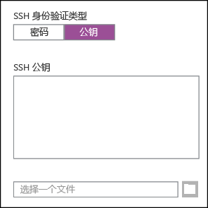
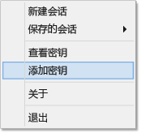

<properties
   pageTitle="在 Windows 中的基于 Linux 的群集上将 SSH 密钥与 Hadoop 配合使用 | Azure"
   description="了解如何创建和使用 SSH 密钥，以便向基于 Linux 的 HDInsight 群集进行身份验证。使用 PuTTY SSH 客户端从基于 Windows 的客户端连接群集。"
   services="hdinsight"
   documentationCenter=""
   authors="Blackmist"
   manager="paulettm"
   editor="cgronlun"
	tags="azure-portal"/>

<tags
   ms.service="hdinsight" 
   ms.date="07/24/2015"
   wacn.date=""/>

#在 Windows 中的 HDInsight 上将 SSH 与基于 Linux 的 Hadoop 配合使用（预览版）

> [AZURE.SELECTOR]
- [Windows](hdinsight-hadoop-linux-use-ssh-windows)
- [Linux, Unix, OS X](hdinsight-hadoop-linux-use-ssh-unix)

基于 Linux 的 Azure HDInsight 群集提供通过密码或 SSH 密钥使用 Secure Shell (SSH) 访问权限的选项。本文档提供有关如何通过使用 PuTTY SSH 客户端在基于 Windows 的客户端中连接到 HDInsight 的信息。

> [AZURE.NOTE] 本文中的步骤假设你使用的是基于 Windows 的客户端。如果你使用的是 Linux、Unix 或 OS X 客户端，请参阅[在 Linux、Unix 或 OS X 中的 HDInsight 上将 SSH 密钥与基于 Linux 的 Hadoop 配合使用](hdinsight-hadoop-linux-use-ssh-unix)。

##先决条件

* 适用于 Windows 客户端的 **PuTTY** 和 **PuTTYGen**。可以从 [http://www.chiark.greenend.org.uk/~sgtatham/putty/download.html](http://www.chiark.greenend.org.uk/~sgtatham/putty/download.html) 获取这些实用工具。

* 支持 HTML5 的现代 Web 浏览器。

或者

* [适用于 Mac、Linux 和 Windows 的 Azure CLI](/documentation/articles/xplat-cli)。

##什么是 SSH？

SSH 是用于登录远程服务器以及在其上远程执行命令的实用工具。通过基于 Linux 的 HDInsight，SSH 可建立与群集头节点的加密连接，并提供用于键入命令的命令行。然后，你便可以在服务器上直接执行命令。

##创建 SSH 密钥（可选）

创建基于 Linux 的 HDInsight 群集时，你可以选择使用密码或 SSH 密钥向服务器进行身份验证（如果使用 SSH）。SSH 密钥基于证书，因此被认为更安全。如果你打算在群集上使用 SSH 密钥，请使用以下信息。

1. 打开 PuTTYGen。

2. 对于**要生成的密钥类型**，请选择**SSH-2 RSA**，然后单击**生成**。

	

3. 在进度条下面的区域中移动鼠标，直到进度条填满。移动鼠标可生成用于生成密钥的随机数据。

	

	生成密钥后，将显示公钥。

4. 为了提高安全性，你可以在**密钥通行短语**字段中输入通行短语，然后在**确认通行短语**字段中键入相同值。

	
	
	> [AZURE.NOTE] 强烈建议你为密钥使用安全的通行短语。但是，如果你忘记了通行短语，将没有办法恢复它。

5. 单击**保存私钥**以在 **.ppk** 文件中保存密钥。在基于 Linux 的 HDInsight 群集上进行身份验证时，将要用到此密钥。

	> [AZURE.NOTE] 应该将此密钥存储在安全位置，因为它可以用来访问基于 Linux 的 HDInsight 群集。

6. 单击**保存公钥**以在 **.txt** 文件中保存此密钥。当你以后创建其他基于 Linux 的 HDInsight 群集时，可以重复使用该公钥。

	> [AZURE.NOTE] 公钥也显示在 PuTTYGen 的顶部。你可以右键单击此字段，复制值，并将其粘贴到窗体中，例如 Azure 门户中的 HDInsight 向导。

##创建基于 Linux 的 HDInsight 群集

创建基于 Linux 的 HDInsight 群集时，你必须提供以前创建的公钥。通过基于 Windows 的客户端，你可以使用下面两种方法，创建基于 Linux 的 HDInsight 群集：

* **Azure 门户** - 使用基于 Web 的门户创建群集。

* **Azure 跨平台命令行界面 (xplat-cli)** - 使用命令行命令创建群集。

上述每种方法都将需要公钥。有关创建基于 Linux 的 HDInsight 群集的完整信息，请参阅<a href="/documentation/articles/hdinsight-hadoop-provision-linux-clusters/" target="_blank">预配基于 Linux 的 HDInsight 群集</a>。

###Azure 门户

使用该门户创建基于 Linux 的 HDInsight 群集时，你必须采用以下形式输入用户名和密码或公钥：

这将为指定的用户创建登录名，并启用密码身份验证或 SSH 密钥身份验证。

###Azure 跨平台命令行界面

你可以使用 <a href="/documentation/articles/xplat-cli/" target="_brad">Azure 跨平台命令行界面</a>来通过 `azure hdinsight cluster create` 命令创建新群集。

有关使用此命令的详细信息，请参阅<a href="/documentation/articles/hdinsight-hadoop-provision-linux-clusters/" target="_blank">使用自定义选项在 HDInsight 中预配 Hadoop Linux 群集</a>。

##连接到基于 Linux 的 HDInsight 群集

1. 打开 PuTTY。

	

2. 如果你在创建用户帐户时提供了 SSH 密钥，则必须执行以下步骤，以选择向群集进行身份验证时要使用的私钥：

	在**类别**中，依次展开**连接**和**SSH**，然后选择**身份验证**。最后，单击**浏览**，然后选择包含私钥的 .ppk 文件。

	

3. 在**类别**中，选择**会话**。在**PuTTY 会话的基本选项**屏幕中，将 HDInsight 服务器的 SSH 地址输入到**主机名(或 IP 地址)**字段中。SSH 地址是群集名称后接 **-ssh.azurehdinsight.cn**。例如 **mycluster-ssh.azurehdinsight.cn**。

	

4. 若要保存连接信息以供将来使用，请在**保存的会话**下方输入此连接的名称，然后单击**保存**。该连接将会添加到已保存会话的列表中。

5. 单击**打开**以连接到群集。

	> [AZURE.NOTE] 如果这是第一次连接到群集，你将收到安全警报。这是一般警报。选择“是”缓存服务器的 RSA2 密钥以继续。

6. 出现提示时，请输入你在创建群集时输入的用户。如果你为用户提供了密码，则系统仍将提示你输入该密码。

> [AZURE.NOTE] 上述步骤假设你使用的是要连接到 HDInsight 群集上 headnode0 的端口 22。如果使用端口 23，将连接到 headnode1。有关头节点的详细信息，请参阅 [HDInsight 中的 Hadoop 群集的可用性和可靠性](hdinsight-high-availability-linux.md)。

###连接到从节点

从节点不能直接从 Azure 数据中心外部访问，但是可以通过 SSH 从群集头节点访问。

如果你在创建用户帐户时提供了 SSH 密钥，则必须执行以下步骤，以在向群集进行身份验证时使用私钥（如果要连接到从节点）。

1. 从 [http://www.chiark.greenend.org.uk/~sgtatham/putty/download.html](http://www.chiark.greenend.org.uk/~sgtatham/putty/download.html) 安装 Pageant。此实用程序用于缓存 PuTTY 的 SSH 密钥。

2. 运行 Pageant。它将最小化到状态托盘中的图标。右键单击该图标，然后选择**添加密钥**。

    

3. 在浏览对话框出现时，选择包含密钥的 .ppk 文件，然后单击**打开**。此时将向 Pageant 添加密钥，在连接到群集时，Pageant 将向 PuTTY 提供该密钥。

    > [AZURE.IMPORTANT] 如果你使用了 SSH 密钥保护帐户，则必须完成以前的步骤，然后才能连接到辅助节点。

4. 打开 PuTTY。

5. 如果你使用 SSH 密钥进行身份验证，请在**类别**部分中，依次展开**连接**和**SSH**，然后选择**身份验证**。

    在**身份验证参数**部分中，启用**允许代理转发**。这样，在连接到从节点时，PuTTY 可以通过到群集头节点的连接自动传递证书身份验证。

    

6. 如上所述，连接到群集。如果你使用 SSH 密钥进行身份验证，则不需要选择该密钥。添加到 Pageant 的 SSH 密钥将用于向群集进行身份验证。

7. 在建立连接后，使用以下方式检索你的群集节点列表。将 *ADMINPASSWORD* 替换为你的群集管理员帐户的密码。将 *CLUSTERNAME* 替换为群集名称。

        curl --user admin:ADMINPASSWORD https://CLUSTERNAME.azurehdinsight.cn/api/v1/hosts

    这将返回群集节点的 JSON 格式的信息，包括 `host_name`，其中包含每个节点的完全限定域名 (FQDN)。下面是由 **curl** 命令返回的 `host_name` 条目的示例：

        "host_name" : "workernode0.workernode-0-e2f35e63355b4f15a31c460b6d4e1230.j1.internal.cloudapp.net"

8. 一旦有你要连接到的从节点的列表，就可以在 PuTTY 会话中使用以下命令打开到从节点的连接：

        ssh USERNAME@FQDN

    将 *USERNAME* 替换为你的 SSH 用户名，并将 *FQDN* 替换为辅助节点的 FQDN。例如，`workernode0.workernode-0-e2f35e63355b4f15a31c460b6d4e1230.j1.internal.cloudapp.net`。

    > [AZURE.NOTE] 如果你使用密码对 SSH 会话进行身份验证，则系统将提示你重新输入该密码。如果你使用 SSH 密钥，则连接应在没有任何提示的情况下完成。

9. 在建立会话后，你的 PuTTY 会话的提示符将从 `username@headnode` 更改为 `username@workernode`，指示你已连接到辅助节点。你此时运行的任何命令都将在从节点上运行。

10. 在辅助节点上执行完操作后，使用 `exit` 命令来关闭辅助节点的会话。这将使你返回到 `username@headnode` 提示符。

##添加更多帐户

如果需要将更多帐户添加到你的群集，请执行以下步骤：

1. 如上所述，为新的用户帐户生成新的公钥和私钥。

2. 在群集的 SSH 会话中，使用以下命令添加新用户：

		sudo adduser --disabled-password <username> 

	这将创建一个新的用户帐户，但会禁用密码身份验证。

3. 使用以下命令，创建用于保存密钥的目录和文件：

		sudo mkdir -p /home/<username>/.ssh
		sudo touch /home/<username>/.ssh/authorized_keys
		sudo nano /home/<username>/.ssh/authorized_keys

4. 当 nano 编辑器打开时，请复制并粘贴新用户帐户的公钥内容。最后，使用 **Ctrl-X** 保存文件并退出编辑器。

	

5. 使用以下命令，将 .ssh 文件夹和内容的所有权更改为新用户帐户：

		sudo chown -hR <username>:<username> /home/<username>/.ssh

6. 现在，你应该可以使用新用户帐户和私钥向服务器进行身份验证。

##SSH 隧道

还可以使用 SSH 来以隧道方式将本地请求（例如 Web 请求）传送到 HDInsight 群集。然后，请求将路由到请求的资源，就像它是来源于 HDInsight 群集头节点一样。

> [AZURE.IMPORTANT] 访问某些 Hadoop 服务的 Web UI 需要使用 SSH 隧道。例如，作业历史记录 UI 或资源管理器 UI 只能使用 SSH 隧道访问。

使用以下步骤创建 SSH 隧道，并将浏览器配置为使用该隧道连接到群集：

1. 打开 PuTTY，并输入你的连接信息，如前面的[连接到基于 Linux 的群集](#connect-to-a-linux-based-hdinsight-cluster)部分中所述。

2. 在对话框左侧的**类别**部分中，依次展开**连接**和**SSH**，然后选择**隧道**。

3. 提供以下有关**用于控制 SSH 端口转发的选项**窗体的信息：

	* **源端口** - 客户端上要转发的端口。例如 **9876**。

	* **目标** - 基于 Linux 的 HDInsight 群集的 SSH 地址。例如 **mycluster-ssh.azurehdinsight.cn**

	* **动态** - 启用动态 SOCKS 代理路由。

	

4. 单击**添加**以添加设置，然后单击**打开**以打开 SSH 连接。

5. 出现提示时，登录到服务器。这将会建立 SSH 会话并启用隧道。

6. 将客户端程序（例如 Firefox）配置为使用 **localhost:9876** 作为 **SOCKS v5** 代理。下面是 Firefox 设置的外观：

	

	> [AZURE.NOTE] 选择**远程 DNS**会使用 HDInsight 群集解析 DNS 请求。如果未将其选中，则将在本地解析 DNS。

	<!--You can verify that traffic is being routed through the tunnel by vising a site such as <a href="http://www.whatismyip.com/" target="_blank">http://www.whatismyip.com/</a> with the proxy settings enabled and disabled in Firefox. While enabled, the IP address will be for a machine in the Microsoft Azure datacenter.-->

###浏览器扩展

虽然你可以将浏览器配置为使用隧道，但是，你通常不想要通过隧道路由所有流量。浏览器扩展，例如 [FoxyProxy](http://getfoxyproxy.org/)，支持 URL 请求的模式匹配（仅限 FoxyProxy Standard 或 Plus 版），以便只有特定 URL 的请求才通过隧道发送。

如果你已安装 FoxyProxy Standard，请使用以下步骤将其配置为仅通过隧道转发 HDInsight 的流量。

1. 在浏览器中打开 FoxyProxy 扩展。例如，在 Firefox 中，选择地址字段旁边的 FoxyProxy 图标。

	

2. 选择**添加新代理**，再选择**常规**选项卡，然后输入代理名称 **HDInsightProxy**。

	

3. 选择**代理详细信息**选项卡并填充以下字段。

	* **主机或 IP 地址** - 这是 localhost，因为我们要在本地计算机上使用 SSH 隧道。

	* **端口** - 这是用于 SSH 隧道的端口。

	* **SOCKS 代理** - 选择此项可让浏览器使用隧道作为代理。

	* **SOCKS v5** - 选择此项可设置代理所需的版本。

	

4. 选择**URL 模式**选项卡，然后选择**添加新模式**。使用以下设置来定义模式，然后单击**确定**：

	* **模式名称** - **headnode** - 这就是模式的友好名称。

	* **URL 模式** - ***headnode*** - 定义将任何 URL 与其包含的单词 **headnode** 匹配的模式。

	

4. 单击**确定**以添加代理，并关闭**代理设置**。

5. 在“FoxyProxy”对话框的顶部，将**选择模式**更改为**根据其预定义模式和优先级使用代理**，然后单击**关闭**。

	

执行这些步骤后，只会通过 SSL 隧道路由包含字符串 **headnode** 的 URL 的请求。

##后续步骤

既然你了解了如何使用 SSH 密钥进行身份验证，就可以学习如何在 HDInsight 上将 MapReduce 与 Hadoop 配合使用。

* [将 Hive 与 HDInsight 配合使用](/documentation/articles/hdinsight-use-hive/)

* [将 Pig 与 HDInsight 配合使用](/documentation/articles/hdinsight-use-pig/)

* [将 MapReduce 作业与 HDInsight 配合使用](/documentation/articles/hdinsight-use-mapreduce/)
 

<!---HONumber=71-->