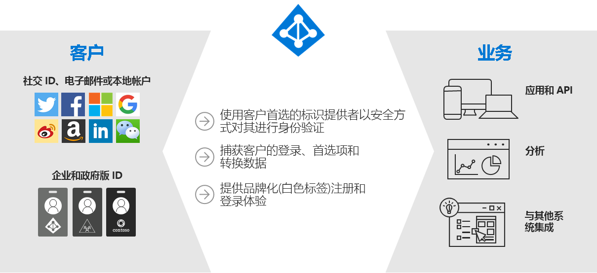
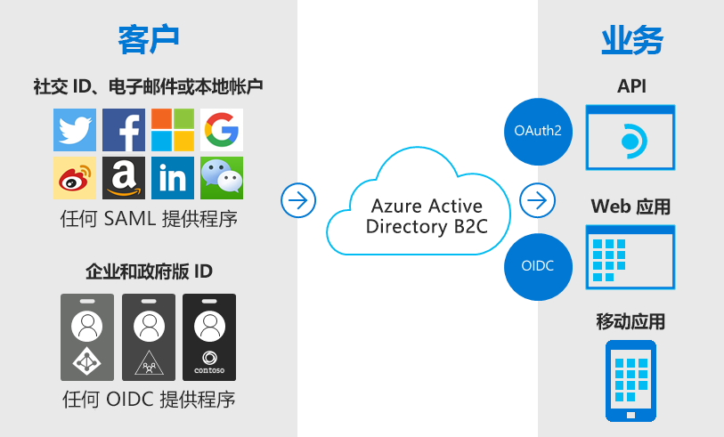
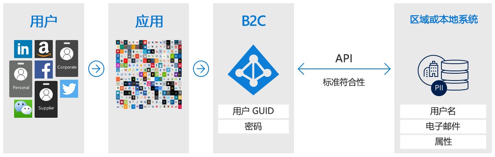
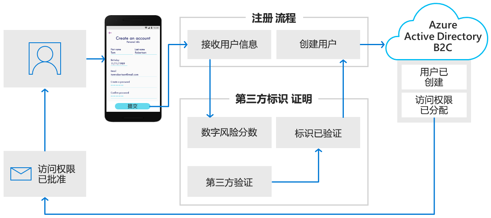
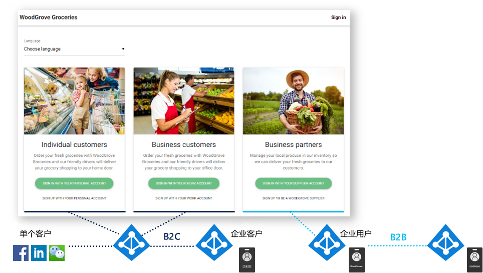

# 什么是 Azure Active Directory B2C？

Azure Active Directory B2C 以服务的形式提供企业到客户的标识。 客户使用其首选的社交、企业或本地帐户标识对应用程序和 API 进行单一登录访问。

Azure Active Directory B2C (Azure AD B2C) 是一个客户标识访问管理 (CIAM) 解决方案，每天能够支持数百万用户和数十亿次身份验证。 它负责处理身份验证平台的规模和安全性，并监视和自动应对拒绝服务、密码喷洒或暴力攻击等威胁。

## 自定义品牌的标识解决方案

Azure AD B2C 是一种贴牌式身份验证解决方案。 你可以使用自己的品牌自定义整个用户体验，使其能够与 Web 和移动应用程序无缝融合。

可以自定义当用户注册、登录和修改其个人资料信息时 Azure AD B2C 显示的每一页。 可以自定义用户旅程中的 HTML、CSS 和 JavaScript，使 Azure AD B2C 体验的外观类似于应用程序的原生组成部分。

## 使用用户提供的标识进行单一登录访问

Azure AD B2C 使用基于标准的身份验证协议，包括 OpenID Connect、OAuth 2.0 和 SAML。 它与大多数新式应用程序和商用现货软件相集成。

Azure AD B2C 充当 Web 应用程序、移动应用和 API 的中心身份验证机构，使你能够为所有这些应用构建单一登录 (SSO) 解决方案。 集中收集用户个人资料和偏好信息，并捕获有关登录行为和注册转换的详细分析。

## 与外部用户存储集成

Azure AD B2C 提供一个目录，其中可以保存每个用户的 100 个自定义属性。 但是，你也可以与外部系统相集成。 例如，使用 Azure AD B2C 进行身份验证，但将权限委托给用作客户数据真实来源的外部客户关系管理 (CRM) 或客户忠诚度数据库。

另一种外部用户存储方案是让 Azure AD B2C 处理应用程序的身份验证，但与存储用户个人资料或个人数据的外部系统相集成。 例如，满足区域或本地数据存储策略规定的数据驻留要求。

Azure AD B2C 有助于在注册或编辑个人资料过程中从用户收集信息，然后将该数据转交到外部系统。 在将来的身份验证过程中，Azure AD B2C 可以从外部系统检索数据，并根据需要将此数据包含为发送到应用程序的身份验证令牌响应的一部分。

## 渐进式分析

另一个用户旅程选项包括渐进式分析。 渐进式分析可让客户通过收集极少量的信息来快速完成第一个事务。 今后在客户登录时，将以渐进方式从客户收集更多的个人资料数据。

## 第三方标识验证和证明

使用 Azure AD B2C 可以收集用户数据，然后将其传递给第三方系统来执行验证、信任评分和审批用户帐户创建操作，以此帮助完成标识验证和证明。

这仅仅是用作企业到客户标识平台的 Azure AD B2C 的一部分功能。 本概述文章的以下部分将演练一个使用 Azure AD B2C 的演示应用程序。 另外，也欢迎你直接查看更深入的文章 [Azure AD B2C 技术概述](technical-overview.md)。

## 示例：WoodGrove Groceries

[WoodGrove Groceries][woodgrove] 是 Microsoft 创建的用于演示多个 Azure AD B2C 功能的实时 Web 应用程序。 后面的几个部分将会介绍 Azure AD B2C 在 WoodGrove 网站中提供的某些身份验证选项。

### 企业概述

WoodGrove 是一家在线杂货商店，向个人消费者和企业客户销售杂货。 其企业客户代表他们的公司或者他们管理的企业购买杂货。

### 登录选项

WoodGrove Groceries 根据其客户与自身商店之间的关系提供多个登录选项：

* **个人**客户可以使用个人帐户（例如社交标识提供者或电子邮件地址和密码）进行注册或登录。
* **企业**客户可以使用其企业凭据进行注册或登录。
* **合作伙伴**和供应商是向该杂货店提供销售产品的个人。 合作伙伴标识由 [Azure Active Directory B2B](../active-directory/b2b/what-is-b2b.md) 提供。

### 对个人客户进行身份验证

当客户选择“使用个人帐户登录”时，将重定向到 Azure AD B2C 托管的自定义登录页。  在下图中可以看到，我们已自定义用户界面 (UI)，其外观与 WoodGrove Groceries 网站非常类似。 WoodGrove 的客户应该不知道身份验证体验是由 Azure AD B2C 托管和保护的。

WoodGrove 允许其客户使用 Google、Facebook 或 Microsoft 帐户作为标识提供者进行注册和登录。 或者，其客户可以使用电子邮件地址和密码创建所谓的“本地帐户”来完成注册。 

当客户依次选择“使用个人帐户注册”、“立即注册”时，将会看到自定义注册页。  

在客户输入电子邮件地址并选择“发送验证码”后，Azure AD B2C 会向客户发送验证码。  输入验证码，选择“验证代码”，并在表单中输入其他信息后，客户还必须同意服务条款。 

单击“创建”按钮后，Azure AD B2C 会将用户重定向回到 WoodGrove Groceries 网站。  在重定向时，Azure AD B2C 会将 OpenID Connect 身份验证令牌传递给 WoodGrove Web 应用程序。 用户现已完成登录并已准备好继续操作，其显示名称将显示在右上角，表示他们已登录。

### 对企业客户进行身份验证

当客户选择“企业客户”下的某个选项时，WoodGrove Groceries 网站会调用一个不同的 Azure AD B2C 策略，该策略不同于针对个人客户调用的策略。 

此策略为用户提供一个使用其公司凭据进行注册和登录的选项。 在 WoodGrove 示例中，系统会提示用户使用任何 Office 365 或 Azure AD 帐户登录。 此策略使用[多租户 Azure AD 应用程序](../active-directory/develop/howto-convert-app-to-be-multi-tenant.md)和 `/common` Azure AD 终结点将 Azure AD B2C 联合到全球的任何 Office 365 客户。

### 对合作伙伴进行身份验证

“使用供应商帐户登录”链接使用 Azure Active Directory B2B 的协作功能。  Azure AD B2B 是 Azure Active Directory 中用于管理合作伙伴标识的功能系列。 可以从 Azure Active Directory 联合这些标识，以访问 Azure AD B2C 保护的应用程序。

有关 Azure AD B2B 的详细信息，请参阅[什么是 Azure Active Directory B2B 中的来宾用户访问权限？](../active-directory/b2b/what-is-b2b.md)。

<!-- UNCOMMENT WHEN REPO IS UPDATED WITH LATEST DEMO CODE
### Sample code

If you'd like to jump right into the code to see how the WoodGrove Groceries application is built, you can find the repository on GitHub:

[Azure-Samples/active-directory-external-identities-woodgrove-demo][woodgrove-repo] (GitHub)
-->

## 后续步骤

大致了解 Azure AD B2C 及其可以帮助实现的某些方案后，接下来请更深入地了解其功能和技术方面。

> [!div class="nextstepaction"]
> [Azure AD B2C 技术概述 >](technical-overview.md)

<!-- LINKS - External -->
[woodgrove]: https://aka.ms/ciamdemo
[woodgrove-repo]: https://github.com/Azure-Samples/active-directory-external-identities-woodgrove-demo
