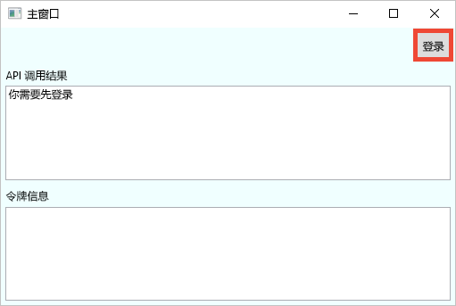
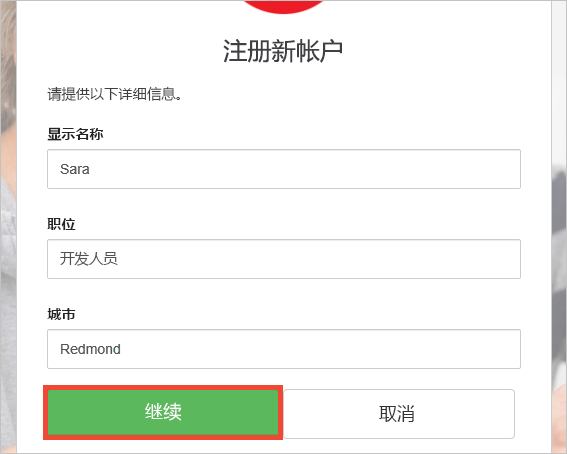
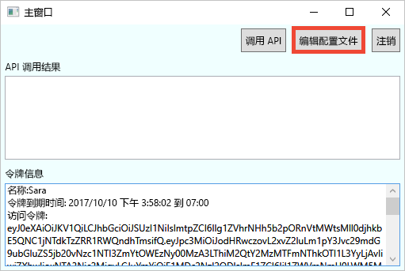
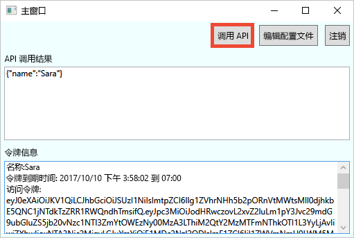

# <a name="quickstart-test-drive-an-azure-ad-b2c-enabled-desktop-app"></a>快速入门：体验启用了 Azure AD B2C 的桌面应用

Azure Active Directory (Azure AD) B2C 提供云身份管理来保护应用程序、业务和客户。 应用可以使用 Azure AD B2C 通过开放式标准协议对社交帐户和企业帐户进行身份验证。

在本教程中，请使用启用了 Azure AD B2C 的示例 Windows Presentation Foundation (WPF) 桌面应用通过社交标识提供者来登录，并调用受 Azure AD B2C 保护的 Web API。

[!INCLUDE [quickstarts-free-trial-note](../../includes/quickstarts-free-trial-note.md)]

## <a name="prerequisites"></a>先决条件

* 带有 ASP.NET 和 Web 开发工作负荷的 [Visual Studio 2017](https://www.visualstudio.com/downloads/)。 
* Facebook、Google、Microsoft 或 Twitter 中的社交帐户。

## <a name="download-the-sample"></a>下载示例

从 GitHub [下载 zip 文件](https://github.com/Azure-Samples/active-directory-b2c-dotnet-desktop/archive/master.zip)或克隆示例 Web 应用。

```
git clone https://github.com/Azure-Samples/active-directory-b2c-dotnet-desktop.git
```

## <a name="run-the-app-in-visual-studio"></a>在 Visual Studio 中运行应用

在示例应用程序项目文件夹中，打开 Visual Studio 中的 `active-directory-b2c-wpf.sln` 解决方案。

按 **F5** 调试应用程序。

## <a name="create-an-account"></a>创建帐户

单击“登录”，启动基于 Azure AD B2C 策略的“注册或登录”工作流。



此示例支持多个注册选项，包括使用社交标识提供者，或者使用电子邮件地址来创建本地帐户。 对于本快速入门，将使用 Facebook、Google、Microsoft 或 Twitter 社交标识提供者帐户。 

### <a name="sign-up-using-a-social-identity-provider"></a>使用社交标识提供者注册

Azure AD B2C 为示例 Web 应用的虚构品牌“Wingtip Toys”提供了一个自定义登录页。 

1. 要使用社交标识提供者注册，请单击要使用的标识提供者按钮。 

    

    请使用社交帐户凭据进行身份验证（登录）并授权应用程序读取社交帐户的信息。 通过授予访问权限，应用程序可以从社交帐户检索个人资料信息，如姓名和城市。 

2. 完成标识提供者的登录进程。 例如，如果你选择 Twitter，请输入你的 Twitter 凭据，然后单击“登录”。

    

    新帐户个人资料详细信息已预先填充社交帐户的信息。 

3. 按需修改详细信息并单击“继续”。 输入的值用于 Azure AD B2C 用户帐户个人资料。

    

    你已成功创建使用标识提供者的新 Azure AD B2C 用户帐户。 登录后，访问令牌显示在“令牌信息”文本框中。 访问令牌在访问 API 资源时使用。

## <a name="edit-your-profile"></a>编辑个人资料

Azure Active Directory B2C 提供允许用户更新个人资料的功能。  示例 Web 应用对工作流使用 Azure AD B2C 编辑配置文件策略。 

1. 单击“编辑个人资料”编辑创建的个人资料。

    

2. 选择与创建的帐户相关联的标识提供者。 例如，如果创建帐户时使用 Twitter 作为标识提供者，那么选择使用 Twitter 来修改关联的个人资料详细信息。

3. 更改“显示名称”或“城市”，然后单击“继续”。

    新的访问令牌显示在“令牌信息”文本框中。 如果要验证对个人资料的更改，将访问令牌复制并粘贴到令牌解码器 (https://jwt.ms) 中。

## <a name="access-a-protected-web-api-resource"></a>访问受保护的 Web API 资源

单击“调用 API”，向 Azure AD B2C 所保护的资源 https://fabrikamb2chello.azurewebsites.net/hello 提出请求。 



应用程序在对受保护的 Web API 资源的请求中包括 Azure AD 访问令牌。 Web API 发送回包含在访问令牌中的显示名称。

你已成功使用 Azure AD B2C 用户帐户对受 Azure AD B2C 保护的 Web API 进行授权调用。

## <a name="clean-up-resources"></a>清理资源

如果打算尝试其他 Azure AD B2C 快速入门或教程，可以使用 Azure AD B2C 租户。 可以在不再需要时[删除 Azure AD B2C 租户](active-directory-b2c-faqs.md#how-do-i-delete-my-azure-ad-b2c-tenant)。

## <a name="next-steps"></a>后续步骤

下一步是创建自己的 Azure AD B2C 租户并将示例配置为使用租户运行。 

> [!div class="nextstepaction"]
> [在 Azure 门户中创建 Azure Active Directory B2C 租户](active-directory-b2c-get-started.md)
