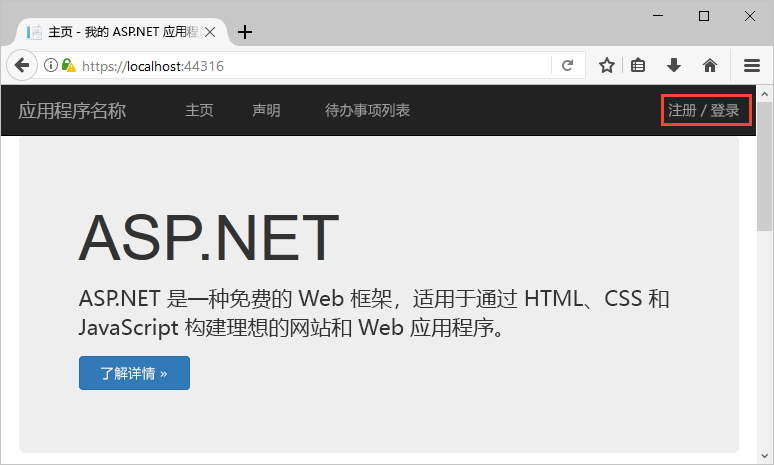
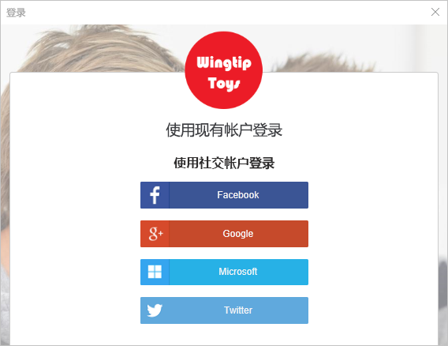
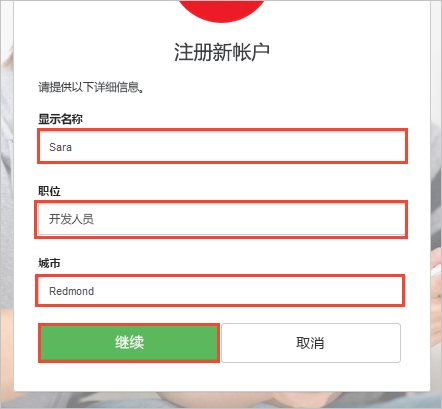
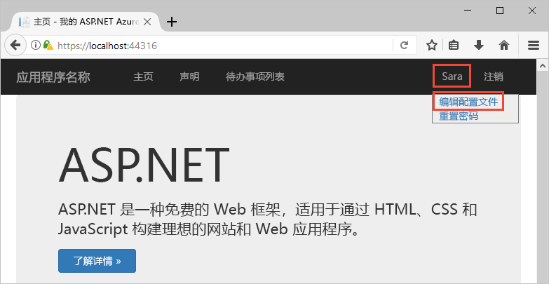
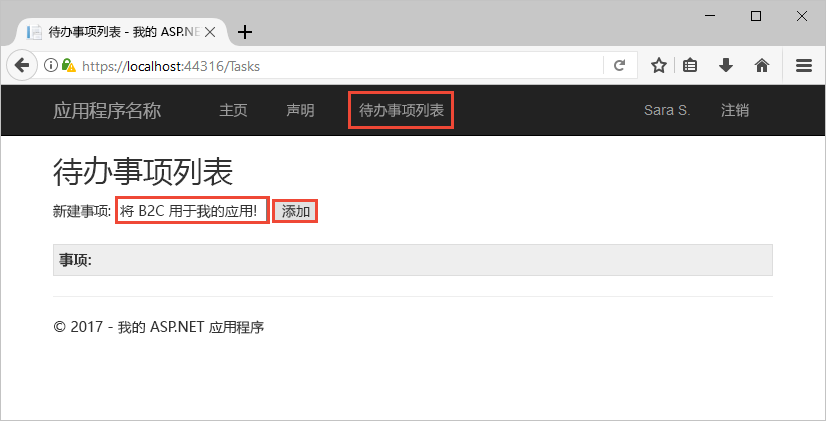

# 试用启用了 Azure AD B2C 的 Web 应用

Azure Active Directory B2C 提供云身份管理来保护应用程序、业务和客户。 本快速入门使用示例待办事项列表应用演示以下操作：

> [!div class="checklist"]
> * 使用自定义登录页登录。
> * 使用社交标识提供者登录。
> * 创建和管理 Azure AD B2C 帐户和用户配置文件。
> * 调用 Azure AD B2C 保护的 Web API。

## 先决条件

* 带有 ASP.NET 和 Web 开发工作负荷的 [Visual Studio 2017](https://www.visualstudio.com/downloads/)。 
* Facebook、Google、Microsoft 或 Twitter 中的社交帐户。

[!INCLUDE [quickstarts-free-trial-note](../../includes/quickstarts-free-trial-note.md)]

## 下载示例

从 GitHub [下载或克隆示例应用程序](https://github.com/Azure-Samples/active-directory-b2c-dotnet-webapp-and-webapi)。

## 在 Visual Studio 中运行应用

在示例应用程序项目文件夹中，打开 Visual Studio 中的 `B2C-WebAPI-DotNet.sln` 解决方案。 

解决方法是包含两个项目的示例待办事项列表应用程序：

* TaskWebApp – 一个用户可以管理待办事项列表项的 ASP.NET MVC Web 应用程序。  
* TaskService – 一个ASP.NET Web API 后端，用于管理在用户待办事项列表项上执行的操作。 Web 应用将调用此 Web API 并显示结果。

在此快速入门中，需要同时运行 `TaskWebApp` 和 `TaskService` 项目。 

1. 在 Visual Studio 菜单中，选择“项目”>“设置启动项目...”。 
2. 选择“多启动项目”单选按钮。
3. 将两个项目的“操作”更改为“启动”。 单击 **“确定”**。

选择“调试”>“开始调试”生成并运行两个应用程序。 各应用程序分别在自己的浏览器选项卡中打开：

`https://localhost:44316/` - 此页面是 ASP.NET Web 应用程序。 在快速入门中，直接与此应用程序交互。
`https://localhost:44332/` - 此页面是由 ASP.NET Web 应用程序调用的 Web API。

## 创建帐户

单击 ASP.NET Web 应用程序中的“注册/登录”链接启动“注册或登录”工作流。 创建帐户时，可以使用现有社交标识提供者帐户或者电子邮件帐户。 对于本快速入门，将使用 Facebook、Google、Microsoft 或 Twitter 社交标识提供者帐户。

### 使用社交标识提供者注册

要使用社交标识提供者注册，请单击要使用的标识提供者按钮。 

需使用社交帐户凭据进行身份验证（登录）并授权应用程序读取社交帐户的信息。 通过授予访问权限，应用程序可以从社交帐户检索个人资料信息，如姓名和城市。 

完成标识提供者的登录进程。 例如，如果你选择 Twitter，请输入你的 Twitter 凭据，然后单击“登录”。

你的新 Azure AD B2C 帐户个人资料详细信息将使用你社交帐户中的信息预填充。

更新“显示名称”、“职务”、“城市”字段，并单击“继续”。  输入的值用于 Azure AD B2C 用户帐户个人资料。

你已成功执行以下操作：

> [!div class="checklist"]
> * 使用标识提供者通过身份验证。
> * 创建了 Azure AD B2C 用户帐户。 

## 编辑个人资料

Azure Active Directory B2C 提供允许用户更新个人资料的功能。 在 Web 应用程序菜单栏中，单击个人资料名称，并选择“编辑个人资料”编辑创建的个人资料。

更改“显示名称”和“城市”。  单击“继续”更新个人资料。

请注意，页面右上角的显示名称将显示更新后的名称。 

## 访问安全 Web API 资源

单击“待办事项列表”输入并修改待办事项列表项。 ASP.NET Web 应用程序包括对 Web API 资源的请求（请求对用户待办事项列表项执行操作的权限）中的访问令牌。 

在“新建项”文本框中输入文本。 单击“添加”调用添加待办事项列表项的由 Azure AD B2C 保护的 Web API。

你已成功使用 Azure AD B2C 用户帐户对 Azure AD B2C 安全 Web API 进行授权调用。

## 后续步骤

可以使用本快速入门中使用的示例尝试其他 Azure AD B2C 方案，包括：

* 使用电子邮件地址创建新的本地帐户。
* 重置本地帐户密码。

如果你已准备好深入研究如何创建自己的 Azure AD B2C 租户，并将示例配置为使用你自己的租户运行，请尝试使用后面的教程。

> [!div class="nextstepaction"]
> [使用 Azure Active Directory B2C 注册、登录、个人资料编辑和密码重置创建 ASP.NET Web 应用](active-directory-b2c-devquickstarts-web-dotnet-susi.md)