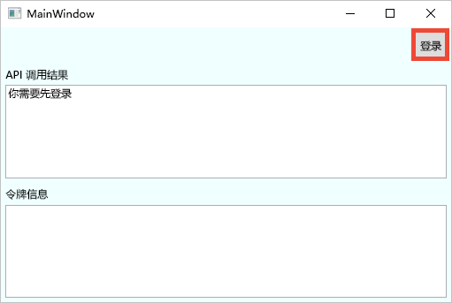
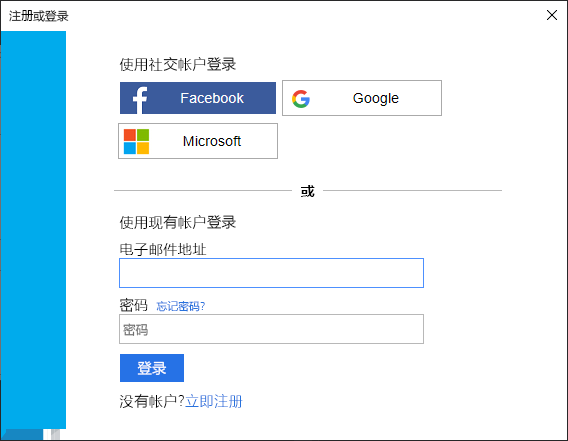
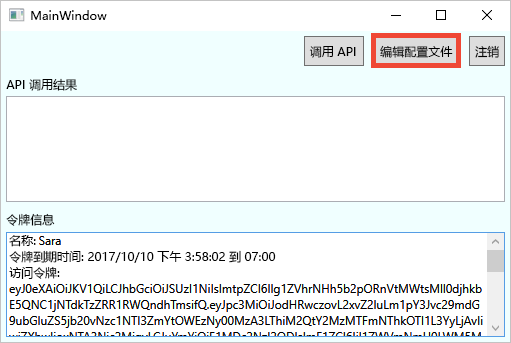
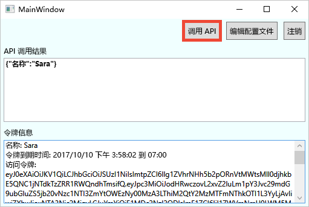

# <a name="quickstart-set-up-sign-in-for-a-desktop-app-using-azure-active-directory-b2c"></a>快速入门：使用 Azure Active Directory B2C 为桌面应用设置登录

Azure Active Directory B2C (Azure AD B2C) 提供云标识管理来保护应用程序、业务和客户。 应用程序可以使用 Azure AD B2C 通过开放式标准协议对社交帐户和企业帐户进行身份验证。 在本教程中，请使用 Windows Presentation Foundation (WPF) 桌面应用程序通过社交标识提供者来登录，并调用受 Azure AD B2C 保护的 Web API。

[!INCLUDE [quickstarts-free-trial-note](../../includes/quickstarts-free-trial-note.md)]

## <a name="prerequisites"></a>必备条件

- 带有 ASP.NET 和 Web 开发  工作负荷的 [Visual Studio 2019](https://www.visualstudio.com/downloads/)。
- Facebook、Google 或 Microsoft 中的社交帐户。
- 从 GitHub [下载 zip 文件](https://github.com/Azure-Samples/active-directory-b2c-dotnet-desktop/archive/master.zip)或克隆示例 Web 应用。

    ```
    git clone https://github.com/Azure-Samples/active-directory-b2c-dotnet-desktop.git
    ```

## <a name="run-the-application-in-visual-studio"></a>在 Visual Studio 中运行应用程序

1. 在示例应用程序项目文件夹中，打开 Visual Studio 中的 **active-directory-b2c-wpf.sln** 解决方案。
2. 按 **F5** 调试应用程序。

## <a name="sign-in-using-your-account"></a>使用帐户登录

1. 单击“登录”开始“注册或登录”工作流。  

    

    此示例支持多个注册选项。 这些选项包括使用社交标识提供者，或者使用电子邮件地址来创建本地帐户。 对于本快速入门，将使用 Facebook、Google 或 Microsoft 社交标识提供者帐户。


2. Azure AD B2C 为示例 Web 应用程序的虚构公司“Fabrikam”提供了一个登录页。 要使用社交标识提供者注册，请单击要使用的标识提供者按钮。

    

    请使用社交帐户凭据进行身份验证（登录）并授权应用程序读取社交帐户的信息。 通过授予访问权限，应用程序可以从社交帐户检索个人资料信息，如姓名和城市。

2. 完成标识提供者的登录进程。

    新帐户个人资料详细信息已预先填充社交帐户的信息。

## <a name="edit-your-profile"></a>编辑个人资料

Azure AD B2C 提供允许用户更新个人资料的功能。 示例 Web 应用对工作流使用 Azure AD B2C 编辑配置文件用户流。

1. 在应用程序菜单栏中，单击“编辑个人资料”以编辑创建的个人资料。 

    

2. 选择与创建的帐户相关联的标识提供者。 例如，如果创建帐户时使用 Facebook 作为标识提供者，那么选择使用 Facebook 来修改关联的个人资料详细信息。

3. 更改“显示名称”或“城市”，然后单击“继续”。   

    新的访问令牌显示在“令牌信息”文本框中。  如果要验证对个人资料的更改，将访问令牌复制并粘贴到令牌解码器 (https://jwt.ms ) 中。

## <a name="access-a-protected-api-resource"></a>访问受保护的 API 资源

单击“调用 API”，向受保护的资源发出请求。 



应用程序在对受保护的 Web API 资源的请求中包括 Azure AD 访问令牌。 Web API 发送回包含在访问令牌中的显示名称。

你已成功使用 Azure AD B2C 用户帐户对受 Azure AD B2C 保护的 Web API 进行授权调用。

## <a name="clean-up-resources"></a>清理资源

如果打算尝试其他 Azure AD B2C 快速入门或教程，可以使用 Azure AD B2C 租户。 可以在不再需要时[删除 Azure AD B2C 租户](faq.md#how-do-i-delete-my-azure-ad-b2c-tenant)。

## <a name="next-steps"></a>后续步骤

本快速入门使用示例桌面应用程序执行了以下操作：

* 使用自定义登录页登录
* 使用社交标识提供者登录
* 创建 Azure AD B2C 租户
* 调用受 Azure AD B2C 保护的 Web API

通过创建自己的 Azure AD B2C 租户来完成入门。

> [!div class="nextstepaction"]
> [在 Azure 门户中创建 Azure Active Directory B2C 租户](tutorial-create-tenant.md)
