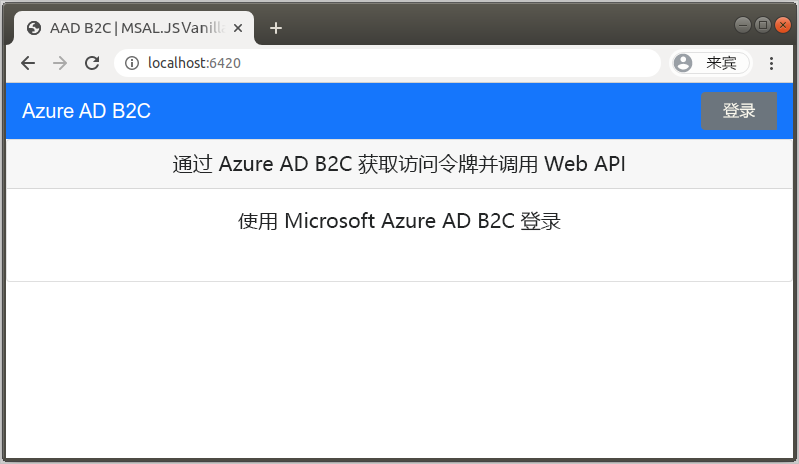
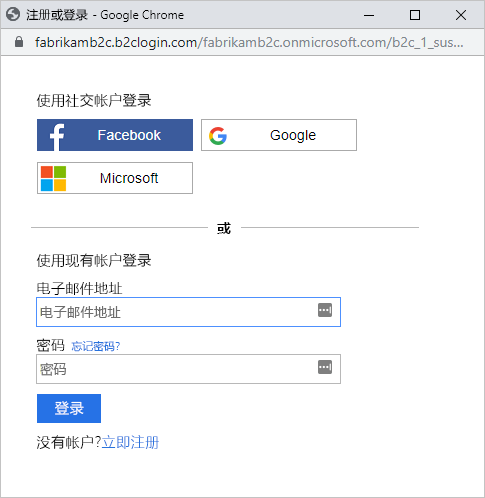
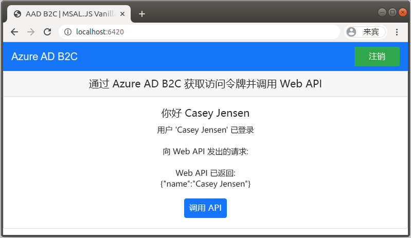

# <a name="quickstart-set-up-sign-in-for-a-single-page-app-using-azure-active-directory-b2c"></a>快速入门：使用 Azure Active Directory B2C 为单页应用设置登录

Azure Active Directory B2C (Azure AD B2C) 提供云标识管理来保护应用程序、业务和客户。 应用程序可以使用 Azure AD B2C 通过开放式标准协议对社交帐户和企业帐户进行身份验证。 在本教程中，请使用单页应用程序通过社交标识提供者来登录，并调用受 Azure AD B2C 保护的 Web API。

[!INCLUDE [quickstarts-free-trial-note](../../includes/quickstarts-free-trial-note.md)]

## <a name="prerequisites"></a>先决条件

- [Visual Studio Code](https://code.visualstudio.com/)
- [Node.js](https://nodejs.org/en/download/)
- Facebook、Google 或 Microsoft 中的社交帐户
- GitHub 中的代码示例：[active-directory-b2c-javascript-msal-singlepageapp](https://github.com/Azure-Samples/active-directory-b2c-javascript-msal-singlepageapp)

    可以[下载 zip 存档](https://github.com/Azure-Samples/active-directory-b2c-javascript-msal-singlepageapp/archive/master.zip)或克隆存储库：

    ```console
    git clone https://github.com/Azure-Samples/active-directory-b2c-javascript-msal-singlepageapp.git
    ```

## <a name="run-the-application"></a>运行应用程序

1. 启动服务器，方法是在 Node.js 命令提示符处运行以下命令：

    ```console
    cd active-directory-b2c-javascript-msal-singlepageapp
    npm install && npm update
    npm start
    ```

    通过 *server.js* 启动的服务器会显示其侦听的端口：

    ```console
    Listening on port 6420...
    ```

1. 浏览到应用程序的 URL。 例如，`http://localhost:6420` 。

    

## <a name="sign-in-using-your-account"></a>使用帐户登录

1. 选择“登录”，开始用户旅程  。
1. Azure AD B2C 为示例 Web 应用程序的虚构公司“Fabrikam”提供了一个登录页。 要使用社交标识提供者注册，请选择要使用的标识提供者的按钮。

    

    请使用社交帐户凭据进行身份验证（登录）并授权应用程序读取社交帐户的信息。 通过授予访问权限，应用程序可以从社交帐户检索个人资料信息，如姓名和城市。

1. 完成标识提供者的登录进程。

## <a name="access-a-protected-api-resource"></a>访问受保护的 API 资源

选择“调用 API”，使显示名称作为 JSON 对象从 Web API 返回。 



示例单页应用程序在对受保护的 Web API 资源的请求中包括访问令牌。

## <a name="clean-up-resources"></a>清理资源

如果打算尝试其他 Azure AD B2C 快速入门或教程，可以使用 Azure AD B2C 租户。 可以在不再需要时[删除 Azure AD B2C 租户](faq.md#how-do-i-delete-my-azure-ad-b2c-tenant)。

## <a name="next-steps"></a>后续步骤

本快速入门使用示例单页应用程序执行了以下操作：

- 使用社交标识提供者登录
- 创建 Azure AD B2C 用户帐户（在登录时自动创建）
- 调用受 Azure AD B2C 保护的 Web API

通过创建自己的 Azure AD B2C 租户来完成入门。

> [!div class="nextstepaction"]
> [在 Azure 门户中创建 Azure Active Directory B2C 租户](tutorial-create-tenant.md)
