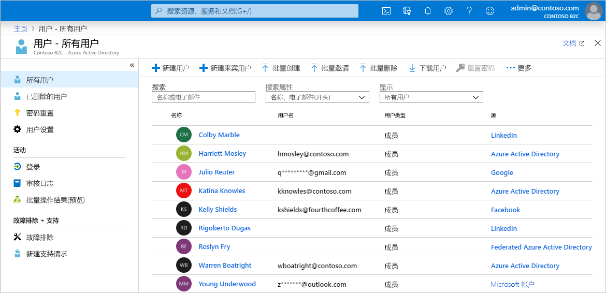
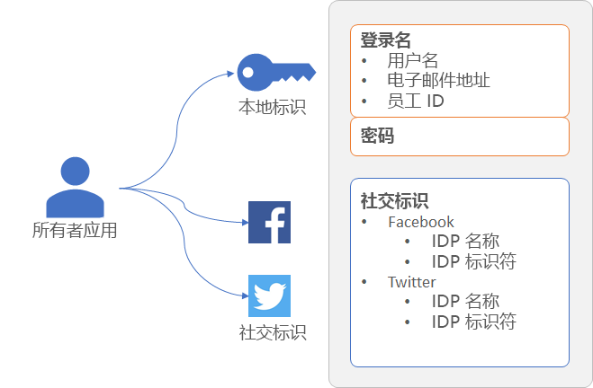
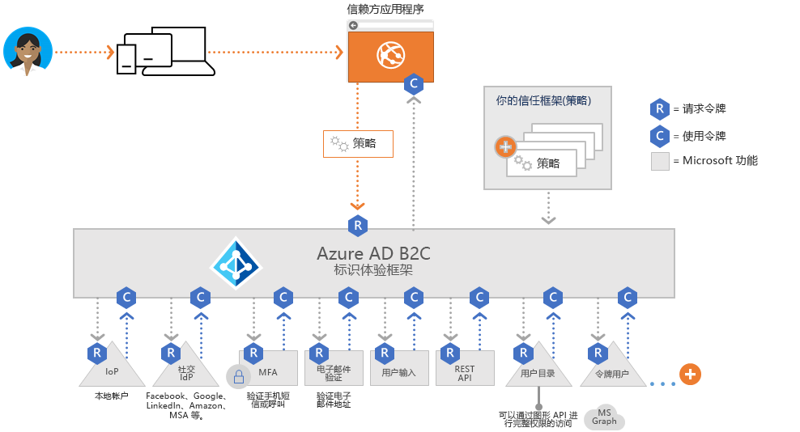
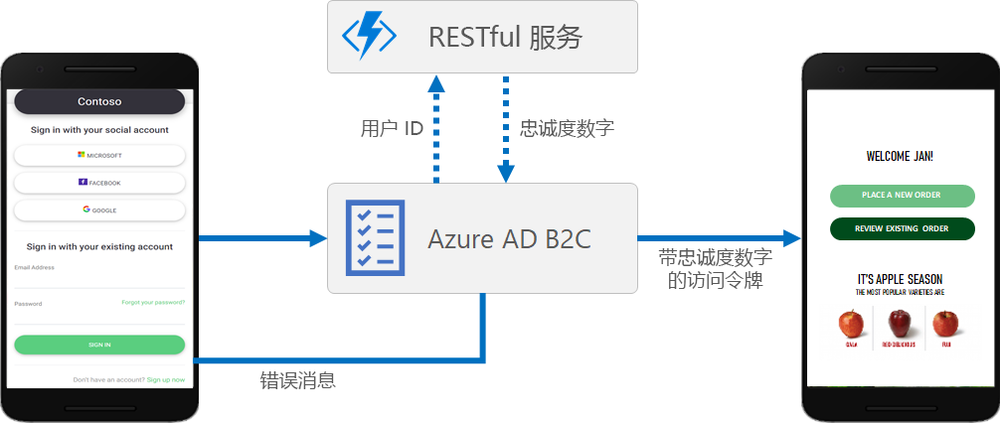
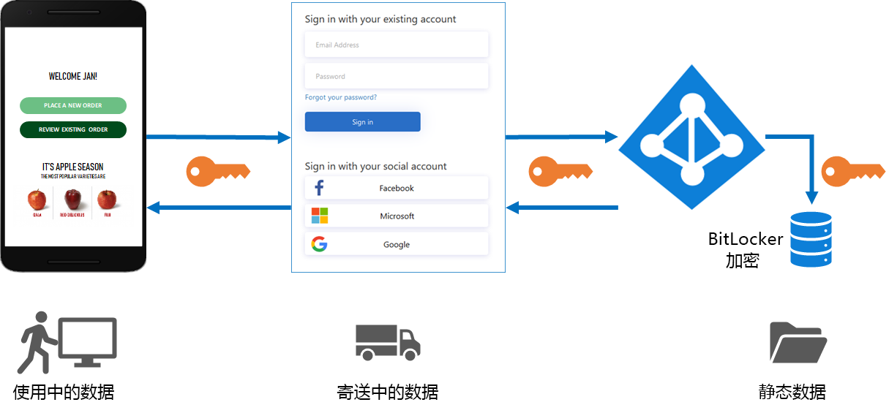
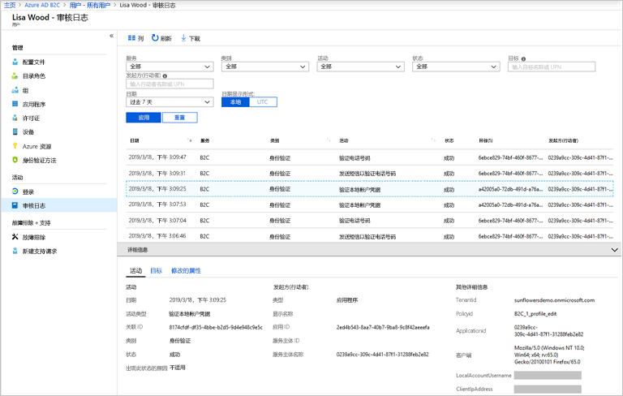

# Azure Active Directory B2C 的技术和功能概述

本文是[关于 Azure Active Directory B2C](overview.md) 一文的配套文档，其中更深入地介绍了该服务。 本文介绍你将在该服务中使用的主要资源和该服务的功能，以及如何通过这些功能为应用程序中的客户提供完全自定义的标识体验。

## Azure AD B2C 租户

在 Azure Active Directory B2C (Azure AD B2C) 中，租户表示组织，也是用户的目录。  每个 Azure AD B2C 租户都是独特的，独立于其他 Azure AD B2C 租户。 Azure AD B2C 租户不同于你可能已有的 Azure Active Directory 租户。

在 Azure AD B2C 租户中使用的主要资源包括：

* **目录** - 目录是 Azure AD B2C 将用户的凭据和配置文件数据以及应用程序注册存储到的位置。 
* **应用程序注册** - 将 Web、移动和本机应用程序注册到 Azure AD B2C 以启用标识管理。 此外，应用程序注册还包括要使用 Azure AD B2C 保护的 API。
* **用户流**和**自定义策略** - 应用程序的内置标识体验（用户流）和完全可自定义的标识体验（自定义策略）。
  * 使用用户流可以快速配置和启用常见标识任务，例如注册、登录和配置文件编辑。 
  * 使用自定义策略不仅可为常见标识任务启用用户体验，而且还能为组织、客户、员工、合作伙伴和市民的独特复杂标识工作流构建支持。 
* **标识提供者** - 以下对象的联合设置：
  * 要在应用程序中支持的社交标识提供者，例如 Facebook、LinkedIn 或 Twitter。 
  * 支持 OAuth 2.0、OpenID Connect 等标准标识协议的外部标识提供者。 
  * 可让用户使用用户名（或者电子邮件地址或其他 ID）和密码注册和登录的本地帐户。 
* **密钥** - 添加和管理用于签署与验证令牌的加密密钥。

Azure AD B2C 租户是开始使用 Azure AD B2C 之前必须先创建的第一个资源。 有关如何创建该资源，请参阅[教程：创建 Azure Active Directory B2C 租户](tutorial-create-tenant.md)中的步骤创建一个。

## Azure AD B2C 中的帐户

Azure AD B2C 定义多种类型的用户帐户。 Azure Active Directory、Azure Active Directory B2B 和 Azure Active Directory B2C 共享这些帐户类型。

* **工作帐户** - 具有工作帐户的用户可以管理租户中的资源，而具有管理员角色的用户还可以管理租户。 具有工作帐户的用户可以创建新的使用者帐户、重置密码、阻止/解除阻止帐户，以及设置权限或将帐户分配到安全组。
* **来宾帐户** - 邀请你作为来宾加入其租户的外部用户。 邀请来宾用户访问 Azure AD B2C 租户的典型方案是共享管理职责。
* **使用者帐户** - 使用者帐户是当用户在你已注册到租户的应用程序中完成注册用户旅程后，在 Azure AD B2C 目录中创建的帐户。

 图：*Azure 门户中 Azure AD B2C 租户内的用户目录*

### 使用者帐户

用户可以通过使用者帐户登录到通过 Azure AD B2C 保护的应用程序。  但是，具有使用者帐户的用户无法访问 Azure 资源（例如 Azure 门户）。

可将使用者帐户关联到以下标识类型：

* **本地**标识：将用户名和密码存储在 Azure AD B2C 目录本地。 我们通常将此类标识称为“本地帐户”。
* **社交**或**企业**标识：用户的标识由 Facebook、Microsoft、ADFS 或 Salesforce 等联合标识提供者进行管理。

具有使用者帐户的用户可以通过多个标识（例如用户名、电子邮件、员工 ID、政府 ID 等）登录。 单个帐户可以有多个本地和社交标识。

 图：*在 Azure AD B2C 中具有多个标识的单个使用者帐户*

在 Azure AD B2C 中可以管理使用者帐户配置文件的通用属性，例如显示名称、姓氏、名字、城市，等等。 还可以扩展 Azure AD 架构以存储有关用户的其他信息。 例如，用户所在的国家/地区或居住地、首选语言和偏好（例如，是否想要订阅新闻稿或启用多重身份验证）。

在 [Azure Active Directory B2C 中的用户帐户概述](user-overview.md)中详细了解 Azure AD B2C 中的用户帐户类型。

## 外部标识提供者

可以配置 Azure AD B2C，以允许用户使用外部社交或企业标识提供者 (IdP) 提供的凭据登录到你的应用程序。 Azure AD B2C 支持 Facebook、Microsoft 帐户、Google、Twitter 等外部标识提供程序，以及支持 OAuth 1.0、OAuth 2.0、OpenID Connect、SAML 或 WS 联合身份验证协议的任何标识提供者。

使用外部标识提供者联合，可让使用者通过其现有的社交帐户或企业帐户登录，而不必仅仅出于访问你的应用程序的目的创建一个新帐户。

在注册或登录页上，Azure AD B2C 会提供外部标识提供者的列表，供用户选择用来登录。 用户选择一个外部标识提供者后，将会转到（重定向到）所选提供者的网站，以完成登录过程。 用户成功登录后，将返回到 Azure AD B2C，以便对应用程序中的帐户进行身份验证。

若要了解如何在 Azure AD B2C 中添加标识提供者，请参阅[教程：将标识提供者添加到 Azure Active Directory B2C 中的应用程序](tutorial-add-identity-providers.md)。

## 标识体验：用户流或自定义策略

Azure AD B2C 的核心优势在于它的可扩展策略框架。 策略描述用户的标识体验，例如注册、登录和配置文件编辑。

在 Azure AD B2C 中，可以通过两个主要途径来提供这些标识体验：用户流和自定义策略。

* **用户流**是我们提供的预定义的内置可配置策略，使你能够在几分钟内创建注册、登录和策略编辑体验。

* 使用**自定义策略**可为复杂的标识体验方案创建自己的用户旅程。

用户流和自定义策略均由 *Identity Experience Framework*（Azure AD B2C 的策略业务流程引擎）提供支持。

### 用户流

为了帮助你快速设置最常见的标识任务，Azure 门户中包含了多个称作“用户流”的预定义可配置策略。 

可以配置如下所述的用户流设置，以控制应用程序中的标识体验行为：

* 用于登录的帐户类型，例如 Facebook 等社交帐户，或者使用电子邮件地址和密码进行登录的本地帐户
* 要从使用者收集的属性，例如名字、邮政编码，或居住地所在国家/地区
* Azure 多重身份验证 (MFA)
* 用户界面的自定义
* 在用户完成用户流后由应用程序接收的令牌中的声明集
* 会话管理
* 等等。

使用用户流可以有效地定义和实现大多数移动、Web 和单页应用程序的最常见标识方案。 除非你的复杂用户旅程方案要求自定义策略具有完全灵活性，否则我们建议使用内置用户流。

在 [Azure Active Directory B2C 中的用户流](user-flow-overview.md)中详细了解用户流。

### 自定义策略

自定义策略可以解锁对 Identity Experience Framework (IEF) 业务流程引擎的全部功能的访问。 借助自定义策略，可以利用 IEF 来构建可以想象到的几乎任何身份验证、用户注册或配置文件编辑体验。

Identity Experience Framework 可让你使用步骤的任意组合来构造用户旅程。 例如：

* 与其他标识提供者联合
* 第一方和第三方多重身份验证 (MFA) 质询
* 收集任何用户输入
* 使用 REST API 通信来与外部系统集成

每个此类用户旅程都由策略定义，你可以根据需要构建任意数量的策略，以便为组织启用最佳用户体验。

自定义策略由多个 XML 文件定义，这些文件在分层链中相互引用。 XML 元素定义声明架构、声明转换、内容定义、声明提供程序、技术配置文件、用户旅程业务流程步骤，以及标识体验的其他方面。

需要构建复杂的标识方案时，自定义策略的极高灵活性可以发挥最大的作用。 配置自定义策略的开发人员必须严谨地定义信任关系，以包含元数据终结点和确切的声明交换定义，并配置每个标识提供者所需的机密、密钥和证书。

在 [Azure Active Directory B2C 中的自定义策略](custom-policy-overview.md)中详细了解自定义策略。

## 协议和令牌

Azure AD B2C 支持对用户旅程使用 [OpenID Connect 和 OAuth 2.0 协议](protocols-overview.md)。 在 OpenID Connect 的 Azure AD B2C 实现中，应用程序通过向 Azure AD B2C 发出身份验证请求，来启动此用户旅程。

向 Azure AD B2C 发出请求后会获得一个安全令牌，例如 [ID 令牌或访问令牌](tokens-overview.md)。 此安全令牌定义用户的标识。 令牌是从 Azure AD B2C 终结点（例如 `/token` 或 `/authorize` 终结点）接收的。 通过这些令牌，可以访问用于验证标识以及允许访问安全资源的声明。

对于外部标识，Azure AD B2C 支持与任何 OAuth 1.0、OAuth 2.0、OpenID Connect、SAML 和 WS 联合身份验证标识提供者联合。

上图显示了 Azure AD B2C 如何使用同一身份验证流中的各种协议进行通信：

1. 信赖方应用程序使用 OpenID Connect 向 Azure AD B2C 发起授权请求。
1. 当应用程序的用户选择通过使用 SAML 协议的外部标识提供者登录时，Azure AD B2C 将调用 SAML 协议来与该标识提供者通信。
1. 用户使用外部标识提供者完成登录操作后，Azure AD B2C 会使用 OpenID Connect 将令牌返回给信赖方应用程序。

## 应用程序集成

当用户想要登录到你的应用程序时（无论是 Web、移动、桌面还是单页应用程序 (SPA)），该应用程序都会向用户流或自定义策略提供的终结点发起授权请求。 用户流或自定义策略定义并控制用户的体验。 当用户完成用户流（例如注册或登录流）后，Azure AD B2C 会生成一个令牌，然后将用户重定向回到应用程序。 

多个应用程序可以使用同一个用户流或自定义策略。 单个应用程序可以使用多个用户流或自定义策略。

例如，若要登录到某个应用程序，该应用程序将使用注册或登录用户流。  用户登录后，他们可能想要编辑其配置文件，在这种情况下，应用程序将发起另一个授权请求（这一次使用的是配置文件编辑用户流）。 

## 无缝用户体验

在 Azure AD B2C 中，可以创建用户的标识体验，使显示的页面能够与品牌形象无缝融合。 当用户完成应用程序的标识旅程时，你几乎可以获得向用户显示的 HTML 和 CSS 内容的完全控制权。 凭借这种灵活性，可以在应用程序与 Azure AD B2C 之间保持品牌和视觉一致性。

有关 UI 自定义的信息，请参阅[关于 Azure Active Directory B2C 中的用户界面自定义](customize-ui-overview.md)。

## 本地化

借助 Azure AD B2C 中的语言自定义可以适应不同的语言以满足客户需求。 Microsoft 提供 36 种语言的翻译，但你也可以为任何语言提供自己的翻译。 即使体验是针对一种语言提供的，也可以自定义页面上的任何文本。

在 [Azure Active Directory B2C 中的语言自定义](user-flow-language-customization.md)中了解本地化的工作原理。

## 添加自己的业务逻辑

如果你选择使用自定义策略，可与用户旅程中的 RESTful API 相集成，以将自己的业务逻辑添加到旅程中。 例如，Azure AD B2C 可与 RESTful 服务交换数据，以便：

* 显示用户友好的自定义错误消息。
* 验证用户输入，以防止在用户目录中保存格式不当的数据。 例如，可以修改用户输入的数据（例如，将用户以全小写形式输入的名字大写）。
* 通过进一步与企业业务线应用程序集成来扩充用户数据。
* 使用 RESTful 调用可以发送推送通知、更新企业数据库、运行用户迁移过程、管理权限、审核数据库，以及执行其他操作。

会员计划是 Azure AD B2C 为了支持调用 REST API 而实现的另一种方案。 例如，RESTful 服务可以接收用户的电子邮件地址、查询客户数据库，然后向 Azure AD B2C 返回用户的会员号。 返回数据可以存储在 Azure AD B2C 的用户目录帐户中，然后在策略的后续步骤中进一步评估，或包含在访问令牌中。

可在自定义策略定义的用户旅程中的任意步骤中添加 REST API 调用。 例如，可在以下时机调用 REST API：

* 登录期间在 Azure AD B2C 验证凭据之前的那一刻
* 登录后立即调用
* Azure AD B2C 在目录中创建新帐户之前
* Azure AD B2C 在目录中创建新帐户之后
* Azure AD B2C 颁发访问令牌之前

若要了解如何对 Azure AD B2C 中的 RESTful API 集成使用自定义策略，请参阅[在 Azure AD B2C 用户旅程中集成 REST API 声明交换](rest-api-claims-exchange-dotnet.md)。

## 保护客户标识

Azure AD B2C 符合 [Microsoft Azure 信任中心](https://www.microsoft.com/trustcenter/cloudservices/azure)内所述的安全性、隐私性和其他承诺。

会话将通过只有 Azure AD B2C 安全令牌服务知道的解密密钥建模为加密数据。 使用强加密算法 AES-192。 为实现保密性和完整性，所有通信路径将通过 TLS 进行保护。 我们的安全令牌服务对 TLS 使用扩展验证 (EV) 证书。 一般而言，安全令牌服务不会呈现不受信任的输入，因此可以缓解跨站点脚本 (XSS) 攻击。

### 访问用户数据

Azure AD B2C 租户与用于员工和合作伙伴的企业 Azure Active Directory 租户共享多个特征。 共享的方面包括用于查看管理角色、分配角色和审核活动的机制。

可以分配角色来控制谁能够在 Azure AD B2C 中执行特定的管理操作，包括：

* 创建和管理用户流的所有方面
* 创建和管理可用于所有用户流的属性架构
* 配置要在直接联合中使用的标识提供者
* 在 Identity Experience Framework 中创建和管理信任框架策略（自定义策略）
* 在 Identity Experience Framework 中管理用于联合身份验证和加密的机密（自定义策略）

有关 Azure AD 角色的详细信息，包括 Azure AD B2C 管理角色支持，请参阅 [Azure Active Directory 中的管理员角色权限](../active-directory/users-groups-roles/directory-assign-admin-roles.md)。

### 多重身份验证 (MFA)

Azure AD B2C 多重身份验证 (MFA) 有助于保护对数据和应用程序的访问，同时满足用户对简单性的需求。 它通过要求另一种形式的身份验证来提供额外的安全性，并通过提供一系列易于使用的身份验证方法来实现强式身份验证。 根据管理员做出的配置决策，用户可能会受到 MFA 的质询，也可能不会受到 MFA 的质询。

有关如何在用户流中启用 MFA，请参阅[在 Azure Active Directory B2C 中启用多重身份验证](custom-policy-multi-factor-authentication.md)。

### 智能帐户锁定

为了防止密码猜测暴力破解攻击，Azure AD B2C 可使用一种复杂的策略，根据请求的 IP、输入的密码和其他多个因素来锁定帐户。 锁定持续时间根据风险和尝试次数自动延长。

有关管理密码保护设置的详细信息，请参阅[管理 Azure Active Directory B2C 中的资源和数据受到的威胁](threat-management.md)。

### 密码复杂性

在注册或密码重置期间，用户必须提供符合复杂性规则的密码。 默认情况下，Azure AD B2C 实施强密码策略。 Azure AD B2C 还提供相应的配置选项用于指定客户所用密码的复杂性要求。

可以在[用户流](user-flow-password-complexity.md)和[自定义策略](custom-policy-password-complexity.md)中配置密码复杂性要求。

## 审核和日志

Azure AD B2C 发出审核日志，其中包含有关其资源、颁发的令牌和管理员访问权限的活动信息。 可以使用这些审核日志来了解平台活动和诊断问题。 在生成事件的活动发生后，会立即提供审核日志条目。

在适用于 Azure AD B2C 租户或特定用户的审核日志中，可以找到以下信息：

* 涉及授权用户访问 B2C 资源（例如，管理员访问 B2C 策略列表）的活动
* 与管理员使用 Azure 门户登录时检索到的目录属性相关的活动
* 对 B2C 应用程序执行的创建、读取、更新和删除 (CRUD) 操作
* 对 B2C 密钥容器中存储的密钥执行的 CRUD 操作
* 与 B2C 资源（如策略和标识提供者）相关的 CRUD 操作
* 用户凭据和令牌颁发的验证

有关审核日志的更多详细信息，请参阅[访问 Azure AD B2C 审核日志](view-audit-logs.md)。

### 使用情况见解

在 Azure AD B2C 中，可以发现用户何时注册或登录你的 Web 应用、用户所在的位置，以及他们使用的是哪种浏览器和操作系统。 通过使用自定义策略将 Azure Application Insights 集成到 Azure AD B2C，可以深入了解用户如何注册、登录、重置其密码或编辑其个人资料。 了解此类信息后，可以针对未来的开发周期做出数据驱动的决策。

有关使用情况分析的详细信息，请参阅[使用 Application Insights 在 Azure Active Directory B2C 中跟踪用户行为](analytics-with-application-insights.md)。

## 后续步骤

更深入地了解 Azure Active Directory B2C 的功能和技术方面后，可以通过创建一个 B2C 租户开始使用该服务：

> [!div class="nextstepaction"]
> [教程：创建 Azure Active Directory B2C 租户 >](tutorial-create-tenant.md)