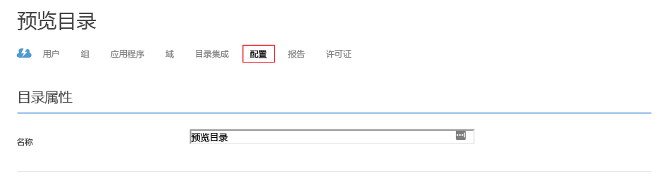

# 为 Azure AD 域服务托管域配置安全 LDAP (LDAPS)
本文说明如何为 Azure AD 域服务托管域启用安全轻量目录访问协议 (LDAPS)。 安全 LDAP 也称为基于安全套接字层 (SSL)/传输层安全性 (TLS) 的轻量目录访问协议 (LDAP)。

## 开始之前
若要执行本文中所列的任务，需要：

1. 一个有效的 **Azure 订阅**。
2. 一个 **Azure AD 目录** - 已与本地目录或仅限云的目录同步。
3. 必须为 Azure AD 目录启用 **Azure AD 域服务**。 如果未启用，请遵循[入门指南](active-directory-ds-getting-started.md)中所述的所有任务。
4. **用于启用安全 LDAP 的证书**。
   
   * **建议** - 从信任的公共证书颁发机构获取证书。 这是更安全的配置选项。
   * 或者，也可以按本文稍后所述选择[创建自签名证书](#task-1---obtain-a-certificate-for-secure-ldap)。

 

### 安全 LDAP 证书的要求
根据以下指导原则获取有效证书，然后启用安全 LDAP。 如果尝试使用无效/不正确的证书来为托管域启用安全 LDAP，操作将会失败。

1. **受信任的颁发者** - 证书必须由使用安全 LDAP 连接到域的计算机所信任的颁发机构颁发。 此颁发机构可能是这些计算机信任的公共证书颁发机构。
2. **生存期** - 证书必须至少在接下来的 3 到 6 个月内保持有效。 证书过期后，安全 LDAP 不再可以访问托管域。
3. **使用者名称** - 在托管域中，证书的使用者名称必须是通配符。 例如，如果域名为“contoso100.com”，则证书的使用者名称必须是“*.contoso100.com”。 请将 DNS 名称（使用者替代名称）设置为此通配符名称。
4. **密钥用途** - 必须将证书设置为以下用途：数字签名和密钥加密。
5. **证书目的** - 证书必须有效，可用于 SSL 服务器身份验证。

> [!NOTE]
> **企业证书颁发机构：**Azure AD 域服务目前不支持使用组织的企业证书颁发机构颁发的安全 LDAP 证书。 限制的原因是：此服务不信任企业 CA 作为根证书颁发机构。 我们希望在将来添加对企业 CA 的支持。 如果必须使用由企业 CA 颁发的证书。请[联系我们](active-directory-ds-contact-us.md)获取帮助。
> 
> 

 

## 任务 1 - 获取安全 LDAP 的证书
第一个任务涉及到获取证书，该证书用于对托管域进行安全 LDAP 访问。 可以使用两个选项：

* 从证书颁发机构获取证书。 颁发机构可以是公共证书颁发机构。
* 创建自签名证书。

### 选项 A（建议）- 从证书颁发机构获取安全 LDAP 证书
如果组织从公共证书颁发机构获取其证书，则你需要从该公共证书颁发机构获取安全 LDAP 证书。

请求证书时，请务必满足[安全 LDAP 证书的要求](#requirements-for-the-secure-ldap-certificate)中所述的要求。

> [!NOTE]
> 需要使用安全 LDAP 连接到托管域的客户端计算机必须信任安全 LDAP 证书的颁发者。
> 
> 

### 选项 B - 为安全 LDAP 创建自签名证书
如果不想使用公共证书颁发机构颁发的证书，可以选择为安全 LDAP 创建自签名证书。

**使用 PowerShell 创建自签名证书**

在 Windows 计算机上以**管理员**身份打开新的 PowerShell 窗口，然后输入以下命令创建新的自签名证书。

    $lifetime=Get-Date

    New-SelfSignedCertificate -Subject *.contoso100.com -NotAfter $lifetime.AddDays(365) -KeyUsage DigitalSignature, KeyEncipherment -Type SSLServerAuthentication -DnsName *.contoso100.com

在上述示例中，请将“contoso100.com”替换为 Azure AD 域服务托管域的 DNS 域名。

新建的自签名证书放在本地计算机的证书存储中。

## 任务 2 - 将安全 LDAP 证书导出到 .PFX 文件
在开始此任务之前，请确保已从公共证书颁发机构获取安全 LDAP 证书，或已创建自签名证书。

执行以下步骤，将 LDAPS 证书导出到 .PFX 文件。

1. 按“开始”按钮并键入 **R**。在“运行”对话框中键入 **mmc**，然后单击“确定”。

    
2. 在“用户帐户控制”提示窗口中单击“是”，以管理员身份启动 MMC（Microsoft 管理控制台）。
3. 在“文件”菜单中，单击“添加/删除管理单元...”。

    
4. 在“添加或删除管理单元”对话框中，选择“证书”管理单元，然后单击“添加 >”按钮。

    
5. 在“证书管理单元”向导中，选择“计算机帐户”并单击“下一步”。

    
6. 在“选择计算机”页上，选择“本地计算机:(运行此控制台的计算机)”并单击“完成”。

    
7. 在“添加或删除管理单元”对话框中，单击“确定”将证书管理单元添加到 MMC。

    
8. 在 MMC 窗口中，单击“控制台根节点”将它展开。 应会看到“证书”管理单元已加载。 单击“证书(本地计算机)”将它展开。 依次单击“个人”节点和“证书”节点将其展开。

    
9. 此时应会显示所创建的自签名证书。 可以检查证书的属性，确保指纹与创建证书时 PowerShell 窗口中报告的指纹相匹配。
10. 选择自签名证书并**单击右键**。 在右键单击菜单中，依次选择“所有任务”和“导出...”。

    
11. 在“证书导出向导”中，单击“下一步”。

    
12. 在“导出私钥”页上，选择“是，导出私钥”，然后单击“下一步”。

    

    > [!WARNING]
    > 必须连同证书一起导出私钥。 如果提供的 PFX 不包含证书的私钥，则为托管域启用安全 LDAP 将会失败。
    >
    >
13. 在“导出文件格式”页上，选择“个人信息交换 - PKCS #12 (.PFX)”作为导出证书的文件格式。

    

    > [!NOTE]
    > 仅支持 .PFX 文件格式。 请不要将证书导出为 .CER 文件格式。
    >
    >
14. 在“安全”页上选择“密码”选项，然后输入用于保护 .PFX 文件的密码。 请记住此密码，因为下一个任务要用到它。 单击“下一步”继续。

    

    > [!NOTE]
    > 记下此密码。 在[任务 3 - 为托管域启用安全 LDAP](#task-3---enable-secure-ldap-for-the-managed-domain) 中为此托管域启用安全 LDAP 时，需要用到此密码。
    >
    >
15. 在“要导出的文件”页上，指定文件名以及证书要导出到的位置。

    
16. 在下一页上单击“完成”，将证书导出到 PFX 文件。 证书导出后，应会显示确认对话框。

    

## 任务 3 - 为托管域启用安全 LDAP
若要启用安全 LDAP，请执行以下配置步骤：

1. 导航到 **[Azure 经典门户](https://manage.windowsazure.com)**。
2. 在左窗格中，选择“Active Directory”节点。
3. 选择已启用 Azure AD 域服务的 Azure AD 目录（也称为“租户”）。

    
4. 单击“配置”  选项卡。

    
5. 向下滚动到标题为“域服务”的部分。 应会看到标题为“安全 LDAP (LDAPS)”的选项，如以下屏幕截图中所示：

    
6. 单击“配置证书...”按钮显示“设置安全 LDAP 的证书”对话框。

    
7. 单击“包含证书的 PFX 文件”下的文件夹图标，指定要用于对托管域进行安全 LDAP 访问的证书所在的 PFX 文件。 此外，请输入将证书导出到 PFX 文件时指定的密码。 然后，单击底部的完成按钮。

    
8. “配置”选项卡的“域服务”部分应该灰显，并且会处在“挂起...”状态几分钟。 在此期间，系统将验证 LDAPS 证书的正确性，同时为托管域配置安全 LDAP。

    

   > [!NOTE]
   > 为托管域启用安全 LDAP 大约需要 10 到 15 分钟时间。 如果提供的安全 LDAP 证书不符合所需的条件，则不会为目录启用安全 LDAP，并且会显示失败消息。 例如，域名不正确、证书已过期或即将过期。
   > 
   > 

9. 为托管域成功启用安全 LDAP 后，“挂起...”消息应会消失。 此时会显示证书的指纹。

    

 

## 任务 4 - 启用通过 Internet 进行安全 LDAP 访问
**可选任务** - 如果你不打算使用 LDAPS 来通过 Internet 访问托管域，请跳过此配置任务。

开始此任务之前，请确保已完成[任务 3](#task-3---enable-secure-ldap-for-the-managed-domain) 中所述的步骤。

1. 应会在“配置”页的“域服务”部分中看到“启用通过 Internet 进行安全 LDAP 访问”的选项。 此选项设置为“否”，因为默认情况下已禁用通过安全 LDAP 对托管域进行 Internet 访问。

    
2. 将“启用通过 Internet 进行安全 LDAP 访问”切换为“是”。 在底部面板上单击“保存”按钮。
    
3. “配置”选项卡的“域服务”部分应该灰显，并且会处在“挂起...”状态几分钟。 经过片刻时间后，将启用通过安全 LDAP 对托管域进行 Internet 访问。

    

   > [!NOTE]
   > 为托管域启用通过安全 LDAP 的 Internet 访问大约需要 10 分钟时间。
   >
   >
4. 在成功启用通过 Internet 对托管域进行安全 LDAP 访问后，“挂起...”消息应会消失。 应会在“LDAPS 访问的外部 IP 地址”字段中看到可用于通过 LDAPS 访问目录的外部 IP 地址。

    

 

## 任务 5 - 配置 DNS 以便从 Internet 访问托管域
**可选任务** - 如果你不打算使用 LDAPS 来通过 Internet 访问托管域，请跳过此配置任务。

开始此任务之前，请确保已完成[任务 4](#task-4---enable-secure-ldap-access-over-the-internet) 中所述的步骤。

为托管域启用通过 Internet 的安全 LDAP 访问后，需要更新 DNS，使客户端计算机能够找到此托管域。 在任务 4 的最后阶段，“配置”选项卡的“LDAPS 访问的外部 IP 地址”中会显示外部 IP 地址。

请配置外部 DNS 提供程序，使托管域的 DNS 名称（例如“ldaps.contoso100.com”）指向此外部 IP 地址。 在本例中，需要创建以下 DNS 条目：

    ldaps.contoso100.com  -> 52.165.38.113

大功告成。现在，可以使用安全 LDAP 通过 Internet 连接到托管域。

> [!WARNING]
> 请记住，客户端计算机必须信任 LDAPS 证书的颁发者，才能成功使用 LDAPS 连接到托管域。 如果使用企业证书颁发机构或公开的受信任证书颁发机构，则不需要采取任何操作，因为客户端计算机信任这些证书颁发者。 如果使用自签名证书，则必须在客户端计算机的受信任证书存储中安装自签名证书的公开部分。
>
>

 

## 相关内容
* [Azure AD 域服务 - 入门指南](active-directory-ds-getting-started.md)
* [管理受 Azure AD 域服务管理的域](active-directory-ds-admin-guide-administer-domain.md)
* [管理 Azure AD 域服务托管域上的组策略](active-directory-ds-admin-guide-administer-group-policy.md)

<!--HONumber=Jan17_HO4-->

