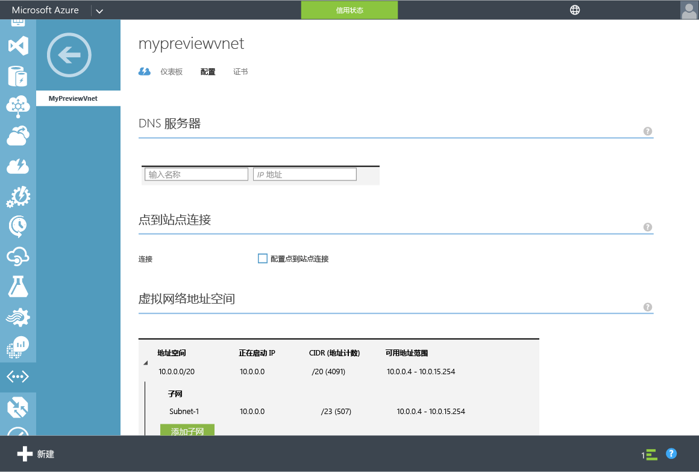
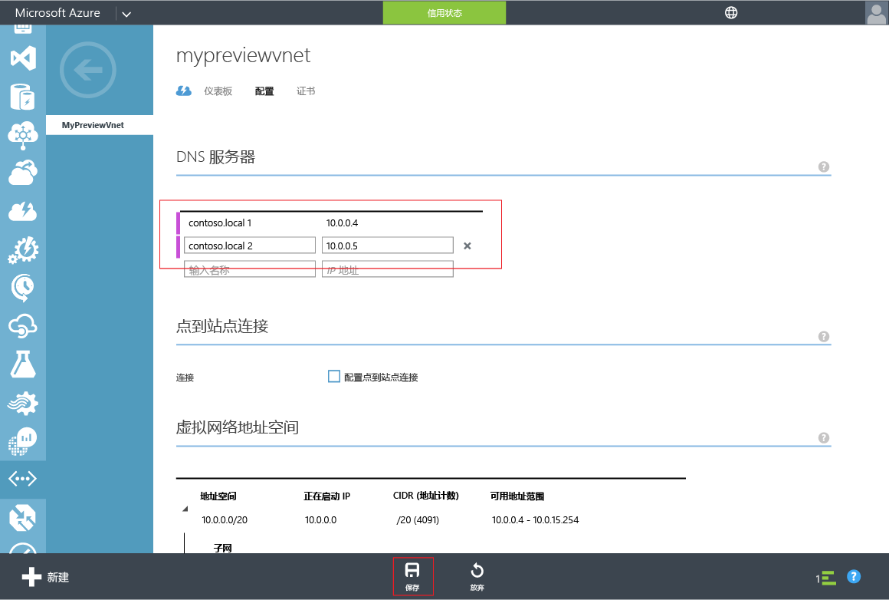

# Azure AD 域服务*（预览版）* - 更新 Azure 虚拟网络的 DNS 设置
## 任务 4：更新 Azure 虚拟网络的 DNS 设置
现在，你已成功为目录启用 Azure AD 域服务，下一个任务是确保虚拟网络中的计算机可以连接并使用这些服务。为此，需要更新虚拟网络的 DNS 服务器设置，以指向其中 Azure AD 域服务在虚拟网络上可用的 IP 地址。

> [!NOTE]
> 为目录启用 Azure AD 域服务后，记下目录的“**配置**”选项卡上显示的 Azure AD 域服务的 IP 地址。
> 
> 

若要更新已在其中启用 Azure AD 域服务的虚拟网络的 DNS 服务器设置，请执行下列配置步骤。

1. 导航到 **Azure 经典门户** ([https://manage.windowsazure.com](https://manage.windowsazure.com))。
2. 在左窗格上选择“**网络**”节点。
   
    
3. 在“**虚拟网络**”选项卡上，选择其中启用了 Azure AD 域服务的虚拟网络，以查看其属性。
4. 单击“**配置**”选项卡。
   
    
5. 在“**DNS 服务器**”部分，输入 Azure AD 域服务的 IP 地址。
6. 确保已输入目录的“**配置**”选项卡上“**域服务**”部分显示的两个 IP 地址。
7. 单击页面底部任务窗格上的“**保存**”，以保存此虚拟网络的 DNS 服务器设置。
   
   

> [!NOTE]
> 更新虚拟网络的 DNS 服务器设置后，网络上的虚拟机可能需要一些时间才能获取更新的 DNS 配置。如果虚拟机无法连接到域，则可以刷新 DNS 缓存（例如“ipconfig /flushdns”），以便强制刷新虚拟机上的 DNS 设置。
> 
> 

## 任务 5 - 启用 Azure AD 域服务密码同步
下一个配置任务是任务“[启用 Azure AD 域服务密码同步](active-directory-ds-getting-started-password-sync.md)”。

<!---HONumber=AcomDC_0921_2016-->