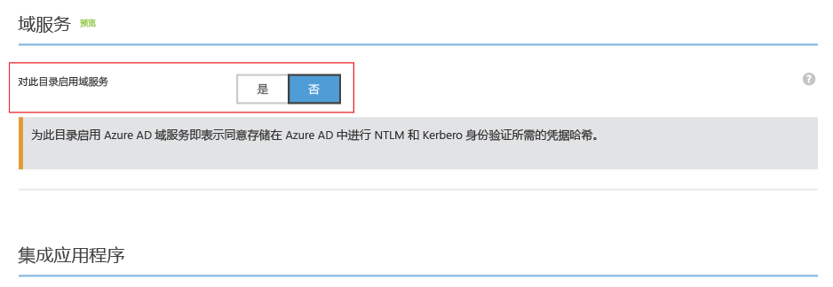
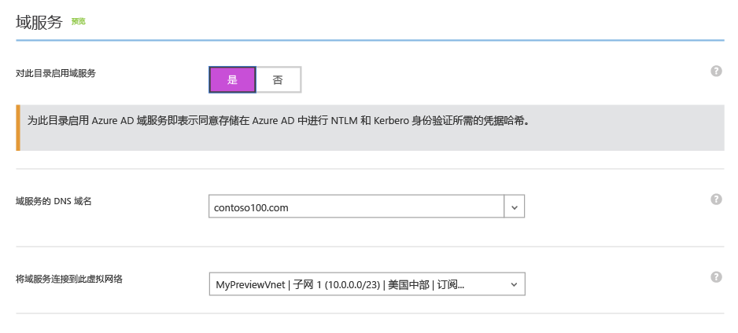
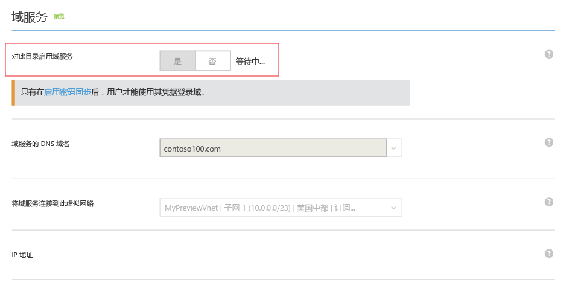
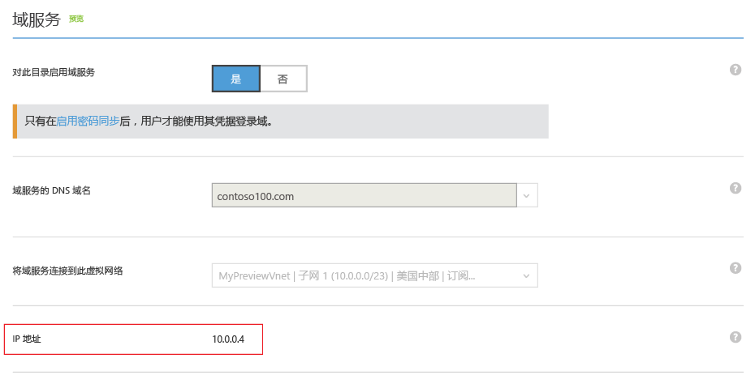
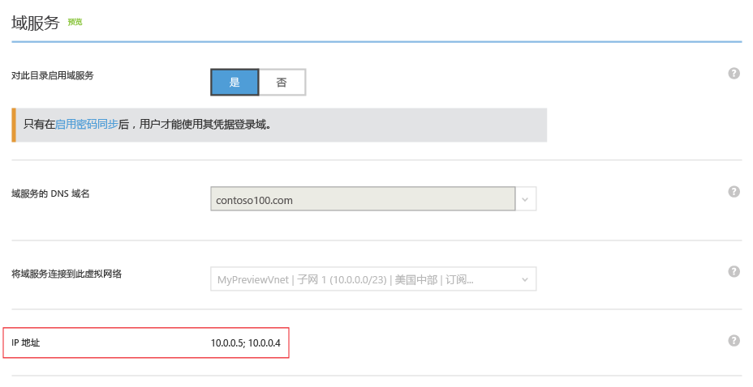

<properties
	pageTitle="Azure AD 域服务：启用 Azure AD 域服务 | Microsoft Azure"
	description="Azure Active Directory 域服务（预览版）入门"
	services="active-directory-ds"
	documentationCenter=""
	authors="mahesh-unnikrishnan"
	manager="stevenpo"
	editor="curtand"/>

<tags
	ms.service="active-directory-ds"
	ms.workload="identity"
	ms.tgt_pltfrm="na"
	ms.devlang="na"
	ms.topic="get-started-article"
	ms.date="07/06/2016"
	ms.author="maheshu"/>

# Azure AD 域服务*（预览版）*- 启用 Azure AD 域服务

## 任务 3：启用 Azure AD 域服务
在此任务中，为目录启用 Azure AD 域服务。执行以下配置步骤，为目录启用 Azure AD 域服务。

1. 导航到 **Azure 经典门户** ([https://manage.windowsazure.com](https://manage.windowsazure.com))。

2. 在左窗格中，选择“Active Directory”节点。

3. 选择要启用 Azure AD 域服务的 Azure AD 租户（目录）。

    

4. 单击“配置”选项卡。

    

5. 向下滚动到标题为“域服务”的部分。

    

6. 将标题为“为此目录启用域服务”的选项切换为“是”。可以看到，页面上出现了 Azure AD 域服务的其他配置选项。

    

    > [AZURE.NOTE] 为租户启用 Azure AD 域服务时，Azure AD 将生成并存储对用户进行身份验证时所需的 Kerberos 和 NTLM 凭据哈希。

7. 指定“域服务的 DNS 域名”。

   - 默认情况下，将选择目录的默认域名（即，末尾为 **.onmicrosoft.com** 域后缀的域名）。

   - 列表包含已针对 Azure AD 目录配置的所有域，包括在“域”选项卡中配置的已验证和未验证域。

   - 此外，还可以在此列表中添加自定义域名，只需在列表中键入即可。在本示例中，键入了自定义域名“contoso100.com”

     > [AZURE.WARNING] 确保指定的域名的域前缀（例如“contoso100.com”域名中的“contoso100”）不超过 15 个字符。不能创建域前缀超过 15 个字符的 Azure AD 域服务域。

8. 下一步是选择要在其中使用 Azure AD 域服务的虚拟网络。在标题为“将域服务连接到此虚拟网络”的下拉列表中，选择刚刚创建的虚拟网络。

   - 确保指定的虚拟网络属于 Azure AD 域服务支持的 Azure 区域。

   - 请参阅 [Azure services by region](https://azure.microsoft.com/regions/#services/)（按区域列出的 Azure 服务）页，了解已推出 Azure AD 域服务的 Azure 区域。

   - 请注意，属于不支持 Azure AD 域服务的区域的虚拟网络不会出现在下拉列表中。

   - 同样地，使用 Azure Resource Manager（基于 ARM 的虚拟网络）创建的虚拟网络也不会出现在下拉列表中。这是因为，Azure AD 域服务目前不支持基于 ARM 的虚拟网络。

9. 确保虚拟网络中不存在为托管域选择的 DNS 域名。在以下情况下可能会存在这种域名：

   - 如果虚拟网络中存在具有相同 DNS 域名的域。

   - 如果选择的虚拟网络已通过 VPN 连接到本地网络，而本地网络上存在具有相同 DNS 域名的域。

   - 如果虚拟网络上存在具有该名称的云服务。

10. 选择完上述选项后，单击页面底部的任务窗格中的“保存”，启用 Azure AD 域服务。

11. 为目录启用 Azure AD 域服务时，页面会显示“等待...”状态。

    

    > [AZURE.NOTE] Azure AD 域服务为托管域提供高可用性。首次为域启用 Azure AD 域服务时，可以看到，可在虚拟网络上使用的域服务的 IP 地址会逐个显示。服务为域启用高可用性后，第二个 IP 地址将立即显示。为域配置高可用性并将其激活后，应会在“配置”选项卡的“域服务”部分中看到两个 IP 地址。

12. 大约 20-30 分钟后，将在“配置”页的“IP 地址”字段中看到可在虚拟网络上使用的域服务的第一个 IP 地址。

    

13. 如果域的高可用性正常运行，将在页面上看到两个 IP 地址。这些是可在所选虚拟网络上使用的 Azure AD 域服务的 IP 地址。请记下这些 IP 地址，以便更新虚拟网络的 DNS 设置。此步骤可使虚拟网络上的虚拟机连接到域，执行域加入等操作。

    

> [AZURE.NOTE] 根据 Azure AD 目录的大小（用户、组等的数目），需要在一段时间后才能在 Azure AD 域服务中提供目录的内容。此同步过程在后台发生。对于包含几万个对象的大型目录，可能需要一天或两天的时间，才能在 Azure AD 域服务中同步和提供所有用户、组成员资格与凭据。

 

## 任务 4 - 更新 Azure 虚拟网络的 DNS 设置
下一个配置任务是[更新 Azure 虚拟网络的 DNS 设置](active-directory-ds-getting-started-dns.md)。

<!---HONumber=AcomDC_0921_2016-->