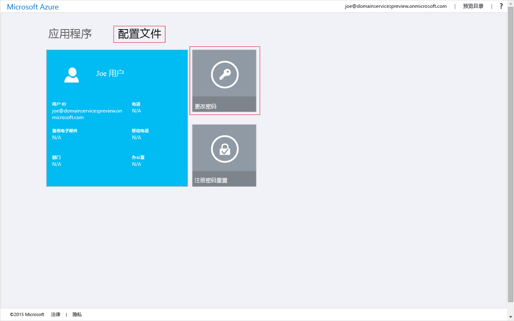

# 允许将密码哈希同步到 Azure Active Directory 域服务
在前述任务中，你为 Azure Active Directory (Azure AD) 租户启用了 Azure Active Directory 域服务。 下一个任务是使 NT LAN Manager (NTLM) 和 Kerberos 身份验证所需的密码哈希同步到 Azure AD 域服务。 设置密码哈希同步以后，用户即可使用其公司凭据登录到托管域。

对于仅限云的用户帐户来说，所涉及的步骤不同于使用 Azure AD Connect 从本地目录同步的用户帐户。 

 
| **用户帐户的类型** | **要执行的步骤** |
| --- |---|
| **在 Azure AD 中创建的云用户帐户** |**&#x2713;** [按此文中的说明操作](active-directory-ds-getting-started-password-sync.md#task-5-enable-password-hash-synchronization-to-your-managed-domain-for-cloud-only-user-accounts) |
| **从本地目录同步的用户帐户** |**&#x2713;** [为从本地 AD 同步到托管域的用户帐户同步密码哈希](active-directory-ds-getting-started-password-sync-synced-tenant.md) | 

 

> [!TIP]
> **可能需要完成这两组步骤。**
> 如果 Azure AD 租户既有仅限云的用户，又有来自本地 AD 的用户，则需完成两组步骤。
>

## 任务 5：为仅限云的用户帐户启用到托管域的密码哈希同步
Azure Active Directory 域服务需要密码哈希的格式适用于 NTLM 和 Kerberos 身份验证，以对托管域上的用户进行身份验证。 除非为租户启用了 Azure Active Directory 域服务，否则 Azure AD 不会以 NTLM 或 Kerberos 身份验证所需的格式生成或存储密码哈希。 出于显而易见的安全考虑，Azure AD 也不以明文形式存储任何密码凭据。 因此，根据用户的现有凭据，Azure AD 没有方法来自动生成这些 NTLM 或 Kerberos 密码哈希。

> [!NOTE]
> **如果组织有仅限云的用户帐户，则需要使用 Azure Active Directory 域服务的所有用户必须更改其密码。** 仅限云的用户帐户是在 Azure AD 目录中使用 Azure 门户或 Azure AD PowerShell cmdlet 创建的帐户。 此类用户帐户不是从本地目录同步的。
>
>

此密码更改过程会导致在 Azure AD 中生成进行 Kerberos 和 NTLM 身份验证时 Azure Active Directory 域服务所需的密码哈希。 也可以对需要使用 Azure Active Directory 域服务的所有租户中的用户终止密码或指示这些用户更改其密码。

### 对仅限云的用户帐户启用 NTLM 和 Kerberos 密码哈希生成
下面是需要向用户提供的说明，以便用户可以更改其密码：

1. 转到组织的 [Azure AD 访问面板](http://myapps.microsoft.com)页。

    

2. 在右上角单击名称，然后从菜单中选择“配置文件”。

    

3. 在“配置文件”页上，单击“更改密码”。

    

   > [!TIP]
   > 如果在“访问面板”窗口中没有显示“更改密码”选项，请确保组织已配置 [Azure AD 中的密码管理](../active-directory/authentication/quickstart-sspr.md)。
   >
   >
4. 在“更改密码”页上，键入现有（旧）密码，并键入新密码并确认。

    

5. 单击“ **提交**”。

更改密码后，新密码数分钟后会在 Azure Active Directory 域服务中可用。 大约 20 分钟后，便可以使用新更改的密码登录到已加入托管域的计算机了。

## 相关内容
* [如何更新自己的密码](../active-directory/user-help/active-directory-passwords-update-your-own-password.md)
* [Azure AD 中的密码管理入门](../active-directory/authentication/quickstart-sspr.md)
* [对已同步的 Azure AD 租户启用 Azure Active Directory 域服务密码哈希同步](active-directory-ds-getting-started-password-sync-synced-tenant.md)
* [管理 Azure Active Directory 域服务托管域](active-directory-ds-admin-guide-administer-domain.md)
* [将 Windows 虚拟机加入到 Azure Active Directory 域服务托管域](active-directory-ds-admin-guide-join-windows-vm.md)
* [将 Red Hat Enterprise Linux 虚拟机加入到 Azure Active Directory 域服务托管域](active-directory-ds-admin-guide-join-rhel-linux-vm.md)
