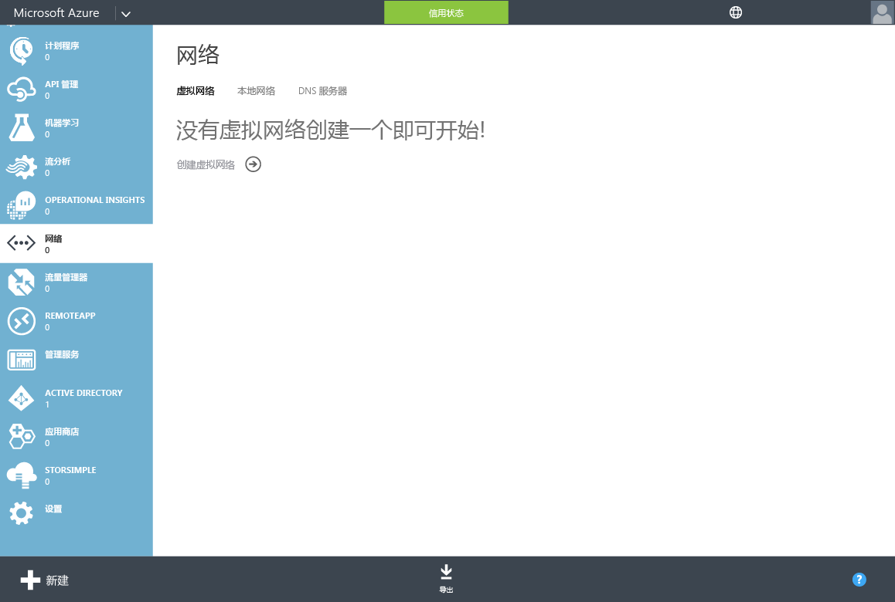
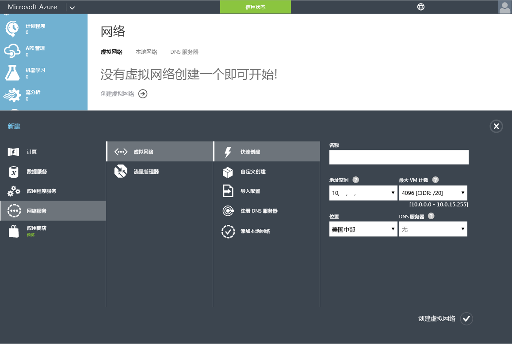
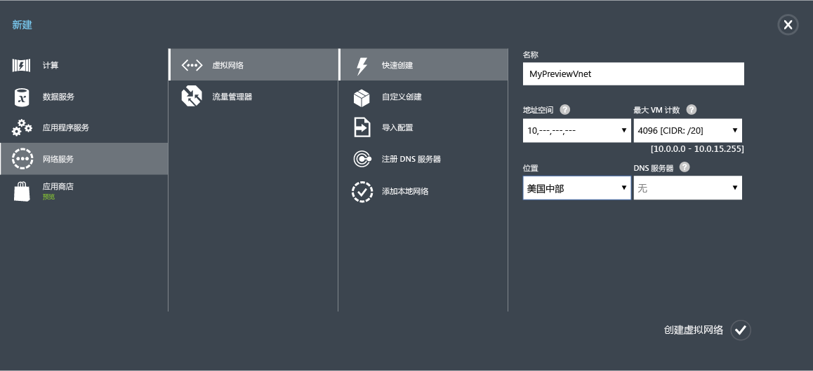
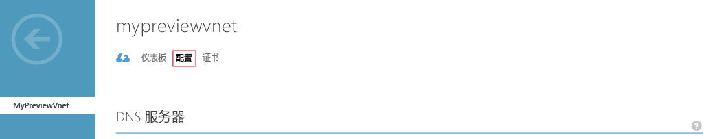
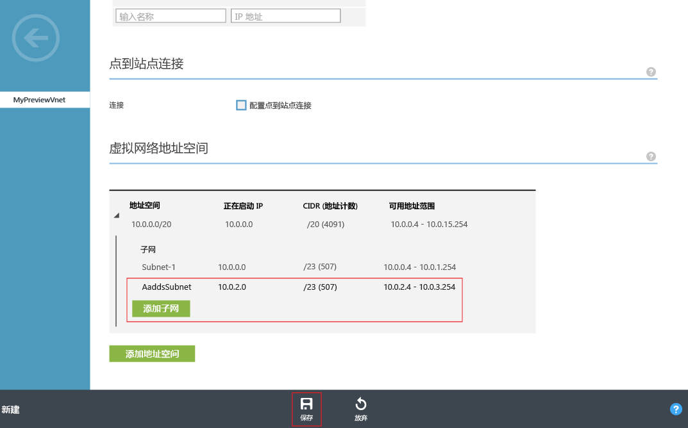

# 为 Azure AD 域服务创建或选择虚拟网络
## 选择 Azure 虚拟网络的准则
> [!NOTE]
> **开始之前**︰请参阅 [有关 Azure AD 域服务的网络注意事项](active-directory-ds-networking.md)。
>
>

## 任务 2：创建 Azure 虚拟网络
下一个配置任务是创建 Azure 虚拟网络和其中的子网。 在虚拟网络的此子网中启用 Azure AD 域服务。 如果已经有你想使用的现有虚拟网络，则可以跳过此步骤。

> [!NOTE]
> 确保你创建或选择与 Azure AD 域服务结合使用的 Azure 虚拟网络属于受 Azure AD 域服务支持的 Azure 区域。 请参阅“ [Azure 服务（按区域）](https://azure.microsoft.com/regions/#services/) ”页面，了解 Azure AD 域服务可用的 Azure 区域。
>
>

记下虚拟网络的名称，以便在后续配置步骤中启用 Azure AD 域服务时能够选择正确的虚拟网络。

执行以下配置步骤，以创建要在其中启用 Azure AD 域服务的 Azure 虚拟网络。

1. 导航到 **Azure 经典门户** ([https://manage.windowsazure.com](https://manage.windowsazure.com))。
2. 在左窗格上选择“ **网络** ”节点。

    
3. 在页面底部的任务窗格中单击“ **新建** ”。

    
4. 在“网络服务”节点中，选择“虚拟网络”。
5. 单击“ **快速创建** ”，创建虚拟网络。

    
6. 指定虚拟网络的“ **名称** ”。 还可以选择为此网络配置“地址空间”或“最大 VM 计数”。 现在，可以将“DNS 服务器”设置保留为“无”。 启用 Azure AD 域服务后，可以更新 DNS 服务器设置。
7. 确保在“ **位置** ”下拉列表中选择受支持的 Azure 区域。 请参阅“ [Azure 服务（按区域）](https://azure.microsoft.com/regions/#services/) ”页面，了解 Azure AD 域服务可用的 Azure 区域。
8. 若要创建虚拟网络，请单击“ **创建虚拟网络** ”按钮。

    
9. 创建虚拟网络后，选择虚拟网络，然后单击“配置”选项卡。

    
10. 导航到“虚拟网络地址空间”部分。 单击“添加子网”，指定名为“AaddsSubnet”的子网。 单击“保存”以创建子网。

    

 

## 任务 3 - 启用 Azure AD 域服务
下一个配置任务是“ [启用 Azure AD 域服务](active-directory-ds-getting-started-enableaadds.md)”。

