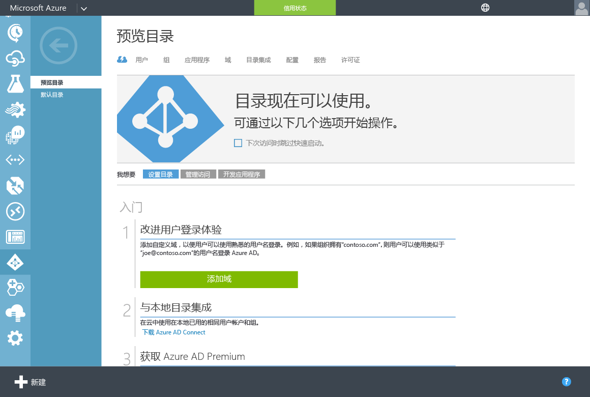

# Azure AD 域服务入门
本文逐步讲解如何针对 Azure AD 租户启用 Azure AD 域服务所需的配置任务。

## 任务 1：创建“AAD DC 管理员”组
第一个任务是在 Azure Active Directory 租户中创建管理组。 此特殊管理组称为 **AAD DC 管理员**。 此组的成员在已加入 Azure AD 域服务托管域的计算机上拥有管理权限。 在加入域的计算机上，此组将添加到“管理员”组。 此外，此组的成员可以使用远程桌面远程连接到已加入域的计算机。  

> [!NOTE]
> 你在使用 Azure AD 域服务创建的域中没有“域管理员”或“企业管理员”权限。 在托管域上，服务将保留这些权限，不会将其提供给租户中的用户。 但是，可以使用在此配置任务中创建的特殊管理员组执行某些特权操作。 这些操作包括将计算机加入域、在已加入域的计算机上将用户添加到“管理员”组、配置组策略，等等。
> 
> 

在此配置任务中，需要创建一个管理组，并将目录中的一个或多个用户添加到该组。 执行以下步骤创建 Azure AD 域服务的管理组：

1. 导航到 **Azure 经典门户** ([https://manage.windowsazure.com](https://manage.windowsazure.com))
2. 在左窗格中，选择“Active Directory”节点。
3. 选择要启用 Azure AD 域服务的 Azure AD 租户（目录）。 对于每个 Azure AD 目录，只能创建一个域。
   
    
4. 单击“组”选项卡。
5. 若要将组添加到 Azure AD 租户，请在页面底部的任务窗格中单击“添加组”。
   
    
6. 创建名为“AAD DC 管理员”的组。 将“组类型”设置为“安全性”。
   
   > [!WARNING]
   > 若要在 Azure AD 域服务托管域中启用访问权限，请使用此确切名称创建组。
   > 
   > 
   
    
7. 添加此组的说明，使其他用户知道此组用于授予 Azure AD 域服务中的管理权限。
8. 创建组之后，请单击组的名称查看此组的属性。 若要将用户添加为此组的成员，请在底部面板中单击“添加成员”按钮。
   
    
9. 在“添加成员”对话框中，选择应成为此组的成员的用户，完成后选中相应的复选框。
   
    

 

## 任务 2：创建或选择 Azure 虚拟网络
下一个配置任务是[创建或选择 Azure 虚拟网络](active-directory-ds-getting-started-vnet.md)。

<!--HONumber=Dec16_HO5-->

