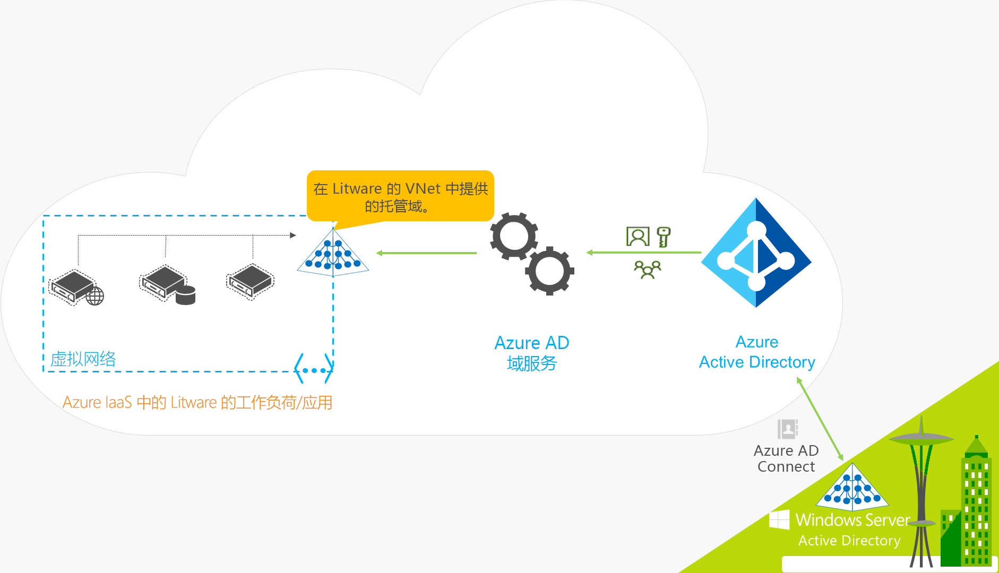
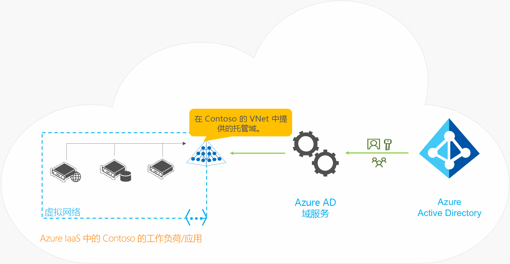

# 什么是 Azure Active Directory 域服务？

Azure Active Directory 域服务 (Azure AD DS) 提供与 Windows Server Active Directory 完全兼容的托管域服务，例如域加入、组策略、轻型目录访问协议 (LDAP) 和 Kerberos/NTLM 身份验证。 无需在云中部署、管理和修补域控制器即可使用这些域服务。 Azure AD DS 与现有 Azure AD 租户集成，因此用户可使用其现有凭据登录。 此外，也可使用现有的组和用户帐户安全访问资源，确保更顺畅地将本地资源直接迁移到 Azure。

Azure AD DS 从 Azure AD 中复制标识信息，因此，适用于仅限云的 Azure AD 租户，或与本地 Active Directory 域服务 (AD DS) 环境同步的租户。 对于这两种环境，都存在相同的一组 Azure AD DS 功能。

* 如果有现有的本地 AD DS 环境，则可以同步用户帐户信息，为用户提供一致的标识。
* 对于仅限云的环境，则不需要传统的本地 AD DS 环境来使用 Azure AD DS 的集中标识服务。

以下视频概述了 Azure AD DS 如何与应用程序和工作负载集成以在云中提供标识服务：

 

>[!VIDEO https://www.youtube.com/embed/T1Nd9APNceQ]

## 在云中提供标识解决方案的常见方法

将现有工作负载迁移到云时，目录感知的应用程序可以使用 LDAP 对本地 AD DS 目录进行读取或写入访问。 Windows Server 上运行的应用程序通常部署在已加入域的虚拟机 (VM) 上，因此可以使用组策略安全地对其进行管理。 若要对最终用户进行身份验证，应用程序还可能依赖于 Windows 集成的身份验证，如 Kerberos 或 NTLM 身份验证。

IT 管理员通常使用以下某一解决方案为 Azure 中运行的应用程序提供标识服务：

* 在 Azure 中运行的工作负载与本地 AD DS 环境之间配置站点到站点 VPN 连接。
* 使用 Azure 虚拟机 (VM) 创建副本域控制器以扩展 AD DS 域/林。
* 使用 Azure VM 上运行的域控制器在 Azure 中部署独立的 AD DS 环境。

借助这些方法，与本地目录的 VPN 连接使得应用程序容易发生暂时性网络问题或中断。 如果使用 Azure 中的 VM 部署域控制器，IT 团队 VM 必须对其进行管理、保护、修补、监视、备份和故障排除。

Azure AD DS 提供了替代方法，由此能够创建返回到本地 AD DS 环境的 VPN 连接，或在 Azure 中运行和管理 VM 以提供标识服务。 作为托管服务，Azure AD DS 降低了为混合环境和仅限云环境创建集成标识解决方案的复杂性。

## Azure AD DS 功能和优点

为了向云中的应用程序和 VM 提供标识服务，Azure AD DS 与传统的 AD DS 环境完全兼容，可用于域加入、安全 LDAP (LDAPS)、组策略和 DNS 管理以及 LDAP 绑定和读取支持等操作。 LDAP 写入支持适用于在 Azure AD DS 托管域中创建的对象，但不适用于从 Azure AD 同步的资源。 Azure AD DS 的以下功能简化了部署和管理操作：

* **简化的部署体验：** 在 Azure 门户中使用单个向导为 Azure AD 租户启用 Azure AD DS。
* **与 Azure AD 集成：** 可从 Azure AD 租户自动获得用户帐户、组成员身份和凭据。 新用户、组或者对 Azure AD 租户或本地 AD DS 环境中的属性所做的更改会自动同步到 Azure AD DS。
    * 链接到 Azure AD 的外部目录中的帐户不可用于 Azure AD DS。 凭据不可用于这些外部目录，因此无法同步到 Azure AD DS 托管域。
* **使用企业凭据/密码：** Azure AD 租户和 Azure AD DS 的用户的密码相同。 用户可以使用其企业凭据将计算机加入域，以交互方式或通过远程桌面登录，以及针对 Azure AD DS 托管域进行身份验证。
* **NTLM 和 Kerberos 身份验证：** 借助对 NTLM 和 Kerberos 身份验证的支持，可以部署依赖于 Windows 集成身份验证的应用程序。
* **高可用性：** Azure AD DS 包括多个域控制器，这些域控制器为托管域提供高可用性。 这种高可用性保证了服务运行时间和故障恢复能力。
    * 在支持 [Azure 可用性区域][availability-zones]的区域中，这些域控制器也跨区域分布，以提升复原能力。 

Azure AD DS 托管域的一些关键方面包括：

* Azure AD DS 托管域是独立的域。 它不是本地域的扩展。
* 你的 IT 团队无需管理、修补或监视此 Azure AD DS 托管域的域控制器。

对于运行本地 AD DS 的混合环境，无需管理到 Azure AD DS 托管域的 AD 复制。 本地目录中的用户帐户、组成员身份和凭据通过 [Azure AD Connect][azure-ad-connect] 同步到 Azure AD。 这些用户帐户、组成员身份和凭据在 Azure AD DS 托管域中自动可用。

## Azure AD DS 如何工作？

为了提供标识服务，Azure 会在所选的虚拟网络上创建一个 AD DS 实例。 在幕后，无需管理、保护或更新，即可通过一对 Windows Server 域控制器提供冗余。

Azure AD DS 托管域配置为从 Azure AD 执行单向同步，以提供对一组集中用户、组和凭据的访问。 你可以直接在 Azure AD DS 托管域中创建资源，但不将它们同步回 Azure AD。 然后，Azure 中连接到此虚拟网络的应用程序、服务和 VM 便可使用常见 AD DS 功能，如域加入、组策略、LDAP 和 Kerberos/NTLM 身份验证。

在具有本地 AD DS 环境的混合环境中，[Azure AD Connect][azure-ad-connect] 会将标识信息与 Azure AD 同步。

若要查看 Azure AD DS 的运行情况，请查看几个示例：

* [混合组织的 Azure AD DS](#azure-ad-ds-for-hybrid-organizations)
* [仅限云的组织的 Azure AD DS](#azure-ad-ds-for-cloud-only-organizations)

### 混合组织的 Azure AD DS

许多组织都运行有一个包含云和本地应用程序工作负载的混合基础结构。 按照直接迁移策略迁移到 Azure 的旧版应用程序可能使用传统的 LDAP 连接来提供标识信息。 若要支持此混合基础结构，可以将本地 AD DS 环境中的标识信息同步到 Azure AD 租户。 然后，Azure AD DS 使用标识源在 Azure 中提供这些旧版应用程序，而无需配置和管理应用程序与本地目录服务的连接。

让我们看一个 Litware Corporation 的示例，这是一个同时运行本地和 Azure 资源的混合组织：

* 需要域服务的应用程序和服务器工作负载部署在 Azure 的虚拟网络中。
    * 这可能包括迁移到 Azure（作为直接迁移策略的一部分）的旧版应用程序。
* 为了将标识信息从其本地目录同步到其 Azure AD 租户，Litware Corporation 部署了 [Azure AD Connect][azure-ad-connect]。
    * 同步的标识信息包括用户帐户和组成员身份。
* Litware 的 IT 团队在此虚拟网络中或在对等互连的虚拟网络中为其 Azure AD 租户启用 Azure AD DS。
* 然后，在 Azure 虚拟网络中部署的应用程序和 VM 便可使用 Azure AD DS 功能，如域加入、LDAP 读取、LDAP 绑定、NTLM、Kerberos 身份验证以及组策略等。

### 仅限云的组织的 Azure AD DS

仅限云的 Azure AD 租户没有本地标识源。 例如，在 Azure AD 中直接创建和管理的用户帐户和组成员身份。

现在，让我们看一个 Contoso 示例，这是一个仅限云的组织，只使用 Azure AD 来标识。 所有用户标识、其凭据和组成员身份都在 Azure AD 中进行创建和管理。 Azure AD Connect 未配置任何其他内容来同步本地目录中的任何标识信息。

* 需要域服务的应用程序和服务器工作负载部署在 Azure 的虚拟网络中。
* Contoso 的 IT 团队在此虚拟网络中或在对等互连的虚拟网络中为其 Azure AD 租户启用 Azure AD DS。
* 然后，在 Azure 虚拟网络中部署的应用程序和 VM 便可使用 Azure AD DS 功能，如域加入、LDAP 读取、LDAP 绑定、NTLM、Kerberos 身份验证以及组策略等。

## 后续步骤

若要详细了解 Azure AD DS 与其他标识解决方案以及同步的工作原理，请参阅以下文章：

* [将 Azure AD DS 与 Azure AD、Azure VM 上的 Active Directory 域服务和本地 Active Directory 域服务进行比较][compare]
* [了解如何将 Azure AD 域服务与 Azure AD 目录同步][synchronization]

若要开始，请[使用 Azure 门户创建 Azure AD DS 托管域][tutorial-create]。

<!-- INTERNAL LINKS -->
[compare]: compare-identity-solutions.md
[synchronization]: synchronization.md
[tutorial-create]: tutorial-create-instance.md
[azure-ad-connect]: ../active-directory/hybrid/whatis-azure-ad-connect.md
[password-hash-sync]: ../active-directory/hybrid/how-to-connect-password-hash-synchronization.md
[availability-zones]: ../availability-zones/az-overview.md
