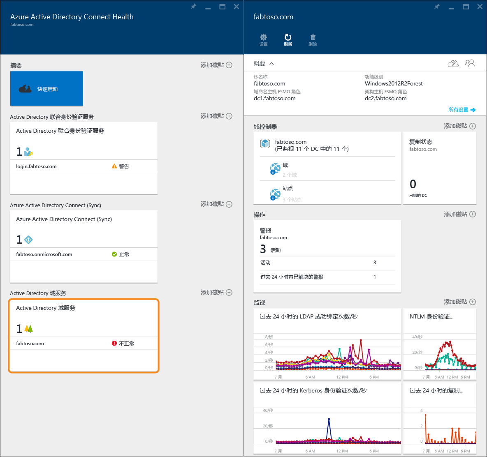
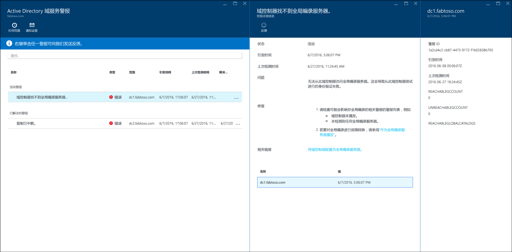
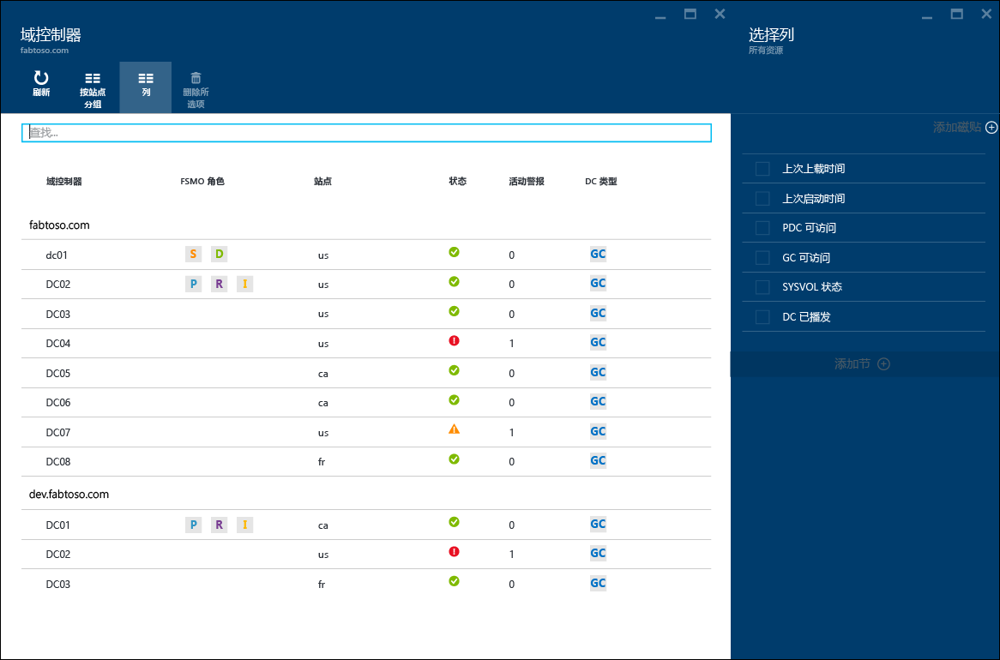
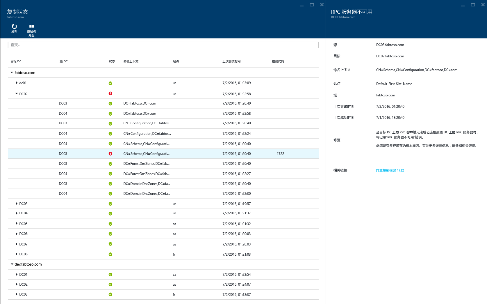
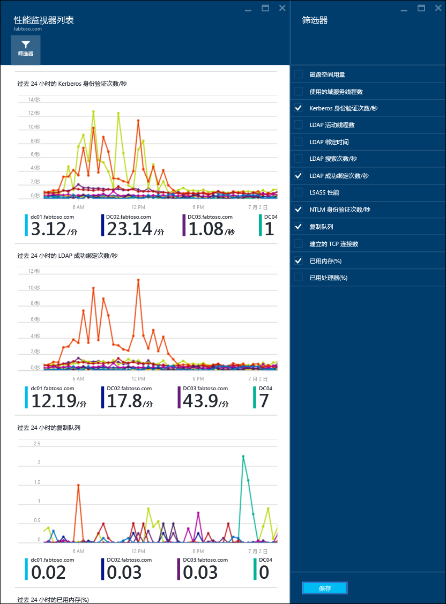

<properties
	pageTitle="在 AD DS 中使用 Azure AD Connect Health | Microsoft Azure"
	description="本页与 Azure AD Connect Health 相关，介绍如何监视 AD DS。"
	services="active-directory"
	documentationCenter=""
	authors="arluca"
	manager="samueld"
	editor="curtand"/>

<tags
	ms.service="active-directory"
	ms.workload="identity"
	ms.tgt_pltfrm="na"
	ms.devlang="na"
	ms.topic="get-started-article"
	ms.date="07/14/2016"
	ms.author="arluca"/>

# 在 AD DS 中使用 Azure AD Connect Health
以下文档专门介绍如何使用 Azure AD Connect Health 来监视 Active Directory 域服务。其中包括 Windows Server 2008 R2、Windows Server 2012 和 Windows Server 2012 R2 上安装的 AD DS。

有关使用 Azure AD Connect Health 监视 AD FS 的信息，请参阅[在 AD FS 中使用 Azure AD Connect Health](active-directory-aadconnect-health-adfs.md)。此外，有关使用 Azure AD Connect Health 监视 Azure AD Connect（同步）的信息，请参阅[使用用于同步的 Azure AD Connect Health](active-directory-aadconnect-health-sync.md)。

## 用于 AD DS 的 Azure AD Connect Health 的警报
用于 AD DS 的 Azure AD Connect Health 中的“警报”部分提供一个与域控制器相关的活动和已解决警报列表。如果选择某个活动或已解决警报，将打开一个新的边栏选项卡，其中包含一些附加信息、解决方法步骤和支持文档链接。每种警报类型可以有一个或多个实例，它们对应于受该特定警报影响的每一个域控制器。在警报边栏选项卡底部附近，可以选择某个受影响的域控制器，这样便会打开一个新的边栏选项卡，其中包含有关该特定警报实例的附加详细信息。

在此边栏选项卡中，可以为警报启用电子邮件通知，并更改视图中的时间范围。通过展开时间范围，可以看到以前已解决的警报。

## 域控制器
此仪表板提供环境拓扑视图，以及每个受监视域控制器的关键操作指标和运行状况。所显示的指标可帮助快速识别可能需要进一步调查的任何域控制器。默认情况下仅显示一部分列；但是，通过单击列命令，你将找到所有可用的列。通过选择你最感兴趣的列，让此仪表板成为一个可轻松查看 AD DS 环境运行状况的地方。

域控制器可按其各自的域或站点分组，这有助于了解环境拓扑。最后，如果你双击边栏选项卡标题，仪表板将最大化，以便充分利用可用的屏幕空间。这在显示多个列时尤其有用。

## 复制状态
此仪表板可用于查看受监视的域控制器的复制状态和复制拓扑。仪表板中将列出最新复制尝试操作的状态，以及针对任何已找到的错误的帮助文档。如果选择包含错误的域控制器，将打开一个新的边栏选项卡，其中包含一些附加信息、解决方法步骤和故障排除文档链接。

## 监视
此功能提供不同性能计数器的图形趋势，这些趋势信息是从每个受监视的域控制器持续收集的。可以根据林中其他所有受监视的域控制器，来轻松比较某个域控制器的性能。此外，你还可以看到并排放置的各种性能计数器，这对排查环境中出现的问题很有帮助。

默认情况下，我们已经预先选择四个性能计数器；但是，你可以通过单击筛选命令并选择或取消选择任何所需的性能计数器，来添加其他计数器。此外，如果单击特定的性能计数器图，将打开一个新的边栏选项卡，其中包含每个受监视域控制器各自的数据点。

## 相关链接

* [Azure AD Connect Health](active-directory-aadconnect-health.md)
* [Azure AD Connect Health 代理安装](active-directory-aadconnect-health-agent-install.md)
* [Azure AD Connect Health 操作](active-directory-aadconnect-health-operations.md)
* [在 AD FS 中使用 Azure AD Connect Health](active-directory-aadconnect-health-adfs.md)
* [使用用于同步的 Azure AD Connect Health](active-directory-aadconnect-health-sync.md)
* [Azure AD Connect Health 常见问题](active-directory-aadconnect-health-faq.md)
* [Azure AD Connect Health 版本历史记录](active-directory-aadconnect-health-version-history.md)

<!---HONumber=AcomDC_0921_2016-->