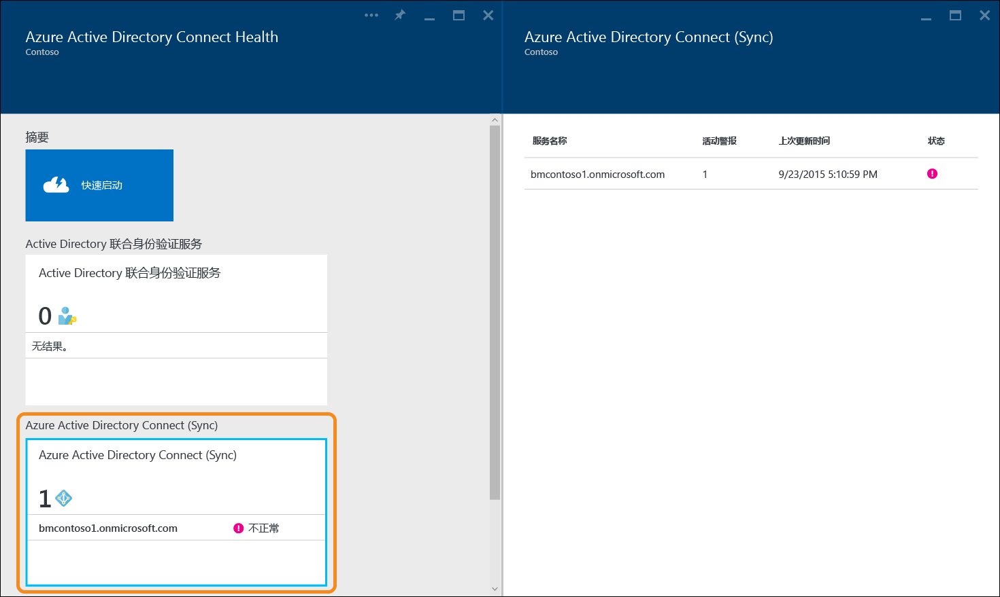
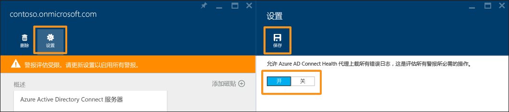

---
title: 使用 Azure AD Connect Health 进行同步 | Microsoft Docs
description: 本页与 Azure AD Connect Health 相关，介绍如何监视 Azure AD Connect 同步。
services: active-directory
documentationcenter: ''
author: billmath
manager: stevenpo
editor: curtand

ms.service: active-directory
ms.workload: identity
ms.tgt_pltfrm: na
ms.devlang: na
ms.topic: get-started-article
ms.date: 08/08/2016
ms.author: billmath

---
# 使用用于同步的 Azure AD Connect Health
以下文档专门介绍如何使用 Azure AD Connect Health 来监视 Azure AD Connect (Sync)。有关使用 Azure AD Connect Health 监视 AD FS 的信息，请参阅[在 AD FS 中使用 Azure AD Connect Health](active-directory-aadconnect-health-adfs.md)。此外，有关使用 Azure AD Connect Health 监视 Active Directory 域服务的信息，请参阅[在 AD DS 中使用 Azure AD Connect Health](active-directory-aadconnect-health-adds.md)。

## 用于同步的 Azure AD Connect Health 的警报
用于同步的 Azure AD Connect Health 警报部分将提供活动警报列表。每个警报均包含相关信息、解决方法步骤和相关文档的链接。选择活动或已解决的警报后，将看到一个新的边栏选项卡，其中将显示额外信息、可用于解决警报的方法步骤以及其他文档的链接。还可以查看过去已解决警报的相关历史数据。

选择警报后，将获取到额外信息、可用于解决警报的方法步骤以及其他文档的链接。

### 警报的受限评估
如果 Azure AD Connect 未使用默认配置（例如，如果属性筛选已从默认配置更改为自定义配置），则 Azure AD Connect Health 代理将不会上载与 Azure AD Connect 相关的错误事件。

这会限制服务对警报进行评估。你将在服务的 Azure 门户中看到一条指示这种状态的横幅消息。

你可以通过单击“设置”并允许 Azure AD Connect Health 代理上载所有错误日志，来改变这种状态。

## 深入了解同步
用于同步的 Azure AD Connect Health 最新版本添加了以下新功能：

* 同步操作延迟
* 对象更改趋势

### 同步延迟
此功能提供连接器同步操作（导入、导出等）延迟的图形趋势。这提供了一种快速方便的方式，使你不仅可以了解操作延迟（在发生大量更改时非常有用），而且还可以检测导致延迟的、可能需要进一步调查的异常行为。

默认情况下只显示 Azure AD 连接器“导出”操作的延迟。若要查看对连接器执行的其他操作或其他连接器执行的操作，请右键单击图表并选择特定的操作和连接器。

### 同步对象更改
此功能提供正在评估并导出到 Azure AD 的更改数的图形趋势。目前，尝试从同步日志收集此信息并不容易。图表不仅可让你以更简单的方式监视环境中发生的更改数，而且可以提供正在发生的失败的可视化视图。

## 相关链接
* [Azure AD Connect Health](active-directory-aadconnect-health.md)
* [Azure AD Connect Health 代理安装](active-directory-aadconnect-health-agent-install.md)
* [Azure AD Connect Health 操作](active-directory-aadconnect-health-operations.md)
* [在 AD FS 中使用 Azure AD Connect Health](active-directory-aadconnect-health-adfs.md)
* [在 AD DS 中使用 Azure AD Connect Health](active-directory-aadconnect-health-adds.md)
* [Azure AD Connect Health 常见问题](active-directory-aadconnect-health-faq.md)
* [Azure AD Connect Health 版本历史记录](active-directory-aadconnect-health-version-history.md)

<!---HONumber=AcomDC_0921_2016-->