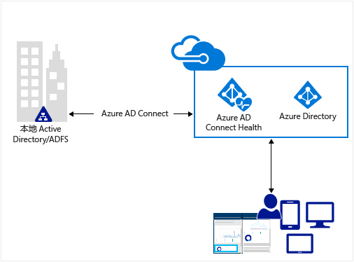
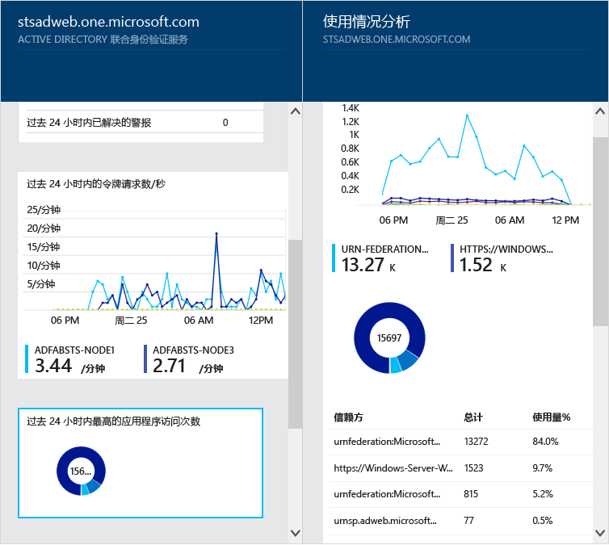
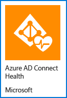

<properties 
	pageTitle="在云中监视本地标识基础结构" 
	description="本页介绍 Azure AD Connect Health 是什么，以及为何要使用它。" 
	services="active-directory" 
	documentationCenter="" 
	authors="billmath" 
	manager="swadhwa" 
	editor="curtand"/>

<tags 
	ms.service="active-directory"  
	ms.date="05/28/2015" 
	wacn.date=""/>

# 在云中监视本地标识基础结构

Azure AD Connect Health 可帮助你监视和深入了解本地标识基础结构。它允许你查看警报、性能、使用模式、配置设置，使你能够维持与 Office 365 的可靠连接，等等。这种优势是使用目标服务器上安装的代理实现的。若要了解详细信息，请参阅 [MSDN 上的 Azure AD Connect Health](https://msdn.microsoft.com/zh-cn/library/azure/dn906722.aspx)。

这些信息全部显示在 Azure AD Connect Health 门户中。使用 Azure AD Connect Health 门户可以查看警报、性能监视和使用情况分析。这些信息全部显示在一个易于使用的位置，你不必浪费时间寻找所需的信息。

将来对 Azure AD Connect Health 所做的更新将会包括附加的监视功能，以及深入分析其他标识组件和服务（例如 Azure AD Connect Sync 服务）的功能。因此，它将通过标识透视图提供单个仪表板，让你能拥有更稳健的集成环境，使用户能够充分利用该环境来增强工作能力。

若要了解详细信息，请参阅 [MSDN 上的 Azure AD Connect Health](https://msdn.microsoft.com/zh-cn/library/azure/dn906722.aspx)。

## 为何使用 Azure AD Connect Health

将本地目录与 Azure AD 集成可提供通用标识用于访问云和本地资源，从而提高用户的生产率。但是，这种集成带来的挑战是，必须确保此环境正常运行，才能让用户从任何设备可靠地访问本地和云中的资源。Azure AD Connect Health 提供简单的基于云的方法让你监视和深入分析用于访问 Office 365 或其他 Azure AD 应用程序的本地标识基础结构。这种方法就像在每个本地标识服务器上安装代理那样简单。

适用于 AD FS 的 Azure AD Connect Health 支持 Windows Server 2008/2008 R2 中的 AD FS 2.0，以及 Windows Server 2012/2012 R2 中的 AD FS。其中还包括为 Extranet 访问提供身份验证支持的任何 AD FS 代理或 Web 应用程序代理服务器。适用于 AD FS 的 Azure AD Connect Health 提供以下关键功能集：

- 查看警报并对其采取措施，以便可靠访问 AD FS 保护的应用程序（包括 Azure AD）
- 关键警报电子邮件通知
- 查看性能数据以确定容量规划
- AD FS 登录模式的详细视图可让你判断异常状况或建立容量规划基准

----------------------------------------------------------------------------------------------------------
## 下载 Azure AD Connect Health 代理

若要开始使用 Azure AD Connect Health，可在此处下载最新版本的代理：[下载 Azure AD Connect Health 代理](http://go.microsoft.com/fwlink/?LinkID=518973)。 在安装代理之前，请确保已从应用商店添加了该服务。

----------------------------------------------------------------------------------------------------------

**其他资源**

* [MSDN 上的 Azure AD Connect Health](https://msdn.microsoft.com/zh-cn/library/azure/dn906722.aspx)

 

<!---HONumber=64-->