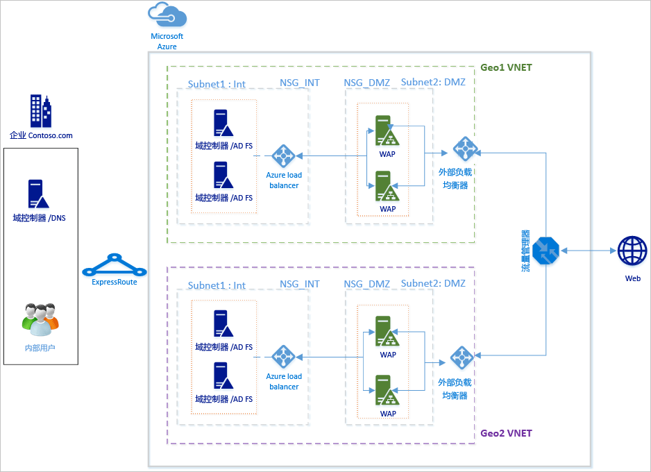
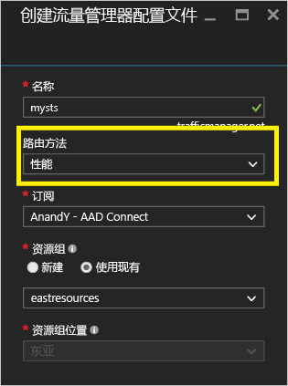
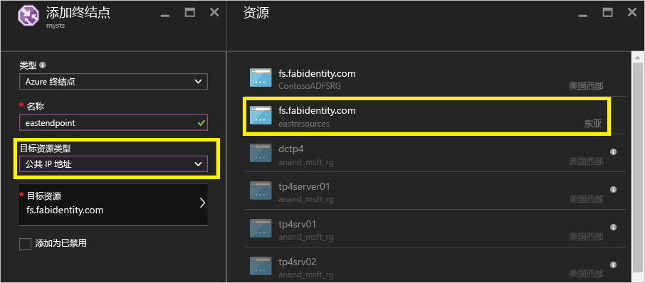
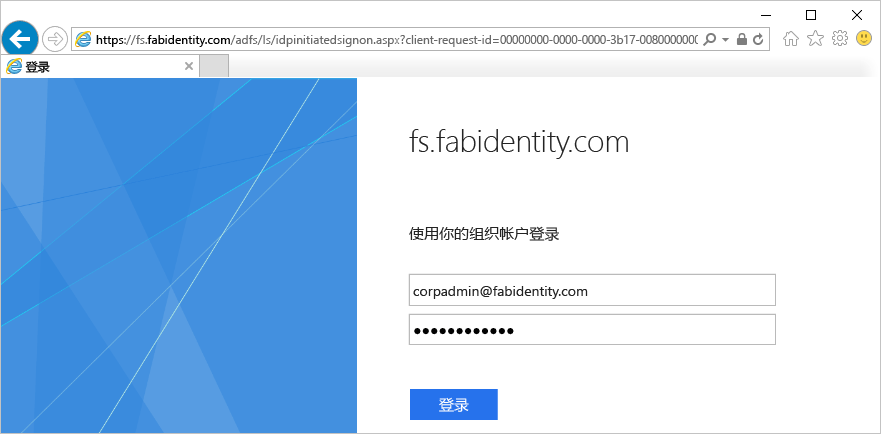
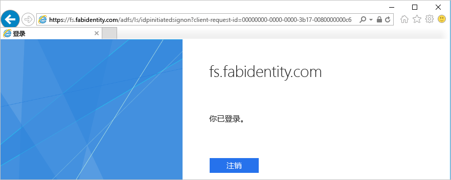

# 在 Azure 与 Azure 流量管理器中的高可用性跨地理 AD FS 部署
[在 Azure 中的 AD FS 部署](active-directory-aadconnect-azure-adfs.md)提供有关如何为你的组织在 Azure 中部署简单的 AD FS 基础结构的分步指南。 本文提供了后续步骤来创建在 Azure 中使用的 AD FS 的跨地理部署[Azure 流量管理器](../traffic-manager/traffic-manager-overview.md)。 Azure 流量管理器可帮助通过生成来创建在地理上分布高可用性和高性能 AD FS 基础结构为你的组织使用的路由方法可用于满足不同的需求，从基础结构的范围。

使高度可用的跨地理 AD FS 基础结构：

* **消除了单一故障点：**使用故障转移功能的 Azure 流量管理器中，你可以实现高度可用的 AD FS 基础结构，即使在发生故障后的数据中心中的全球一部分之一
* **改进的性能：**可以使用本文中的建议的部署以提供高性能的 AD FS 基础结构，可帮助更快地进行身份验证的用户。 

## 设计原则

基本设计原则将与在 Azure 中的 AD FS 部署的文章中的设计原则中列出相同。 上图显示简单的扩展名的基本部署到另一个地理区域。 下面是要扩展部署到新的地理区域时，请考虑一些要点

* **虚拟网络：**应在你想要部署其他 AD FS 基础结构的地理区域中创建新的虚拟网络。 在上面的关系图中看到 Geo1 VNET 和 Geo2 VNET 作为每个地理区域中的两个虚拟网络。
* **域控制器和新地理 VNET 中的 AD FS 服务器：**建议部署中的新的地理区域的域控制器，以便新的区域中的 AD FS 服务器不需要联系域控制器中另一个远离网络，以完成身份验证，从而能提高性能。
* **存储帐户：**存储帐户是与区域相关联。 因为你将部署新的地理区域中的计算机，你将需要创建新的存储帐户即可区域中使用。  
* **网络安全组：**存储帐户，在区域中创建的网络安全组不能使用在另一个地理区域。 因此，你将需要创建新的网络安全组类似于 INT 和外围网络子网的第一个地理区域中的那些在新的地理区域中。
* **公共 IP 地址的 DNS 标签：** Azure 流量管理器可以指终结点仅通过 DNS 标签。 因此，需要创建针对外部负载平衡器的公用 IP 地址的 DNS 标签。
* **Azure 流量管理器：** Microsoft Azure Traffic Manager 可以控制向世界各地不同数据中心内运行的服务终结点的用户流量分发。 Azure 流量管理器在 DNS 级别工作。 它使用 DNS 响应来指示最终用户流量到全球分布的终结点。 客户端然后直接连接到这些终结点。 使用不同的性能、 加权和优先级的路由选项，你可以轻松选择最适合你组织的需求的路由选择选项。 
* **两个区域之间的 V net 到 V net 连接：**不需要将虚拟网络之间的连接自身。 由于每个虚拟网络有权访问域控制器，以及在自身中具有 AD FS 和 WAP 服务器，它们可在不不同区域中的虚拟网络之间的任何连接。 

## 集成 Azure 流量管理器的步骤
### 部署新的地理区域中的 AD FS
遵循步骤和中的指导原则[在 Azure 中的 AD FS 部署](active-directory-aadconnect-azure-adfs.md)部署新的地理区域中的相同拓扑。

### 针对 Internet 面向 （公用） 负载平衡器的公用 IP 地址的 DNS 标签
如上所述，Azure 流量管理器只能引用作为终结点的 DNS 标签，因此它是重要创建针对外部负载平衡器的公用 IP 地址的 DNS 标签。 以下屏幕快照显示了如何配置的公共 IP 地址你 DNS 标签。 

### 部署 Azure 流量管理器
请按照以下步骤来创建流量管理器配置文件。 有关详细信息，你还可以对引用[管理 Azure 流量管理器配置文件](../traffic-manager/traffic-manager-manage-profiles.md)。

1. **创建流量管理器配置文件：**提供一个唯一名称的流量管理器配置文件。 此配置文件的名称是 DNS 名称的一部分，并且可作为 Traffic Manager 域名标签的前缀。 名称 / 前缀添加到。 trafficmanager.net 管理器中创建你的流量的 DNS 标签。 下面的屏幕截图显示 traffic manager DNS 前缀设置为 mysts，生成 DNS 标签将 mysts.trafficmanager.net。 
   
    
2. **流量路由方法：**有流量管理器中提供的三个路由选项：
   
   * Priority 
   * 性能
   * 加权
     
     **性能**是推荐的选项，以实现响应度高的 AD FS 基础结构。 但是，你可以选择最适合你的部署需求任何路由方法。 AD FS 功能不受所选的路由选择选项。 请参阅[流量管理器流量路由方法](../traffic-manager/traffic-manager-routing-methods.md)有关详细信息。 可以在此示例中看到上面的屏幕截图**性能**选择的方法。
3. **配置终结点：**在 traffic manager 页面上，单击终结点，然后选择添加。 这将打开类似于下面的屏幕快照添加终结点页面
   
   
   
   为不同的输入，请遵循以下准则：
   
   **类型：**选择 Azure 终结点，因为我们将指向 Azure 的公共 IP 地址。
   
   **名称：**创建想要与该终结点关联的名称。 这不是 DNS 名称和 DNS 记录中没有任何影响。
   
   **目标资源类型：**选择公共 IP 地址与此属性的值。 
   
   **目标资源：**这将为你提供一个选项以选择从不同的 DNS 标签必须在你的订阅下可用。 选择对应于你配置的终结点的 DNS 标签。
   
   添加要在 Azure 流量管理器流量路由到每个地理区域的终结点。
   有关详细信息和有关如何添加 / 在流量管理器中配置终结点的详细的步骤，请参阅[添加、 禁用、 启用或删除终结点](../traffic-manager/traffic-manager-endpoints.md)
4. **配置探测：**在流量管理器页中，单击配置。 在配置页中，你需要更改要在 HTTP 端口 80 和相对路径 /adfs/probe 探测的监视器设置
   
     
   
   > [!NOTE]
   > **确保终结点的状态处于联机状态，配置完成后**。 如果所有终结点处于已降级状态，Azure 流量管理器将执行最佳试图将路由流量假设，诊断不正确，并且所有终结点均可访问。
   > 
   > 
5. **DNS 记录修改 Azure 流量管理器：**联合身份验证服务应为 Azure Traffic Manager DNS 名称的 CNAME。 在公共 DNS 记录中创建的 CNAME，以便任何人员都尝试访问联合身份验证服务实际达到 Azure 流量管理器。
   
    例如，以指向联合身份验证服务 fs.fabidentity.com 到 Traffic Manager 中，将需要更新你的 DNS 资源记录为以下：
   
    <code>fs.fabidentity.com IN CNAME mysts.trafficmanager.net</code>

## 测试路由和 AD FS 登录
### 路由测试
路由的非常基本测试是尝试使用联合身份验证服务 DNS 名称来自每个地理区域中的计算机执行 ping 操作。 根据选择的路由方法，它实际上地址执行 ping 操作的终结点将会反映在 ping 显示。 例如，如果你选择性能路由，然后客户端的区域靠近的终结点将访问。 下面是从两个不同的区域客户端计算机的两个 ping 的快照，一个在东亚区域中，一个在美国西部。 

### AD FS 登录测试
若要测试 AD FS 的最简单方法是通过使用 IdpInitiatedSignon.aspx 页。 若要执行操作，会需要启用对 AD FS 属性 IdpInitiatedSignOn。 请按照以下步骤来验证你的 AD FS 设置

1. 运行以下 cmdlet 在 AD FS 服务器上，使用 PowerShell，将其设置为已启用。 
   Set-adfsproperties EnableIdPInitiatedSignonPage $true
2. 从任何外部计算机访问 https://<yourfederationservicedns>/adfs/ls/IdpInitiatedSignon.aspx
3. 你应看到 AD FS 页与下面类似：
   
    
   
    并在成功登录，它将为你提供一条成功消息如下所示：
   
    

## 相关链接
* [在 Azure 中的基本 AD FS 部署](active-directory-aadconnect-azure-adfs.md)
* [Microsoft Azure 流量管理器](../traffic-manager/traffic-manager-overview.md)
* [流量管理器流量路由方法](../traffic-manager/traffic-manager-routing-methods.md)

## 后续步骤
* [管理 Azure 流量管理器配置文件](../traffic-manager/traffic-manager-manage-profiles.md)
* [添加、 禁用、 启用或删除终结点](../traffic-manager/traffic-manager-endpoints.md) 

