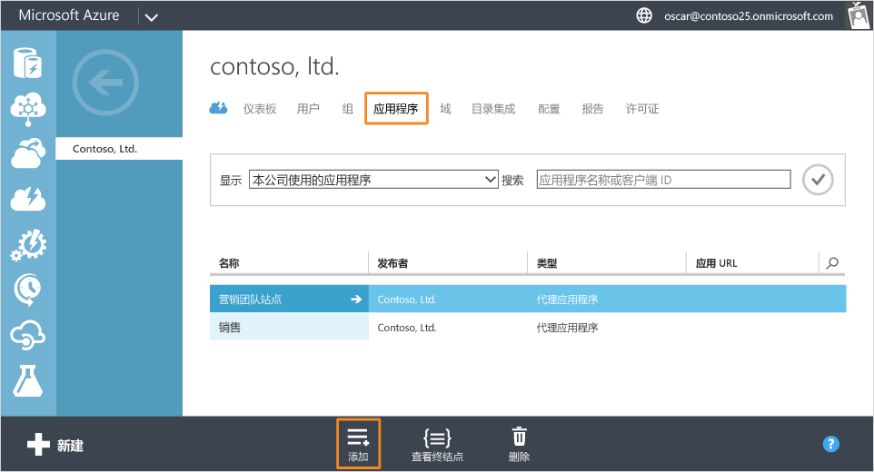
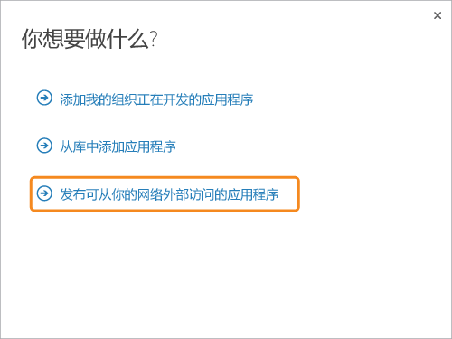
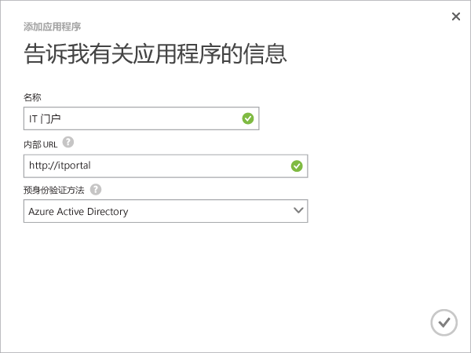
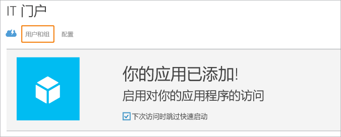
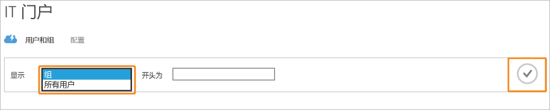
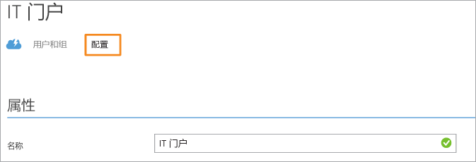

<properties
	pageTitle="使用 Azure AD 应用程序代理发布应用 | Azure"
	description="使用 Azure AD 应用程序代理将本地应用程序发布到云。"
	services="active-directory"
	documentationCenter=""
	authors="kgremban"
	manager="stevenpo"
	editor=""/>

<tags
	ms.service="active-directory"
	ms.date="06/01/2016"
	wacn.date=""/>

# 使用 Azure AD 应用程序代理发布应用程序

启用 Microsoft Azure Active Directory (AD) 应用程序代理后，你可以发布本地应用程序，以便远程用户可以在专用网络外部访问它们。

本文将指导你完成发布要在本地网络上运行并提供从网络外部进行的安全远程访问的应用程序的步骤。如果尚未设置应用程序代理或安装任何连接器，在此处继续之前请按照[在 Azure 门户中启用应用程序代理](active-directory-application-proxy-enable.md)中的步骤执行。

如果这是你首次使用 Azure AD 应用程序代理，则我们建议在发布应用程序之前通过从专用网络发布网站来测试连接器。

> [AZURE.NOTE] 应用程序代理是一项仅当升级到高级版或基本版的 Azure Active Directory 才可用的功能。有关详细信息，请参阅 [Azure Active Directory 版本](active-directory-editions.md)。

## 使用向导发布应用

1. 在 [Azure 经典门户](https://manage.windowsazure.cn/)中，以管理员身份进行登录。
2. 转到 Active Directory，并选择在其中启用了应用程序代理的目录。

	

3. 单击“应用程序”选项卡，然后单击屏幕底部的“添加”按钮

	

4. 选择“发布可从你的网络外部访问的应用程序”。

	

5. 提供有关应用程序的以下信息：

	- **名称**：应用程序的用户友好名称。它必须在你的目录中唯一。
	- **内部 URL**：这是应用程序代理连接器用于从专用网络内部访问应用程序的地址。你可以提供后端服务器上要发布的特定路径，而服务器的其余部分则不发布。通过这种方式可以在同一服务器上发布不同站点，并为每个站点提供其自己的名称和访问规则。
	- **预先身份验证方法**：应用程序代理在向用户提供对应用程序的访问权限之前用于验证用户的方式。从下拉菜单中选择一个选项。

		- Azure Active Directory：应用程序代理会重定向用户以便使用 Azure AD 登录，这会对他们针对目录和应用程序的权限进行身份验证。
		- Passthrough：用户不必进行身份验证即可访问应用程序。

	

6. 若要完成向导，请单击屏幕底部的复选标记。现已在 Azure AD 中定义应用程序。

## 将用户和组分配到应用程序

若要使用户可以访问发布的应用程序，需要单独或成组分配它们。对于需要预先身份验证的应用，这会授予使用应用的权限。对于不需要预身份验证的应用，用户无需权限，但仍需要分配到应用，以便它出现在其应用程序列表中。

1. 完成“添加应用”向导之后，你会看到适用于你的应用程序的快速启动页面。若要管理有权访问应用的人员，请选择**用户和组**。

	

2. 在目录中搜索特定组，或显示所有用户。单击复选标记以显示结果。

  	

3. 选择要分配到此应用的每个用户或组，然后单击“分配”。系统会要求你确认此操作。

> [AZURE.NOTE] 对于集成 Windows 身份验证应用，只能分配已从本地 Active Directory 同步的用户和组。对于使用 Azure Active Directory 应用程序代理发布的应用，不能分配使用 Microsoft 帐户登录的用户以及来宾。确保用户使用属于你要发布的应用所在域的一部分的凭据登录。

## 高级配置

可以在“配置”页面上修改发布的应用或设置高级选项。在此页面上，可以通过更改名称或上载徽标来自定义应用。还可以管理访问规则，如预先身份验证方法或 Multi-Factor Authentication。

使用 Azure Active Directory 应用程序代理发布应用程序后，这些应用程序将出现在 Azure AD 的“应用程序”列表中，你可以在该处管理这些应用程序。

如果在发布应用程序后禁用应用程序代理服务，则不会删除应用程序，但再也不能从专用网络外部访问应用程序。

若要查看应用程序并确保它可供访问，请双击应用程序的名称。如果“应用程序代理”服务已禁用并且该应用程序不可用，则会在屏幕顶部显示一条警告消息。

若要删除某个应用程序，请在列表中选择该应用程序，然后单击“删除”。

## 后续步骤

- [使用你自己的域名发布应用程序](active-directory-application-proxy-custom-domains.md)
- [启用单一登录](active-directory-application-proxy-sso-using-kcd.md)
- [启用条件性访问](active-directory-application-proxy-conditional-access.md)
- [使用声明感知应用程序](active-directory-application-proxy-claims-aware-apps.md)

有关最新新闻和更新，请参阅[应用程序代理博客](http://blogs.technet.com/b/applicationproxyblog/)

<!---HONumber=Mooncake_0711_2016-->