<properties
   pageTitle="有关使用 Azure Active Directory B2B 协作预览版的详细演练 | Microsoft Azure"
   description="Azure Active Directory B2B 协作可让业务合作伙伴有选择性地访问本方的企业应用程序，为跨公司合作关系提供支持"
   services="active-directory"
   documentationCenter=""
   authors="viv-liu"
   manager="cliffdi"
   editor=""
   tags=""/>

<tags
   ms.service="active-directory"
   ms.devlang="NA"
   ms.topic="get-started-article"
   ms.tgt_pltfrm="NA"
   ms.workload="identity"
   ms.date="05/09/2016"
   ms.author="viviali"/>

# Azure AD B2B 协作预览版：详细演练

本演练概述如何使用 Azure AD B2B 协作。作为 Contoso 的 IT 管理员，我们要与三家合作伙伴公司的员工共享应用程序。所有合作伙伴公司都不需要有 Azure AD。

- 来自 Simple Partner Org 的 Alice
- 来自 Medium Partner Org 的 Bob 需要一组应用的访问权限
- 来自 Complex Partner Org 的 Carol 需要一组应用的访问权限，以及 Contoso 组的成员资格

将邀请发送到合作伙伴用户后，可以在 Azure AD 中配置这些用户，通过 Azure 门户授予应用访问权限以及组成员资格。首先，让我们添加 Alice。

## 将 Alice 添加到 Contoso 目录
1. 创建具有如下所示标头的 .csv 文件，只需填充 Alice 的 **Email**、**DisplayName** 和 **InviteContactUsUrl** 即可。**DisplayName** 是邀请中显示的名称，也是 Contoso Azure AD 目录中显示的名称。**InviteContactUsUrl** 是 Alice 联系 Contoso 的途径。在以下示例中，InviteContactUsUrl 指定 Contoso 的 LinkedIn 配置文件。必须完全根据 [CSV file format reference](active-directory-b2b-references-csv-file-format.md)（CSV 文件格式参考）中的规定，拼写 .csv 文件第一行中的标签。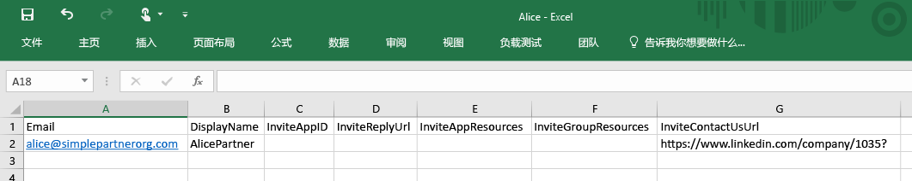

2. 在 Azure 门户中，将用户添加到 Contoso 目录（“Active Directory”>“Contoso”>“用户”>“添加用户”）。在“用户类型”下拉列表中，选择“合作伙伴公司中的用户”。上载 .csv 文件。确保 .csv 文件在上载之前已关闭。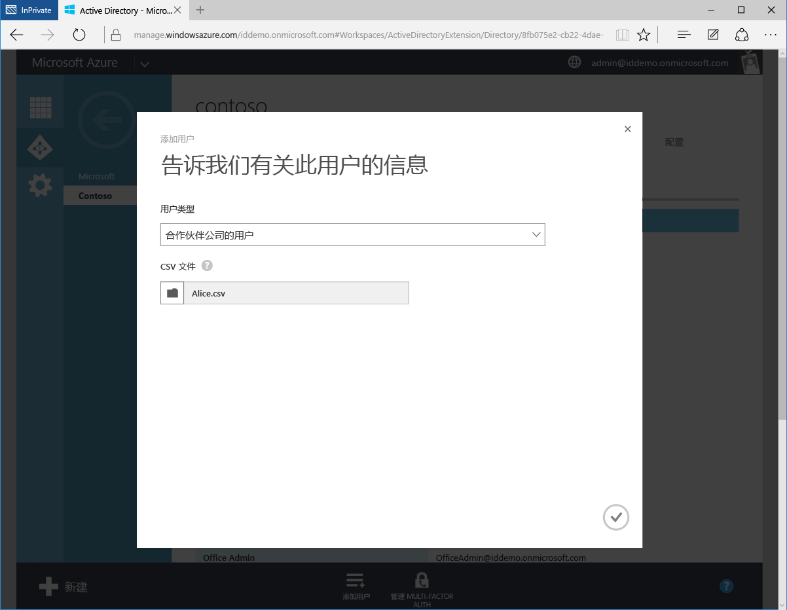

3. 现在，Alice 显示为 Contoso Azure AD 目录中的外部用户。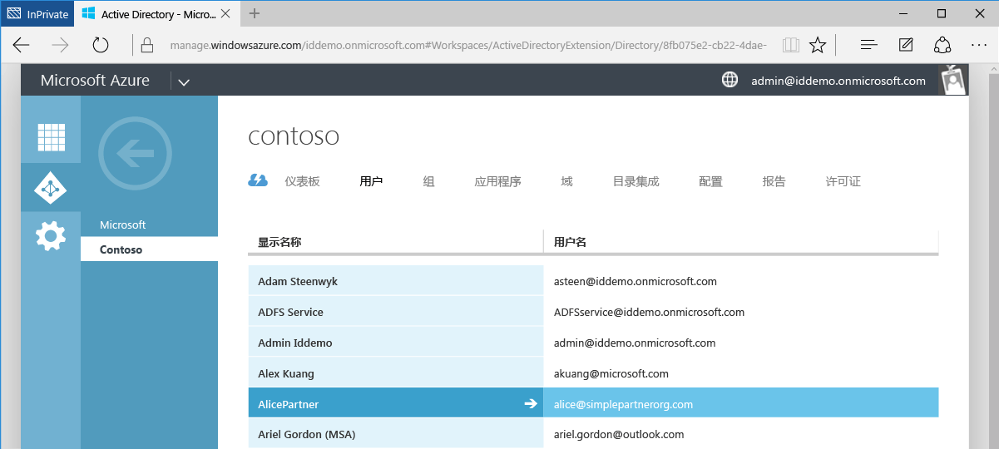

4. Alice 收到以下电子邮件。

5. Alice 单击链接，然后系统会提示她接受邀请并使用其工作凭据登录。如果 Alice 不在 Azure AD 目录中，系统会提示 Alice 注册。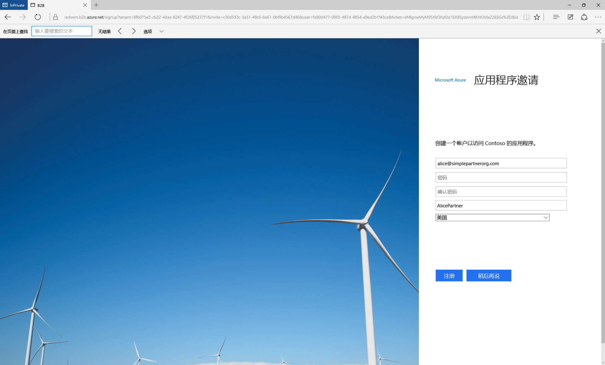

6. Alice 被重定向到应用访问面板，在向她授予应用访问权限之前，该面板是空的。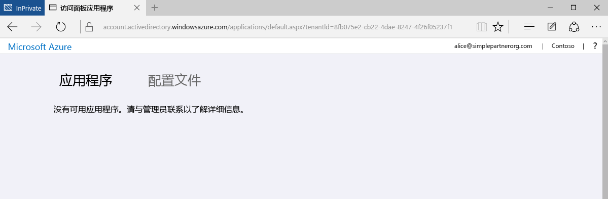

此过程可实现最简单形式的 B2B 协作。作为 Contoso Azure AD 目录中的用户，Alice 可通过 Azure 门户获取应用程序和组的访问权限。现在添加 Bob，他需要 Moodle 和 Salesforce 应用程序的访问权限。

## 将 Bob 添加到 Contoso 目录并授予应用访问权限
1. 使用装有 Azure AD 模块的 Windows PowerShell 查找 Moodle 和 Salesforce 的应用程序 ID。可以使用以下 cmdlet 检索 ID：`Get-MsolServicePrincipal | fl DisplayName, AppPrincipalId`。此时会显示 Contoso 中所有可用应用程序的列表及其 AppPrincialIds。

2. 创建包含 Bob 的 Email、DisplayName、**InviteAppID**、**InviteAppResources** 和 InviteContactUsUrl 的 .csv 文件。在 **InviteAppResources** 中填充通过 PowerShell 找到的 Moodle 和 Salesforce AppPrincipalIds（以空格分隔）。在 **InviteAppId** 中填充相同的 Moodle AppPrincipalId，创建包含 Moodle 品牌徽标的电子邮件和登录页。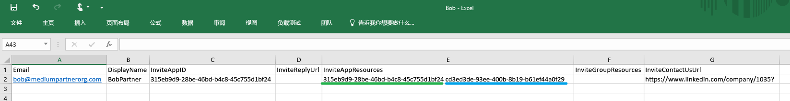

3. 就像对 Alice 所做的一样，通过 Azure 门户上载该 .csv 文件。Bob 现在是 Contoso Azure AD 目录中的外部用户。

4. Bob 收到以下电子邮件。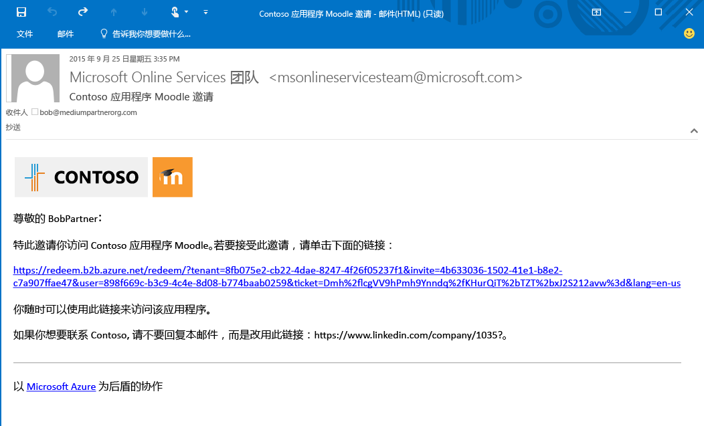

5. Bob 单击链接，系统会提示他接受邀请。登录后，他被定向到访问面板，然后就可以使用 Moodle 和 Salesforce 了。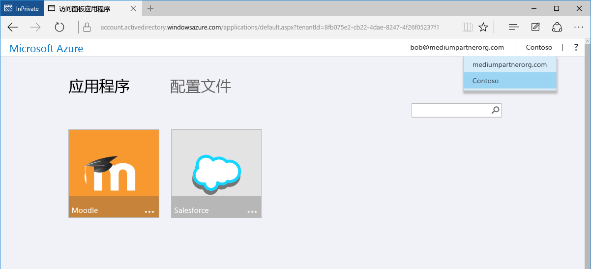

接下来添加 Carol，她需要应用程序的访问权限以及 Contoso 目录中的组成员资格。

## 将 Carol 添加到 Contoso 目录，授予应用访问权限，并提供组成员资格

1. 使用装有 Azure AD 模块的 Windows PowerShell 查找 Contoso 中的应用程序 ID 和组 ID。
 - 就像对 Bob 所做的一样，使用 cmdlet `Get-MsolServicePrincipal | fl DisplayName, AppPrincipalId` 检索 AppPrincipalId。
 - 使用 cmdlet `Get-MsolGroup | fl DisplayName, ObjectId` 检索组的 ObjectId。此时会显示 Contoso 中所有组的列表及其 ObjectIds。也可以在 Azure 门户中组的“属性”选项卡中，以对象 ID 的形式检索组 ID。

2. 创建 .csv 文件，填充 Carol 的 Email、DisplayName、InviteAppID、InviteAppResources、**InviteGroupResources** 和 InviteContactUsUrl。在 **InviteGroupResources** 中填充 MyGroup1 和 Externals 组的 ObjectIds（以空格分隔）。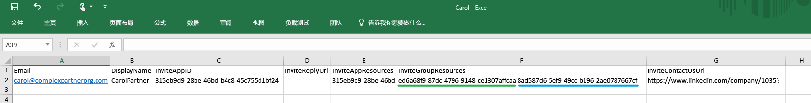

3. 通过 Azure 门户上载 .csv 文件。

4. Carol 是 Contoso 目录中的用户，同时也是 MyGroup1 和 Externals 组的成员（如 Azure 门户中所示）。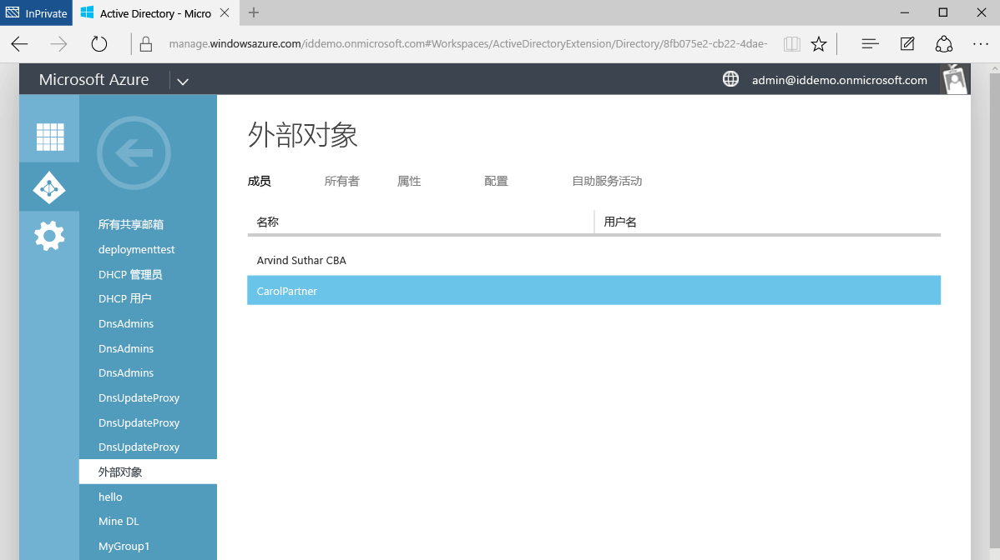

5. Carol 收到一封电子邮件，其中包含用于接受邀请的链接。登录后，她被重定向到应用访问面板，获取 Moodle 和 Salesforce 的访问权限。

这就是在 Azure AD B2B 协作中添加合作伙伴公司用户的整个过程。本演练演示了如何使用三个不同的 .csv 文件将用户 Alice、Bob 和 Carol 添加到 Contoso 目录。将不同的 .csv 文件压缩成一个文件可以简化此过程。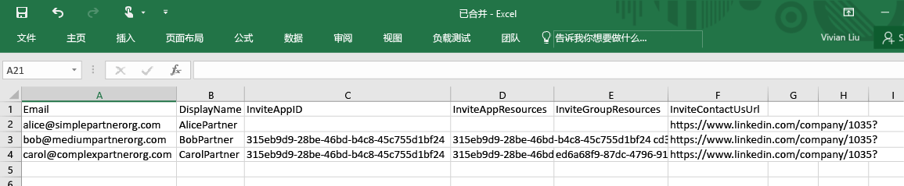

## 相关文章
在 Azure AD B2B 协作网站上浏览我们的其他文章：

- [什么是 Azure AD B2B 协作？](active-directory-b2b-what-is-azure-ad-b2b.md)
- [工作原理](active-directory-b2b-how-it-works.md)
- [CSV 文件格式参考](active-directory-b2b-references-csv-file-format.md)
- [外部用户令牌格式](active-directory-b2b-references-external-user-token-format.md)
- [外部用户对象属性更改](active-directory-b2b-references-external-user-object-attribute-changes.md)
- [当前预览版限制](active-directory-b2b-current-preview-limitations.md)
- [有关 Azure Active Directory 中应用程序管理的文章索引](active-directory-apps-index.md)

<!---HONumber=AcomDC_0921_2016-->