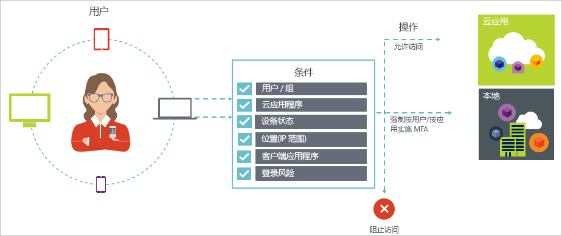

# Azure Active Directory 中的条件性访问

安全是使用云的组织关心的头等大事。 云安全在管理云资源方面的一个重要方面是标识和访问。 在移动优先、云优先的世界，用户可以从任意位置使用各种设备和应用访问组织的资源。 因此，仅关注谁可以访问资源不再能满足需求。 为掌握安全与效率之间的平衡，IT 专业人员还需要将资源的访问方式作为访问控制决策的考虑因素。 使用 Azure AD 条件访问便可处理该需求。 条件访问是 Azure Active Directory 的一项功能，可用于从中央位置根据特定条件针对环境中的应用强制实施访问控制。 

本文从概念上概述了 Azure AD 中的条件访问。

## 常见方案

在移动优先、云优先的世界中，使用 Azure Active Directory 可以实现从任意位置单一登录到设备、应用和服务。 随着 BYOD 等设备、脱离企业网络的办公和第三方 SaaS 应用的普及，IT 专业人员面临着两个对立的目标：

- 使用户能够随时随地保持高效的工作
- 随时保持企业资产

通过使用条件访问策略，用户可以根据所需的条件应用适当的访问控制。 Azure AD 条件访问可为你在需要时提供增强的安全性，并在不需要时毫不阻碍用户。 

以下是条件访问可帮助你的部分常见访问问题：

- [登录风险](active-directory-conditional-access-conditions.md#sign-in-risk)：Azure AD Identity Protection 可检测登录风险。 如果检测到的登录风险指示可疑操作者，如何限制访问？ 如果想要获取更有力的证据，证明登录是由合法用户执行的，或者你的疑惑足够强，甚至能够阻止特定用户访问应用，应怎么办？

- [网络位置](active-directory-conditional-access-locations.md)：Azure AD 可从任意位置进行访问。 如果试图从不在 IT 部门控制范围内的网络位置访问，应怎么办？ 使用用户名和密码的组合可能足以作为公司网络资源访问尝试的身份证据。 如果从其他意外的国家或地区发起的访问尝试要求更有力的身份证据，应怎么办？ 如果想要阻止从某些位置发起的访问尝试，应怎么办？  

- [设备管理](active-directory-conditional-access-conditions.md#device-platforms)：在 Azure AD 中，用户可以从大量设备（包括移动设备和个人设备）访问云应用。 如果要求只能由使用受 IT 部门管理的设备的用户执行访问尝试，应怎么办？ 如果要在环境中阻止云应用中的特定设备类型窗体访问，应怎么办？ 

- [客户端应用程序](active-directory-conditional-access-conditions.md#client-apps)：现在可以使用各种应用（例如基于 Web 的应用、移动应用或桌面应用）访问许多云应用。 如果使用导致已知问题的客户端应用类型执行访问尝试，应怎么办？ 如果需要由 IT 部门管理的特定应用类型的设备，应怎么办？ 

这些问题和相关答案表示 Azure AD 条件访问的常见访问方案。 条件访问是 Azure Active Directory 的一项功能，可使你使用基于策略的方法处理访问方案。

## 条件访问策略

条件访问策略是使用以下模式的访问方案的定义：

**然后执行此操作**定义策略的响应。 请务必注意，条件访问策略的目标不是向云应用授予访问权限。 在 Azure AD 中，向云应用授予访问权限是用户指定的主题。 使用条件访问策略，你可以控制授权用户（已获得访问云应用权限的用户）在特定条件下访问云应用的方式。 在响应中，你将强制执行其他要求，如多重身份验证、托管设备等。 在 Azure AD 条件访问上下文中，策略强制执行的要求称为访问控制。 在限制性最强的窗体中，策略可阻止访问。 有关详细信息，请参阅 [Azure Active Directory 条件访问中的访问控制](active-directory-conditional-access-controls.md)。
     

**发生这种情况时**定义触发策略的原因。 此原因以已满足的一组条件为特征。 在 Azure AD 条件访问中，这两个指定条件扮演了特殊的角色：

- [用户](active-directory-conditional-access-conditions.md#users-and-groups)：执行访问尝试的用户（人物）。 

- [云应用](active-directory-conditional-access-conditions.md#cloud-apps)：访问尝试的目标（事件）。    

这两个条件在条件访问策略中是必需的。 除这两个必需的条件外，还可加入介绍访问尝试执行方式的其他条件。 常见示例是使用公司网络外的移动设备或位置。 有关详细信息，请参阅 [Azure Active Directory 条件访问中的条件](active-directory-conditional-access-conditions.md)。   

条件与访问控制的组合表示一种条件访问策略。 

使用 Azure AD 条件访问，可以控制授权用户访问云应用的方式。 条件访问的目标是对某种云应用的访问尝试强制执行其他访问控制，该云应用由访问尝试的执行方式驱动。

使用基于策略的方法保护对云应用的访问的一个好处是，可使用本文中概述的结构起草环境的策略要求，而无需担心技术实现。 

## 需要了解的事项

### 使用条件访问的一般要求

如果身份验证尝试来自以下位置，可以使用 Azure AD 条件访问来保护云应用：

- Web 浏览器

- 使用新式身份验证的客户端应用

- Exchange ActiveSync

有关详细信息，请参阅[客户端应用](active-directory-conditional-access-conditions.md#client-apps)。

某些[云应用](active-directory-conditional-access-conditions.md#cloud-apps)还支持旧式身份验证协议。 例如，SharePoint Online 和 Exchange Online 就支持这些协议。 如果客户端应用可以使用旧式身份验证协议访问云应用，则 Azure AD 无法针对此访问尝试实施条件访问策略。 为了防止客户端应用绕过策略的实施，应该检查它是否能够做到只对受影响的云应用启用新式身份验证。

条件访问不适用的客户端应用示例包括：

- Office 2010 和更低版本

- 未启用新式身份验证的 Office 2013

有关详细信息，请参阅[为 Azure Active Directory 条件访问设置 SharePoint Online 和 Exchange Online](active-directory-conditional-access-no-modern-authentication.md)。

### 使用条件访问的许可证要求

使用条件访问需要 Azure AD Premium/企业移动性 + 安全性许可证。 若要查找满足要求的合适许可证，请参阅[企业移动性 + 安全性方案](https://www.microsoft.com/cloud-platform/enterprise-mobility-security-pricing)。

## 后续步骤

- 如需深入了解：
    - 条件，请参阅 [Azure Active Directory 条件访问中的条件](active-directory-conditional-access-conditions.md)。

    - 访问控制，请参阅 [Azure Active Directory 条件访问中的访问控制](active-directory-conditional-access-controls.md)。

- 若要获得一些配置条件访问策略的体验，请参阅 [Azure Active Directory 中的条件访问入门](active-directory-conditional-access-azure-portal-get-started.md)。

- 如果已准备好配置环境的条件访问策略，请参阅 [Azure Active Directory 中条件访问的最佳做法](active-directory-conditional-access-best-practices.md)。 
