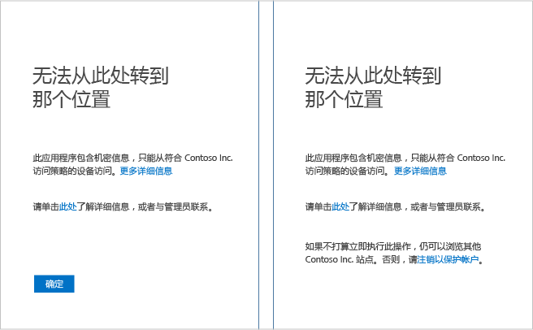
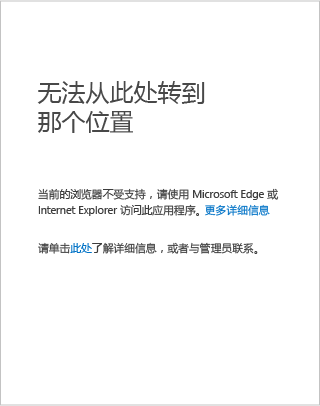

# Azure Active Directory 访问问题的疑难解答
你尝试访问组织的 SharePoint Online Intranet 时，收到“拒绝访问”错误消息。 你要怎么做？

本文介绍可帮助你解决组织的联机资源访问问题的修正步骤。

如需帮助解决 Azure Active Directory (Azure AD) 访问问题，请转到本文中介绍你的设备平台的部分：

* Windows 设备
* iOS 设备（请稍后返回查看有关 iPhone 和 iPad 的帮助。）
* Android 设备（请稍后返回查看有关 Android 手机和平板电脑的帮助。）

## 从 Windows 设备访问
如果你的设备运行以下平台之一，请在后续部分中查找在尝试访问应用程序或服务时显示的错误消息：

* Windows 10
* Windows 8.1
* Windows 8
* Windows 7
* Windows Server 2016
* Windows Server 2012 R2
* Windows Server 2012
* Windows Server 2008 R2

### 未注册设备
如果未在 Azure AD 中注册设备，并且应用程序使用基于设备的策略进行保护，可能会看到页面上显示以下错误消息之一：

如果设备已通过域加入组织的 Active Directory，请尝试以下操作：

1. 确保你使用工作帐户（Active Directory 帐户）登录到 Windows。
2. 通过虚拟专用网络 (VPN) 或 DirectAccess 连接到公司网络。
3. 建立连接后，按 Windows 徽标键 + L 键来锁定 Windows 会话。
4. 输入工作帐户凭据解锁 Windows 会话。
5. 等待一分钟，然后再次尝试访问应用程序或服务。
6. 如果看到相同页面，请单击“更多详细信息”链接，然后与管理员联系，并提供详细信息。

如果设备未加入域，并且运行 Windows 10，则有两个选项：

* 运行 Azure AD Join
* 将工作帐户或学校帐户添加到 Windows

有关这些选项有什么不同的信息，请参阅[在工作区中使用 Windows 10 设备](active-directory-azureadjoin-windows10-devices.md)。

若要运行 Azure AD Join，请针对设备运行的平台执行以下步骤。 （Azure AD Join 在 Windows Phone 上不可用。）

**Windows 10 周年更新**

1. 打开“设置”应用。
2. 单击“帐户” > “访问工作或学校”。
3. 单击“连接”。
4. 单击“将此设备加入 Azure AD”。
5. 向组织进行身份验证，提供多重身份验证，如果出现提示，则按照所示的步骤进行操作。
6. 注销，然后使用工作帐户登录。
7. 再次尝试访问应用程序。

**Windows 10 2015 年 11 月更新**

1. 打开“设置”应用。
2. 单击“系统” > “关于”。
3. 单击“加入 Azure AD”。
4. 向组织进行身份验证，提供多重身份验证，如果出现提示，则按照所示的步骤进行操作。
5. 注销，然后使用工作帐户（Azure AD 帐户）登录。
6. 再次尝试访问应用程序。

若要添加工作或学校帐户，请执行以下步骤：

**Windows 10 周年更新**

1. 打开“设置”应用。
2. 单击“帐户” > “访问工作或学校”。
3. 单击“连接”。
4. 向组织进行身份验证，提供多重身份验证，如果出现提示，则按照所示的步骤进行操作。
5. 再次尝试访问应用程序。

**Windows 10 2015 年 11 月更新**

1. 打开“设置”应用。
2. 单击“帐户” > “你的帐户”。
3. 单击“工作或学校帐户”。
4. 向组织进行身份验证，提供多重身份验证，如果出现提示，则按照所示的步骤进行操作。
5. 再次尝试访问应用程序。

如果设备未加入域，并且运行 Windows 8.1，若要执行工作区加入并在 Microsoft Intune 中注册，请执行以下步骤：

1. 打开“电脑设置”。
2. 单击“网络” > “工作区”。
3. 单击“加入” 。
4. 向组织进行身份验证，提供多重身份验证，如果出现提示，则按照所示的步骤进行操作。
5. 单击“启用”。
6. 再次尝试访问应用程序。

### 不支持浏览器
如果尝试使用以下浏览器之一访问应用程序或服务，则可能会被拒绝访问：

* Windows 10 或 Windows Server 2016 中的 Chrome、Firefox，或者 Microsoft Edge 或 Microsoft Internet Explorer 以外的任何其他浏览器
* Windows 8.1、Windows 7、Windows Server 2012 R2、Windows Server 2012 或 Windows Server 2008 R2 中的 Firefox

你将看到如下所示的错误页面：

唯一的修复方法是在设备平台上使用应用程序支持的浏览器。

## 后续步骤
[Azure Active Directory 条件访问](active-directory-conditional-access.md)

