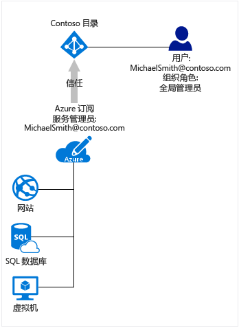

# Azure 订阅与 Azure Active Directory 的关联方式
本文介绍 Azure 订阅与 Azure Active Directory (Azure AD) 之间的关系。

## Azure 订阅与 Azure AD 的关系
Azure 订阅与 Azure AD 建立了信任关系，也即会委托该目录对用户、服务和设备进行身份验证。 多个订阅可以委托同一个目录，但每个订阅只能委托一个目录。 

订阅与目录之间的这种委托关系不同于订阅与 Azure 中其他资源（网站、数据库等）之间的委托关系。 如果某个订阅过期，则与该订阅关联的其他资源的访问权限也会终止。 但是，目录将保留在 Azure 中，而你则可以将其他订阅与该目录相关联，然后继续管理目录用户。

Azure AD 与 Azure 订阅中其他服务的运行方式不同。 其他 Azure 服务从属于 Azure 订阅。 但是，在 Azure AD 中看到的内容不因订阅而异。 它会根据已登录用户的情况来决定是否允许其访问相关目录。

所有用户都只有一个用于验证其身份的主目录，但他们也可以是其他目录中的来宾。 在 Azure AD 中，你只能看到用户帐户是其成员的目录。 目录也可以与本地 Active Directory 同步。

## Azure AD 和云服务订阅
Azure AD 在大多数 Microsoft 云服务的后面提供核心目录和身份管理功能，其中包括：

* Azure
* Microsoft Office 365
* Microsoft Dynamics CRM Online
* Microsoft Intune

注册其中任何一个 Microsoft 云服务便会免费获得 Azure AD 服务。 若要向 Azure AD 目录添加其他 Azure 订阅，前提是必须使用 Microsoft 帐户登录。 例如，如果使用 Microsoft 帐户注册 Azure，同时使用工作或学校帐户注册另一个 Microsoft 云服务，则就有了两个 Azure AD 实例：
1. Azure 订阅的默认目录。 如果已使用 Microsoft 帐户登录，则可向此目录或所创建的其他目录添加另一 Azure 订阅，因为可以通过 Azure 进行身份验证。
2. 工作或学校帐户的主目录。 如果使用工作或学校帐户登录到 Azure，则不能向现有目录添加 Azure 订阅，因为不能直接通过 Azure 对工作或学校帐户进行身份验证。 
 
若要详细了解如何更改 Azure 订阅的管理员，请参阅[将 Azure 订阅所有权转让给其他帐户](../billing/billing-subscription-transfer.md)

## 建议：如何同时管理订阅和目录
Azure 订阅的管理角色可以管理与 Azure 订阅绑定的资源。 本部分介绍 Azure 订阅管理员和 Azure AD 目录管理员之间的差异。 有关管理角色以及如何使用这些角色来管理订阅的其他建议，请参阅[在 Azure Active Directory 中分配管理员角色](active-directory-assign-admin-roles.md)。

默认情况下，注册时，系统将分配服务管理员角色。 如果其他人需要使用同一个订阅登录和访问服务，则可以将他们添加为协同管理员。 

Azure AD 提供一组不同的管理角色，用于管理目录和标识相关的功能。 例如，目录的全局管理员可以将用户和组添加到目录，或者要求对用户执行多重身份验证。 将为创建目录的用户分配全局管理员角色，而这些用户又可以向其他用户分配管理角色。 Office 365 和 Microsoft Intune 等其他服务也会使用 Azure AD 管理角色。 

Azure 订阅管理员和 Azure AD 目录管理员是两个不同的角色。 
* Azure 订阅管理员可以管理 Azure 中的资源，还可以在 Azure 门户中使用 Azure AD（因为 Azure 门户本身是一种 Azure 资源）。 
* 目录管理员只能管理 Azure AD 目录中的属性。

一个人可以充当两种角色，但是没有这个必要。 可将某个用户分配到目录全局管理员角色，但不能将其分配为 Azure 订阅的服务管理员或协同管理员。 不是订阅管理员的用户可以登录到 Azure 门户，但无法在门户中管理该订阅的目录。 该用户可以使用其他工具（例如 Azure AD PowerShell 或 Office 365 管理中心）来管理目录。

## 后续步骤
* 若要详细了解如何更改 Azure 订阅的管理员，请参阅[将 Azure 订阅所有权转让给其他帐户](../billing/billing-subscription-transfer.md)
* 若要了解有关如何在 Microsoft Azure 中控制资源访问的详细信息，请参阅 [Understanding resource access in Azure](active-directory-understanding-resource-access.md)（了解 Azure 中的资源访问）
* 有关如何在 Azure AD 中分配角色的详细信息，请参阅 [在 Azure Active Directory 中分配管理员角色](active-directory-assign-admin-roles-azure-portal.md)

<!--Image references-->
[1]: ./media/active-directory-how-subscriptions-associated-directory/WAAD_PassThruAuth.png
[2]: ./media/active-directory-how-subscriptions-associated-directory/WAAD_OrgAccountSubscription.png
[3]: ./media/active-directory-how-subscriptions-associated-directory/WAAD_SignInDisambiguation.PNG

