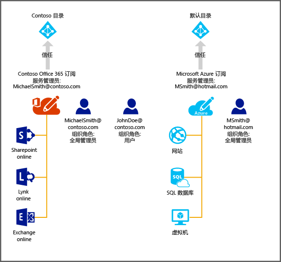

# 在 Azure 中管理 Office 365 订阅的目录
本文介绍如何使用 Azure 经典门户管理为 Office 365 订阅创建的目录。 必须是 Azure 订阅的服务管理员或共同管理员才能登录到 Azure 经典门户。 如果还没有 Azure 订阅，现在就可以使用此链接注册 [30 天免费试用版](https://azure.microsoft.com/trial/get-started-active-directory/)，并在 5 分钟内部署第一个云解决方案。 请务必使用登录 Office 365 时所用的工作或学校帐户。

> [!IMPORTANT]
> Microsoft 建议使用 Azure 门户而不是本文中引用的 Azure 经典门户通过 [Azure AD 管理中心](https://aad.portal.azure.com)管理 Azure AD。

完成 Azure 订阅后，便可以登录到 Azure 经典门户并访问 Azure 服务。 若要管理对 Office 365 用户进行身份验证所用的同一目录，请单击 Active Directory 扩展。

如果已有 Azure 订阅，则管理其他目录的过程也很简单明了。 例如，Michael Smith 可能有一个用于 Contoso.com 的 Office 365 订阅。 另外，他还有一个使用其 Microsoft 帐户 msmith@hotmail.com 注册的 Azure 订阅。 在这种情况下，他管理着两个目录。

| 订阅 | Office 365 | Azure |
| --- | --- | --- |
|   显示名称 |Contoso |默认的 Azure Active Directory (Azure AD) 目录 |
|   域名 |contoso.com |msmithhotmail.onmicrosoft.com |

他希望在使用 Microsoft 帐户登录到 Azure 时管理 Contoso 目录中的用户身份，以便启用 Azure AD 功能，如多重身份验证。 下图可帮助你了解该过程。

在这种情况下，这两个目录是相互独立的。

## 管理两个独立的目录
若要在以 msmith@hotmail.com 身份登录到 Azure 时管理这两个目录，Michael Smith 必须完成以下步骤：

> [!NOTE]
> 仅当用户使用 Microsoft 帐户登录时才能完成这些步骤。 如果用户是使用工作或学校帐户登录的，则“使用现有目录”选项不可用。 工作或学校帐户只能通过其主目录（即存储工作或学校帐户的目录，该目录由工作单位或学校拥有）进行身份验证。
>
>

1. 以 msmith@hotmail.com 身份登录到 [Azure 经典门户](https://manage.windowsazure.com)。
2. 单击“新建” > “应用程序服务” > “Active Directory” > “目录” > “自定义创建”。
3. 单击“使用现有目录”，并选中“已准备好立即注销”复选框。
4. 以 Contoso.onmicrosoft.com 的全局管理员身份（例如，msmith@contoso.com）登录到 Azure 经典门户。
5. 当系统提示“是否要将 Contoso 目录用于 Azure?”时，单击“继续”。
6. 单击“立即注销”。
7. 以 msmith@hotmail.com 身份登录到 Azure 经典门户。 Contoso 目录和默认目录会显示在 Active Directory 扩展中。

完成这些步骤之后，msmith@hotmail.com 将成为 Contoso 目录的全局管理员。

## 以全局管理员身份管理资源
现在，让我们假设 Jane Doe 需要管理与 msmith@hotmail.com 的 Azure 订阅关联的网站和数据库资源。 在执行该操作之前，Michael Smith 需要完成以下附加步骤：

1. 使用 Azure 订阅的服务管理员帐户（在本示例中为 msmith@hotmail.com）登录到 [Azure 经典门户](https://manage.windowsazure.com)。
2. 将订阅传输到 Contoso 目录：单击“设置” > “订阅”> 选择订阅 >“编辑目录”> 选择“Contoso (Contoso.com)”。 在传输过程中，将删除作为订阅协同管理员的所有工作或学校帐户。
3. 将 Jane Doe 添加为订阅的共同管理员：单击“设置” > “管理员”> 选择订阅 >“添加”> 键入 **JohnDoe@Contoso.com**。

## 后续步骤
有关订阅与目录之间的关系的详细信息，请参阅 [订阅与目录的关联方式](active-directory-how-subscriptions-associated-directory.md)。

