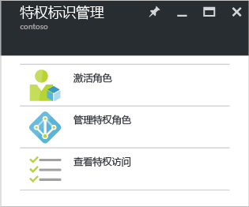

# Azure AD Privileged Identity Management 入门
使用 Azure Active Directory (AD) Privileged Identity Management，可以管理、控制和监视组织内的访问。 这包括访问 Azure AD 和其他 Microsoft Online Services（如 Office 365 或 Microsoft Intune）中的资源。

本文介绍了如何将 Azure AD PIM 应用添加到 Azure 门户仪表板。

## 添加 Privileged Identity Management 应用程序
在使用 Azure AD Privileged Identity Management 之前，需要将应用程序添加到 Azure 门户仪表板。

1. 以目录的全局管理员身份登录 [Azure 门户](https://portal.azure.com/) 。
2. 如果你的组织有多个目录，请在 Azure 门户的右上角选择你的用户名。 选择将在其中使用 PIM 的目录。
3. 选择“更多服务”，然后使用“筛选器”文本框搜索“Azure AD Privileged Identity Management”。
4. 选中“固定到仪表板”，然后单击“创建”。 Privileged Identity Management 应用程序打开。

如果你是在目录中使用 Azure AD Privileged Identity Management 的第一个人，则 [安全性向导](active-directory-privileged-identity-management-security-wizard.md) 会引导你完成初始分配体验。 之后，你将自动成为该目录的第一个**安全管理员**和**特权角色管理员**。 只有特权角色管理员可以访问此应用程序来管理其他管理员的访问权限。  

## 导航到你的任务
设置 Azure AD Privileged Identity Management 后，每次打开应用程序时均会看到导航边栏选项卡。 使用此边栏选项卡可完成标识管理任务。

* **激活我的角色** 可将带你到分配给你的角色列表。 你可在其中激活任何符合条件的角色。
* **管理特权角色** 是特权角色管理员用于管理角色分配、更改角色激活设置、开始访问审阅等的仪表板。 如果不是特权角色管理员，则会禁用此仪表板中的选项。
* **审阅特权访问** 可将你带到需要完成的任何挂起的访问审阅，无论你是审阅自己还是审阅其他人的访问权限。 

<!--Every topic should have next steps and links to the next logical set of content to keep the customer engaged-->
## 后续步骤
[Azure AD Privileged Identity Management 概述](active-directory-privileged-identity-management-configure.md) 包括有关如何管理组织中管理访问权限的更多详细信息。

[!INCLUDE [active-directory-privileged-identity-management-toc](../../includes/active-directory-privileged-identity-management-toc.md)]

<!--Image references-->

[1]: ./media/active-directory-privileged-identity-management-configure/PIM_EnablePim.png

<!--HONumber=Nov16_HO2-->

