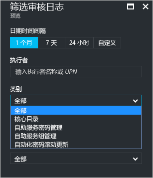
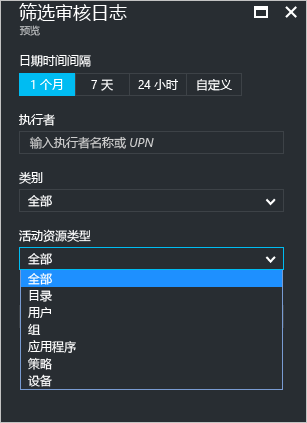
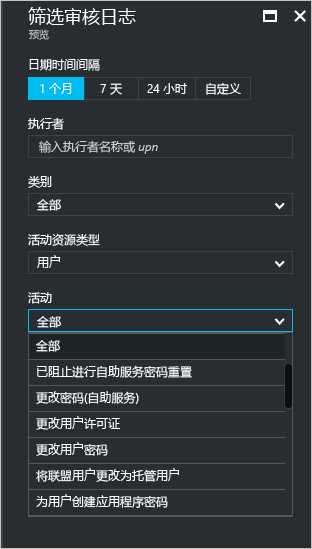
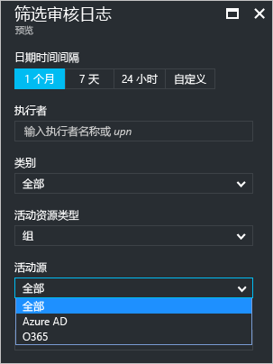

# Azure Active Directory 门户中的“审核活动”报表 - 预览

通过 Azure Active Directory [预览](active-directory-preview-explainer.md)中的报表，可以获取确定环境运行状况所需的所有信息。

Azure Active Directory 中的报表体系结构由以下部分组成：

- **活动** 
    - **登录活动** — 有关托管应用程序的使用和用户登录活动的信息
    - **审核日志** - 有关用户和组管理、托管应用程序和目录活动的系统活动信息。
- **安全性** 
    - **风险登录** - 风险登录是指可能由非用户帐户合法拥有者进行的登录尝试。 有关详细信息，请参阅“有风险的登录”。
    - **已标记为存在风险的用户** - 风险用户是指可能已泄露的用户帐户。 有关详细信息，请参阅“已标记为存在风险的用户”。

本主题对审核活动进行了概述。
 
## 审核日志

Azure Active Directory 中的审核日志为符合性提供系统活动的记录。

Azure 门户中主要有三种与审核相关的活动：

- 用户和组   

- 应用程序

- Directory   

有关审核报表活动的完整列表，请参阅 [审核报表事件的列表](active-directory-reporting-audit-events.md#list-of-audit-report-events)。

所有审核数据的入口点为 **Azure Active Directory** 的“活动”部分中的“审核日志”。

审核日志有一个列表视图，其中显示参与者（人员）、活动（内容）和目标。

通过单击列表视图中的项，可以获得更多详情。

## 用户和组审核日志

使用基于用户和组的审核报表，可以获得如下问题的答案：

- 对用户应用了哪种类型的更新？

- 更改了多少用户？

- 更改了多少密码？

- 管理员在目录中做了什么？

- 添加了哪些组？

- 是否存在成员身份已更改的组？

- 是否已更改组的所有者？

- 向组或用户分配了哪些许可证？

如果只想查看与用户和组相关的审核数据，可以在“用户和组”的“活动”部分中的“审核日志”下方查找筛选视图。

## 应用程序审核日志
通过基于应用程序的审核报表，可以获得如下问题的答案：

* 已添加或更新的应用程序有哪些？
* 已删除的应用程序有哪些？
* 应用程序的服务原则是否有变化？
* 应用程序的名称是否已更改？
* 哪些用户同意使用应用程序？

如果只想查看与应用程序相关的审核数据，可以在“企业应用程序”的“活动”部分中的“审核日志”下方查找筛选视图。

## 筛选审核日志
可以使用以下字段筛选登录信息，以限制显示的数据量：

- 日期和时间

- 执行组件的用户主体名称

- 类别

- 活动资源类型

- 活动

“类别”筛选器使你能够根据以下类别缩小审核报表的范围：

- 核心目录

- 自助服务密码管理

- 自助服务组管理

- 自动密码滚动更新 

“活动资源类型”列表的内容将绑定到此边栏选项卡的入口点。  
如果入口点是 Azure Active Directory，则此列表包含所有可能的活动类型：

- Directory

- 用户

- 组 

- 应用程序 

- 策略

- 设备

按活动类型限定列出的活动的范围。
例如，如果选择“用户”作为“活动类型”，则“活动”列表仅包含与组相关的活动。   

如果选择“组”作为“活动资源类型”，则会出现附加的筛选器选项，可根据以下“活动源”进行筛选：

- Azure AD

- O365

用于筛选审核日志的条目的另一种方法是搜索特定条目。

## 后续步骤
请参阅 [Azure Active Directory 报表指南](active-directory-reporting-guide.md)。

