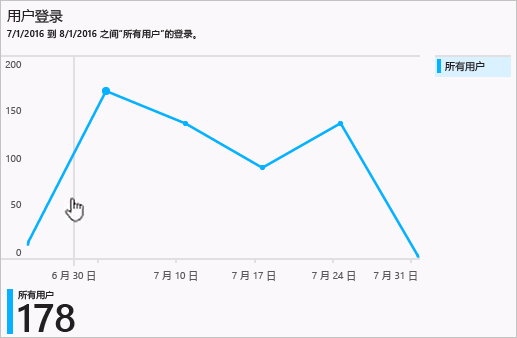
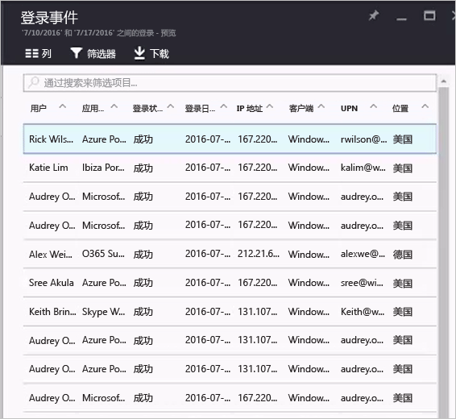

# Azure Active Directory 门户中的“登录活动”报告

通过 [Azure 门户](https://portal.azure.com)中的 Azure Active Directory (Azure AD) 报告，可以获取确定环境运行状况所需的信息。

Azure Active Directory 中的报表体系结构由以下部分组成：

- **活动** 
    - **登录活动** — 有关托管应用程序的使用和用户登录活动的信息
    - **审核日志** - 有关用户和组管理、托管应用程序和目录活动的系统活动信息。
- **安全性** 
    - **风险登录** - 风险登录是指可能由非用户帐户合法拥有者进行的登录尝试。 有关详细信息，请参阅“有风险的登录”。
    - **已标记为存在风险的用户** - 风险用户是指可能已泄露的用户帐户。 有关详细信息，请参阅“已标记为存在风险的用户”。

本主题概述登录活动。

## 先决条件

### 谁可以访问该数据？
* 安全管理员或安全读者角色中的用户
* 全局管理员
* 任何用户（非管理员）都可以访问自己的登录活动 

### 访问登录活动需要什么 Azure AD 许可证？
* 租户必须具有与之关联的 Azure AD Premium 许可证，才能查看包含所有登录活动的报告

## 登录活动

通过用户登录报表提供的信息，可以找到一些问题的答案，例如：

* 什么是用户的登录模式？
* 多少用户超过一周都有登录行为？
* 这些登录的状态怎样？

所有登录活动数据的第一个入口点为 Azure Active

登录日志有一个默认列表视图，用于显示：

- 登录日期
- 相关的用户
- 用户登录到的应用程序
- 登录状态
- 风险检测的状态
- 多重身份验证 (MFA) 要求的状态 

单击工具栏中的“列”即可自定义列表视图。

用于显示其他字段，或者删除已显示的字段。

通过单击列表视图中的项，可以在水平视图中获得为该项提供的所有相关详情。

## 筛选登录活动

若要将所报告数据的范围缩小到适当的级别，可以使用以下默认字段筛选登录数据：

- 用户
- Application
- 登录状态
- 风险检测的状态
- 日期

“用户”筛选器用于指定所关注的用户的名称或用户主体名称 (UPN)。 

“应用程序”筛选器用于指定所关注的应用程序的名称。  

“登录状态”筛选器用于选择：

- 全部 
- 成功
- 失败

“检测到的风险”筛选器用于选择：

- 全部
- 是
- 否 

“日期”筛选器用于定义已返回数据的时间范围。  
可能的值包括：

- 1 个月
- 7 天
- 24 小时
- 自定义时间范围

选择自定义时间范围时，可以配置开始时间和结束时间。

如果向登录视图添加其他字段，这些字段会自动添加到筛选器列表。 例如，如果向列表添加“客户端应用”字段，则还会获得另一筛选器选项，用于设置以下筛选器：

- 浏览器      
- Exchange ActiveSync（受支持）               
- Exchange ActiveSync（不受支持）
- 其他客户端               
    - IMAP
    - MAPI
    - 旧式 Office 客户端
    - POP
    - SMTP

## 登录活动快捷方式

除了 Azure Active Directory，Azure 门户还提供了两个额外的登录活动数据的入口点：

- 标识安全保护概览
- 用户
- 组
- 企业应用程序

### 用户登录活动

通过用户登录报表提供的信息，可以找到一些问题的答案，例如：

- 什么是用户的登录模式？
- 多少用户超过一周都有登录行为？
- 这些登录的状态怎样？

该数据的入口点为“标识安全保护”概览页上的用户登录图。 用户登录图显示指定时间内所有用户的按周汇总的登录信息。 默认时间为 30 天。

单击登录图中的某一天时，可以获得该天的登录活动的概览。

登录活动列表中的每一行显示以下内容：

* 登录者是谁？
* 登录的目标应用程序是哪个？
* 登录的状态是什么？
* 登录的 MFA 状态是什么？

单击某个项即可获得有关登录操作的更多详情：

- 用户 ID
- 用户
- 用户名
- 应用程序 ID
- Application
- Client
- Location
- IP 地址
- 日期
- 需要 MFA
- 登录状态

 
在“用户”页中单击“活动”部分的“登录”即可完全了解所有用户登录活动。

## 托管应用程序的使用情况

通过登录数据的以应用程序为中心的视图，可以回答如下问题：

* 谁正在使用我的应用程序？
* 组织中最常用的 3 个应用程序是哪些？
* 我最近推出了一个应用程序。 它用起来怎样？

该数据的入口点为“企业应用程序”页“概览”部分的“组织过去 30 天最常用的 3 个应用程序”报告。

应用程序使用情况图显示指定时间内最常用的 3 个应用程序的按周汇总的登录情况。 默认时间为 30 天。

如果需要，可以将焦点设置在特定应用程序上。

单击应用程序使用情况图中的某一天时，可以获取登录活动的详细列表。

**登录** 选项可提供应用程序的所有登录事件的完整概览。

## 后续步骤

如需详细了解登录活动的错误代码，请参阅 [Azure Active Directory 门户中的登录活动报告错误代码](active-directory-reporting-activity-sign-ins-errors.md)。

