# Azure Active Directory 报表 - 预览
> [!div class="op_single_selector"]
> * [Azure 门户](active-directory-reporting-azure-portal.md)
> * [Azure 经典门户](active-directory-reporting-guide.md)
> 
> 

*本文档是 [Azure Active Directory 报告指南](active-directory-reporting-guide.md)的一部分。*

通过 Azure Active Directory 预览中的报表，可以获取确定环境的运行状况所需的所有信息。 [预览包括哪些内容？](active-directory-preview-explainer.md)

报表包含两个主要区域：

* **登录活动** — 有关托管应用程序的使用和用户登录活动的信息
* **审核日志** - 有关用户和组管理、托管应用程序和目录活动的系统活动信息

根据查找的数据范围，可以在 [Azure 门户](https://portal.azure.com)中通过单击“用户和组”或者服务列表中的“企业应用程序”来访问这些报告。

## 登录活动
### 用户登录活动
通过用户登录报表提供的信息，可以找到一些问题的答案，例如：

* 什么是用户的登录模式？
* 多少用户超过一周都有登录行为？
* 这些登录的状态怎样？

该数据的入口点为“概览”部分的“用户和组”下面的用户登录图。

 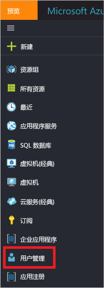

用户登录图显示指定时间内所有用户的按周汇总的登录信息。 默认时间为 30 天。

单击登录图中的某一天时，可以获取登录活动的详细列表。

登录活动列表中的每一行提供了有关所选登录的详细信息，例如：

* 登录者是谁？
* 相关的 UPN 是什么？
* 登录的目标应用程序是哪个？
* 登录的 IP 地址是多少？
* 登录的状态怎样？

### 托管应用程序的使用情况
通过登录数据的以应用程序为中心的视图，可以回答如下问题：

* 谁正在使用我的应用程序？
* 组织中最常用的 3 个应用程序是哪些？
* 我最近推出了一个应用程序。 它用起来怎样？

该数据的入口点为“概览”部分的“企业应用程序”下面的组织过去 30 天的报告中最常用的 3 个应用程序。

 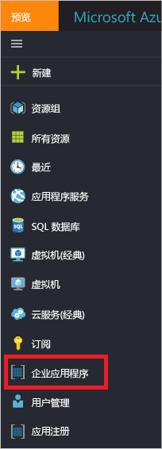

应用程序使用情况图显示指定时间内最常用的 3 个应用程序的按周汇总的登录情况。 默认时间为 30 天。

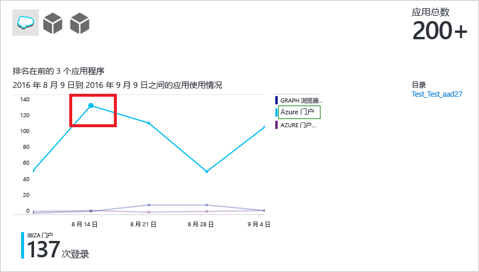

如果需要，可以将焦点设置在特定应用程序上。

单击应用程序使用情况图中的某一天时，可以获取登录活动的详细列表。

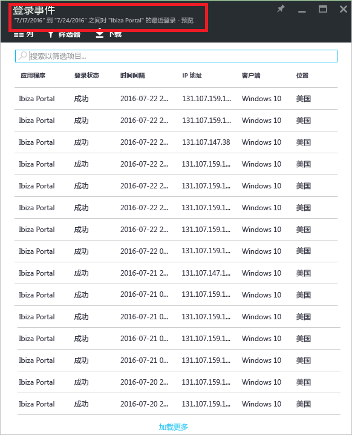

**登录** 选项可提供应用程序的所有登录事件的完整概览。

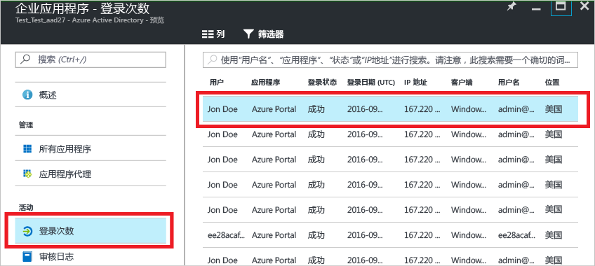

使用列选择器可以选择想要显示的数据字段。

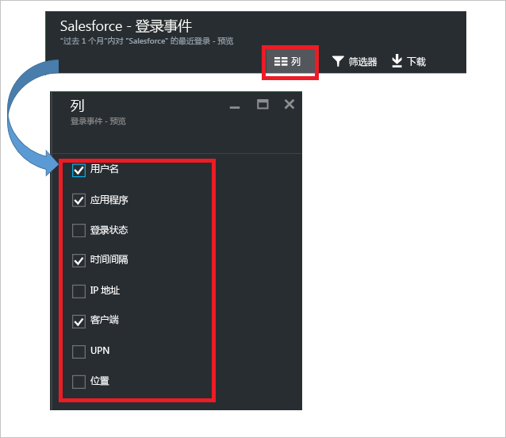

### 筛选登录信息
可以使用以下字段筛选登录信息，以限制显示的数据量：

* 日期和时间 
* 用户的用户主体名称
* 应用程序名称
* 客户端名称
* 登录状态

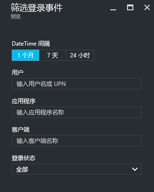

用于筛选登录活动的条目的另一种方法是搜索特定条目。
搜索方法能够将登录信息的范围限定在特定的**用户**、**组**或**应用程序**。

## 审核日志
Azure Active Directory 中的审核日志为合规性提供了系统活动的记录。

Azure 门户中主要有三种与审核相关的活动：

* 用户和组   
* 应用程序
* Directory   

有关审核报表活动的完整列表，请参阅 [审核报表事件的列表](active-directory-reporting-audit-events.md#list-of-audit-report-events)。

所有审核数据的入口点为 **Azure Active Directory** 的“活动”部分中的“审核日志”。

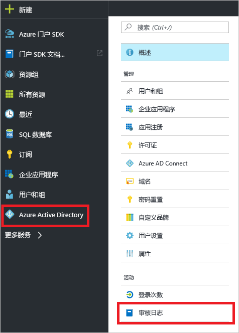

审核日志有一个列表视图，其中显示参与者（人员）、活动（内容）和目标。

通过单击列表视图中的项，可以获得更多详情。

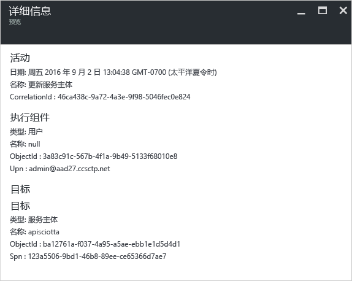

### 用户和组审核日志
使用基于用户和组的审核报表，可以获得如下问题的答案：

* 对用户应用了哪种类型的更新？
* 更改了多少用户？
* 更改了多少密码？
* 管理员在目录中做了什么？
* 添加了哪些组？
* 是否存在成员身份已更改的组？
* 是否已更改组的所有者？
* 向组或用户分配了哪些许可证？

如果只想查看与用户和组相关的审核数据，可以在“用户和组”的“活动”部分中的“审核日志”下方查找筛选视图。

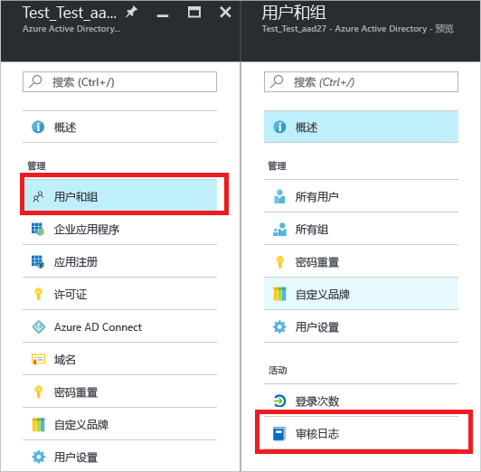

### 应用程序审核日志
通过基于应用程序的审核报表，可以获得如下问题的答案：

* 已添加或更新的应用程序有哪些？
* 已删除的应用程序有哪些？
* 应用程序的服务原则是否有变化？
* 应用程序的名称是否已更改？
* 哪些用户同意使用应用程序？

如果只想查看与应用程序相关的审核数据，可以在“企业应用程序”的“活动”部分中的“审核日志”下方查找筛选视图。

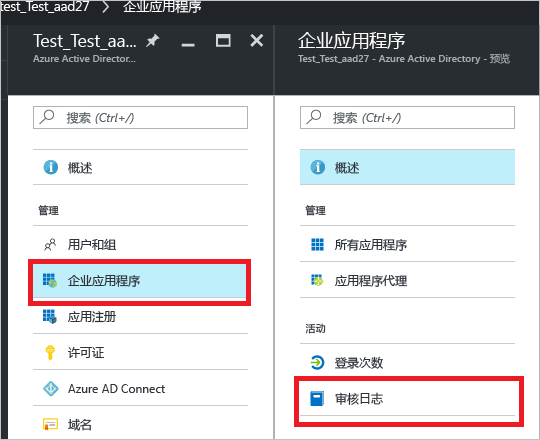

### 筛选审核日志
可以使用以下字段筛选登录信息，以限制显示的数据量：

* 日期和时间
* 执行组件的用户主体名称
* 活动类型
* 活动

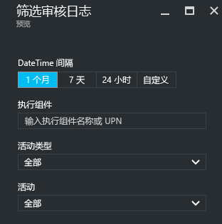

“活动类型”列表的内容将绑定到此边栏选项卡的入口点。  
如果入口点是 Azure Active Directory，则此列表包含所有可能的活动类型：

* 应用程序 
* 组 
* 用户
* 设备
* Directory
* 策略
* 其他

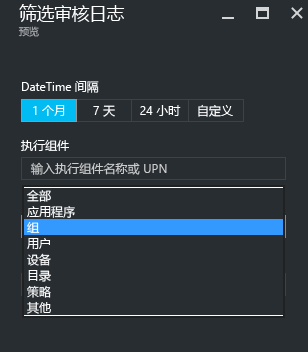

按活动类型限定列出的活动的范围。
例如，如果将“组”选为“活动类型”，则“活动”列表仅包含与组相关的活动。   

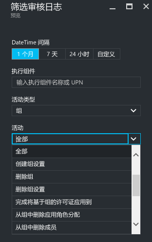

用于筛选审核日志的条目的另一种方法是搜索特定条目。

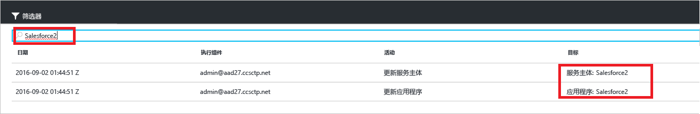

## 后续步骤
请参阅 [Azure Active Directory 报表指南](active-directory-reporting-guide.md)。

<!--HONumber=Nov16_HO2-->

