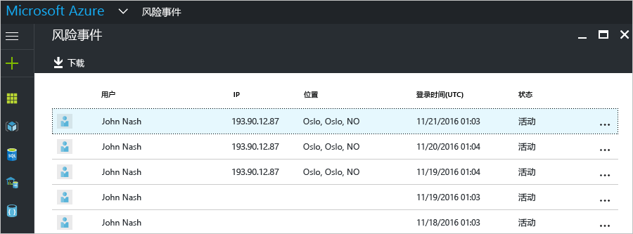
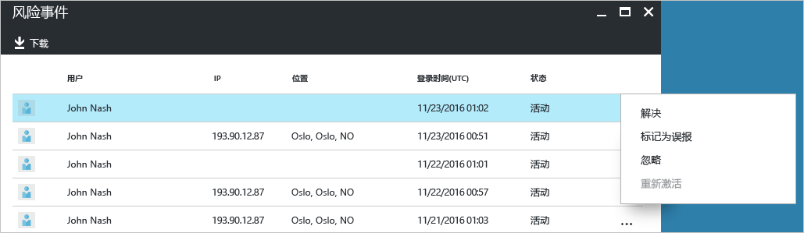
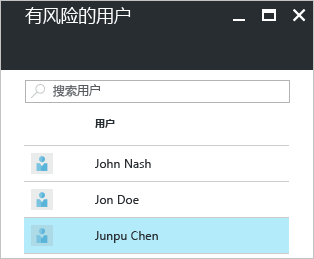

# Azure Active Directory 免费版和基本版中的安全报告 - 预览

可以通过 Azure Active Directory [预览版](active-directory-preview-explainer.md)中的安全报告，了解你的环境中用户帐户泄露的可能性。 

Azure Active Directory 可以检测到与用户帐户相关的可疑操作。 每检测到一个可疑操作，就会创建一个名为“风险事件”的记录。 有关更多详细信息，请参阅 [Azure Active Directory 风险事件](active-directory-identity-protection-risk-events.md)。 

检测到的风险事件用于计算：

- **风险登录** - 风险登录是指可能由非用户帐户合法拥有者进行的登录尝试。 有关更多详细信息，请参阅[风险登录](active-directory-identityprotection.md#risky-sign-ins)。 

- **已标记为存在风险的用户** - 风险用户是指可能已泄露的用户帐户。 有关更多详细信息，请参阅[已标记为存在风险的用户](active-directory-identityprotection.md#users-flagged-for-risk)。  

## 风险登录报告

Azure Active Directory 免费版和基本版为你提供了针对用户检测并报告的风险登录的列表。 风险事件报告提供以下内容：

- **用户** - 在登录操作期间使用的用户的名称
- **IP** - 用于连接到 Azure Active Directory 的设备的 IP 地址
- **位置** - 用于连接到 Azure Active Directory 的位置
- **登录时间** - 进行登录的时间
- **状态** - 登录的状态

此报告提供了下载报告数据的选项。

可以根据自己对风险登录的调查情况，以下述操作的形式向 Azure Active Directory 提供反馈：

- 解决
- 标记为误报
- 忽略
- 重新激活

有关更多详细信息，请参阅[手动关闭风险事件](active-directory-identityprotection.md#closing-risk-events-manually)。

## 风险用户报告

Azure Active Directory 免费版为你提供可能已泄露的用户帐户的列表。 

单击列表中的用户即可打开相关的用户数据边栏选项卡。
对于存在风险的用户，请查看其登录历史记录，并根据需要重置密码。

## 后续步骤

- 有关 Azure Active Directory 报告的更多详细信息，请参阅 [Azure Active Directory 报告指南](active-directory-reporting-guide.md)。
- 有关 Azure Active Directory Identity Protection 的详细信息，请参阅 [Azure Active Directory Identity Protection](active-directory-identityprotection.md)。

<!--HONumber=Jan17_HO3-->

