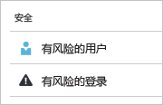
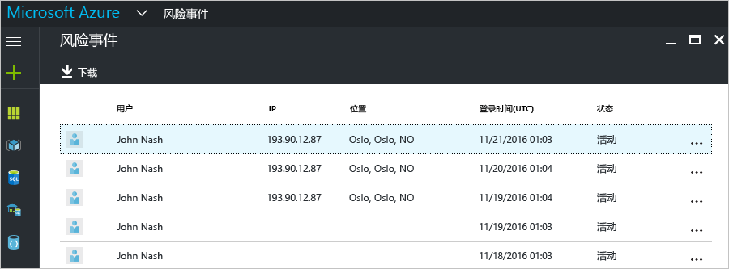
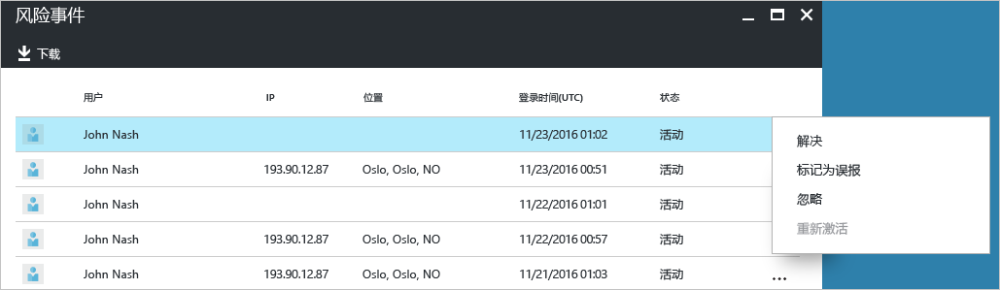
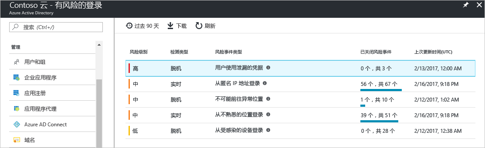
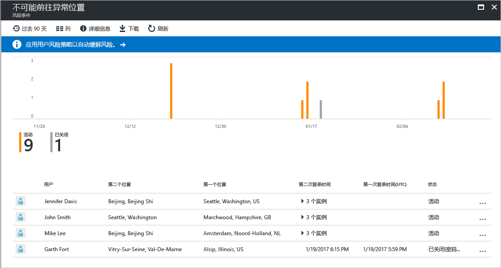
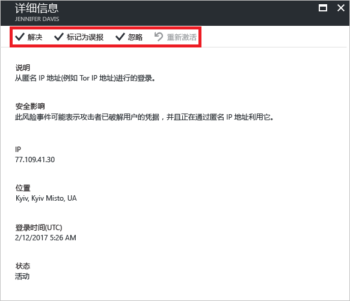

# Azure Active Directory 门户中的“有风险的登录”报告

可以通过 Azure Active Directory (Azure AD) 中的安全报告，了解环境中用户帐户泄露的可能性。 

Azure AD 可以检测到与用户帐户相关的可疑操作。 每检测到一个可疑操作，就会创建一个名为“风险事件”的记录。 有关更多详细信息，请参阅 [Azure Active Directory 风险事件](active-directory-identity-protection-risk-events.md)。 

检测到的风险事件用于计算：

- **风险登录** - 风险登录是指可能由非用户帐户合法拥有者进行的登录尝试。 有关更多详细信息，请参阅[风险登录](active-directory-identityprotection.md#risky-sign-ins)。 

- **已标记为存在风险的用户** - 风险用户是指可能已泄露的用户帐户。 有关更多详细信息，请参阅[已标记为存在风险的用户](active-directory-identityprotection.md#users-flagged-for-risk)。  

在 [Azure 门户](https://portal.azure.com)中，可在“Azure Active Directory”边栏选项卡上的“安全”部分中找到安全报告。 

## 访问安全报表需要什么 Azure AD 许可证？  

所有版本的 Azure Active Directory 都提供风险登录报表。  
但是，各版本的报表粒度级别有所不同： 

- 在“Azure Active Directory 免费版和基本版”中，你已经获得了一个列表，其中包含存在风险的登录。 

- Azure Active Directory Premium 1 版本还允许你检查每个报表中检测到的部分潜在性风险事件，从而扩展了该模型。 

- Azure Active Directory Premium 2 版本提供有关所有潜在风险事件的最详细信息，并且还允许配置可自动响应已配置风险级别的安全策略。

## Azure Active Directory 免费版和基本版

Azure Active Directory 免费版和基本版提供为用户检测到的有风险的登录列表。 此报告列出：

- **用户** - 在登录操作期间使用的用户的名称
- **IP** - 用于连接到 Azure Active Directory 的设备的 IP 地址
- **位置** - 用于连接到 Azure Active Directory 的位置
- **登录时间** - 进行登录的时间
- **状态** - 登录的状态

可以根据自己对风险登录的调查情况，以下述操作的形式向 Azure Active Directory 提供反馈：

- 解决
- 标记为误报
- 忽略
- 重新激活

有关更多详细信息，请参阅[手动关闭风险事件](active-directory-identityprotection.md#closing-risk-events-manually)。

此报告提供的选项用于：

- 搜索资源
- 下载报告数据

## Azure Active Directory Premium 版

Azure Active Directory Premium 版中有风险的登录报表提供：

- 有关已检测到的[风险事件类型](active-directory-identity-protection-risk-events.md)的聚合信息

- 一个用于下载报表的选项

选择风险事件时，可获得此风险事件的详细报表视图，使你能够：

- 一个用于配置[用户风险补救策略](active-directory-identityprotection.md#user-risk-security-policy)的选项  

- 查看风险事件的检测时间线  

- 查看已为其检测到此风险事件的用户的列表

- [手动关闭风险事件](active-directory-identityprotection.md#closing-risk-events-manually)或重新激活已手动关闭的风险事件。 

选择用户时，可获取此用户的详细报表视图，以便：

- 打开“所有的登录”视图

- 重置用户密码

- 清除所有事件

- 为用户调查报告的风险事件。 

若要调查风险事件，请从列表选择某个事件。  
这会打开此风险事件的“详细信息”边栏选项卡。 在“详细信息”边栏选项卡上，可以选择[手动关闭风险事件](active-directory-identityprotection.md#closing-risk-events-manually)或重新激活已手动关闭的风险事件。 

## 后续步骤

- 有关 Azure Active Directory Identity Protection 的详细信息，请参阅 [Azure Active Directory Identity Protection](active-directory-identityprotection.md)。

