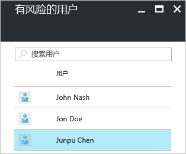
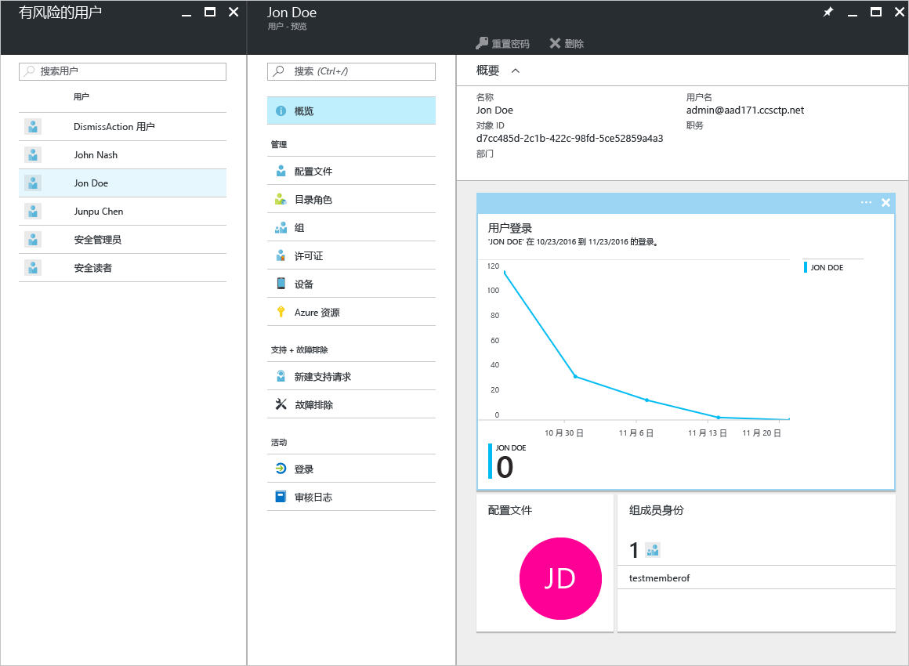
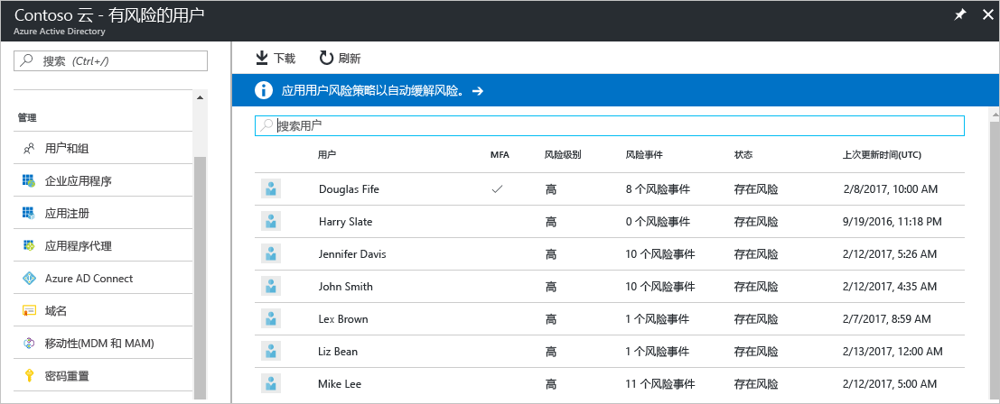
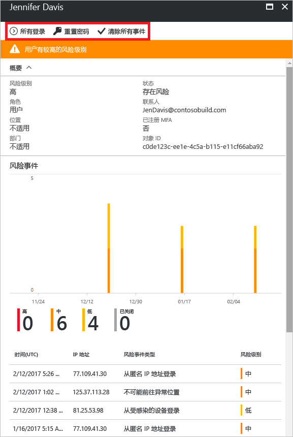

---

title: "Azure Active Directory 门户中的“有风险的用户”安全报告 | Microsoft Docs"
description: "了解 Azure Active Directory 门户中的“有风险的用户”安全报告"
services: active-directory
author: MarkusVi
manager: femila
ms.assetid: addd60fe-d5ac-4b8b-983c-0736c80ace02
ms.service: active-directory
ms.devlang: na
ms.topic: get-started-article
ms.tgt_pltfrm: na
ms.workload: identity
ms.date: 05/04/2017
ms.author: markvi
ms.translationtype: Human Translation
ms.sourcegitcommit: 2db2ba16c06f49fd851581a1088df21f5a87a911
ms.openlocfilehash: 01ecb98c02b2a01007c7f76805d4db4b7aeee1f0
ms.contentlocale: zh-cn
ms.lasthandoff: 05/09/2017

---
# Azure Active Directory 门户中的“有风险的用户”安全报告

可以通过 Azure Active Directory (Azure AD) 中的安全报告，了解你的环境中用户帐户泄露的可能性。 

Azure Active Directory 可以检测到与用户帐户相关的可疑操作。 每检测到一个可疑操作，就会创建一个名为“风险事件”的记录。 有关更多详细信息，请参阅 [Azure Active Directory 风险事件](active-directory-identity-protection-risk-events.md)。 

检测到的风险事件用于计算：

- **风险登录** - 风险登录是指可能由非用户帐户合法拥有者进行的登录尝试。 有关更多详细信息，请参阅[风险登录](active-directory-identityprotection.md#risky-sign-ins)。 

- **已标记为存在风险的用户** - 风险用户是指可能已泄露的用户帐户。 有关更多详细信息，请参阅[已标记为存在风险的用户](active-directory-identityprotection.md#users-flagged-for-risk)。  

在 Azure 门户中，可在“Azure Active Directory”边栏选项卡上的“安全”部分中找到安全报表。  

## Azure Active Directory 免费版和基本版

Azure Active Directory 免费版和基本版中“有风险的用户”报表提供可能已泄露的用户帐户列表。 

选择用户可打开相关的用户数据边栏选项卡。
对于存在风险的用户，可查看其登录历史记录，并根据需要重置密码。

## Azure Active Directory Premium 版

Azure Active Directory Premium 版中“有风险的用户”报表提供：

- 可能已泄露的[用户帐户列表](active-directory-identityprotection.md#users-flagged-for-risk) 

- 有关已检测到的[风险事件类型](active-directory-identity-protection-risk-events.md)的聚合信息

- 一个用于下载报表的选项

- 一个用于配置[用户风险补救策略](active-directory-identityprotection.md#user-risk-security-policy)的选项  

选择用户时，可获取此用户的详细报表视图，使你能够：

- 打开“所有的登录”视图

- 重置用户密码

- 清除所有事件

- 为用户调查报告的风险事件。 

若要调查风险事件，请从列表选择某个事件。  
这将打开此风险事件的“详细信息”边栏选项卡。 在“详细信息”边栏选项卡上，可以选择[手动关闭风险事件](active-directory-identityprotection.md#closing-risk-events-manually)或重新激活已手动关闭的风险事件。 

## 后续步骤

- 有关 Azure Active Directory Identity Protection 的详细信息，请参阅 [Azure Active Directory Identity Protection](active-directory-identityprotection.md)。

