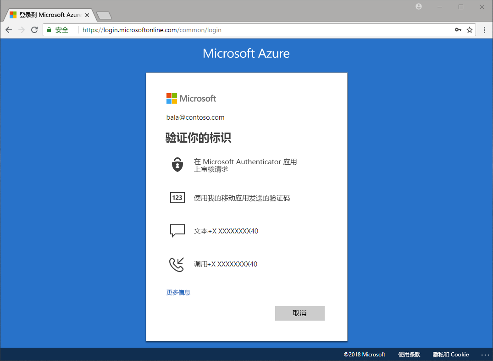

# 有哪些方法可用来进行身份验证？

我们经常在新闻中听到有关密码被盗以及身份被冒用的报道。 除了密码之外，要求使用第二个因素可以立即提高你的组织的安全性。 Microsoft Azure Active Directory (Azure AD) 包括了诸如 Azure 多重身份验证 (Azure MFA) 和 Azure AD 自助服务密码重置 (SSPR) 来帮助管理员使用附加身份验证方法保护其组织和用户。

当用户需要访问敏感应用程序、重置其密码或者启用 Windows Hello 时，可能会要求他们提供附加验证来证明他们是自己所说的人。

附加验证可以采用身份验证方法进行，例如：

* 在电子邮件或短信中提供的代码
* 电话呼叫
* 手机上的通知或代码
* 安全问题的答案

Azure MFA 和 Azure AD 自助服务密码重置允许管理员使用 Azure AD 和 Azure 门户来控制配置、策略、监视和报告以保护其组织。

## 自助密码重置

自助服务密码重置允许用户在需要时重置其密码，不需要管理员干预。

> [!VIDEO https://www.youtube.com/embed/hc97Yx5PJiM]

自助服务密码重置包括：

* **密码更改：** 我知道我的密码，但想将其更改为某个新密码。
* **密码重置：** 我无法登录，并希望使用一种或多种经批准的身份验证方法重置我的密码。
* **帐户解锁：** 因为我的帐户被锁定，我无法登录并希望使用一种或多种经批准的身份验证方法进行解锁。

## 多重身份验证

Azure 多重身份验证 (MFA) 是 Microsoft 的双重验证解决方案。 使用管理员批准的身份验证方法，Azure MFA 可帮助保护对数据和应用程序的访问，同时满足对简单登录过程的需求。

## 后续步骤

下一个步骤是深入了解并配置自助服务密码重置和 Azure 多重身份验证。

若要开始使用自助服务密码重置，请参阅[启用 SSPR 快速入门文章](quickstart-sspr.md)。

在[工作原理：Azure AD 自助服务密码重置](concept-sspr-howitworks.md)一文中详细了解自助服务密码重置

在[工作原理：Azure 多重身份验证](concept-mfa-howitworks.md)一文中详细了解 Azure 多重身份验证