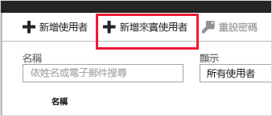
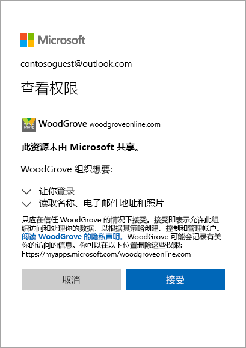

# 快速入门：在 Azure 门户中将来宾用户添加到目录

通过将人员作为来宾用户添加到目录中，可邀请任何人与你的组织进行协作。 然后，可发送包含兑换链接的邀请电子邮件，也可发送要共享的应用的直接链接。 来宾用户可使用其自己的工作、学校或社交标识进行登录。

在该快速入门中，你将向 Azure AD 添加新的来宾用户、发送邀请，并查看来宾用户的邀请兑换过程的呈现效果。

如果还没有 Azure 订阅，可以在开始前创建一个[免费帐户](https://azure.microsoft.com/free/?WT.mc_id=A261C142F)。

## 先决条件

若要完成本教程中的方案，需要：

 - 一个可用于在租户目录中创建用户的角色，例如全局管理员或任何有限管理员目录角色。
 - 一个有效的电子邮件帐户，该帐户可添加到租户目录中，并可用于接收测试邀请电子邮件。

## 在 Azure AD 中添加新的来宾用户

1. 以 Azure AD 管理员身份登录到 [Azure 门户](https://portal.azure.com/)。
2. 在左窗格中选择“Azure Active Directory”。
3.  在“管理”下，选择“用户”。

    

4.  选择“新来宾用户”。

    

5.  在“用户名”下，输入外部用户的电子邮件地址。 在“包含带邀请的个人消息”下，键入欢迎消息。 

    

6. 选择“邀请”，以自动向来宾用户发送邀请。 右上角会显示一则通知，其中的消息显示“已成功邀请用户”。 
7.  发送邀请后，该用户帐户将以来宾的形式自动添加到目录。

## 向来宾用户分配应用
向测试租户添加 Salesforce 应用，并向应用分配测试来宾用户。
1.  以 Azure AD 管理员身份登录到 Azure 门户。
2.  在左窗格中，选择“企业应用程序”。
3.  选择“新建应用程序”。
4. 在“从库中添加”下，搜索 Salesforce，然后将其选中。

    
5. 选择 **添加** 。
6. 在“管理”下，选择“单一登录”，再在“单一登录模式”下选择“基于密码的登录”，然后单击“保存”。
7. 在“管理”下，选择“用户和组” > “添加用户” > “用户和组”。
8. 使用搜索框搜索测试用户（如必需），再选择列表中的测试用户。 然后单击“选择”。
9. 选择“分配”。 

## 接受邀请
现在作为来宾用户登录以查看邀请。
1.  登录到测试来宾用户的电子邮件帐户。
2.  在收件箱中，找到“你已受邀”电子邮件。

    

3.  在电子邮件正文中，选择“入门”。 浏览器中随即打开一个“查看权限”页面。 

    

4. 选择“接受”。 随即打开访问面板，其中列出来宾用户可访问的应用程序。

## 清理资源
不再需要测试来宾用户和测试应用时，请将其删除。
1.  以 Azure AD 管理员身份登录到 Azure 门户。
2.  在左窗格中选择“Azure Active Directory”。
3.  在“管理”下，选择“企业应用程序”。
4.  打开 Salesforce 应用程序，然后选择“删除”。
5.  在左窗格中选择“Azure Active Directory”。
6.  在“管理”下，选择“用户”。
7.  选择测试用户，然后选择“删除用户”。

## 后续步骤
在本教程中，你在 Azure 门户中创建了一个来宾用户，还发送了一个应用共享邀请。 然后，你以来宾用户的视角查看了兑换过程，并已验证确定来宾用户的访问面板上显示有应用。 要详细了解如何添加来宾用户进行协作，请参阅[在 Azure 门户中添加 Azure Active Directory B2B 协作用户](add-users-administrator.md)。
