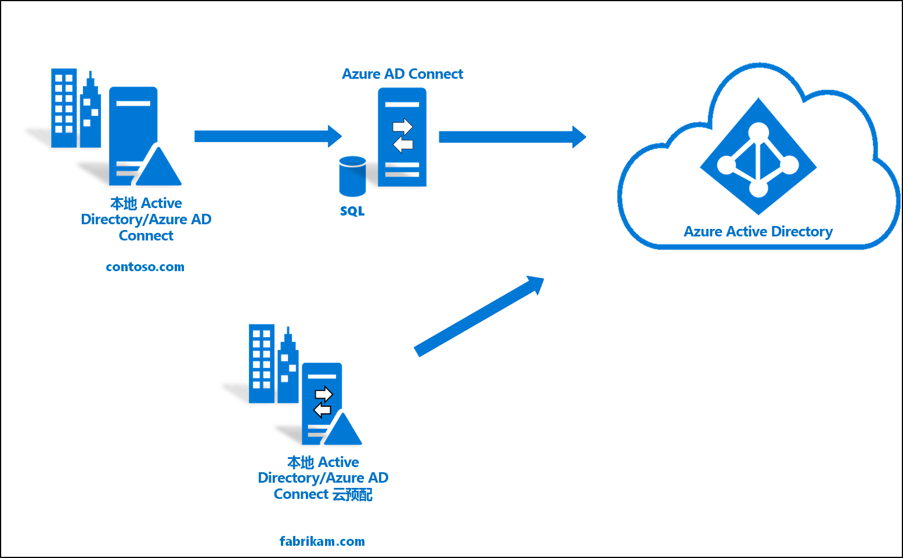

# 将现有林和新林与单个 Azure AD 租户集成

本教程引导你将云预配添加到现有的混合标识环境。 

可以使用本教程中创建的环境进行测试，或者加深了解混合标识的工作原理。 

在此场景中，有一个现有的林已通过 Azure AD Connect sync 同步到 Azure AD 租户。 你想要将一个新林同步到同一个 Azure AD 租户。 你将为新林设置云预配。 

## 先决条件
### 在 Azure Active Directory 管理中心中

1. 在 Azure AD 租户中创建仅限云的全局管理员帐户。 这样一来，就可以在本地服务出现故障或不可用时管理租户的配置。 了解如何[添加仅限云的全局管理员帐户](../active-directory-users-create-azure-portal.md)。 完成此步骤至关重要，可确保自己不被锁定在租户外部。
2. 在 Azure AD 租户中添加一个或多个[自定义域名](../active-directory-domains-add-azure-portal.md)。 用户可以使用其中一个域名登录。

### 在本地环境中

1. 指定一台已加入域的、运行 Windows Server 2012 R2 或更高版本、至少有 4 GB RAM 且装有 .NET 4.7.1+ 运行时的主机服务器 

2. 如果服务器和 Azure AD 之间存在防火墙，请配置以下项：
   - 确保代理可以通过以下端口向 Azure AD 发出出站请求： 

     | 端口号 | 用途 |
     | --- | --- |
     | **80** | 下载证书吊销列表 (Crl) 的同时验证 SSL 证书 |
     | **443** | 处理与服务的所有出站通信 |
     | **8080**（可选） | 如果端口 443 不可用，代理将每隔 10 分钟通过端口 8080 报告其状态。 此状态显示在 Azure AD 门户上。 |
     
     如果防火墙根据原始用户强制实施规则，请打开这些端口以允许来自作为网络服务运行的 Windows 服务的流量。
   - 如果防火墙或代理允许指定安全后缀，请将连接添加到 **\*.msappproxy.net** 和 **\*.servicebus.windows.net**。 否则，请允许访问每周更新的 [Azure 数据中心 IP 范围](https://www.microsoft.com/download/details.aspx?id=41653)。
   - 代理需要访问 **login.windows.net** 和 **login.microsoftonline.com** 来完成初始注册。 另外，还请为这些 URL 打开防火墙。
   - 为了进行验证证书，请取消阻止以下 URL：**mscrl.microsoft.com:80**、**crl.microsoft.com:80**、**ocsp.msocsp.com:80** 和 **www\.microsoft.com:80**。 由于这些 URL 与其他 Microsoft 产品一起用于证书验证，因此可能已取消阻止这些 URL。

## 安装 Azure AD Connect 预配代理
1. 登录到已加入域的服务器。  如果使用的是[基本 AD 和 Azure 环境](tutorial-basic-ad-azure.md)教程，则该服务器是 DC1。
2. 使用仅限云的全局管理员凭据登录到 Azure 门户。
3. 在左侧选择“Azure Active Directory”，单击“Azure AD Connect”，然后在中心位置选择“管理预配(预览版)”。    
 
4. 单击“下载代理”
5. 运行 Azure AD Connect 预配代理
6. 在初始屏幕上**接受**许可条款，然后单击“安装”。  
 

7. 此操作完成后，将启动配置向导。  使用 Azure AD 全局管理员帐户登录。  请注意，如果启用了 IE 增强的安全性，将会阻止登录。  如果存在这种情况，请关闭安装，服务器管理器中禁用 IE 增强的安全性，然后单击“AAD Connect 预配代理向导”重新开始安装。 
8. 在“连接 Active Directory”屏幕上单击“添加目录”，然后使用 Active Directory 域管理员帐户登录。    注意：域管理员帐户不应附带密码更改要求。 如果密码过期或发生更改，则需要使用新凭据重新配置代理。 此操作将添加本地目录。  单击“下一步”。  
 

9. 在“配置完成”屏幕上，单击“确认”。    此操作将注册并重启代理。 
 

10. 此操作完成后，会显示一条通知：“已成功验证代理配置”。   可以单击“退出”。  
 
11. 如果仍然显示了初始屏幕，请单击“关闭”。 

## 验证代理安装
代理验证是在 Azure 门户中以及在运行该代理的本地服务器上进行的。

### Azure 门户代理验证
若要验证 Azure 是否能够识别到代理，请执行以下步骤：

1. 登录到 Azure 门户。
2. 在左侧选择“Azure Active Directory”，单击“Azure AD Connect”，然后在中心位置选择“管理预配(预览版)”。    
 

3.  在“Azure AD 预配(预览版)”屏幕上，单击“查看所有代理”。  
 
 
4. 在**本地预配代理屏幕上**，将看到已安装的代理。  验证相关的代理是否在该屏幕上，并且标记为“活动”。 
 

### 在本地服务器上
若要验证代理是否正在运行，请执行以下步骤：

1.  使用管理员帐户登录到服务器
2.  导航到“服务”或者转到“开始”>“运行”并输入 Services.msc，打开“服务”。 
3.  确保“Microsoft Azure AD Connect Agent Updater”和“Microsoft Azure AD Connect Provisioning Agent”包含在“服务”中，并且其状态为“正在运行”。    

## 配置 Azure AD Connect 云预配
 使用以下步骤配置预配

1.  登录到 Azure AD 门户。
2.  单击“Azure Active Directory” 
3.  单击“Azure AD Connect” 
4.  选择“管理预配(预览版)”  

5.  单击“新建配置”  

7.  在配置屏幕上输入一条**通知电子邮件**，将选择器切换到“启用”，然后单击“保存”。  

1.  现在，配置状态应为“正常”。 

## 验证是否已创建用户并正在进行同步
现在验证本地目录中的用户是否已同步并在 Azure AD 租户中存在。  请注意，这可能需要几个小时才能完成。  要验证用户是否已同步，请执行以下操作。

1. 浏览到 [Azure 门户](https://portal.azure.com)，使用具有 Azure 订阅的帐户登录。
2. 在左侧选择“Azure Active Directory” 
3. 在“管理”下，选择“用户”   。
4. 验证租户中是否显示了新用户 
 

## 使用我们的某位用户测试登录

1. 浏览到 [https://myapps.microsoft.com](https://myapps.microsoft.com)
2. 使用在我们的新租户中创建的用户帐户登录。  需要使用以下格式登录：(user@domain.onmicrosoft.com)。 使用用户用于在本地登录的相同密码。 
    

现已成功设置了一个混合标识环境，可以使用它来测试和熟悉 Azure 提供的功能。

## 后续步骤 

- [什么是预配？](what-is-provisioning.md)
- [什么是 Azure AD Connect 云预配？](what-is-cloud-provisioning.md)
