# 为现有已同步的 AD 林试点云预配 

本教程逐步介绍如何试运行已使用 Azure Active Directory (Azure AD) Connect sync 进行同步的测试 Active Directory 林的云预配。

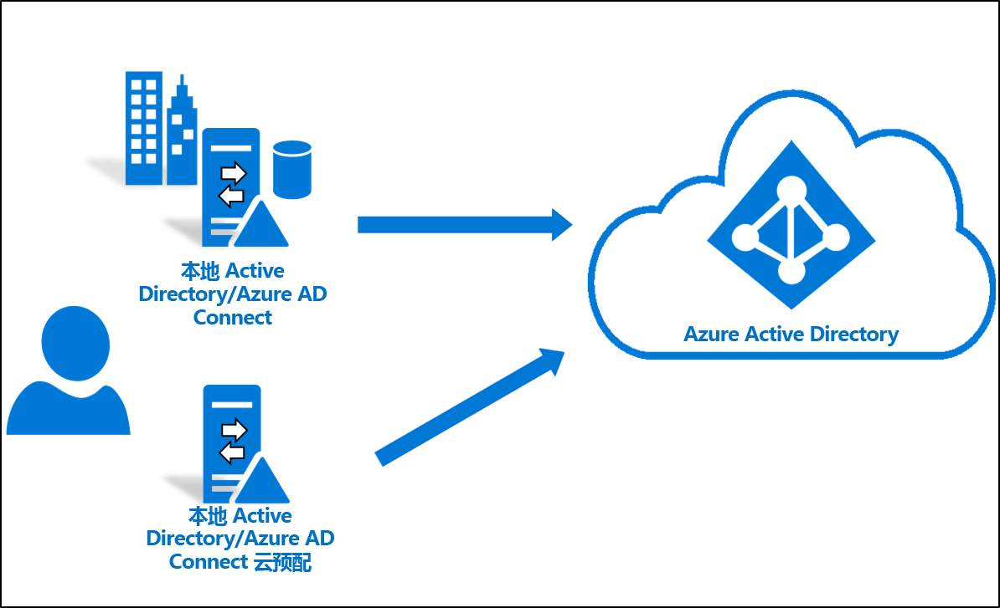

## 注意事项
在尝试学习本教程之前，请注意以下各项：
1. 确保熟悉云预配的基础知识。 
2. 确保运行 Azure AD Connect sync 1.4.32.0 或更高版本，并根据文档所述配置了同步规则。 在试运行时，将从 Azure AD Connect sync 范围中删除测试 OU 或组。 将对象移出范围会导致在 Azure AD 中删除这些对象。 其中的用户对象将在 Azure AD 中软删除，但可以还原。 其中的组对象将在 Azure AD 中硬删除，且不可还原。 Azure AD Connect sync 中引入了一个新的链接类型，它可以防止在试运行方案中删除对象。 
3. 确保为试运行范围中的对象填充 ms-ds-consistencyGUID，使云预配与对象硬性匹配。 

   > [!NOTE]
   > Azure AD Connect sync 默认不会为组对象填充 *ms-ds-consistencyGUID*。 请遵循[此博客文章](https://blogs.technet.microsoft.com/markrenoden/2017/10/13/choosing-a-sourceanchor-for-groups-in-multi-forest-sync-with-aad-connect/)中所述的步骤来填充组对象的 *ms-ds-consistencyGUID*。

4. 这是一种高级方案。 请确保严格按照本教程所述的步骤操作。

## 必备条件
以下是完成本教程所需的先决条件
- 装有 Azure AD Connect sync 1.4.32.0 或更高版本的测试环境
- 处于同步范围内的且可用于试运行的 OU 或组。 我们建议从少量的对象开始。
- 运行 Windows Server 2012 R2 或更高版本的服务器，用于托管预配代理。  此服务器不能是 Azure AD Connect 服务器。
- AAD Connect sync 的源定位点应是 *objectGuid* 或 *ms-ds-consistencyGUID*

## 更新 Azure AD Connect

至少应安装 [Azure AD Connect](https://www.microsoft.com/download/details.aspx?id=47594) 1.4.32.0。 若要更新 Azure AD Connect sync，请完成 [Azure AD Connect：升级到最新版本](../hybrid/how-to-upgrade-previous-version.md)中的步骤。  

## 停止计划程序
Azure AD Connect sync 使用计划程序同步本地目录中发生的更改。 若要修改和添加自定义规则，可以禁用该计划程序，以便在处理此操作时同步不会运行。  请使用以下步骤：

1.  在运行 Azure AD Connect sync 的服务器上，使用管理特权打开 PowerShell。
2.  运行 `Stop-ADSyncSyncCycle`。  按 Enter。
3.  运行 `Set-ADSyncScheduler -SyncCycleEnabled $false`。

>[!NOTE] 
>如果你正在针对 AAD Connect sync 运行自己的自定义计划程序，请禁用该计划程序。 

## 创建自定义用户入站规则

 1. 从桌面上的应用程序菜单启动同步编辑器，如下所示： 
 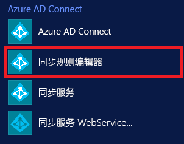 
 
 2. 在“方向”下拉列表中选择“入站”，然后单击“添加新规则”。  
 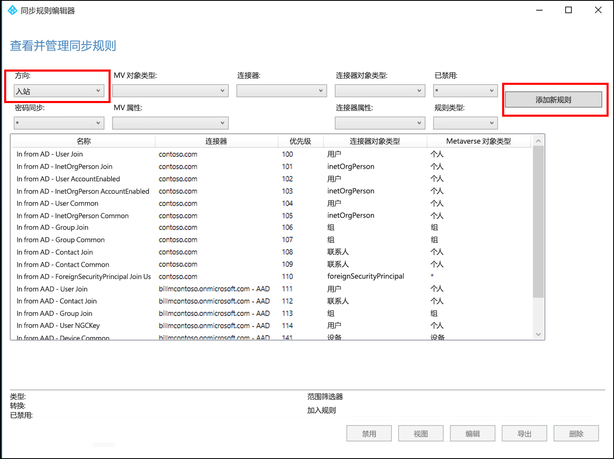 
 
 3. 在“说明”页上，输入以下内容并单击“下一步”：  

    **名称：** 为规则指定一个有意义的名称 
    **说明：** 添加有意义的说明 
    **连接的系统：** 选择要为其编写自定义同步规则的 AD 连接器 
    **连接的系统对象类型：** 用户 
    **Metaverse 对象类型：** 人员 
    **链接类型：** Join 
    **优先顺序：** 提供在系统中唯一的值 
    **标记：** 将此项留空 
    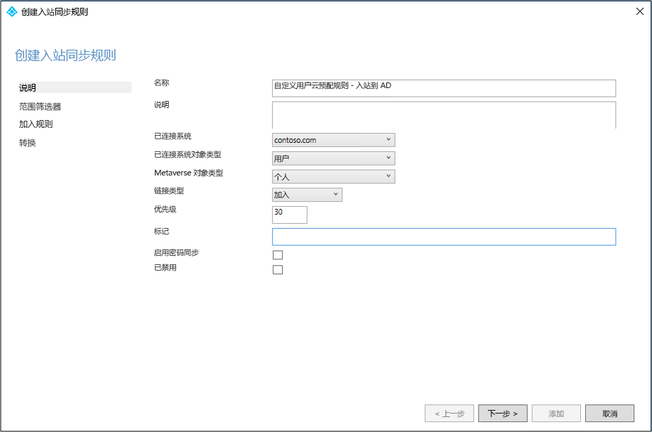 
 
 4. 在“范围筛选器”页上，输入试运行所依据的 OU 或安全组。   若要按 OU 筛选，请添加可分辨名称的 OU 部分。 此规则将应用到该 OU 中的所有用户。  因此，如果 DN 以“OU=CPUsers,DC=contoso,DC=com”结尾，请添加此筛选器。  然后单击“下一步”  。 

    |规则|Attribute|操作员|值|
    |-----|----|----|-----|
    |范围 OU|DN|ENDSWITH|OU 的可分辨名称。|
    |范围组||ISMEMBEROF|安全组的可分辨名称。|

    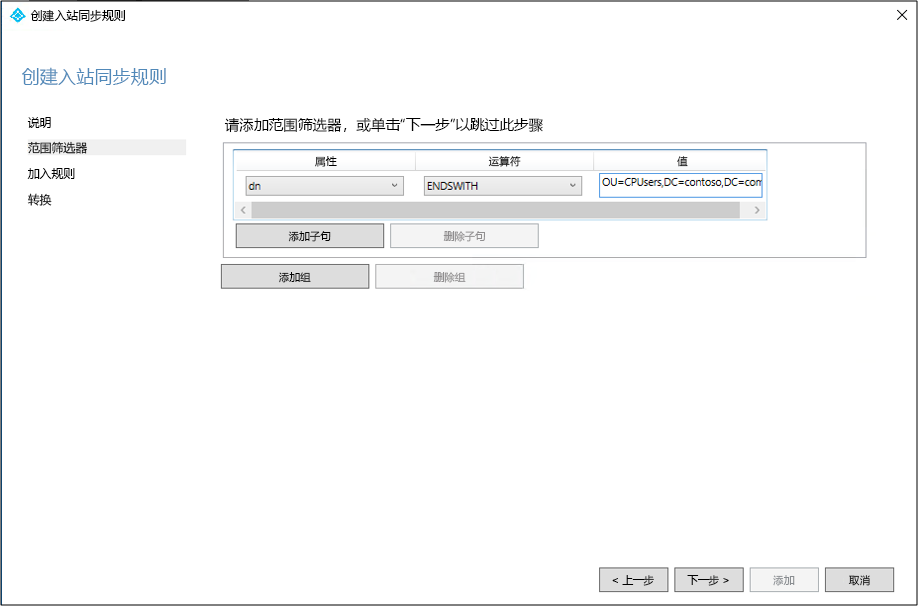 
 
 5. 在“联接规则”页上，单击“下一步”。  
 6. 在“转换”页上添加一个“常量”转换：将 True 流送到 cloudNoFlow 属性。  单击“添加”  。
 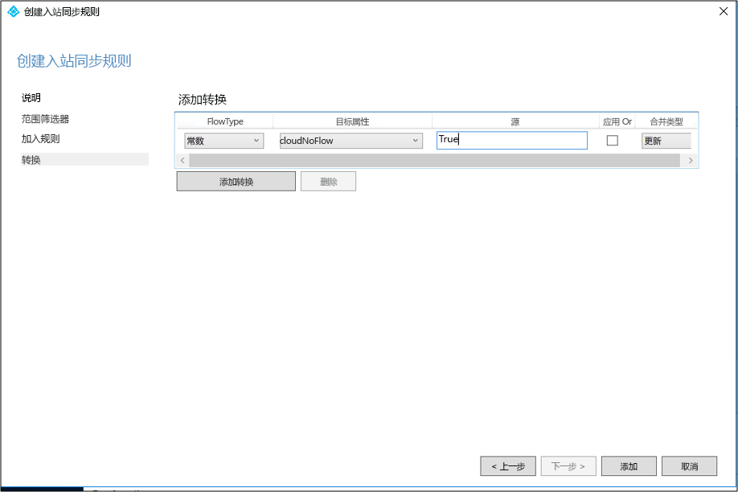 

需要针对所有对象类型（用户、组和联系人）遵循相同的步骤。 针对配置的每个 AD 连接器/每个 AD 林重复这些步骤。 

## 创建自定义用户出站规则

 1. 在“方向”下拉列表中选择“出站”，然后单击“添加规则”。  
 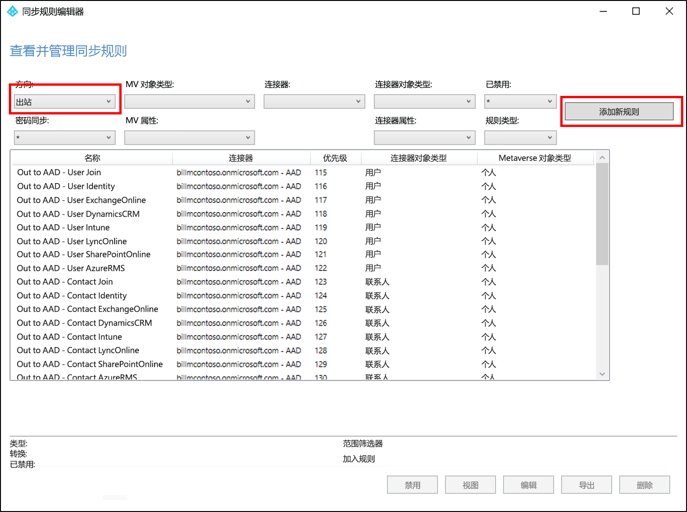 
 
 2. 在“说明”页上，输入以下内容并单击“下一步”：  

    **名称：** 为规则指定一个有意义的名称 
    **说明：** 添加有意义的说明  
    **连接的系统：** 选择要为其编写自定义同步规则的 AAD 连接器 
    **连接的系统对象类型：** 用户 
    **Metaverse 对象类型：** 人员 
    **链接类型：** JoinNoFlow 
    **优先顺序：** 提供在系统中唯一的值 
    **标记：** 将此项留空 
    
    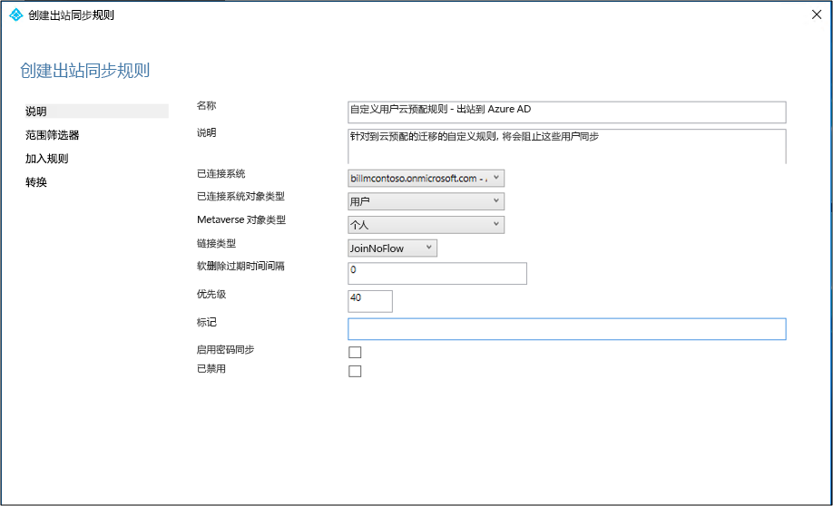 
 
 3. 在“范围筛选器”页上，选择“cloudNoFlow”、“等于”、“True”。    然后单击“下一步”  。
 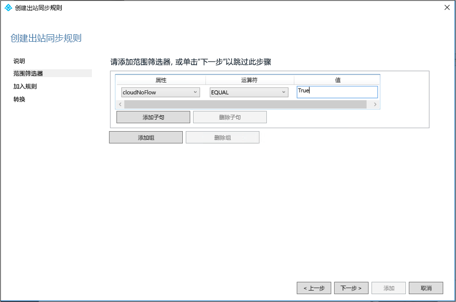 
 
 4. 在“联接规则”页上，单击“下一步”。  
 5. 在“转换”页上单击“添加”。  

需要针对所有对象类型（用户、组和联系人）遵循相同的步骤。

## 安装 Azure AD Connect 预配代理
1. 以企业管理员权限登录到要使用的服务器。  如果使用的是[基本 AD 和 Azure 环境](tutorial-basic-ad-azure.md)教程，则该服务器是 CP1。
2. 在[此处](https://go.microsoft.com/fwlink/?linkid=2109037)下载 Azure AD Connect 云预配代理。
3. 运行 Azure AD Connect 云预配 (AADConnectProvisioningAgent.Installer)
3. 在初始屏幕上**接受**许可条款，然后单击“安装”。  
 

4. 此操作完成后，将启动配置向导。  使用 Azure AD 全局管理员帐户登录。
5. 在“连接 Active Directory”屏幕上单击“添加目录”，然后使用 Active Directory 管理员帐户登录。    此操作将添加本地目录。  单击“下一步”。  
 

6. 在“配置完成”屏幕上，单击“确认”。    此操作将注册并重启代理。 
 

7. 完成此操作后，应会看到通知“已成功验证”。   可以单击“退出”。  
 
8. 如果仍然显示了初始屏幕，请单击“关闭”。 

## 验证代理安装
代理验证是在 Azure 门户中以及在运行该代理的本地服务器上进行的。

### Azure 门户代理验证
若要验证 Azure 是否能够识别到代理，请执行以下步骤：

1. 登录到 Azure 门户。
2. 在左侧选择“Azure Active Directory”，单击“Azure AD Connect”，然后在中心位置选择“管理预配(预览版)”。    
 

3.  在“Azure AD 预配(预览版)”屏幕上，单击“查看所有代理”。  
 
 
4. 在**本地预配代理屏幕上**，将看到已安装的代理。  验证相关的代理是否在该屏幕上，并且标记为“已禁用”。   该代理默认已禁用  

### 在本地服务器上
若要验证代理是否正在运行，请执行以下步骤：

1.  使用管理员帐户登录到服务器
2.  导航到“服务”或者转到“开始”>“运行”并输入 Services.msc，打开“服务”。 
3.  确保“Microsoft Azure AD Connect Agent Updater”和“Microsoft Azure AD Connect Provisioning Agent”包含在“服务”中，并且其状态为“正在运行”。    

## 配置 Azure AD Connect 云预配
使用以下步骤配置预配：

 1. 登录到 Azure AD 门户。
 2. 单击“Azure Active Directory” 
 3. 单击“Azure AD Connect” 
 4. 选择“管理预配(预览版)”  
  
 5.  单击“新建配置”  
  
 6.  在配置屏幕上输入一条**通知电子邮件**，将选择器切换到“启用”，然后单击“保存”。  
  
 7. 在“配置”下选择“所有用户”，以更改配置规则的范围。  
 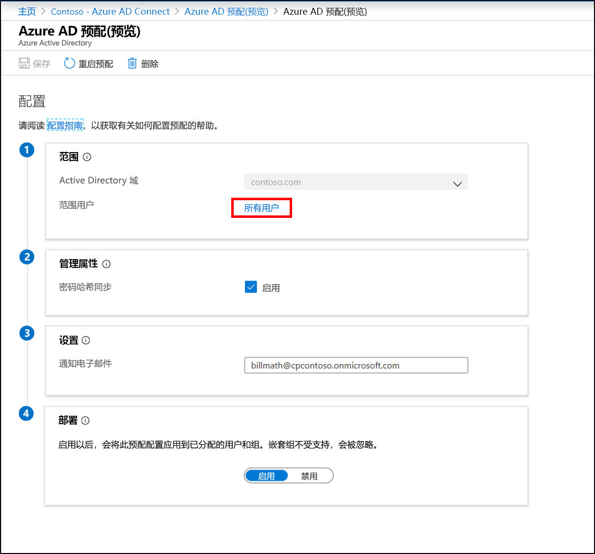 
 8. 在右侧，将范围更改为包括刚刚创建的特定 OU“OU=CPUsers,DC=contoso,DC=com”。
 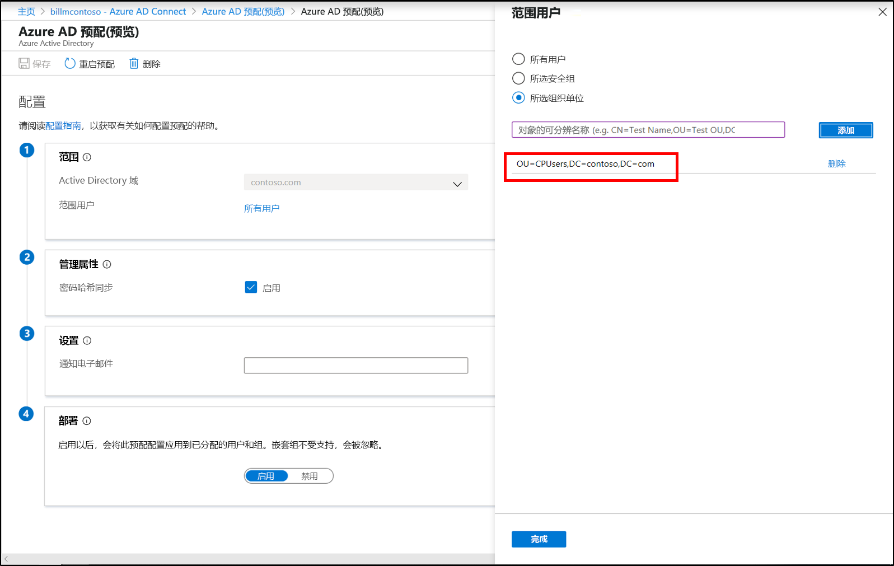 
 9.  依次单击“完成”、“保存”。  
 10. 现在，范围应设置为一个组织单位。 
 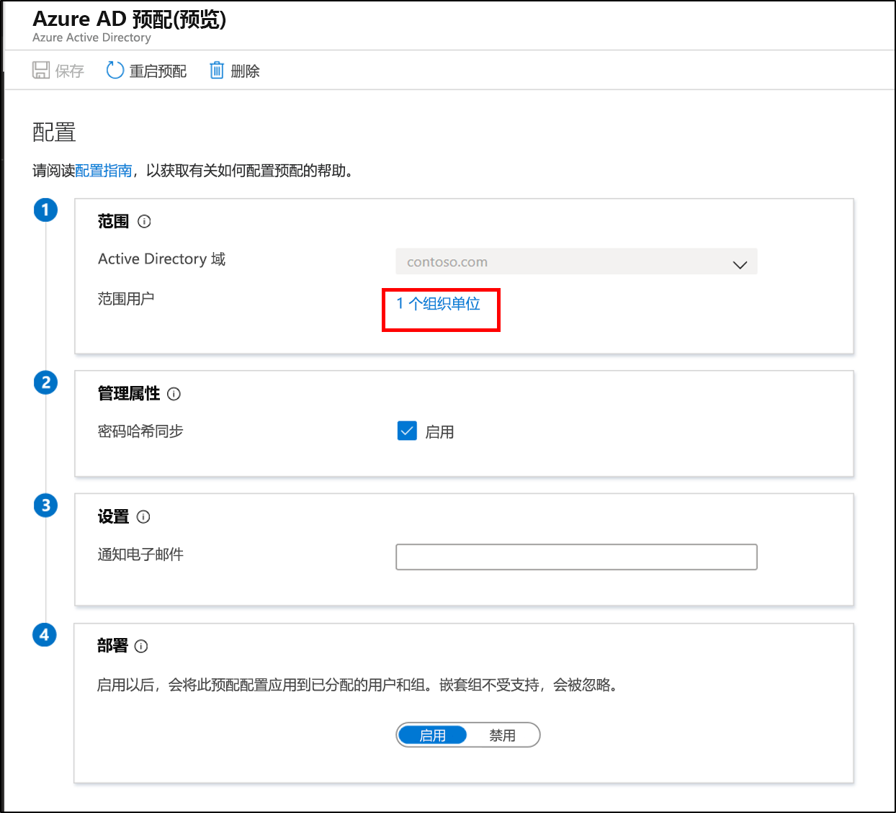 
 

## 验证云预配是否预配用户
现在验证本地目录中的用户是否已同步并在 Azure AD 租户中存在。  请注意，这可能需要几个小时才能完成。  若要验证云预配是否预配用户，请执行以下步骤：

1. 浏览到 [Azure 门户](https://portal.azure.com)，使用具有 Azure 订阅的帐户登录。
2. 在左侧选择“Azure Active Directory” 
3. 单击“Azure AD Connect” 
4. 单击“管理预配(预览版)” 
5. 单击“日志”按钮 
6. 搜索某个用户名，确认云预配是否预配了相应的用户

此外，可以验证相应的用户和组是否在 Azure AD 中存在。

## 启动计划程序
Azure AD Connect sync 使用计划程序同步本地目录中发生的更改。 修改规则后，接下来可以重启计划程序。  请使用以下步骤：

1.  在运行 Azure AD Connect sync 的服务器上，使用管理特权打开 PowerShell
2.  运行 `Set-ADSyncScheduler -SyncCycleEnabled $true`。
3.  运行 `Start-ADSyncSyncCycle`。  按 Enter。  

>[!NOTE] 
>如果你正在针对 AAD Connect sync 运行自己的自定义计划程序，请启用该计划程序。 

## 出现问题
如果试运行不按预期工作，可遵循以下步骤返回到 Azure AD Connect sync 设置：
1.  在 Azure 门户中禁用预配配置。 
2.  使用同步规则编辑器工具禁用为云预配创建的所有自定义同步规则。 禁用后，应会在所有连接器上执行完全同步。

## 配置 Azure AD Connect sync 以排除试运行 OU
验证试运行 OU 中的用户已由云预配成功管理后，可以重新配置 Azure AD Connect，以排除前面创建的试运行 OU。  云预配代理今后将处理这些用户的同步。  使用以下步骤来限定 Azure AD Connect 的范围。

 1. 在运行 Azure AD Connect 的服务器上，双击“Azure AD Connect”图标。
 2. 单击“配置”。 
 3. 选择“自定义同步选项”，然后单击“下一步”。 
 4. 登录到 Azure AD 并单击“下一步”。 
 5. 在“连接目录”屏幕上，单击“下一步”。  
 6. 在“域和 OU 筛选”屏幕上，选择“同步选定的域和 OU”。  
 7. 展开自己的域，**取消选择**“CPUsers”OU。   单击“下一步”。 
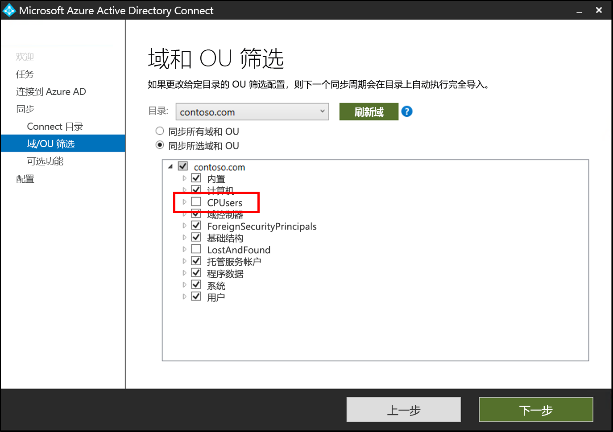 
 9. 在“可选功能”屏幕上单击“下一步”。  
 10. 在“准备好配置”  屏幕上，单击“配置”  。
 11. 完成该操作后，单击“退出”。  

## 后续步骤 

- [什么是预配？](what-is-provisioning.md)
- [什么是 Azure AD Connect 云预配？](what-is-cloud-provisioning.md)

