# 教程：将单个林与单个 Azure AD 租户集成

本教程演示如何使用 Azure Active Directory （Azure AD）连接云预配创建混合标识环境。

你可以使用在本教程中创建的环境进行测试，或更熟悉云设置。

## 必备组件
### 在 Azure Active Directory 管理中心中

1. 在 Azure AD 租户中创建仅限云的全局管理员帐户。 这样一来，就可以在本地服务出现故障或不可用时管理租户的配置。 了解如何[添加仅限云的全局管理员帐户](../active-directory-users-create-azure-portal.md)。 完成此步骤至关重要，可确保自己不被锁定在租户外部。
2. 在 Azure AD 租户中添加一个或多个[自定义域名](../active-directory-domains-add-azure-portal.md)。 用户可以使用其中一个域名登录。

### 在本地环境中

1. 标识已加入域且运行 Windows Server 2012 R2 或更高版本且至少具有 4 GB RAM 和 .NET 4.7.1 + 运行时的主机服务器 

2. 如果服务器和 Azure AD 之间存在防火墙，请配置以下项：
   - 确保代理可以通过以下端口发出到 Azure AD 的*出站*请求：

     | 端口号 | 用途 |
     | --- | --- |
     | **80** | 下载证书吊销列表 (Crl) 的同时验证 SSL 证书 |
     | **443** | 处理与服务的所有出站通信 |
     | **8080**（可选） | 如果443端口8080不可用，代理将通过端口每10分钟报告其状态。 此状态显示在 Azure AD 门户上。 用户登录不会使用端口 8080。 |
     
     如果防火墙根据原始用户强制实施规则，请打开这些端口以允许来自作为网络服务运行的 Windows 服务的流量。
   - 如果你的防火墙或代理允许你指定安全后缀，则将连接 t 添加到 **\*msappproxy.net**和 **\*。** 否则，请允许访问每周更新的 [Azure 数据中心 IP 范围](https://www.microsoft.com/download/details.aspx?id=41653)。
   - 代理需要访问**login.windows.net**和**login.microsoftonline.com** ，以便进行初始注册。 另外，还请为这些 URL 打开防火墙。
   - 对于证书验证，请取消阻止以下 Url： **mscrl.microsoft.com:80**、 **crl.microsoft.com:80**、 **ocsp.msocsp.com:80**和**www\.microsoft.com:80**。 由于这些 URL 与其他 Microsoft 产品一起用于证书验证，因此可能已取消阻止这些 URL。

## 安装 Azure AD Connect 预配代理
1. 登录到已加入域的服务器。  如果你使用的是 "[基本 AD 和 Azure 环境](tutorial-basic-ad-azure.md)" 教程，则应为 DC1。
2. 使用仅限云的全局管理员凭据登录到 Azure 门户。
3. 在左侧选择 " **Azure Active Directory**"，单击 " **Azure AD Connect**"，然后在中心选择 "**管理预配（预览版）** "。

   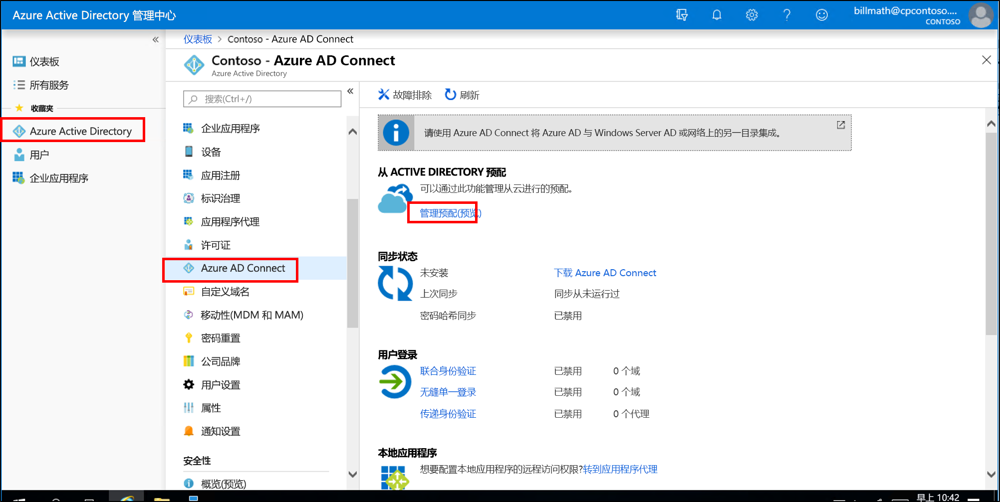

4. 单击 "**下载代理**"。
5. 运行 Azure AD Connect 设置代理。
6. 在初始屏幕上，**接受**许可条款，然后单击 "**安装**"。

   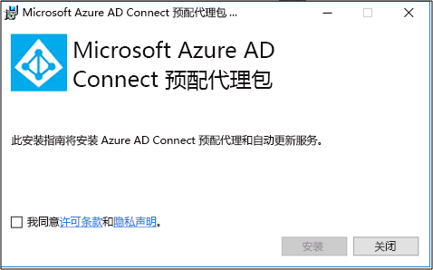

7. 此操作完成后，将启动配置向导。  用 Azure AD 全局管理员帐户登录。  请注意，如果启用了 IE 增强安全性，则会阻止登录。  如果是这种情况，请关闭安装，在服务器管理器中禁用 IE 增强安全性，然后单击 " **AAD 连接设置代理向导**" 以重新启动安装。
8. 在 "**连接 Active Directory** " 屏幕上，单击 "**添加目录**"，然后用 Active Directory 域管理员帐户登录。  注意：域管理员帐户不应具有密码更改要求。 如果密码过期或发生更改，则需要用新凭据重新配置代理。 此操作将添加你的本地目录。  单击“下一步”。

   

9. 在 "**配置完成**" 屏幕上，单击 "**确认**"。  此操作将注册并重新启动代理。

   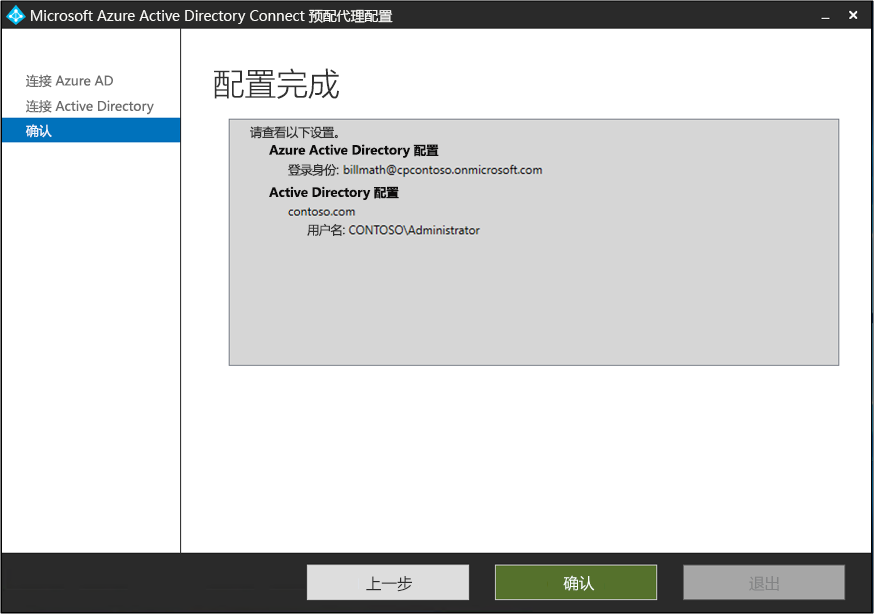

10. 完成此操作后，你会看到一个通知：**已成功验证你的代理配置。**  可单击 "**退出**"。 
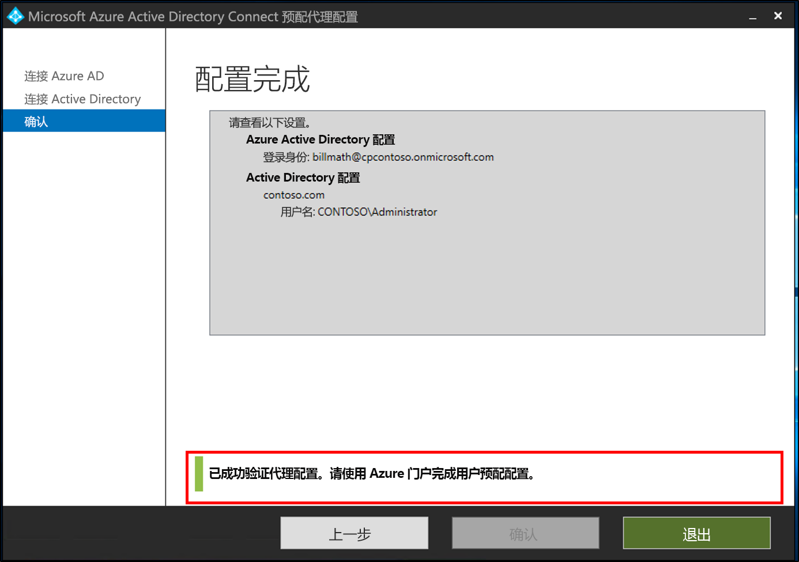 
11. 如果仍看到初始初始屏幕，请单击 "**关闭**"。

## 验证代理安装
代理验证在 Azure 门户和运行代理的本地服务器上进行。

### Azure 门户代理验证
若要验证 Azure 是否正在显示代理，请执行以下步骤：

1. 登录到 Azure 门户。
2. 在左侧选择 " **Azure Active Directory**"，单击 " **Azure AD Connect** "，然后在中心选择 "**管理预配（预览版）** "。 
 

3.  在 " **Azure AD 预配（预览版）** " 屏幕上，单击 "**查看所有代理**"。
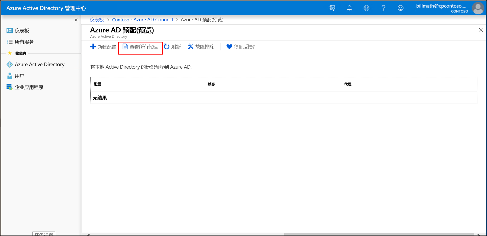 
 
4. 在 "**本地预配代理" 屏幕**上，你将看到已安装的代理。  验证相关代理是否存在并标记为 "**活动**"。
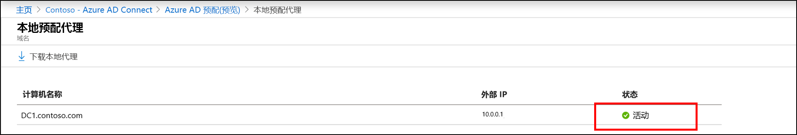 

### 在本地服务器上
若要验证代理是否正在运行，请执行以下步骤：

1.  使用管理员帐户登录到服务器
2.  通过导航到服务或转到 "开始/运行"/"服务" 打开**服务**。
3.  在 "**服务**" 下，确保**Microsoft Azure AD 连接代理更新**程序和**Microsoft Azure AD 连接设置代理**存在并且状态为 "**正在运行**"。
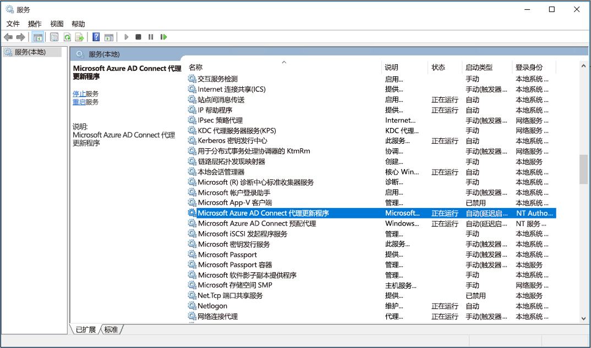

## 配置 Azure AD Connect 云预配
 使用以下步骤配置预配

1.  登录到 Azure AD 门户。
2.  单击**Azure Active Directory**
3.  单击**Azure AD Connect**
4.  选择 "**管理预配（预览版）** "

5.  单击 "**新建配置**
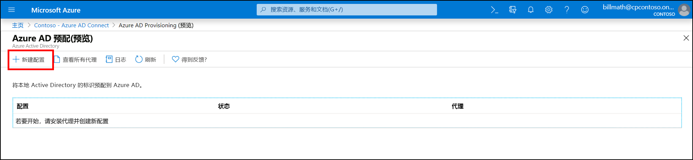
7.  在 "配置" 屏幕上，输入**通知电子邮件**，将选择器移动到 "**启用**"，然后单击 "**保存**"。
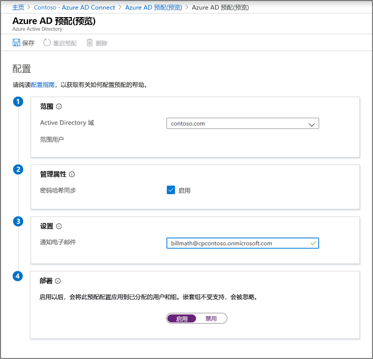
1.  现在，配置状态应为 "**正常**"。
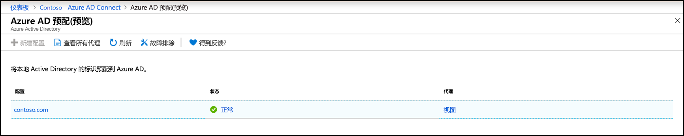

## 验证是否已创建用户并正在进行同步
现在，你将验证你在本地目录中拥有的用户是否已同步，并且现在存在于我们的 Azure AD 租户中。  请注意，这可能需要几个小时才能完成。  要验证用户是否已同步，请执行以下操作。

1. 浏览到 [Azure 门户](https://portal.azure.com)，使用具有 Azure 订阅的帐户登录。
2. 在左侧选择“Azure Active Directory”
3. 在“管理”下，选择“用户”。
4. 验证租户中是否显示了新用户 
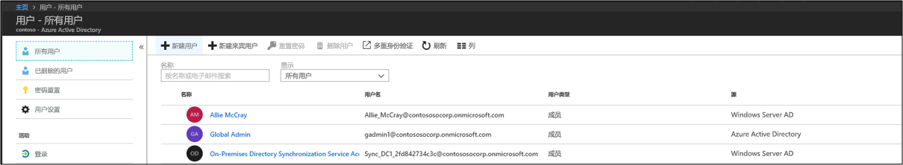 

## 使用我们的某位用户测试登录

1. 浏览到 [https://myapps.microsoft.com](https://myapps.microsoft.com)
2. 使用在我们的新租户中创建的用户帐户登录。  需要使用以下格式登录：(user@domain.onmicrosoft.com)。 使用用户用于在本地登录的相同密码。 
   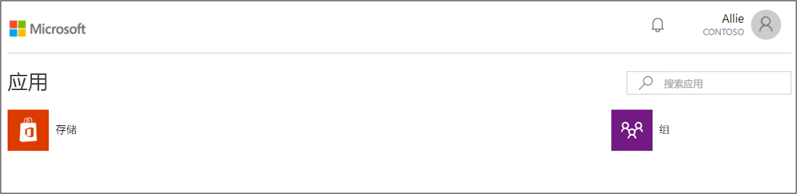 

现在已经成功设置了一个混合标识环境，可以使用它来测试和熟悉 Azure 提供的功能。

## 后续步骤 

- [什么是预配？](what-is-provisioning.md)
- [什么是 Azure AD Connect 云预配？](what-is-cloud-provisioning.md)
