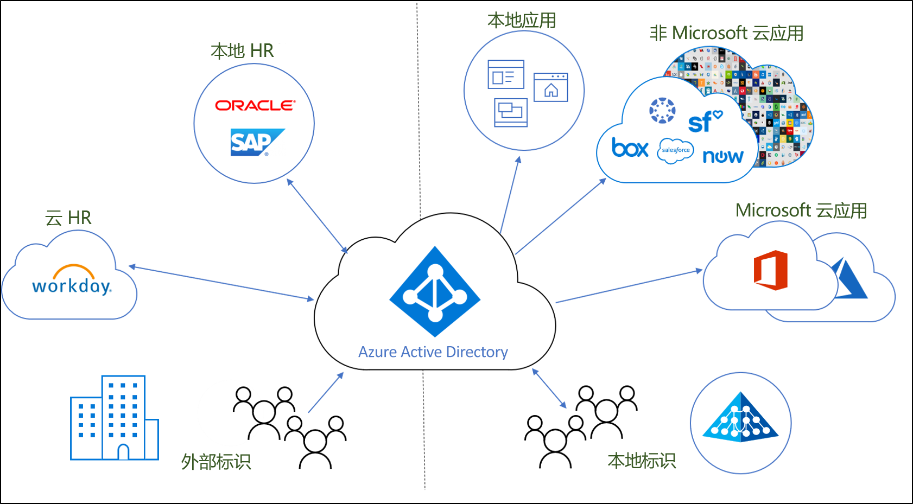
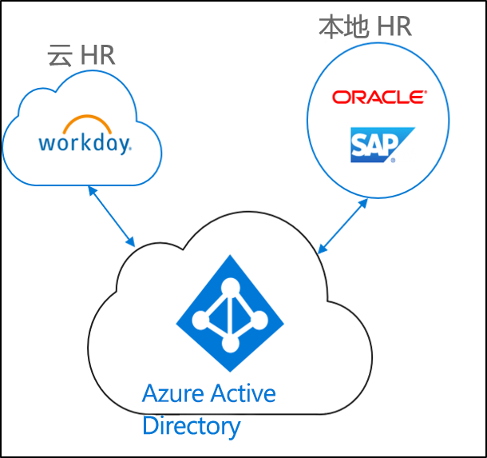
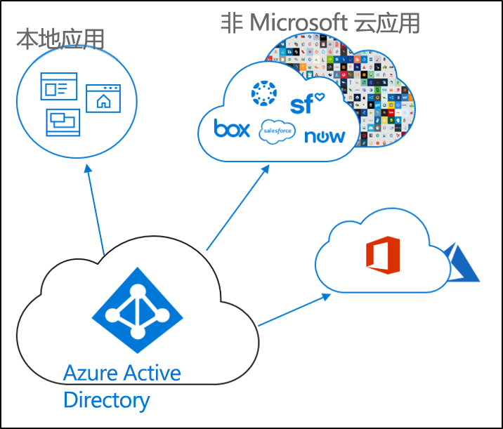

# 什么是标识预配？

如今，企业和公司越来越成为本地应用程序和云应用程序的混合体。  用户需要同时访问位于本地和云中的应用程序。 需要在这些不同的应用程序（本地和云）中使用一种标识。

预配是根据特定的条件创建对象，保持对象的最新状态，并在不再满足这些条件时删除对象的过程。 例如，当某个新用户加入组织时，会在人力资源 (HR) 系统中输入该用户。  此时，预配可以在云、Active Directory 以及用户需要访问的不同应用程序中创建相应的用户帐户。  这样，用户便可以开始工作，且在第一天就有权访问所需的应用程序和系统。 

对于 Azure Active Directory，预配可划分为以下关键场景。  

- **[HR 驱动的预配](#hr-driven-provisioning)**  
- **[应用预配](#app-provisioning)**  
- **[目录预配](#directory-provisioning)** 

## HR 驱动的预配

从 HR 到云的预配涉及到根据 HR 系统中的信息创建对象（用户、角色、组等）。  

最常见的场景是，当新员工加入公司时，将其输入到 HR 系统中。  完成该过程后，即已将此员工预配到云中。  在这种情况下，云为 Azure AD。  从 HR 进行预配可能涵盖以下场景。 

- **招聘新员工** - 将新员工添加到云 HR 后，Active Directory、Azure Active Directory、（可选）Office 365 和 Azure AD 支持的其他 SaaS 应用程序中会自动创建一个用户帐户，并将电子邮件地址写回到云 HR。
- **员工属性和个人资料更新** - 在云 HR 中更新员工记录（例如其姓名、职称或上司）后，Active Directory、Azure Active Directory、（可选）Office 365 和 Azure AD 支持的其他 SaaS 应用程序中会自动更新相应员工的用户帐户。
- **员工离职** - 当某个员工在云 HR 离职时，Active Directory、Azure Active Directory、（可选）Office 365 和 Azure AD 支持的其他 SaaS 应用程序中会自动禁用其用户帐户。
- **员工返聘** - 当云 HR 返聘某位员工时，该员工的旧帐户可自动重新激活或重新预配到 Active Directory、Azure Active Directory、Office 365 以及 Azure AD 支持的其他 SaaS 应用程序（其中，具体操作由你的偏好而定，且后两类应用可选配）。

## 应用预配

在 Azure Active Directory (Azure AD) 中，术语 **[应用预配](https://docs.microsoft.com/azure/active-directory/manage-apps/user-provisioning)** 是指在用户需要访问的云应用程序中自动创建用户标识和角色。 除了创建用户标识外，自动预配还包括在状态或角色发生更改时维护和删除用户标识。 常见方案包括将 Azure AD 用户预配到 [Dropbox](https://docs.microsoft.com/azure/active-directory/saas-apps/dropboxforbusiness-provisioning-tutorial)、[Salesforce](https://docs.microsoft.com/azure/active-directory/saas-apps/salesforce-provisioning-tutorial)、[ServiceNow](https://docs.microsoft.com/azure/active-directory/saas-apps/servicenow-provisioning-tutorial) 等应用程序中。

## 目录预配

本地预配涉及到从本地源（例如 Active Directory）预配到 Azure AD。  

最常见的场景是，将 Active Directory (AD) 中的用户预配到 Azure AD。

Azure AD Connect sync、Azure AD Connect 云预配和 Microsoft Identity Manager 已实现此功能。 
 
## 后续步骤 

- [什么是 Azure AD Connect 云预配？](what-is-cloud-provisioning.md)
- [安装云预配](how-to-install.md)
