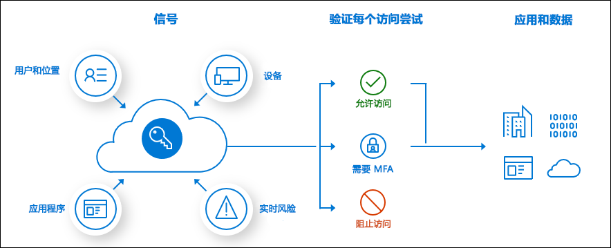

# 什么是条件访问？

新式安全外围网络现已超出组织网络的范围，其中涵盖了用户和设备标识。 在做出访问控制决策过程中，组织可以利用这些标识信号。 

Azure Active Directory 使用条件访问作为一种工具来统合信号、做出决策，以及实施组织策略。 条件访问是新的标识驱动控制平面的核心。

最简单地讲，条件访问策略是一些 if-then 语句：如果用户想要访问某个资源，则必须完成某个操作。 示例：薪资管理人员想要访问薪资应用程序，而需要执行多重身份验证才能访问。

管理员面临着两个主要目标：

- 使用户能够随时随地保持高效的工作
- 保护组织的资产

使用条件访问策略，可以在必要时应用适当的访问控制来确保组织的安全，并在不必要应用这些控制时，避免为用户造成阻碍。

完成第一因素身份验证后将强制执行条件访问策略。 在遇到拒绝服务 (DoS) 攻击等情景中，条件访问不应充当组织的第一道防线，但可以使用这些事件的信号来确定访问权限。

## 常见信号

在做出策略方面的决策时，条件访问可以考虑的常见信号包括：

- 用户或组成员身份
   - 策略可以针对特定的用户和组，并为管理员提供精细的访问控制。
- IP 定位信息
   - 组织可以创建在做出策略决策时使用的受信任 IP 地址范围。 
   - 管理员可以指定要阻止或允许的整个流量来源国家/地区的 IP 范围。
- 设备
   - 实施条件访问策略时，用户可以使用的装有特定平台或标有特定状态的设备。
- 应用程序
   - 尝试访问特定应用程序的用户可以触发不同的条件访问策略。 
- 实时风险和计算风险检测
   - 将信号与 Azure AD 标识保护相集成可让条件访问策略识别有风险的登录行为。 然后，策略可以强制用户执行密码更改或多重身份验证，以降低其风险级别，或者在管理员采取手动措施之前阻止其访问。
- Microsoft Cloud App Security (MCAS)
   - 实时监视和控制用户应用程序的访问和会话，提高云环境中执行的访问和活动的透明度与控制度。

## 常见决策

- 阻止访问
   - 最严格的决策
- 授予访问权限
   - 最不严格的决策仍可要求以下一个或多个选项：
      - 需要多重身份验证
      - 要求将设备标记为合规
      - 要求使用加入混合 Azure AD 的设备
      - 需要批准的客户端应用
      - 需要应用保护策略（预览版）

## 经常应用的策略

许多组织存在一些常见的访问考虑因素，而条件访问策略可帮助解决这些忧虑，例如：

- 要求具有管理角色的用户执行多重身份验证
- 要求在运行 Azure 管理任务时执行多重身份验证
- 阻止用户尝试使用旧式身份验证协议登录
- 要求在受信任的位置注册 Azure 多重身份验证
- 阻止或允许来自特定位置的访问
- 阻止有风险的登录行为
- 要求在组织管理的设备上使用特定的应用程序

## 许可要求

[!INCLUDE [Active Directory P1 license](../../../includes/active-directory-p1-license.md)]

拥有 [Microsoft 365 商业版许可证](https://docs.microsoft.com/office365/servicedescriptions/microsoft-365-service-descriptions/microsoft-365-business-service-description)的客户也可以访问条件访问功能。 

## 后续步骤

[条件访问策略构建方法详解](concept-conditional-access-policies.md)

若要了解如何在环境中实现条件访问，请参阅[在 Azure Active Directory 中规划条件访问部署](plan-conditional-access.md)。

[了解标识保护](../identity-protection/overview-v2.md)

[了解 Microsoft Cloud App Security](https://docs.microsoft.com/cloud-app-security/what-is-cloud-app-security)

[了解 Microsoft Intune](https://docs.microsoft.com/intune/index)