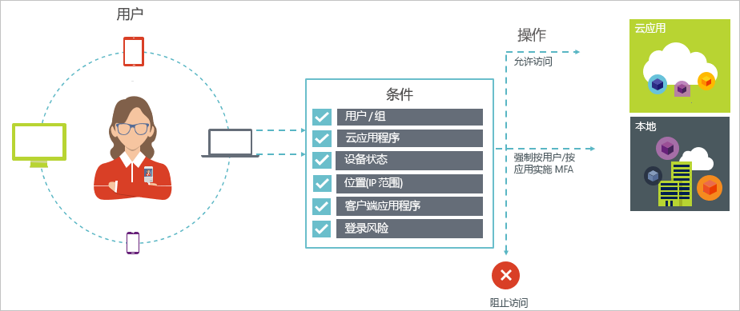

# 什么是条件访问？

安全是使用云的组织关心的头等大事。 云安全在管理云资源方面的一个重要方面是标识和访问。 在移动优先、云优先的世界，用户可以从任意位置使用各种设备和应用访问组织的资源。 因此，仅关注谁可以访问资源不再能满足需求。 为了掌握安全与效率之间的平衡，还需将资源的访问方式作为访问控制决策的考虑因素。 使用 Azure Active Directory (Azure AD) 条件访问，可以解决此需求。 条件访问是 Azure Active Directory 的一项功能。 使用条件访问，可以实现基于条件访问云应用的自动访问控制决策。

完成第一因素身份验证后将强制执行条件访问策略。 因此，条件访问并不是针对拒绝服务 (DoS) 攻击等情况的第一道防线，而是可以利用来自这些事件的信号（例如，登录风险级别、请求的位置等）来确定访问权限。  

本文从概念上概述了 Azure AD 中的条件访问。

## 常见方案

在移动优先、云优先的世界中，使用 Azure Active Directory 可以实现从任意位置单一登录到设备、应用和服务。 随着包含 BYOD 在内的设备、脱离企业网络的办公和第三方 SaaS 应用的普及，你面临着两个对立的目标：

- 使用户能够随时随地保持高效的工作
- 随时保持企业资产

通过使用条件访问策略，你可以根据所需的条件应用适当的访问控制。 Azure AD 条件访问可在需要时为你提供增强的安全性，并在不需要时毫不阻碍用户。

以下是条件访问可帮助你的部分常见访问问题：

- **[登录风险](conditions.md#sign-in-risk)** ：Azure AD 标识保护可检测登录风险。 如果检测到的登录风险指示可疑操作者，如何限制访问？ 如果想要获取更有力的证据，证明登录是由合法用户执行的，该怎么办？ 如果你十分怀疑特定的用户，以至于想要阻止其访问某个应用，该怎么办？  
- **[网络位置](location-condition.md)** ：Azure AD 可从任意位置进行访问。 如果试图从不在 IT 部门控制范围内的网络位置访问，应怎么办？ 用户名和密码的组合可能足以作为从公司网络进行访问尝试的身份证据。 如果从其他意外的国家或地区发起的访问尝试要求更有力的身份证据，应怎么办？ 如果想要阻止从某些位置发起的访问尝试，应怎么办？  
- **[设备管理](conditions.md#device-platforms)** ：在 Azure AD 中，用户可以从大量设备（包括移动设备和个人设备）访问云应用。 如果要求只能使用 IT 部门管理的设备执行访问尝试，应怎么办？ 如果要阻止特定设备类型访问环境中的云应用，应怎么办？
- **[客户端应用程序](conditions.md#client-apps)** ：现在可以使用各种应用（例如基于 Web 的应用、移动应用或桌面应用）访问许多云应用。 如果使用导致已知问题的客户端应用类型执行访问尝试，应怎么办？ 如果需要由 IT 部门管理的特定应用类型的设备，应怎么办？

这些问题和相关答案表示 Azure AD 条件访问的常见访问方案。
条件访问是 Azure Active Directory 的一项功能，使你可以使用基于策略的方法处理访问方案。

> [!VIDEO https://www.youtube.com/embed/eLAYBwjCGoA]

## 条件访问策略

条件访问策略定义了使用以下模式的访问方案：

**发生这种情况时**定义触发策略的原因。 此原因以已满足的一组条件为特征。 在 Azure AD 条件访问中，这两个指定条件扮演了特殊的角色：

- **[用户](conditions.md#users-and-groups)** ：执行访问尝试的用户（人物）  。
- **[云应用](conditions.md#cloud-apps-and-actions)** ：访问尝试的目标（事件）  。

这两个条件在条件访问策略中是必需的。 除这两个必需的条件外，还可加入介绍访问尝试执行方式的其他条件。 常见示例是使用公司网络外的移动设备或位置。 有关详细信息，请参阅 [Azure Active Directory 条件访问中的条件](conditions.md)。

条件与访问控制的组合表示一种条件访问策略。

使用 Azure AD 条件访问，可以控制授权用户访问云应用的方式。 条件访问策略的目标是根据访问尝试的执行方式对云应用的访问尝试实施附加访问控制。

使用基于策略的方法保护对云应用的访问时，可使用本文中概述的结构起草环境的策略要求，而无需担心技术实现。

## Azure AD 条件访问和联合身份验证

条件访问策略可以与[联合身份验证](../../security/azure-ad-choose-authn.md#federated-authentication)无缝地配合使用。 此支持包括所有支持的条件和控制，可以用来通过 [Azure AD 报表](../reports-monitoring/concept-sign-ins.md)了解策略是如何应用到活动用户登录的。

*使用 Azure AD 进行的联合身份验证*是指由受信任的身份验证服务处理用户通过 Azure AD 进行的身份验证。 举例来说，受信任的身份验证服务是指 Active Directory 联合身份验证服务 (AD FS) 或任何其他的联合身份验证服务。 在此配置中，主用户身份验证会在服务中执行，然后会使用 Azure AD 登录到各个应用程序中。 在将访问权限授予用户访问的应用程序之前，会应用 Azure AD 条件访问。 

当配置的条件访问策略要求多重身份验证时，Azure AD 会默认设置为使用 Azure MFA。 如果使用联合身份验证服务进行 MFA，则可对 Azure AD 进行配置，以便在需要 MFA 时重定向到联合身份验证服务，方法是在 [PowerShell](https://docs.microsoft.com/powershell/module/msonline/set-msoldomainfederationsettings) 中将 `-SupportsMFA` 设置为 `$true`。 此设置适用的联合身份验证服务支持由 Azure AD 通过 `wauth= http://schemas.microsoft.com/claims/multipleauthn` 发出的 MFA 质询请求。

在用户登录到联合身份验证服务以后，Azure AD 会处理其他策略要求，例如设备符合性或批准的应用程序。

## 许可要求

[!INCLUDE [Active Directory P1 license](../../../includes/active-directory-p1-license.md)]

拥有 [Microsoft 365 商业版许可证](https://docs.microsoft.com/office365/servicedescriptions/microsoft-365-service-descriptions/microsoft-365-business-service-description)的客户也可以访问条件访问功能。 

## 后续步骤

若要了解如何在环境中实现条件访问，请参阅[在 Azure Active Directory 中规划条件访问部署](plan-conditional-access.md)。
