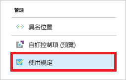
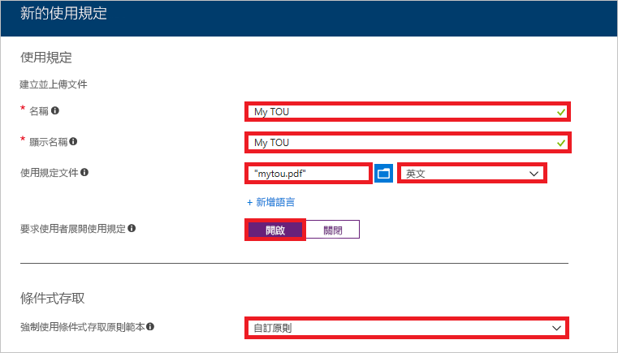
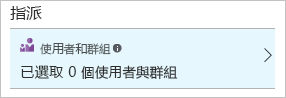
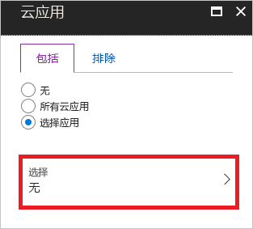
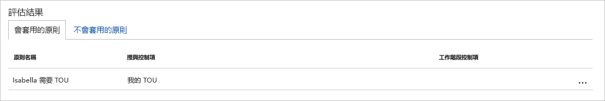
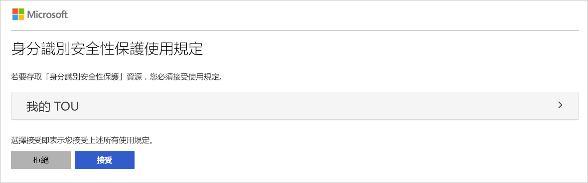
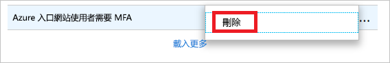

# 快速入门：在访问云应用之前要求接受使用条款

在访问前环境中的特定云应用中，你可能希望以接受使用条款 (ToU) 的形式获取用户的同意。 Azure Active Directory (Azure AD) 条件访问提供：

- 一种简单方法用于配置 ToU
- 通过条件访问策略要求接受使用条款的选项  

本快速入门介绍如何配置一个 [Azure AD 条件访问策略](../active-directory-conditional-access-azure-portal.md)，要求用户在访问环境中的选定云应用之前接受 ToU。

如果没有 Azure 订阅，请在开始之前创建一个[免费帐户](https://azure.microsoft.com/free/?WT.mc_id=A261C142F)。

## 必备条件

若要完成本快速入门中的方案，你需要：

- **对 Azure AD Premium 版本的访问权限**：Azure AD 条件访问是一项 Azure AD Premium 功能。
- **名为 Isabella Simonsen 的测试帐户**：如果不知道如何创建测试帐户，请参阅[添加基于云的用户](../fundamentals/add-users-azure-active-directory.md#add-a-new-user)。

## 测试登录

此步骤的目标是在没有条件访问策略的情况下获得登录体验的印象。

**测试登录：**

1. 以 Isabella Simonsen 身份登录到 [Azure 门户](https://portal.azure.com/)。
1. 注销。

## 创建使用条款

本部分提供创建示例 ToU 的步骤。 创建 ToU 时，请选择“强制实施条件访问策略模板”的值。  创建 ToU 之后，选择“自定义策略”会随即打开一个对话框，可在其中创建新的条件访问策略。 

**创建使用条款：**

1. 在 Microsoft Word 中创建一个新文档。
1. 键入“我的使用条款”，然后在计算机上将此文档保存为 **mytou.pdf**。
1. 以全局管理员、安全管理员或条件访问管理员的身份登录到 [Azure 门户](https://portal.azure.com)。
1. 在 Azure 门户的左侧导航栏中，单击“Azure Active Directory”。 

   

1. 在“Azure Active Directory”  页的“安全性”  部分中，单击“条件访问”  。

   

1. 在“管理”部分，单击“使用条款”。  

   

1. 在顶部菜单中，单击“新建项”  。

   

1. 在“新建使用条款”页上： 

   

   1. 在“名称”  文本框中，键入“我的 TOU”。 
   1. 在“显示名称”  文本框中，键入“我的 TOU”  。
   1. 上传使用条款 PDF 文件。
   1. 对于“语言”，请选择“英语”。  
   1. 对于“要求用户展开使用条款”，请选择“打开”。  
   1. 对于“强制实施条件访问策略模板”，请选择“自定义策略”。  
   1. 单击“创建”。 

## 创建条件访问策略

此部分介绍如何创建所需的条件访问策略。 本快速入门中的方案使用：

- Azure 门户作为需要接受 ToU 的云应用的占位符。 
- 示例用户来测试条件访问策略。  

在策略中，设置：

| 设置 | 值 |
| --- | --- |
| 用户和组 | Isabella Simonsen |
| 云应用 | Microsoft Azure 管理 |
| 授予访问权限 | 我的 TOU |

**若要配置条件访问策略，请执行以下操作：**

1. 在“新建”页上的“名称”文本框中，键入“要求 Isabella 接受 TOU”。   

   

1. 在“分配”部分中，单击“用户和组”。  

   

1. 在“用户和组”页上： 

   

   1. 单击“选择用户和组”，然后选择“用户和组”   。
   1. 单击“选择”  。
   1. 在“选择”页上，选择“Isabella Simonsen”，然后单击“选择”    。
   1. 在“用户和组”页，单击“完成”   。
1. 单击“云应用”  。

   

1. 在“云应用”页上： 

   

   1. 单击“选择应用”。 
   1. 单击“选择”  。
   1. 在“选择”页上，选择“Microsoft Azure 管理”，然后单击“选择”    。
   1. 在“云应用”页上，单击“完成”。  
1. 在“访问控制”部分中，单击“授予”。  

   

1. 在“授予”页上： 

   

   1. 选择“授予访问权限”  。
   1. 选择“我的 TOU”  。
   1. 单击“选择”  。
1. 在“启用策略”部分中，单击“开”   。

   

1. 单击“创建”。 

## 评估模拟登录

你已经配置了条件访问策略，现在可能想知道它是否按预期工作。 第一步，使用条件访问 what if 策略工具模拟测试用户登录。 该模拟会估计此登录对策略的影响并生成模拟报表。  

若要初始化 **What If** 策略评估工具，请设置：

- **Isabella Simonsen** 作为用户
- **Microsoft Azure 管理**作为云应用

单击“What If”会创建一个模拟报告，该报告  ：

- “要应用的策略”下面的“要求 Isabella 接受 TOU”  
- 用作“授权控制措施”的“我的 TOU”。  

**若要评估条件访问策略，请执行以下操作：**

1. 在[条件访问 - 策略](https://portal.azure.com/#blade/Microsoft_AAD_IAM/ConditionalAccessBlade/Policies)页上，单击顶部菜单中的“What If”。   

   

1. 单击“用户”，选择“Isabella Simonsen”，然后单击“选择”    。

   

1. 选择云应用：

   

   1. 单击“云应用”  。
   1. 在“云应用”页上，单击“选择应用”   。
   1. 单击“选择”  。
   1. 在“选择”页上，选择“Microsoft Azure 管理”，然后单击“选择”    。
   1. 在“云应用”页上，单击“完成”  。
1. 单击“What If”  。

## 测试条件访问策略

在上一部分中，你已经了解如何评估模拟登录。 除了模拟之外，还应该测试条件访问策略，以确保其按预期工作。

若要测试策略，请尝试使用 **Isabella Simonsen** 测试帐户登录 [Azure 门户](https://portal.azure.com)。 此时应会出现一个要求接受使用条款的对话框。

## 清理资源

不再需要测试用户和条件访问策略时，请将其删除：

- 如果不知道如何删除 Azure AD 用户，请参阅[从 Azure AD 中删除用户](../fundamentals/add-users-azure-active-directory.md#delete-a-user)。
- 若要删除策略，请选择该策略，然后在快速访问工具栏中单击“删除”  。

    

- 若要删除使用条款，请将其选中，然后单击顶部工具栏中的“删除条款”。 

    

## 后续步骤

> [!div class="nextstepaction"]
> [要求针对特定的应用执行 MFA](app-based-mfa.md)
> [检测到会话风险时阻止访问](app-sign-in-risk.md)
