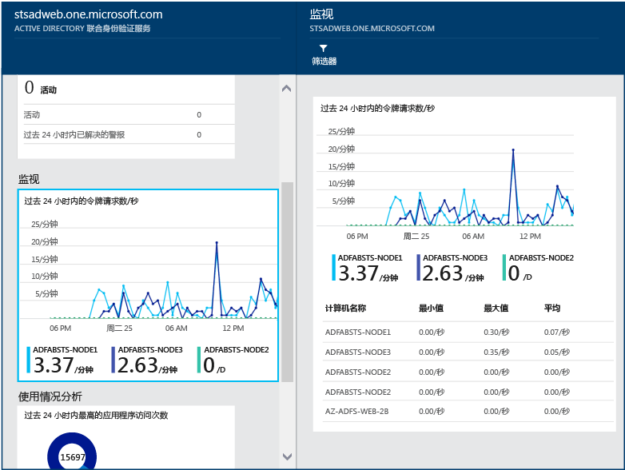

# 使用 Azure AD Connect Health 监视 AD FS
以下文档专门介绍如何使用 Azure AD Connect Health 来监视 AD FS 基础结构。 有关使用 Azure AD Connect Health 监视 Azure AD Connect（同步）的信息，请参阅 [使用用于同步的 Azure AD Connect Health](active-directory-aadconnect-health-sync.md)。此外，有关使用 Azure AD Connect Health 监视 Active Directory 域服务的信息，请参阅 [在 AD DS 中使用 Azure AD Connect Health](active-directory-aadconnect-health-adds.md)。

## AD FS 的警报
Azure AD Connect Health 警报部分将提供活动警报列表。 每个警报均包含相关信息、解决方法步骤和相关文档的链接。

可以双击某个活动的警报或已解决的警报打开新的边栏选项卡，其中包含附加信息、解决警报的步骤，以及相关文档的链接。 还可以查看过去已解决警报的相关历史数据。

## AD FS 的使用情况分析
Azure AD Connect Health 使用情况分析可分析联合服务器的身份验证流量。 可以双击使用情况分析框打开使用情况分析边栏选项卡，显示多个指标和分组。

> [!NOTE]
> 要将使用情况分析与 AD FS 结合使用，请务必启用 AD FS 审核。 有关详细信息，请参阅 [为 AD FS 启用审核](active-directory-aadconnect-health-agent-install.md#enable-auditing-for-ad-fs)。
>
>

若要选择其他指标、指定时间范围或更改分组，请右键单击使用情况分析图表并选择“编辑图表”。 然后可以指定时间范围、选择不同的指标以及更改分组。 可以查看基于不同“度量值”的身份验证流量分布，并使用以下部分中所述的相关“分组依据”参数对每个度量值进行分组:

**度量值：请求总数** - 由 AD FS 服务器处理的请求总数。

|分组依据 | 分组意味着什么，它为什么很有用？ |
| --- | --- |
| 全部 | 显示所有 AD FS 服务器处理的请求总数的计数。|
| Application | 基于目标信赖方对请求总数分组。 此分组有助于了解具体某个应用程序正在接收多少百分比的总流量。 |
|  服务器 |基于处理请求的服务器对请求总数分组。 此分组有助于了解总流量的负载分布。
| 工作区加入 |基于请求是否来自已加入工作区（已知）的设备对请求总数分组。 此分组有助于了解是否使用标识基础结构未知的设备来访问资源。 |
|  身份验证方法 | 基于用于身份验证的身份验证方法对请求总数分组。 此分组有助于了解用于身份验证的常见身份验证方法。 可能的身份验证方法如下所示： <ol> <li>Windows 集成身份验证 (Windows)</li> <li>基于窗体的身份验证（窗体）</li> <li>SSO（单一登录）</li> <li>X509 证书身份验证（证书）</li>  如果联合服务器接收带有 SSO Cookie 的请求，则该请求被计为 SSO（单一登录）。 在这种情况下，如果此 cookie 有效，则不会要求用户提供凭据并该用户可无缝访问该应用程序。 如果有多个受联合服务器保护的信赖方，则这种行为很常见。 |
| 网络位置 | 基于用户的网络位置对请求总数分组。 该位置可以是 Intranet 或 Extranet。 此分组有助于了解来自 Intranet 或 Extranet 的流量分别为多少百分比。 |

**度量值：失败请求总数** - 失败了的由联合身份验证服务处理的请求总数。 （此度量值仅在 Windows Server 2012 R2 的 AD FS 上可用）

|分组依据 | 分组意味着什么，它为什么很有用？ |
| --- | --- |
| 错误类型 | 基于预定义错误类型显示错误数。 此分组有助于了解常见类型的错误。 <ul><li>用户名或密码错误：因用户名或密码不正确而导致的错误。</li> <li>“Extranet 锁定”：收到无法访问 Extranet 的用户的请求而导致的失败 </li><li> “密码过期”：用户使用已过期密码登录而导致的失败。</li><li>“帐户已禁用”：用户使用已禁用的帐户登录导致的失败。</li><li>“设备身份验证”：用户无法使用“设备身份验证”进行身份验证导致的失败。</li><li>“用户证书身份验证”：用户因证书无效而无法进行身份验证而导致的失败。</li><li>“MFA”：用户无法使用“多重身份验证”进行身份验证导致的失败。</li><li>“其他凭据”：“颁发授权”：因授权失败而失败。</li><li>“颁发委托”：颁发委托错误导致的失败。</li><li>“令牌接受”：由于 ADFS 拒绝来自第三方标识提供者的令牌而导致的失败。</li><li>“协议”：因协议错误而失败。</li><li>“未知”：全部捕获。 任何其他不属于定义类别的失败。</li> |
| 服务器 | 基于服务器对错误分组。 这种分组有助于了解各服务器的错误分布情况。 分布不均匀可能表示服务器处于错误状态。 |
| 网络位置 | 基于请求的网络位置（Intranet 或 Extranet）对错误分组。 这种分组有助于了解失败的请求类型。 |
|  Application | 基于目标应用程序（信赖方）对失败分组。 这种分组有助于了解错误数最多的目标应用程序。 |

**度量值：用户计数** - 使用 AD FS 主动进行身份验证的独立用户平均数

|分组依据 | 分组意味着什么，它为什么很有用？ |
| --- | --- |
|全部 |此指标提供所选时间段内使用联合身份验证服务的用户平均数。 不对用户进行分组。  平均值取决于所选的时间段。 |
| Application |基于目标应用程序（信赖方）对用户平均数分组。 这种分组有助于了解使用具体某个应用程序的用户数量。 |

## AD FS 的性能监视
Azure AD Connect Health 性能监视提供有关度量值的监视信息。 选择“监视”框会打开一个边栏选项卡，其中包含有关指标的详细信息。

通过选择边栏选项卡顶部的“筛选器”选项，可以按服务器进行筛选，以查看单个服务器的度量值。 要更改度量值，请右键单击监视边栏选项卡下的监视图表，并选择“编辑图表”（或选择“编辑图表”按钮）。 在打开的新边栏选项卡中，可从下拉列表中选择其他度量值，并指定查看性能数据的时间范围。

## 用户名/密码登录失败的前 50 个用户
AD FS 服务器上身份验证请求失败的常见原因之一就是请求所提供的凭据无效，也就是错误的用户名或密码。 这往往是用户的密码太复杂、忘记密码或打错字。

但也有其他原因导致 AD FS 服务器处理的请求数超过预期，例如：某个应用程序缓存了用户凭据、凭据过期，或者某个恶意用户尝试以一系列的常见密码登录到帐户。 这两个示例都是可能导致请求激增的合理原因。

Azure AD Connect Health for ADFS 提供一份报告，内容有关因为用户名或密码无效而登录尝试失败的前 50 个用户。 处理场中所有 AD FS 服务器所生成的审核事件即可完成此报告。

可以在这份报告中轻松获取以下信息：

* 过去 30 天内用户名/密码错误的失败请求总数
* 每天由于用户名/密码不正确而登录失败的平均用户人数。

单击此部分可转到提供其他详细信息的主要报告边栏选项卡。 此边栏选项卡包含一个提供趋势信息的图形，可帮助建立有关用户名或密码错误的请求的基准。 此外，该边栏选项卡还提供在过去一周尝试失败次数最多的 50 个用户的列表。 请注意，可以通过过去一周前 50 个用户的情况来确定错误密码尝试的峰值。  

该图形提供以下信息：

* 每天由于用户名/密码不正确而登录失败的总数。
* 每天登录失败的唯一用户总数。
* 最后一个请求的客户端 IP 地址

该报告提供以下信息：

| 报告项 | 说明 |
| --- | --- |
| 用户 ID |显示使用的用户 ID。 此值是用户键入的内容，在某些情况下是使用的错误用户 ID。 |
| 失败尝试次数 |显示该特定用户 ID 的尝试失败总次数。 该表已按最多失败尝试次数的降序排序。 |
| 上次失败时间 |显示上次发生失败时的时间戳。 |
| 上次失败 IP |显示最后一个错误请求中的客户端 IP 地址。 |

> [!NOTE]
> 此报告每隔 12 小时以该段时间内收集的新信息自动进行更新。 因此，报告中不包括过去 12 小时内的登录尝试。
>
>

## 有风险的 IP 报表 
AD FS 客户可以将密码身份验证终结点公开给 Internet，以便为最终用户提供身份验证服务，方便他们访问 Office 365 之类的 SaaS 应用程序。 在这种情况下，恶意参与者可能会尝试登录 AD FS 系统，用猜测最终用户密码的方式获得应用程序资源的访问权限。 AD FS 提供 Extranet 帐户锁定功能，可以防止这些类型的攻击，自 AD FS 出现在 Windows Server 2012 R2 中以后就是这样。 如果所用版本较低，强烈建议将 AD FS 系统升级到 Windows Server 2016。  
另外，单个 IP 地址可能会尝试针对多个用户进行多次登录。 在这些情况下，每个用户的尝试次数必须在 AD FS 中的帐户锁定保护阈值以下。 Azure AD Connect Health 现在提供“风险 IP 报表”来检测这种情况，并在发生这种情况时通知管理员。 下面是此报表的主要优点： 
- 检测超出基于密码的登录失败次数阈值的 IP 地址
- 支持在密码错误或出现 Extranet 状态为锁定的情况下，强制登录失败
- 使用可自定义的电子邮件设置，在发生这种情况时通过电子邮件通知来提醒管理员
- 阈值设置可以自定义，因此可以与组织的安全策略相匹配
- 报表可以下载，适合进行脱机分析，并可通过自动化操作与其他系统集成

> [!NOTE]
> 若要使用此报表，请务必启用 AD FS 审核。 有关详细信息，请参阅 [为 AD FS 启用审核](active-directory-aadconnect-health-agent-install.md#enable-auditing-for-ad-fs)。  
> 若要访问预览版，需要提供全局管理员或[安全读者](https://docs.microsoft.com/azure/active-directory/role-based-access-built-in-roles#security-reader)权限。  
> 

### 报表内容
“风险 IP”报表中的每个项目都会显示有关失败的 AD FS 登录活动（失败次数超出指定阈值）的聚合信息。 它提供以下信息：

| 报告项 | 说明 |
| ------- | ----------- |
| 时间戳 | 当检测时间窗口启动时，显示基于 Azure 门户本地时间的时间戳。  所有每日事件都在 UTC 时间的午夜生成。  每小时事件的时间戳舍入为整点。 可以在已导出文件的“firstAuditTimestamp”中找到第一个活动开始时间。 |
| 触发器类型 | 显示检测时间窗口的类型。 聚合触发器类型为每小时或每日。 这适用于检测高频暴力破解攻击，与之相反的是慢速攻击，后者在一天中的尝试攻击行动是分散的。 |
| IP 地址 | 密码错误或者 Extranet 登录活动处于锁定状态的单一风险 IP 地址。 该地址可能是 IPv4 或 IPv6 地址。 |
| “密码不正确”错误计数 | 在检测时间窗口期间的 IP 地址中发生“密码不正确”错误的计数。 某些用户的“密码不正确”错误可能发生多次。 请注意，这不包括因密码过期而尝试失败的情况。 |
| Extranet 锁定错误计数 | 在检测时间窗口期间的 IP 地址中发生“Extranet 锁定”错误的计数。 某些用户的“Extranet 锁定”错误可能发生多次。 仅当在 AD FS（2012R2 或更高版本）中配置 Extranet 锁定的情况下，才会出现这种错误。 <b>注意</b> 强烈建议在允许使用密码进行 Extranet 登录的情况下启用此功能。 |
| 已尝试的唯一用户 | 在检测时间窗口期间的 IP 地址中进行了尝试的唯一用户的计数。 这样就提供了一种机制，用于区分单用户攻击模式和多用户攻击模式。  |

例如，下面的报表项表明，在 2018/02/28 下午 6 点到 7 点这段时间，IP 地址 <i>104.2XX.2XX.9</i> 没有出现“密码不正确”错误，但出现 284 次“Extranet 锁定”错误。 符合条件的 14 个唯一用户受影响。 活动事件超出指定的报表小时阈值。 

> [!NOTE]
> - 只有那些超出指定阈值的活动才会显示在报表列表中。 
> - 此报表最多可回溯 30 天。
> - 此警报报表不显示 Exchange IP 地址或专用 IP 地址。 它们仍包括在导出列表中。 
>

### 下载“风险 IP”报表
使用**下载**功能，可以将过去 30 天的整个风险 IP 地址列表从 Connect Health 门户导出 导出结果将包括每个检测时段所有失败的 AD FS 登录活动，因此可以在导出后自定义筛选功能。 除了门户中突出显示的聚合，导出结果还显示有关已失败登录活动（按 IP 地址划分）的更多详细信息：

|  报告项  |  说明  | 
| ------- | ----------- | 
| firstAuditTimestamp | 显示在检测时段启动失败的活动时的第一个时间戳。  | 
| lastAuditTimestamp | 显示在检测时段结束失败的活动时的最后一个时间戳。  | 
| attemptCountThresholdIsExceeded | 表示当前活动是否超出警报阈值的标志。  | 
| isWhitelistedIpAddress | 表示 IP 地址是否从警报和报表进行筛选的标志。 专用 IP 地址（<i>10.x.x.x、172.x.x.x 和 192.168.x.x</i>）和 Exchange IP 地址会在筛选后标记为 True。 如果看到专用 IP 地址范围，则很可能是因为外部负载均衡器在将请求传递给 Web 应用程序代理服务器时未发送客户端 IP 地址。  | 

### 配置通知设置
可以通过“通知设置”更新报表的管理联系人。 默认情况下，风险 IP 警报电子邮件通知处于关闭状态。 若要启用通知，可以切换“获取 IP 地址超过失败活动阈值报表的电子邮件通知”下的按钮 与 Connect Health 中的泛型警报通知设置一样，它可以让你在此处自定义有关风险 IP 报表的指定通知接收者列表。 也可在进行更改时通知所有全局管理员。 

### 配置阈值设置
可以通过“阈值设置”更新警报阈值。 首先，系统已默认设置阈值。 在风险 IP 报表阈值设置中，共有四个类别：

| 阈值项 | 说明 |
| --- | --- |
| (错误 U/P + Extranet 锁定) / 天  | 阈值设置，用于在特定条件下报告活动并触发警报通知。该特定条件是：每**天**的“密码不正确”错误的计数加上“Extranet 锁定”错误的计数超出该阈值。 |
| (错误 U/P + Extranet 锁定) / 小时 | 阈值设置，用于在特定条件下报告活动并触发警报通知。该特定条件是：每**小时**的“密码不正确”错误的计数加上“Extranet 锁定”错误的计数超出该阈值。 |
| Extranet 锁定 / 天 | 阈值设置，用于在特定条件下报告活动并触发警报通知。该特定条件是：每**天**的“Extranet 锁定”错误的计数超出该阈值。 |
| Extranet 锁定 / 小时| 阈值设置，用于在特定条件下报告活动并触发警报通知。该特定条件是：每**小时**的“Extranet 锁定”错误的计数超出该阈值。 |

> [!NOTE]
> - 在一小时的设置更改以后，将会应用对报表阈值的更改。 
> - 现有的报表项不会受到阈值更改的影响。 
> - 建议分析环境中发现的事件数，并相应地调整阈值。 
>
>

### 常见问题
1. 为何在报表中发现专用 IP 地址范围？   
专用 IP 地址（<i>10.x.x.x、172.x.x.x 和 192.168.x.x</i>）和 Exchange IP 地址会在筛选后在 IP 允许列表中标记为 True。 如果看到专用 IP 地址范围，则很可能是因为外部负载均衡器在将请求传递给 Web 应用程序代理服务器时未发送客户端 IP 地址。

2. 如何才能阻止 IP 地址？   
应该将标识的恶意 IP 地址添加到防火墙，或者在 Exchange 中进行阻止。    
对于 AD FS 2016 + 1803.C+ QFE，可以直接在 AD FS 中阻止 IP 地址。 

3. 为何此报表中看不到任何项目？  
   - 失败的登录活动数未超出阈值设置。 
   - 确保在 AD FS 服务器列表中没有活动的“运行状况服务不是最新的”警报。  详细了解[如何排查此警报问题](active-directory-aadconnect-health-data-freshness.md)。
   - AD FS 场中未启用审核。

## 相关链接
* [Azure AD Connect Health](active-directory-aadconnect-health.md)
* [Azure AD Connect Health 代理安装](active-directory-aadconnect-health-agent-install.md)
* [Azure AD Connect Health 操作](active-directory-aadconnect-health-operations.md)
* [使用用于同步的 Azure AD Connect Health](active-directory-aadconnect-health-sync.md)
* [在 AD DS 中使用 Azure AD Connect Health](active-directory-aadconnect-health-adds.md)
* [Azure AD Connect Health 常见问题](active-directory-aadconnect-health-faq.md)
* [Azure AD Connect Health 版本历史记录](active-directory-aadconnect-health-version-history.md)
