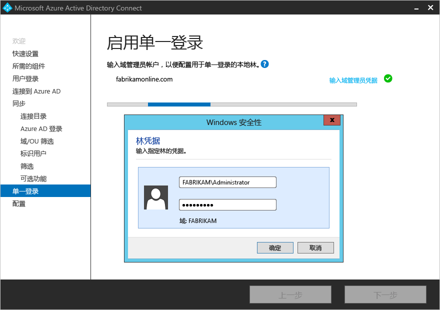
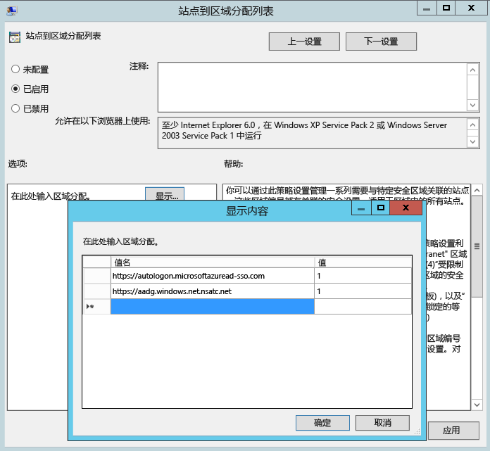

# Azure AD Connect 的自定义安装
如果希望有更多的安装选项，可以使用 Azure AD Connect“自定义设置”。 如果拥有多个林或希望配置未覆盖在快速安装中的可选功能，可以使用它。 它适用于[**快速安装**](active-directory-aadconnect-get-started-express.md)不能满足部署或拓扑的所有情况。

开始安装 Azure AD Connect 之前，确保[下载 Azure AD Connect](http://go.microsoft.com/fwlink/?LinkId=615771)，完成 [Azure AD Connect：硬件和先决条件](active-directory-aadconnect-prerequisites.md)中的预备步骤。 此外请确保拥有 [Azure AD Connect 帐户和权限](active-directory-aadconnect-accounts-permissions.md)所述的可用的必需帐户。

如果自定义的设置不匹配拓扑，例如，若要升级 DirSync，有关其他情况，请参阅 [相关文档](#related-documentation) 。

## Azure AD Connect 的自定义设置安装
### 快速设置
在此页面上，单击“自定义”  启动已自定义的设置安装。

### 安装所需的组件
安装同步服务时，可以将可选配置部分保留未选中状态，Azure AD Connect 会自动完成所有设置。 这会设置 SQL Server 2012 Express LocalDB 实例、创建相应的组并分配权限。 如果想要更改默认设置，可以使用下表来了解可用的可选配置选项。

| 可选配置 | Description |
| --- | --- |
| 使用现有的 SQL Server |用于指定 SQL Server 名称和实例名称。 如果已有一个要使用的数据库服务器，请选择此选项。 如果 SQL Server 没有启用浏览，请在“实例名称”中输入实例名称后接逗号和端口号。 |
| 使用现有的服务帐户 |默认情况下，Azure AD Connect 将虚拟服务帐户用于为要使用的同步服务。 如果使用远程 SQL 服务器或使用需要身份验证的代理，则需使用**托管服务帐户**，或者使用域中的服务帐户并知道密码。 在这些情况下，请输入要使用的帐户。 确保运行安装的用户是 SQL 中的 SA，以便可以创建服务帐户的登录名。  请参阅 [Azure AD Connect 帐户和权限](active-directory-aadconnect-accounts-permissions.md#adsync-service-account)。   现在，在使用最新版本的情况下，可以由 SQL 管理员在带外进行数据库预配，然后由具有数据库所有者权限的 Azure AD Connect 管理员完成安装。  有关详细信息，请参阅[使用 SQL 委派的管理员权限安装 Azure AD Connect](active-directory-aadconnect-sql-delegation.md)。|
| 指定自定义同步组 |默认情况下，在安装同步服务时，Azure AD Connect 会在服务器本地创建四个组。 这些组是：管理员组、操作员组、浏览组和密码重置组。 在此可以指定自己的组。 组必须在服务器本地，并且不能位于域中。 |

### 用户登录
在安装所需的组件后，需要选择用户单一登录方法。 下表提供了可用选项的简短说明。 有关登录方法的完整说明，请参阅[用户登录](active-directory-aadconnect-user-signin.md)。

| 单一登录选项 | Description |
| --- | --- |
| 密码哈希同步 |用户能够用在其本地网络中使用的相同密码登录到 Microsoft 云服务，例如 Office 365。 用户密码将作为密码哈希同步到 Azure AD，并在云中进行身份验证。 有关详细信息，请参阅[密码哈希同步](active-directory-aadconnectsync-implement-password-hash-synchronization.md)。 |
|直通身份验证|用户能够用在其本地网络中使用的相同密码登录到 Microsoft 云服务，例如 Office 365。  用户密码会传递到本地 Active Directory 域控制器进行验证。
| 使用 AD FS 进行联合身份验证 |用户能够用在其本地网络中使用的相同密码登录到 Microsoft 云服务，例如 Office 365。  用户被重定向到他们的本地 AD FS 实例以进行登录，并在本地完成身份验证。 |
| 使用 PingFederate 进行联合身份验证|用户能够用在其本地网络中使用的相同密码登录到 Microsoft 云服务，例如 Office 365。  用户被重定向到他们的本地 PingFederate 实例以进行登录，并在本地完成身份验证。 |
| 不要配置 |不安装和配置用户登录功能。 如果已有第三方联合服务器或部署了另一个现有解决方案，请选择此选项。 |
|启用单一登录|此选项适用于密码同步和传递身份验证，为企业网络中的桌面用户提供单一登录体验。 有关详细信息，请参阅[单一登录](active-directory-aadconnect-sso.md)。  请注意，对于 AD FS 客户此选项不可用，因为 AD FS 已提供相同级别的单一登录。 

### 连接到 Azure AD
在“连接到 Azure AD”屏幕中，输入全局管理员的帐户和密码。 如果在前一个页面选择了“与 AD FS 联合”，不要以计划启用联合的域中的帐户登录。 建议使用随附于 Azure AD 目录的默认 **onmicrosoft.com** 域中的帐户。

此帐户仅用于在 Azure AD 中创建服务帐户，在向导完成后将不会使用。  

如果全局管理员帐户已启用 MFA，则需要在登录弹出窗口中再次提供密码，并完成 MFA 质询。 此质询可能是提供验证码或电话呼叫。  

全局管理员帐户也可以启用 [Privileged Identity Management](../privileged-identity-management/pim-getting-started.md)。

如果收到错误消息并且出现连接问题，请参阅[排查连接问题](active-directory-aadconnect-troubleshoot-connectivity.md)。

## “同步”部分下的页面

### 连接目录
若要连接到 Active Directory 域服务，Azure AD Connect 工具需要使用具有足够权限的帐户的林名称和凭据。

在输入林名称并单击“添加目录”后，会显示一个弹出对话框，提示选择以下选项：

| 选项 | Description |
| --- | --- |
| 创建新帐户 | 如果需要使用 Azure AD Connect 向导创建一个 Azure AD Connect 需要的 AD DS 帐户，以便在目录同步期间连接到 AD 林，请选择此选项。 选择此选项时，请输入企业管理员帐户的用户名和密码。 Azure AD Connect 向导将使用提供的企业管理员帐户创建所需的 AD DS 帐户。 可以采用 NetBios 或 FQDN 格式输入域部分，即 FABRIKAM\administrator 或 fabrikam.com\administrator。 |
| 使用现有帐户 | 如果需要提供一个现有的 AD DS 帐户，以便在目录同步期间用在 Azure AD Connect 中以连接到 AD 林，请选择此选项。 可以采用 NetBios 或 FQDN 格式输入域部分，即 FABRIKAM\syncuser 或 fabrikam.com\syncuser。 此帐户可以是普通的用户帐户，因为该帐户只需默认的读取权限。 不过，根据方案，可能会需要更多权限。 有关详细信息，请参阅 [Azure AD Connect 帐户和权限](active-directory-aadconnect-accounts-permissions.md##create-the-ad-ds-connector-account)。 |

### Azure AD 登录配置
此页用于查看本地 AD DS 中存在的 UPN 域，以及已在 Azure AD 中验证的 UPN 域。 此页还可让你配置用于 userPrincipalName 的属性。

  
查看标记为“未添加”和“未验证”的每个域。 确保使用的域都已在 Azure AD 中验证。 验证域后，请单击“刷新”符号。 有关详细信息，请参阅[添加和验证域](../active-directory-domains-add-azure-portal.md)

**UserPrincipalName** - 属性 userPrincipalName 是用户登录 Azure AD 和 Office 365 时使用的属性。 应在同步处理用户前在 Azure AD 中对使用的域（也称为 UPN 后缀）进行验证。 Microsoft 建议保留默认属性 userPrincipalName。 如果此属性不可路由且无法验证，则可以选择另一个属性。 例如，可以选择 email 作为保存登录 ID 的属性。 使用除 userPrincipalName 以外的其他属性被称为“替代 ID” 。 “替代 ID”属性值必须遵循 RFC822 标准。 替代 ID 可以配合密码同步和联合使用。 不得在 Active Directory 中将该属性定义为多值，即使它只有单个值。

>[!NOTE]
> 启用传递身份验证时，必须至少有一个已验证的域才能继续向导中的操作。

> [!WARNING]
> 所有 Office 365 工作负荷都不允许使用替代 ID。 有关详细信息，请参阅 [配置替代登录 ID](https://docs.microsoft.com/windows-server/identity/ad-fs/operations/configuring-alternate-login-id)。
>
>

### 域和 OU 筛选
默认情况下将同步所有域和 OU。 如果不想将某些域或 OU 同步到 Azure AD，可以取消选择这些域和 OU。  
  
向导中的此页面用于配置基于域和基于 OU 的筛选。 如果打算进行更改，请在更改之前参阅[基于域的筛选](active-directory-aadconnectsync-configure-filtering.md#domain-based-filtering)和[基于 OU 的筛选](active-directory-aadconnectsync-configure-filtering.md#organizational-unitbased-filtering)。 某些 OU 对功能至关重要，不应取消选中。

如果将基于 OU 的筛选与 1.1.524.0 之前的 Azure AD Connect 版本配合使用，则会默认同步以后添加的新 OU。 如果希望行为是不同步新 OU，可在向导完成后，使用[基于 OU 的筛选](active-directory-aadconnectsync-configure-filtering.md#organizational-unitbased-filtering)来配置此行为。 对于 Azure AD Connect 1.1.524.0 或更高版本，可以指示是否需要同步新 OU。

如果打算使用[基于组的筛选](#sync-filtering-based-on-groups)，请确保包含该组所在的 OU，而未使用 OU 筛选将该 OU 筛选掉。 OU 筛选会在基于组的筛选之前评估。

由于防火墙限制，也可能无法连接到某些域。 默认情况下未选择这些域，并且会出现警告。  
  
如果看到此警告，请确认确实无法访问这些域，并且该警报在意料之中。

### 唯一标识用户

#### 选择应如何在本地目录中标识用户
“跨林匹配”功能允许定义如何在 Azure AD 中呈现 AD DS 林中的用户。 一个用户可以在所有林中只呈现一次，也可以使用已启用和已禁用帐户的组合。 在某些林中，用户还可以被表示为联系人。

| 设置 | Description |
| --- | --- |
| [用户在所有林中只呈现一次](active-directory-aadconnect-topologies.md#multiple-forests-single-azure-ad-tenant) |将所有用户在 Azure AD 中创建为单独的对象。 不会在 Metaverse 中联接对象。 |
| [邮件属性](active-directory-aadconnect-topologies.md#multiple-forests-single-azure-ad-tenant) |如果邮件属性在不同的林中具有相同的值，则此选项将联接用户和联系人。 当已使用 GALSync 创建了联系人时，请使用此选项。 如果选择此选项，则不会将 Mail 属性尚未填充的 User 对象同步到 Azure AD。 |
| [ObjectSID 和 msExchangeMasterAccountSID/ msRTCSIP-OriginatorSid](active-directory-aadconnect-topologies.md#multiple-forests-single-azure-ad-tenant) |此选项将帐户林中的已启用用户与资源林中的已禁用用户进行联接。 在 Exchange 中，此配置称为链接邮箱。 如果只使用 Lync 并且资源林中没有 Exchange，则你也可以使用此选项。 |
| sAMAccountName 和 MailNickName |此选项根据预期可以在其中找到用户登录 ID 的属性进行联接。 |
| 特定的属性 |此选项允许选择自己的属性。 如果选择此选项，则不会将其选定属性尚未填充的 User 对象同步到 Azure AD。 **限制：** 确保选择已可在 Metaverse 中找到的属性。 如果选择自定义属性（不在 Metaverse 中），向导将无法完成。 |

#### 选择应如何使用 Azure AD 标识用户 - 源定位点
sourceAnchor 属性是一个在用户对象的生命周期内不会改变的属性。 它是链接本地用户与 Azure AD 中用户的主密钥。

| 设置 | Description |
| --- | --- |
| 让 Azure 为我管理源定位点 | 如果想要 Azure AD 选取属性，请选择此选项。 如果选择此选项，Azure AD Connect 向导会应用 sourceAnchor 属性选择逻辑，该逻辑在相关文章的 [Azure AD Connect: Design concepts - Using msDS-ConsistencyGuid as sourceAnchor](active-directory-aadconnect-design-concepts.md#using-msds-consistencyguid-as-sourceanchor)（Azure AD Connect：设计概念 - 使用 msDS-ConsistencyGuid 作为 sourceAnchor）部分进行了说明。 自定义安装完成后，向导会通知你已选取哪个属性作为“源定位点”属性。 |
| 特定的属性 | 如果希望指定现有的 AD 属性作为 sourceAnchor 属性，请选择此选项。 |

由于无法更改该属性，因此，必须规划好要使用的合适属性。 objectGUID 就是不错的候选项。 除非在林/域之间移动用户帐户，否则此属性不会更改。 在要在林间移动帐户的多林环境中，必须使用另一个属性，例如具有 employeeID 的属性。 避免某人结婚时会改变的属性，或会更改分配的属性。 由于不可以使用带有 @-sign 符号的属性，因此无法使用 email 和 userPrincipalName。 属性也区分大小写，因此在林间移动对象时，请务必保留大写/小写。 二进制属性采用 base64 编码，但其他属性类型会保留未编码状态。 在联合方案和某些 Azure AD 接口中，此属性也称为 immutableID。 可以在[设计概念](active-directory-aadconnect-design-concepts.md#sourceanchor)中找到有关源定位点的详细信息。

### 根据组同步筛选
根据组筛选功能用于只同步一小部分的对象来进行试验。 若要使用此功能，请在本地 Active Directory 中针对此目的创建一个组。 然后添加应该以直属成员身份与 Azure AD 同步的用户和组。 稍后可以在此组中添加和删除用户，以维护应该要在 Azure AD 中显示的对象列表。 要同步的所有对象必须是组的直属成员。 用户、组、联系人和计算机/设备都必须是直属成员。 系统不会解析嵌套组成员身份。 添加某个组作为成员时，只会添加该组本身，而不添加其成员。

> [!WARNING]
> 此功能仅用于支持试验部署。 请不要将其用于成熟的生产部署。
>
>

在成熟的生产部署中，往往很难维护单个要同步所有对象的组。 在这种情况下，应该使用[配置筛选](active-directory-aadconnectsync-configure-filtering.md)中所述的方法之一。

### 可选功能
此屏幕用于针对特定方案选择可选功能。

> [!WARNING]
> 如果当前启用了 DirSync 或 Azure AD Sync，请勿激活 Azure AD Connect 中的任何写回功能。
>
>

| 可选功能 | Description |
| --- | --- |
| Exchange 混合部署 |Exchange 混合部署功能使 Exchange 邮箱能够在本地和 Office 365 中共存。 Azure AD Connect 将特定的[属性](active-directory-aadconnectsync-attributes-synchronized.md#exchange-hybrid-writeback)集从 Azure AD 同步回到本地目录。 |
| Exchange 邮件公用文件夹 | “Exchange 邮件公用文件夹”功能可以将支持邮件功能的公用文件夹对象从本地 Active Directory 同步到 Azure AD。 |
| Azure AD 应用程序和属性筛选 |通过启用 Azure AD 应用和属性筛选，可以定制同步的属性集。 此选项会在向导中额外添加两个配置页。 有关详细信息，请参阅 [Azure AD 应用程序和属性筛选](#azure-ad-app-and-attribute-filtering)。 |
| 密码哈希同步 |如果选择了联合作为登录解决方案，则可以启用此选项。 然后，可将密码哈希同步用作备份选项。 有关更多信息，请参阅[密码哈希同步](active-directory-aadconnectsync-implement-password-hash-synchronization.md)。   如果选择了“传递身份验证”，则也可以启用此选项来确保支持旧客户端并将其用作备份选项。 有关更多信息，请参阅[密码哈希同步](active-directory-aadconnectsync-implement-password-hash-synchronization.md)。|
| 密码写回 |通过启用密码写回，源自 Azure AD 的密码更改将写回到本地目录。 有关详细信息，请参阅[密码管理入门](../authentication/quickstart-sspr.md)。 |
| 组写回 |如果使用了“Office 365 组”功能，则可以在本地 Active Directory 中呈现这些组。 仅当本地 Active Directory 中存在 Exchange 时，才可以使用此选项。 有关详细信息，请参阅[组写回](active-directory-aadconnect-feature-preview.md#group-writeback)。 |
| 设备写回 |允许将 Azure AD 中的设备对象写回本地 Active Directory 以实现条件性访问方案。 有关详细信息，请参阅[在 Azure AD Connect 中启用设备写回](active-directory-aadconnect-feature-device-writeback.md)。 |
| 目录扩展属性同步 |通过启用目录扩展属性同步，可将指定的属性同步到 Azure AD。 有关详细信息，请参阅 [目录扩展](active-directory-aadconnectsync-feature-directory-extensions.md)。 |

### Azure AD 应用程序和属性筛选
如果想要限制同步到 Azure AD 的属性，请通过选择正在使用的服务来启动。 如果在此页面上进行配置更改，则必须通过重新运行安装向导来明确选择新的服务。

此页面会根据上一步选择的服务来显示要同步的所有属性。 此列表是要同步的所有对象类型的组合。 如果需要禁止同步某些特定属性，可以取消选中这些属性。

> [!WARNING]
> 删除属性可能会影响功能。 有关最佳实践和建议，请参阅[属性同步](active-directory-aadconnectsync-attributes-synchronized.md#attributes-to-synchronize)。
>
>

### 目录扩展属性同步
可以使用组织添加的自定义属性或 Active Directory 中的其他属性，在 Azure AD 中扩展架构。 若要使用这项功能，请在“可选功能”页上选择“目录扩展属性同步”。 可以在此页上选择要同步的其他属性。

有关详细信息，请参阅[目录扩展](active-directory-aadconnectsync-feature-directory-extensions.md)。

### 启用单一登录 (SSO)
配合密码同步或传递身份验证配置单一登录是一个简单的过程，针对要同步到 Azure AD 的每个林，只需完成此过程一次。 配置包括如下所述的两个步骤：

1.  在本地 Active Directory 中创建所需的计算机帐户。
2.  配置客户端计算机的 Intranet 区域，使其支持单一登录。

#### 在 Active Directory 中创建计算机帐户
对于在 Azure AD Connect 中添加的每个林，需要提供域管理员凭据，以便在每个林中创建计算机帐户。 凭据仅用于创建帐户，而不会存储，也不会用于其他任何操作。 只需在 Azure AD Connect 向导的“启用单一登录”页上添加凭据，如下所示：

>[!NOTE]
>如果不想要对某个特定的林使用单一登录，可以跳过该林。

#### 配置客户端计算机的 Intranet 区域
为了确保客户端在 Intranet 区域中自动登录，需确保两个 URL 是 Intranet 区域的一部分。 这样就可以确保已加入域的计算机在连接到企业网络后，向 Azure AD 自动发送 Kerberos 票证。
在装有组策略管理工具的计算机上：

1.  打开组策略管理工具
2.  编辑要应用到所有用户的组策略。 例如默认的域策略。
3.  导航到“用户配置\管理模板\Windows 组件\Internet Explorer\Internet 控制面板\安全性”页，并选择“区域分配列表的站点”，如下图所示。
4.  启用策略，并在对话框中输入以下项。

        Value: `https://autologon.microsoftazuread-sso.com`  
        Data: 1  
    

5.  如下图所示：  

6.  单击“确定”两次。

## 配置与 AD FS 的联合
使用 Azure AD Connect 配置 AD FS 非常简单，只需单击几下鼠标即可。 配置之前需要做好以下准备。

* 已启用远程管理的、用作联合服务器的 Windows Server 2012 R2 或更高版服务器
* 已启用远程管理的、用作 Web 应用程序代理服务器的 Windows Server 2012 R2 或更高版服务器
* 想要使用的联合身份验证服务名称（例如 sts.contoso.com）的 SSL 证书

>[!NOTE]
>可以使用 Azure AD Connect 更新 AD FS 场的 SSL 证书，即使不使用它来管理联合身份验证信任。

### AD FS 配置先决条件
若要使用 Azure AD Connect 配置 AD FS 场，请确保已在远程服务器上启用了 WinRM。 确保已完成[联合身份验证先决条件](active-directory-aadconnect-prerequisites.md#prerequisites-for-federation-installation-and-configuration)中的其他任务。 此外，请仔细查看[表 3 - Azure AD Connect 和联合服务器/WAP](active-directory-aadconnect-ports.md#table-3---azure-ad-connect-and-ad-fs-federation-serverswap) 中列出的端口要求。

### 创建新的 AD FS 场或使用现有的 AD FS 场
可以使用现有的 AD FS 场，或选择创建新的 AD FS 场。 如果选择创建新的场，则需要提供 SSL 证书。 如果 SSL 证书受密码保护，系统会提示输入密码。

如果选择使用现有 AD FS 场，将直接转到一个屏幕，可以在其中配置 AD FS 与 Azure AD 之间的信任关系。

>[!NOTE]
>Azure AD Connect 只能用来管理一个 AD FS 场。 如果现有的联合身份验证信任在所选 AD FS 场上配置了 Azure AD，则会由 Azure AD Connect 从头开始重新建立信任。

### 指定 AD FS 服务器
输入要在其中安装 AD FS 的服务器。 可以根据容量规划需求添加一个或多个服务器。 执行此配置之前，请将所有 AD FS 服务器（不是 WAP 服务器所需的）加入 Active Directory。 Microsoft 建议安装一台用于测试和试验部署的 AD FS 服务器。 然后，在完成初始配置之后通过再次运行 Azure AD Connect，根据缩放需求添加并部署更多的服务器。

> [!NOTE]
> 在执行此配置之前，请确保所有服务器已加入 AD 域。
>
>

### 指定 Web 应用程序代理服务器
输入要用作 Web 应用程序代理服务器的特定服务器。 Web 应用程序代理服务器部署在外围网络中（面向 Extranet），支持来自 Extranet 的身份验证请求。 可以根据容量规划需求添加一个或多个服务器。 Microsoft 建议安装一台用于测试和试验部署的 Web 应用程序代理服务器。 然后，在完成初始配置之后通过再次运行 Azure AD Connect，根据缩放需求添加并部署更多的服务器。 我们建议使用数量相当的代理服务器，以满足来自 Intranet 的身份验证要求。

> [!NOTE]
> <li> 如果使用的帐户不是 WAP 服务器上的本地管理员，系统会提示你提供管理员凭据。</li>
> <li> 在运行此步骤之前，请确保 Azure AD Connect 服务器与 Web 应用程序代理服务器之间已建立 HTTP/HTTPS 连接。</li>
> <li> 确保 Web 应用程序服务器与 AD FS 服务器之间的 HTTP/HTTPS 连接允许通过身份验证请求。</li>
>

系统会提示输入凭据，使 Web 应用程序服务器可以创建与 AD FS 服务器的安全连接。 这些凭据需是 AD FS 服务器上的本地管理员。

### 指定 AD FS 服务的服务帐户
AD FS 服务需要域服务帐户来验证用户，以及在 Active Directory 中查找用户信息。 它可以支持两种类型的服务帐户：

* **组托管服务帐户** - Active Directory 域服务中随 Windows Server 2012 一起引入。 此类型的帐户提供 AD FS 之类的服务，让可以使用单个帐户，且不需要定期更新帐户密码。 如果 AD FS 服务器将要加入的域中已有 Windows Server 2012 域控制器，请使用此选项。
* 域用户帐户 - 此类型的帐户会要求你提供密码，并在密码更改或过期时定期更新密码。 仅当 AD FS 服务器所属的域中没有 Windows Server 2012 域控制器时，才使用此选项。

如果选择了组托管的服务帐户且从未在 Active Directory 中使用过此功能，则系统会提示输入企业管理员凭据。 这些凭据用于启动密钥存储，以及在 Active Directory 中启用该功能。

> [!NOTE]
> Azure AD Connect 会检查 AD FS 服务是否已在域中注册为 SPN。  AD DS 不允许注册重复的 SPN。  如果发现重复的 SPN，则必须删除该 SPN 才能继续操作。

### 选择要联合的 Azure AD 域
此配置用于设置 AD FS 与 Azure AD 之间的联合关系。 它将 AD FS 配置为向 Azure AD 颁发安全令牌，并将 Azure AD 配置为信任来自此特定 AD FS 实例的令牌。 此页只允许在初始安装中配置单个域。 以后可以通过再次运行 Azure AD Connect 来配置其他域。

### 验证选择用于联合的 Azure AD 域
选择要联合的域时，Azure AD Connect 将提供所需的信息来验证尚未验证的域。 有关如何使用此信息，请参阅[添加和验证域](../active-directory-domains-add-azure-portal.md)。

> [!NOTE]
> AD Connect 尝试在配置阶段验证域。 如果继续进行配置但未添加所需的 DNS 记录，向导将无法完成配置。
>
>

## 配置使用 PingFederate 的联合身份验证
使用 Azure AD Connect 配置 PingFederate 非常简单，只需单击几下鼠标即可。 但是，以下先决条件是必需的。
- PingFederate 8.4 或更高版本。  有关详细信息，请参阅 [PingFederate 与 Azure Active Directory 和 Office 365 的集成](https://docs.pingidentity.com/bundle/O365IG20_sm_integrationGuide/page/O365IG_c_integrationGuide.html)
- 想要使用的联合身份验证服务名称（例如 sts.contoso.com）的 SSL 证书

### 验证域
选择使用 PingFederate 进行联合身份验证之后，会要求你要验证要进行联合身份验证的域。  从下拉框中选择域。

### 导出 PingFederate 设置

必须将 PingFederate 配置为每个联合 Azure 域的联合服务器。  单击“导出设置”按钮并与 PingFederate 管理员共享此信息。  联合服务器管理员将更新配置，然后提供 PingFederate 服务器 URL 和端口号，以便 Azure AD Connect 可以验证元数据设置。  

与 PingFederate 管理员联系以解决任何验证问题。  下面是与 Azure 之间没有有效的信任关系的 PingFederate 服务器的示例：

### 验证联合身份验证连接性
Azure AD Connect 将尝试验证从上一步中的 PingFederate 元数据检索的身份验证终结点。  Azure AD Connect 将首先尝试使用本地 DNS 服务器解析终结点。  接下来，它将尝试使用外部 DNS 提供程序解析终结点。  与 PingFederate 管理员联系以解决任何验证问题。  

### 验证联合登录
最后，可以通过登录到联合域来验证新配置的联合登录流。 如果此操作成功，则说明已成功配置了使用 PingFederate 的联合身份验证。

## 配置和验证页面
在此页上进行配置。

> [!NOTE]
> 在继续安装之前，如果配置了联合服务器，请确保已配置[联合服务器的名称解析](active-directory-aadconnect-prerequisites.md#name-resolution-for-federation-servers)。
>
>

### 过渡模式
在过渡模式下，可以同时设置新的同步服务器。 系统仅支持一台同步服务器导出到云中的一个目录。 但如果想要从另一台服务器（例如运行 DirSync 的服务器）移动，则可以启用过渡模式的 Azure AD Connect。 启用后，同步引擎将像平时一样导入并同步数据，但不会将任何内容导出到 Azure AD。 密码同步和密码写回功能会在过渡模式下禁用。

在过渡模式下，可以对同步引擎进行所需的更改，并复查要导出的内容。 如果配置看起来正常，请再次运行安装向导，并禁用过渡模式。 现在，已将数据从此服务器导出到 Azure AD。 确保同时禁用其他服务器，以便只有一台服务器在主动导出。

有关详细信息，请参阅[过渡模式](active-directory-aadconnectsync-operations.md#staging-mode)。

### 验证联合配置
单击“验证”按钮时，Azure AD Connect 会验证 DNS 设置。

Intranet 连接检查

* 解析联合 FQDN：Azure AD Connect 会查看是否可以通过 DNS 解析联合 FQDN，以确保连接性。 如果 Azure AD Connect 无法解析 FQDN，验证会失败。 确保出示适用于联合身份验证服务 FQDN 的 DNS 记录，以便成功完成验证。
* DNS A 记录：Azure AD Connect 会检查是否存在适用于联合身份验证服务的 A 记录。 在没有 A 记录的情况下，验证会失败。 请为联合 FQDN 创建 A 记录而不是 CNAME 记录，以便成功完成验证。

Extranet 连接检查

* 解析联合 FQDN：Azure AD Connect 会查看是否可以通过 DNS 解析联合 FQDN，以确保连接性。

若要验证端到端身份验证是否成功，应当手动执行下列一个或多个测试：

* 在同步完成后，使用 Azure AD Connect 中的”验证联合登录”附加任务来验证你选择的本地用户帐户的身份验证。
* 在 Intranet 上，通过已加入域的计算机上的浏览器验证是否能够登录：连接到 https://myapps.microsoft.com，并使用登录帐户验证登录。 内置的 AD DS 管理员帐户未同步，因此无法用于验证。
* 验证是否可以从 Extranet 中的设备登录。 在家庭计算机或移动设备上连接到 https://myapps.microsoft.com，并提供凭据。
* 验证富客户端登录。 连接到 https://testconnectivity.microsoft.com，选择“Office 365”选项卡，并选择“Office 365 单一登录测试”。

## 故障排除
以下部分包含故障排除内容以及在遇到 Azure AD Connect 安装问题时可以使用的信息。

### “ADSync 数据库已经包含数据，无法重写” 
对 Azure AD Connect 进行自定义安装并在“安装所需的组件”页上选择“使用现有的 SQL Server”选项时，可能会遇到一个错误，指出“ADSync 数据库已经包含数据，无法重写。请删除现有的数据库，然后重试。”

这是因为在 SQL Server 的 SQL 实例上已经有一个现成的名为 **ADSync** 的数据库，该数据库是在上面的文本框中指定的。

这通常发生在卸载 Azure AD Connect 之后。  卸载时，此数据库不会从 SQL Server 中删除。

若要修复此问题，请首先验证在卸载之前由 Azure AD Connect 使用的 **ADSync** 数据库是否不再处于使用状态。

接下来，建议在删除数据库之前先备份数据库。 

最后，需删除该数据库。  为此，可使用 **Microsoft SQL Server Management Studio** 连接到 SQL 实例。 找到 **ADSync** 数据库后右键单击它，从上下文菜单中选择“删除”。  然后单击“确定”按钮，将其删除。

删除 **ADSync** 数据库后，可以单击“安装”按钮来重试安装。

## 后续步骤
安装完成后，请注销并再次登录到 Windows，即可使用同步服务管理器或同步规则编辑器。

安装 Azure AD Connect 后，可以[验证安装并分配许可证](active-directory-aadconnect-whats-next.md)。

若要了解有关这些功能（在安装过程中已启用）的详细信息，请参阅[防止意外删除](active-directory-aadconnectsync-feature-prevent-accidental-deletes.md)和 [Azure AD Connect Health](../connect-health/active-directory-aadconnect-health-sync.md)。

若要了解有关这些常见主题的详细信息，请参阅[计划程序以及如何触发同步](active-directory-aadconnectsync-feature-scheduler.md)。

了解有关 [将本地标识与 Azure Active Directory 集成](active-directory-aadconnect.md)的详细信息。
