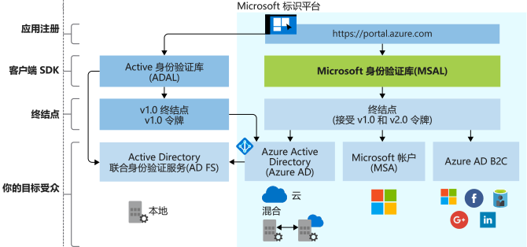

# Microsoft 标识平台的发展

Microsoft 标识平台由 Azure Active Directory (Azure AD) 开发人员平台演变而来。 借助该平台，开发人员可以生成登录用户的应用程序，以及获取令牌调用 API，例如 Microsoft Graph 或开发人员已生成的 API。 它包含身份验证服务、开源库、应用程序注册和配置（通过开发人员门户和应用程序 API）、完整的开发人员文档、快速入门示例、代码示例、教程、操作指南和其他开放人员内容。 Microsoft 标识平台支持行业标准协议，例如 OAuth 2.0 和 OpenID Connect。

到现在为止，许多开发人员已经使用过 Azure AD v1.0 平台来对工作和学校帐户（由 Azure AD 预配）进行身份验证，方法是使用 Azure AD 身份验证库 (ADAL)、用于应用程序注册和配置的 Azure 门户，以及用于编程应用程序配置的 Azure AD Graph API，从 Azure AD v1.0 终结点请求令牌。

借助 Microsoft 标识平台 (v2.0)，将覆盖范围扩展到以下类型的用户：

- 工作和学校帐户（Azure AD 预配帐户）
- 个人帐户（例如 Outlook.com 或 Hotmail.com）
- 通过 Azure AD B2C 产品/服务使用自己的电子邮件或社交身份（如 LinkedIn、Facebook、Google）的客户

借助 Microsoft 统一标识平台，可以一次性编写代码，然后将任何 Microsoft 标识身份验证到应用程序。 对于多个平台，存在完全受支持的开源库，称为 Microsoft 身份验证库 (MSAL)。 MSAL 易于使用，为用户提供出色的单一登录 (SSO) 体验，帮助你实现高可靠性和性能，采用 Microsoft 安全开发生命周期 (SDL) 开发。 调用 API 时，可以将应用程序配置为使用递增同意，这允许你延迟对同意的请求以实现更广的范围，直到应用程序的使用在运行时对此作出保证。

可以使用 Azure 门户注册和配置应用程序，并将 Microsoft Graph API 用于编程应用程序配置。

根据自己的进度更新应用程序。 使用 ADAL 库构建的应用程序继续受支持。 混合应用程序组合（包含使用 ADAL 生成的应用程序和使用 MSAL 库生成的应用程序）也受支持。 这意味着使用最新 ADAL 和最新 MSAL 的应用程序将在组合中提供 SSO，SSO 由这些库之间的共享令牌缓存提供。 从 ADAL 更新为 MSAL 的应用程序将在升级时保持用户登录状态。

## Microsoft 标识平台体验

下图显示了高级别的 Microsoft 标识体验，包括应用注册体验、SDK、终结点和支持的标识。

### 应用注册体验

Azure 门户[应用注册](https://go.microsoft.com/fwlink/?linkid=2083908)体验是用于管理已与 Microsoft 标识平台集成的所有应用程序的一种门户体验。 如果你一直使用的是应用程序注册门户，请开始改为使用 Azure 门户应用注册体验。

要与 Azure AD B2C 集成（对社交或本地身份进行身份验证时），需要在 B2C 租户中注册应用程序。 这种体验也是 Azure 门户的一部分。

Microsoft Graph 中的应用程序 API 当前处于预览阶段。 使用此 API 以编程方式配置与 Microsoft 标识平台集成的应用程序，以对 Microsoft 标识进行身份验证。 但是，在此 API 发布正式版之前，应使用 Azure AD Graph 1.6 API 和应用程序清单。

### MSAL 库

可以使用 MSAL 库生成对所有 Microsoft 标识进行身份验证的应用程序。 .NET 中的 SAL 库已正式发布。 适用于 JavaScript、iOS 和 Android 的 MSAL 库处于预览阶段，适合用于生产环境。 我们为预览版 MSAL 库提供的生产级别支持与我们为正式版 MSAL 和 ADAL 提供的生产级别支持相同。

还可使用 MSAL 库将应用程序与 Azure AD B2C 集成。

用于构建 Web 应用和 Web API 的服务器端库已正式发布：[ASP.NET](https://docs.microsoft.com/aspnet/overview) 和 [ASP.NET Core](https://docs.microsoft.com/aspnet/core/?view=aspnetcore-2.2)

### Microsoft 标识平台终结点

Microsoft 标识平台 (v2.0) 终结点现已经过 OIDC 认证。 它适用于 Microsoft 身份验证库 (MSAL) 或任何其他符合标准的库。 它按照行业标准实现了简明易懂的范围。

## 后续步骤

深入了解 v1.0 和 v2.0。

* [Microsoft 标识平台 (v2.0) 概述](v2-overview.md)
* [适用于开发人员的 Azure Active Directory (v1.0) 概述](v1-overview.md)
