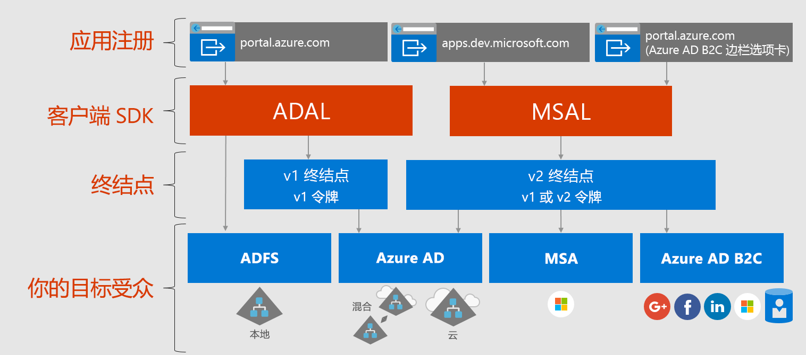

# 关于 Microsoft 标识平台

Microsoft 标识平台是 Azure Active Directory (Azure AD) 标识服务和开发人员平台的一种演变。 开发人员可以通过它来生成应用程序，以便进行所有 Microsoft 标识的登录，以及获取令牌来调用 Microsoft Graph、其他 Microsoft API 或者开发人员生成的 API。 它是一种全功能的平台，包含身份验证服务、开源库、应用程序注册和配置（通过开发人员门户和应用程序 API）、完整的开发人员文档、代理示例，以及其他开发人员内容。 Microsoft 标识平台支持行业标准协议，例如 OAuth 2.0 和 OpenID Connect。

到现在为止，大多数开发人员都曾使用过 Azure AD v1.0 平台来对 Azure AD 标识（工作和学校帐户）进行身份验证，方法是使用 Azure AD 身份验证库 (ADAL)、Azure 门户（用于注册和配置应用程序）以及 Azure AD Graph API（用于配置编程式应用程序），从 Azure AD v1.0 终结点请求令牌。 Azure AD v1.0 平台是一个成熟的平台产品/服务，将继续用于企业应用程序。

为扩展并改进 Microsoft 标识平台的功能，现在可以通过称为 Azure AD v2.0 终结点的对象对各种 Microsoft 标识（Azure AD 标识、Microsoft 帐户（如 outlook.com 和 hotmail.com）和社交以及通过 Azure AD B2C 的本地帐户）进行身份验证。 在这里，你将使用 Microsoft 身份验证库 (MSAL) 或任何开放源代码 OAuth2.0 或 OpenID Connect 库、用于注册和配置应用程序的 Azure 门户以及用于配置编程式应用程序的 Microsoft Graph API。 过去一年内，更新后的 Microsoft 标识平台（尤其是 MSAL 库和最新的 Azure 门户应用注册体验）经历了显著的发展。 为完成此版本，我们鼓励开发人员使用最新的 Microsoft 标识平台开发测试其应用程序。

使用最新 ADAL 和最新 MSAL 的应用程序将彼此实现 SSO。 从 ADAL 更新到 MSAL 的应用程序将保持用户的登录状态。 如果开发人员认为合适，可以选择将其应用程序更新为 MSAL，而使用 ADAL 构建的应用程序将继续正常运行并受支持。

## Microsoft 标识平台体验

下图显示了高级别的 Microsoft 标识体验，包括应用注册体验、SDK、终结点和支持的标识。

Microsoft 标识平台具有两个终结点（v1.0 和 v2.0）和两组客户端库，用于处理这些终结点。 开发新应用程序时，请考虑终结点和身份验证库的优势和当前状态。 另请考虑以下因素：

* 支持的平台

    * [ADAL](active-directory-authentication-libraries.md) 支持 .NET、JavaScript、iOS、Android、Java 和 Python
    * [MSAL 预览](reference-v2-libraries.md)支持 .NET、JavaScript、iOS 和 Android
    * 这两个终结点均支持使用 .NET 和 Node.js 服务器中间件保护 API 和登录。 

* 批量创新，例如动态许可和增量许可，发生于 v2.0 终结点和 MSAL，而我们将继续支持 v1.0 和 ADAL。

    在 Azure 门户中，以前必须以静态方式标识应用所需的所有作用域。 使用 v2.0 终结点以及与此终结点关联的门户，可通过静态的方式定义作用域，就像之前一样，或者可在应用需要权限的时候进行动态请求。 动态提供了另外一个可选功能，即增量许可。 使用增量许可，可在用户首次进行身份验证时，请求一个所需的作用域子集，并可根据需要，请求其他作用域。 
    
    例如，在移动设备上使用相机应用时，用户被要求允许应用访问相机，仅当用户同意应用访问相机后才能拍摄照片。  应用准备好保存新照片时，可能需要请求照片读/写权限。 

* 可能推出的重大更改

    MSAL 适合在生产环境中使用。 我们为 MSAL 提供与当前生产库相同的生产级别支持。 在预览期间，我们可能会更改该库的 API、内部缓存格式和其他机制，将因此需要使用 bug 修复程序和功能改进。 这可能会影响应用程序。 例如，对缓存格式的更改可能会影响用户，例如要求他们重新登录。 API 更改可能要求更新代码。 我们提供正式发布版 (GA) 时，会要求用户在六个月内更新到 GA 版，因为使用早期版本库编写的应用程序可能无法再正常运行。

## 后续步骤

深入了解 v1.0 和 v2.0。

* [关于 v1.0](azure-ad-developers-guide.md)
* [关于 v2.0](azure-ad-developers-guide.md)
