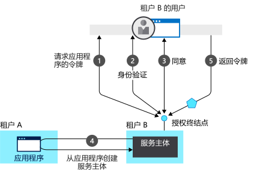

# 应用程序模型

应用程序可以自行将用户登录，或者委托标识提供者登录。 本主题讨论向 Microsoft 标识平台注册应用程序所需的步骤。

## 注册应用程序

要使标识提供者知道某个用户有权访问特定的应用，必须同时将该用户和应用程序注册到标识提供者。 向 Azure AD 注册应用程序时，将为应用程序提供标识配置，使其能够与 Microsoft 标识平台集成。 注册应用还可以：

* 在登录对话框中自定义应用程序的品牌。 这一点很重要，因为这是用户首次体验你的应用。
* 确定是否只允许属于你的组织的用户登录。 这是一个单租户应用程序。 或者允许用户使用任何工作或学校帐户登录。 这是一个多租户应用程序。 你还可以允许个人 Microsoft 帐户，或来自 LinkedIn、Google 的社交帐户，等等。
* 请求范围权限。 例如，可以请求“user.read”范围，该授予读取已登录用户的个人资料的权限。
* 定义范围，以便定义对 Web API 的访问权限。 通常，当某个应用想要访问你的 API 时，它需要请求对你所定义的范围的权限。
* 与 Microsoft 标识平台共享机密，以证实应用的标识。  这适用于应用是机密客户端应用程序的情况。 机密客户端应用程序是可以安全保存凭据的应用程序。 它们需要使用受信任的后端服务器来存储凭据。

注册后，将为应用程序提供一个唯一的标识符，该标识符在请求令牌时与 Microsoft 标识平台共享。 如果应用是[机密客户端应用程序](developer-glossary.md#client-application)，它还会共享机密或公钥，具体取决于是否使用了证书或机密。

Microsoft 标识平台使用满足以下两个主要功能的模型来表示应用程序：

* 根据应用所支持的身份验证协议来标识应用
* 提供进行身份验证所需的所有标识符、URL、机密和相关信息

Microsoft 标识平台：

* 保存在运行时支持身份验证所需的所有数据
* 保存所有数据，以确定应用可能需要访问的资源，以及在哪些情况下应满足给定的请求
* 提供用于在应用开发人员的租户和任何其他 Azure AD 租户中实现应用配置的基础设施
* 在令牌请求期间处理用户同意并帮助跨租户动态预配应用

"**同意**" 是资源所有者授权客户端应用程序，以代表资源所有者访问受保护资源的权限。 Microsoft 标识平台：

* 使用户和管理员能够动态地同意或拒绝应用以他们的名义访问资源。
* 使管理员能够最终决定允许执行哪些应用、哪些用户可以使用特定的应用，以及如何访问目录资源。

## 多租户应用

在 Microsoft 标识平台中，[应用程序对象](developer-glossary.md#application-object)描述应用程序。 在部署时，Microsoft 标识平台使用应用程序对象作为蓝图来创建[服务主体，该服务主体](developer-glossary.md#service-principal-object)表示目录或租户中的应用程序的具体实例。 该服务主体定义应用在特定目标目录中可以实际执行的操作、使用者是谁、以及可以访问哪些资源等。 Microsoft 标识平台通过[许可](developer-glossary.md#consent)使用应用程序对象创建服务主体。

下图显示了征得同意后经过简化的 Microsoft 标识平台预配流程。 其中显示了两个租户： *A*和*B*。

* *租户 A*拥有该应用程序。
* *租户 B*通过服务主体实例化应用程序。

在此预配流程中：

1. 来自租户 B 的某个用户尝试使用该应用登录，授权终结点请求应用程序的令牌。
1. 获取并验证用于身份验证的用户凭据。
1. 系统提示用户许可该应用访问租户 B。
1. Microsoft 标识平台使用租户 A 中的应用程序对象作为在租户 B 中创建服务主体的蓝图。
1. 用户接收请求的令牌。

可对其他租户重复此过程。 租户 A 保留了应用（应用程序对象）的蓝图。 应用获得许可的所有其他租户中的用户和管理员通过每个租户中的相应服务主体对象保留对应用程序允许执行的操作的控制权。 有关详细信息，请参阅 [Microsoft 标识平台中的应用程序和服务主体对象](app-objects-and-service-principals.md)。

## 后续步骤

有关涉及身份验证和授权的其他主题，请执行以下操作：

* 若要了解 Microsoft 标识平台中身份验证和授权的基本概念，请参阅[身份验证与授权](authentication-vs-authorization.md)。
* 请参阅[安全令牌](security-tokens.md)，了解身份验证和授权中如何使用访问令牌、刷新令牌和 ID 令牌。
* 请参阅[应用登录流](app-sign-in-flow.md)，了解 Microsoft 标识平台中的 web、桌面和移动应用的登录流。

若要了解有关应用程序模型的详细信息：

* 有关 Microsoft 标识平台中的应用程序对象和服务主体的详细信息，请参阅[应用程序添加到 Azure AD 的方式和原因](active-directory-how-applications-are-added.md)。
* 有关单租户应用程序和多租户应用的详细信息，请参阅[Azure Active Directory 中的租户](single-and-multi-tenant-apps.md)。
* 有关 Azure AD 如何提供 Azure Active Directory B2C 的详细信息，请参阅[Azure Active Directory B2C 文档](https://docs.microsoft.com/azure/active-directory-b2c)，以便组织可以使用诸如 Google 帐户之类的社交标识登录用户（通常为客户）。
