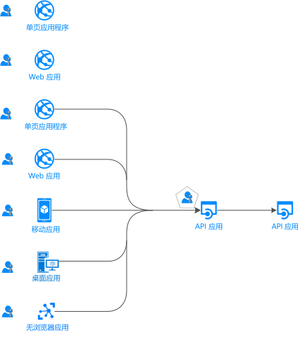
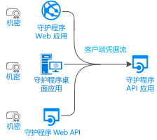
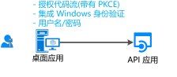
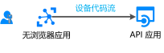
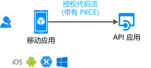

# 身份验证流和应用程序方案

Microsoft 标识平台 (v2.0) 终结点支持各种新式应用程序体系结构的身份验证。 所有这些体系结构基于行业标准协议 [OAuth 2.0 和 OpenID Connect](active-directory-v2-protocols.md)。 通过使用[Microsoft 标识平台的身份验证库](reference-v2-libraries.md)，应用程序将对标识进行身份验证，并获取令牌以访问受保护的 api。

本文介绍身份验证流以及它们在中使用的应用程序方案。

## 应用程序类别

获取的令牌可以来自多种类型的应用程序，其中包括：

- Web 应用
- 移动应用
- 桌面应用
- Web API

还可以通过在未使用浏览器的设备上运行的应用或在物联网（IoT）上运行的应用获取令牌。

以下部分介绍应用程序的类别。

### 受保护的资源与客户端应用程序

身份验证方案涉及两个活动：

- **获取受保护的 WEB API 的安全令牌**：我们建议你使用[支持 Microsoft 的客户端库](reference-v2-libraries.md#microsoft-supported-client-libraries)来获取令牌。 具体而言，我们建议 Microsoft 身份验证库（MSAL）家族。
- **保护 WEB API 或 web 应用**：保护这些资源的一个挑战是验证安全令牌。 Microsoft 在某些平台上提供[中间件库](reference-v2-libraries.md#microsoft-supported-server-middleware-libraries)。

### 涉及或不涉及用户

大多数身份验证方案代表已登录的用户获取令牌。

但是，也有守护程序应用。 在这些情况下，应用程序会代表自身获取令牌，而无用户。

### 单页、公共客户端和机密客户端应用程序

可以通过多种类型的应用程序获取安全令牌。 这些应用程序往往分为以下三种类别。 每种应用程序配合不同的库和对象使用。

- **单页应用程序**：也称为 spa，这些是在浏览器中运行的 JavaScript 或 TypeScript 应用获取令牌的 web 应用。 许多新式应用都有一个前端的单页面应用程序，该应用程序主要用 JavaScript 编写。 该应用程序通常使用 Angular、React 或 Vue 等框架。 MSAL 是唯一支持单页应用程序的 Microsoft 身份验证库。

- **公共客户端应用程序**：此类别中的应用（如以下类型）始终登录用户：
  - 代表登录用户调用 web Api 的桌面应用
  - 移动应用
  - 在没有浏览器的设备上运行的应用，如 IoT 上运行的应用程序
  
- **机密客户端应用程序**：此类别中的应用包括：
  - 调用 web API 的 web 应用
  - 用于调用 web API 的 web Api
  - 守护程序应用（即使实施为 Linux 守护程序或 Windows 服务等控制台服务）

### 登录受众

可用的身份验证流因登录受众而异。 一些流仅适用于工作或学校帐户。 对于工作或学校帐户以及个人 Microsoft 帐户，还可以使用其他帐户。

有关详细信息，请参阅[支持的帐户类型](v2-supported-account-types.md#account-type-support-in-authentication-flows)。

## 应用程序方案

Microsoft 标识平台终结点支持对以下应用程序体系结构进行身份验证：

- 单页应用
- Web 应用
- Web API
- 移动应用
- 本机应用
- 守护程序应用
- 服务器端应用

应用程序使用不同的身份验证流将用户登录和获取令牌，以调用受保护的 API。

### 单页应用程序

许多新式 Web 应用都是作为客户端单页应用程序构建的。 这些应用程序使用 JavaScript 或 Vue 等框架，并做出反应。 这些应用程序在 Web 浏览器中运行。

单页面应用程序不同于传统的服务器端 web 应用程序的身份验证特征。 单页应用程序可以使用 Microsoft 标识平台将用户登录，并获取用于访问后端服务或 Web API 的令牌。

有关详细信息，请参阅[单页应用程序](scenario-spa-overview.md)。

### 登录用户的 Web 应用

若要帮助保护登录用户的 web 应用，请执行以下操作：

- 如果在 .NET 中进行开发，则可以将 ASP.NET 或 ASP.NET Core 与 ASP.NET OpenID Connect 中间件一起使用。 保护资源涉及验证安全令牌，该令牌由[适用于 .net 的 system.identitymodel 扩展](https://github.com/AzureAD/azure-activedirectory-identitymodel-extensions-for-dotnet/wiki)执行，而不是 MSAL 库。

- 如果在 Node.js 中进行开发，将使用 Passport.js。

有关详细信息，请参阅[可将用户登录的 Web 应用](scenario-web-app-sign-user-overview.md)。

### 登录用户并代表用户调用 web API 的 web 应用

若要代表用户从 web 应用调用 web API，请使用授权代码流，并将获取的令牌存储在令牌缓存中。 必要时，MSAL 可刷新令牌，而控制器可从缓存中以无提示方式获取令牌。

有关详细信息，请参阅用于[调用 Web api 的 web 应用](scenario-web-app-call-api-overview.md)。

### 代表已登录用户调用 web API 的桌面应用

对于桌面应用程序，若要调用用于登录用户的 web API，请使用 MSAL 的交互式标记获取方法。 使用这些交互方法可以控制登录 UI 体验。 MSAL 使用 Web 浏览器进行这种交互。

对于已加入 Windows 域或者由 Azure Active Directory (Azure AD) 管理的计算机上的 Windows 托管应用程序，存在另一种可能的情况。 这些应用程序可以使用 [Windows 集成身份验证](https://aka.ms/msal-net-iwa)以无提示方式获取令牌。

在无浏览器的设备上运行的应用程序仍可代表用户调用 API。 若要进行身份验证，用户必须登录到有 Web 浏览器的另一台设备。 此方案要求使用[设备代码流](https://aka.ms/msal-net-device-code-flow)。

尽管我们不建议使用它，但可在公共客户端应用程序中使用[用户名/密码流](scenario-desktop-acquire-token.md#username-and-password)。 在某些方案（例如 DevOps）中仍需要此流。

使用用户名/密码流会限制你的应用程序。 例如，应用程序无法登录需要使用多重身份验证的用户或 Azure AD 中的条件访问工具。 应用程序也无法受益于单一登录。 用户名/密码流的身份验证根据新式身份验证的原则进行，仅出于传统原因提供。

在桌面应用中，如果希望令牌缓存持久保存，可以自定义[令牌缓存序列化](scenario-desktop-acquire-token.md#file-based-token-cache)。 通过实施[双重令牌缓存序列化](scenario-desktop-acquire-token.md#dual-token-cache-serialization-msal-unified-cache--adal-v3)，可以使用后向兼容和前向兼容的令牌缓存。 这些令牌支持以前代系的身份验证库。 具体的库包括适用于 .NET 的 Azure AD 身份验证库 (ADAL.NET) 版本 3 和 4。

有关详细信息，请参阅[调用 Web API 的桌面应用](scenario-desktop-overview.md)。

### 代表交互式用户调用 web API 的移动应用

与桌面应用程序类似，移动应用程序调用 MSAL 的交互式标记获取方法，以获取用于调用 web API 的令牌。

MSAL iOS 和 MSAL Android 默认使用系统 Web 浏览器。 不过，您可以将它们定向到使用嵌入的 web 视图。 根据以下移动平台，存在一些特殊情况：通用 Windows 平台 (UWP)、iOS 或 Android。

某些方案（例如，涉及到与设备 ID 或设备注册相关的条件访问的方案）要求在设备上安装一个中介。 中介的示例包括 Android 上的 Microsoft 公司门户，以及 Android 和 iOS 上的 Microsoft Authenticator。 MSAL 现在可与中介交互。 有关代理的详细信息，请参阅[在 Android 和 iOS 上利用代理](https://github.com/AzureAD/azure-activedirectory-library-for-dotnet/wiki/leveraging-brokers-on-Android-and-iOS)。

有关详细信息，请参阅[调用 Web API 的移动应用](scenario-mobile-overview.md)。

> [!NOTE]
> 使用 MSAL，MSAL 的移动应用。适用于 Xamarin 的 Android 或 MSAL.NET 可应用应用保护策略。 例如，策略可以阻止用户复制受保护的文本。 移动应用由 Intune 管理，Intune 被作为托管应用识别。 有关详细信息，请参阅 [Microsoft Intune App SDK 概述](https://docs.microsoft.com/intune/app-sdk)。
>
> [Intune 应用 SDK](https://docs.microsoft.com/intune/app-sdk-get-started) 独立于 MSAL 库，可自行与 Azure AD 交互。

### 受保护的 Web API

可以使用 Microsoft 标识平台终结点来保护 Web 服务，例如应用的 RESTful Web API。 受保护的 web API 通过访问令牌调用。 令牌可帮助保护 API 的数据并对传入的请求进行身份验证。 Web API 调用方会在 HTTP 请求的授权标头中追加一个访问令牌。

若要保护 ASP.NET 或 ASP.NET Core Web API，需要验证访问令牌。 可以使用 ASP.NET JWT 中间件进行这种验证。 验证是由[适用于.NET 的 IdentityModel 扩展](https://github.com/AzureAD/azure-activedirectory-identitymodel-extensions-for-dotnet/wiki)库而不是 MSAL.NET 完成的。

有关详细信息，请参阅[受保护的 Web API](scenario-protected-web-api-overview.md)。

### 代表用户调用另一个 web API 的 web API

为了使受保护的 web API 代表用户调用另一个 web API，你的应用程序需要获取下游 web API 的令牌。 此类调用有时称为*服务到服务*调用。 调用其他 web Api 的 web Api 需要提供自定义缓存序列化。

有关详细信息，请参阅[调用 Web API 的 Web API](scenario-web-api-call-api-overview.md)。

### 在守护程序名称中调用 web API 的守护程序应用

包含长时运行进程或无需用户交互即可运行的应用还需要通过某种方式访问安全的 Web API。 此类应用可以使用应用的标识进行身份验证和获取令牌。 应用将使用客户端机密或证书来证明其身份。

可以通过使用 MSAL 中的[客户端凭据](scenario-daemon-acquire-token.md#acquiretokenforclient-api)采集方法，编写此类守护程序应用，以便为调用应用获取令牌。 这些方法要求将客户端机密添加到 Azure AD 中的应用注册。 然后，该应用将与被调用守护程序共享机密。 此类机密的示例包括应用程序密码、证书断言和客户端断言。

有关详细信息，请参阅[调用 Web API 的守护程序应用程序](scenario-daemon-overview.md)。

## 方案和受支持的身份验证流

使用身份验证流可以实现请求令牌的应用程序方案。 应用程序方案和身份验证流之间不存在一对一的映射。

涉及到获取令牌的方案还会映射到 OAuth 2.0 身份验证流。 有关详细信息，请参阅 [Microsoft 标识平台上的 OAuth 2.0 和 OpenID Connect 协议](active-directory-v2-protocols.md)。

<table>
 <thead>
  <tr><th>场景</th> <th>详细方案演练</th> <th>OAuth 2.0 流和授权</th> <th>目标受众</th></tr>
 </thead>
 <tbody>
  <tr>
   <td></td>
   <td><a href="scenario-spa-overview.md">单页应用</a></td>
   <td><a href="v2-oauth2-implicit-grant-flow.md">隐式</a></td>
   <td>工作或学校帐户、个人帐户和 Azure Active Directory B2C （Azure AD B2C）</td>
 </tr>

  <tr>
   <td></td>
   <td><a href="scenario-web-app-sign-user-overview.md">登录用户的 Web 应用</a></td>
   <td><a href="v2-oauth2-auth-code-flow.md">授权代码</a></td>
   <td>工作或学校帐户、个人帐户和 Azure AD B2C</td>
 </tr>

  <tr>
   <td></td>
   <td><a href="scenario-web-app-call-api-overview.md">调用 Web API 的 Web 应用</a></td>
   <td><a href="v2-oauth2-auth-code-flow.md">授权代码</a></td>
   <td>工作或学校帐户、个人帐户和 Azure AD B2C</td>
 </tr>

  <tr>
   <td rowspan="3"></td>
   <td rowspan="4"><a href="scenario-desktop-overview.md">用于调用 Web API 的 桌面应用</a></td>
   <td>使用<a href="v2-oauth2-auth-code-flow.md">授权代码</a>和 PKCE 进行交互式交互</td>
   <td>工作或学校帐户、个人帐户和 Azure AD B2C</td>
 </tr>

  <tr>
   <td>Windows 集成身份验证</td>
   <td>工作或学校帐户</td>
 </tr>

  <tr>
   <td><a href="v2-oauth-ropc.md">资源所有者密码</a></td>
   <td>工作或学校帐户和 Azure AD B2C</td>
 </tr>

  <tr>
   <td></td>
   <td><a href="v2-oauth2-device-code.md">设备代码</a></td>
   <td>工作或学校帐户</td>
 </tr>

 <tr>
   <td rowspan="2"></td>
   <td rowspan="2"><a href="scenario-mobile-overview.md">用于调用 Web API 的移动应用</a></td>
   <td>使用<a href="v2-oauth2-auth-code-flow.md">授权代码</a>和 PKCE 进行交互式交互</td>
   <td>工作或学校帐户、个人帐户和 Azure AD B2C</td>
 </tr>

  <tr>
   <td><a href="v2-oauth-ropc.md">资源所有者密码</a></td>
   <td>工作或学校帐户和 Azure AD B2C</td>
 </tr>

  <tr>
   <td></td>
   <td><a href="scenario-daemon-overview.md">用于调用 web Api 的守护程序应用</a></td>
   <td><a href="v2-oauth2-client-creds-grant-flow.md">客户端凭据</a></td>
   <td>仅限应用的权限，没有用户并且仅在 Azure AD 组织中使用</td>
 </tr>

  <tr>
   <td></td>
   <td><a href="scenario-web-api-call-api-overview.md">用于调用 Web API 的 Web API</a></td>
   <td><a href="v2-oauth2-on-behalf-of-flow.md">代理</a></td>
   <td>工作或学校帐户和个人帐户</td>
 </tr>

 </tbody>
</table>

## 方案和受支持的平台和语言

Microsoft 身份验证库支持多个平台：

- Javascript
- .NET framework
- .NET Core
- Windows 10/UWP
- Xamarin.iOS
- Xamarin.Android
- 本机 iOS
- macOS
- 本机 Android
- Java
- Python

你还可以使用多种语言来构建你的应用程序。

> [!NOTE]
> 某些应用程序类型并非在每种平台上都可用。

在下表的“Windows”列中，每当提到 .NET Core，表示 .NET Framework 也可用。 省略后者是为了避免表格内容混杂。

|方案  | Windows | Linux | Mac | iOS | Android
|--|--|--|--|--|--|--|
| [单页应用](scenario-spa-overview.md)   |  MSAL.js |  MSAL.js |  MSAL.js |  MSAL.js |  MSAL.js
| [用于登录用户的 Web 应用](scenario-web-app-sign-user-overview.md)   |  ASP.NET Core |  ASP.NET Core |  ASP.NET Core
| [用于调用 Web API 的 Web 应用](scenario-web-app-call-api-overview.md)     |  ASP.NET Core + MSAL.NET   MSAL Java  Flask + MSAL Python|  ASP.NET Core + MSAL.NET  MSAL Java  Flask + MSAL Python|  ASP.NET Core + MSAL.NET  MSAL Java   Flask + MSAL Python
| [用于调用 Web API 的 桌面应用](scenario-desktop-overview.md)      | MSAL.NET  MSAL Java   MSAL Python| MSAL.NET  MSAL Java  MSAL Python| MSAL.NET  MSAL Java  MSAL Python    MSAL.objc |
| [用于调用 Web API 的移动应用](scenario-mobile-overview.md)    |  MSAL.NET  MSAL.NET | | |  MSAL.objc |  MSAL.Android
| [守护程序应用](scenario-daemon-overview.md)    | MSAL.NET  MSAL Java  MSAL Python|  MSAL.NET  MSAL Java  MSAL Python| MSAL.NET  MSAL Java  MSAL Python
| [用于调用 Web API 的 Web API](scenario-web-api-call-api-overview.md)     |  ASP.NET Core + MSAL.NET  MSAL Java  MSAL Python|  ASP.NET Core + MSAL.NET  MSAL Java  MSAL Python|  ASP.NET Core + MSAL.NET  MSAL Java  MSAL Python

有关详细信息，请参阅[Microsoft 支持的库（按 OS/语言](reference-v2-libraries.md#microsoft-supported-libraries-by-os--language)）。

## 后续步骤

* 详细了解[身份验证基础知识](authentication-scenarios.md)和[Microsoft 标识平台中的访问令牌](access-tokens.md)。
* 详细了解[如何保护对 IoT 应用的访问](/azure/architecture/example-scenario/iot-aad/iot-aad)。
