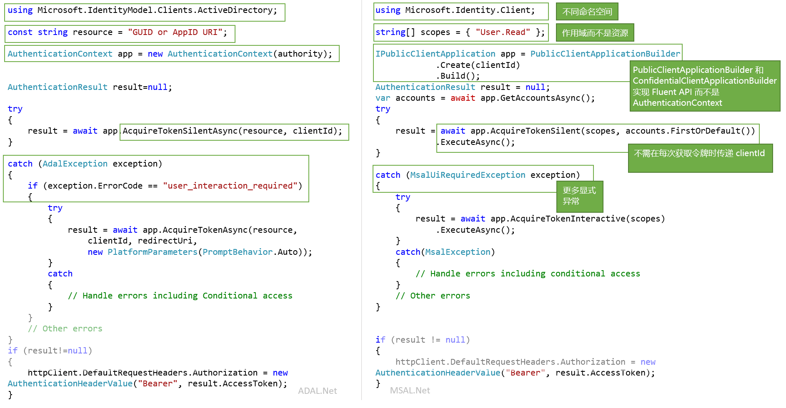

# <a name="migrating-applications-to-msalnet"></a>将应用程序迁移到 MSAL.NET

适用于 .NET 的 Microsoft 身份验证库 (MSAL.NET) 与适用于 .NET 的 Azure AD 身份验证库 (ADAL.NET) 用于对 Azure AD 实体进行身份验证，以及从 Azure AD 请求令牌。 截止目前，大多数开发人员都是通过 Azure AD 身份验证库 (ADAL) 来请求令牌，使用面向开发人员的 Azure AD 平台 (v1.0) 来对 Azure AD 标识（工作和学校帐户）进行身份验证。 现在，使用 MSAL.NET 可以通过 Microsoft 标识平台终结点对更广泛的 Microsoft 标识（Azure AD 标识和 Microsoft 帐户，以及通过 Azure AD B2C 使用的社交和本地帐户）进行身份验证。 

本文介绍如何在适用于 .NET 的 Microsoft 身份验证库 (MSAL.NET) 与适用于 .NET 的 Azure AD 身份验证库 (ADAL.NET) 之间进行选择，并对这两个库做了比较。  

## <a name="differences-between-adal-and-msal-apps"></a>ADAL 与 MSAL 应用之间的差异
在大多数情况下都可以使用 MSAL.NET 和 Microsoft 标识平台终结点，这是最新一代的 Microsoft 身份验证库。 使用 MSAL.NET 可以获取通过 Azure AD（工作和学校帐户）、Microsoft（个人）帐户 (MSA) 或 Azure AD B2C 登录到应用程序的用户的令牌。 

如果你已熟悉面向开发人员的 Azure AD (v1.0) 终结点（和 ADAL.NET），请阅读[ Microsoft 标识平台 (v2.0) 终结点有何不同？](active-directory-v2-compare.md)

但是，如果应用程序需要使用早期版本的 [Active Directory 联合身份验证服务 (ADFS)](/windows-server/identity/active-directory-federation-services) 将用户登录，则你仍然需要使用 ADAL.NET。 有关更多详细信息，请参阅 [ADFS 支持](https://aka.ms/msal-net-adfs-support)。

下图汇总了 ADAL.NET 与 MSAL.NET 之间的一些差异 

### <a name="nuget-packages-and-namespaces"></a>NuGet 包和命名空间

ADAL.NET 是从 [Microsoft.IdentityModel.Clients.ActiveDirectory](https://www.nuget.org/packages/Microsoft.IdentityModel.Clients.ActiveDirectory) NuGet 包使用的。 要使用的命名空间为 `Microsoft.IdentityModel.Clients.ActiveDirectory`。

若要使用 MSAL.NET，需要添加 [Microsoft.Identity.Client](https://www.nuget.org/packages/Microsoft.Identity.Client) NuGet 包并使用 `Microsoft.Identity.Client` 命名空间

### <a name="scopes-not-resources"></a>范围不是资源

ADAL.NET 获取资源的令牌，但 MSAL.NET 获取范围的令牌。   许多 MSAL.NET AcquireToken 重写都需要名为 scopes(`IEnumerable<string> scopes`) 的参数。 此参数是一个简单的字符串列表，这些字符串声明所需的权限和请求的资源。 已知的范围是 [Microsoft Graph 范围](/graph/permissions-reference)。

在 MSAL.NET 中也可以访问 v1.0 资源。 请参阅 [v1.0 应用程序的范围](#scopes-for-a-web-api-accepting-v10-tokens)中的详细信息。 

### <a name="core-classes"></a>核心类

- ADAL.NET 使用 [AuthenticationContext](https://github.com/AzureAD/azure-activedirectory-library-for-dotnet/wiki/AuthenticationContext:-the-connection-to-Azure-AD) 来表示通过颁发机构与安全令牌服务 (STS) 或授权服务器建立的连接。 相比之下，MSAL.NET 是围绕[客户端应用程序](https://github.com/AzureAD/microsoft-authentication-library-for-dotnet/wiki/Client-Applications)设计的。 MSAL.NET 提供两个独立的类：`PublicClientApplication` 和 `ConfidentialClientApplication`

- 获取令牌：ADAL.NET 和 MSAL.NET 具有相同的身份验证调用（适用于 ADAL.NET 的 `AcquireTokenAsync` 和 `AcquireTokenSilentAsync`，以及 MSAL.NET 中的 `AqquireTokenInteractive` 和 `AcquireTokenSilent`），但需要不同的参数。 不同之处在于，在 MSAL.NET 中，不再需要在每个 AcquireTokenXX 调用中传入应用程序的 `ClientID`。 实际上，只需在生成 `IPublicClientApplication` 或 `IConfidentialClientApplication` 时设置 `ClientID` 一次。

### <a name="iaccount-not-iuser"></a>IAccount 不是 IUser

ADAL.NET 操控用户。 但是，用户是人类或软件代理，可以拥有/负责 Microsoft 标识系统中的一个或多个帐户（若干 Azure AD 帐户、Azure AD B2C、Microsoft 个人帐户）。 

MSAL.NET 2.x 现在定义了帐户的概念（通过 IAccount 接口）。 这项中断性变更提供了正确的语义：同一用户可以在不同的 Azure AD 目录中拥有多个帐户这一事实。 此外，由于系统会提供主帐户信息，MSAL.NET 可以在来宾方案中提供更有用的信息。

有关 IUser 与 IAccount 之间的差异的详细信息，请参阅 [MSAL.NET 2.x](https://aka.ms/msal-net-2-released)。

### <a name="exceptions"></a>例外

#### <a name="interaction-required-exceptions"></a>“需要交互”异常

MSAL.NET 提供更明确的异常。 例如，当 ADAL 中的无提示身份验证失败时，处理过程是捕获异常并查找 `user_interaction_required` 错误代码：

```csharp
catch(AdalException exception)
{
 if (exception.ErrorCode == “user_interaction_required”)
 {
  try
  {“try to authenticate interactively”}}
 }
}
```

请参阅[使用 ADAL.NET 获取令牌的建议模式](https://github.com/AzureAD/azure-activedirectory-library-for-dotnet/wiki/AcquireTokenSilentAsync-using-a-cached-token#recommended-pattern-to-acquire-a-token)中的详细信息

使用 MSAL.NET 可以根据 [AcquireTokenSilent](https://github.com/AzureAD/microsoft-authentication-library-for-dotnet/wiki/AcquireTokenSilentAsync-using-a-cached-token) 中所述捕获 `MsalUiRequiredException`。

```csharp
catch(MsalUiRequiredException exception)
{
 try {“try to authenticate interactively”}
}
```

#### <a name="handling-claim-challenge-exceptions"></a>处理声明质询异常

在 ADAL.NET 中，声明质询异常按以下方式进行处理：

- `AdalClaimChallengeException` 是当资源需要用户的更多声明时（例如，使用双重身份验证时），服务引发的异常（派生自 `AdalServiceException`）。 `Claims` 成员包含某个带有预期声明的 JSON 片段。
- 在 ADAL.NET 中，接收此异常的公共客户端应用程序需要调用包含声明参数的 `AcquireTokenInteractive` 重写。 此 `AcquireTokenInteractive` 重写甚至不会尝试命中缓存，因为缓存是不必要的。 原因在于，缓存中的令牌没有适当的声明（否则不会引发 `AdalClaimChallengeException`）。 因此，没有必要查找缓存。 请注意，可以在执行 OBO 的 Web API 中接收 `ClaimChallengeException`，而 `AcquireTokenInteractive` 需要在调用此 Web API 的公共客户端应用程序中调用。
- 有关详细信息（包括示例），请参阅[处理 AdalClaimChallengeException](https://github.com/AzureAD/azure-activedirectory-library-for-dotnet/wiki/Exceptions-in-ADAL.NET#handling-adalclaimchallengeexception)

在 MSAL.NET 中，声明质询异常按以下方式进行处理：

- `Claims` 在 `MsalServiceException` 中显示。
- 可对 `AcquireTokenInteractive` 生成器应用一个 `.WithClaim(claims)` 方法。 

### <a name="supported-grants"></a>支持的授权

有些授权在 MSAL.NET 和 v2.0 终结点中尚不受支持。 下面汇总了 ADAL.NET 和 MSAL.NET 支持的授权的对比。

#### <a name="public-client-applications"></a>公共客户端应用程序

下面是适用于桌面和移动应用程序的 ADAL.NET 与 MSAL.NET 支持的授权

授权 | ADAL.NET | MSAL.NET
----- |----- | -----
交互 | [交互式身份验证](https://github.com/AzureAD/azure-activedirectory-library-for-dotnet/wiki/Acquiring-tokens-interactively---Public-client-application-flows) | [在 MSAL.NET 中以交互方式获取令牌](https://github.com/AzureAD/microsoft-authentication-library-for-dotnet/wiki/Acquiring-tokens-interactively)
Windows 集成身份验证 | [Windows 上的集成身份验证 (Kerberos)](https://github.com/AzureAD/azure-activedirectory-library-for-dotnet/wiki/AcquireTokenSilentAsync-using-Integrated-authentication-on-Windows-(Kerberos)) | [Windows 集成身份验证](msal-authentication-flows.md#integrated-windows-authentication)
用户名/密码 | [使用用户名和密码获取令牌](https://github.com/AzureAD/azure-activedirectory-library-for-dotnet/wiki/Acquiring-tokens-with-username-and-password)| [用户名/密码身份验证](msal-authentication-flows.md#usernamepassword)
设备代码流 | [没有 Web 浏览器的设备的设备配置文件](https://github.com/AzureAD/azure-activedirectory-library-for-dotnet/wiki/Device-profile-for-devices-without-web-browsers) | [设备代码流](msal-authentication-flows.md#device-code)

#### <a name="confidential-client-applications"></a>机密客户端应用程序

下面是适用于 Web 应用程序、Web API 和守护程序应用程序的 ADAL.NET 与 MSAL.NET 支持的授权：

应用类型 | 授权 | ADAL.NET | MSAL.NET
----- | ----- | ----- | -----
Web 应用、Web API、守护程序 | 客户端凭据 | [ADAL.NET 中的客户端凭据流](https://github.com/AzureAD/azure-activedirectory-library-for-dotnet/wiki/Client-credential-flows) | [MSAL.NET 中的客户端凭据流](msal-authentication-flows.md#client-credentials)
Web API | 代表 | [代表用户使用 ADAL.NET 进行服务到服务的调用](https://github.com/AzureAD/azure-activedirectory-library-for-dotnet/wiki/Service-to-service-calls-on-behalf-of-the-user) | [在 MSAL.NET 中代表](msal-authentication-flows.md#on-behalf-of)
Web 应用 | 身份验证代码 | [使用 ADAL.NET 通过 Web 应用中的授权代码获取令牌](https://github.com/AzureAD/azure-activedirectory-library-for-dotnet/wiki/Acquiring-tokens-with-authorization-codes-on-web-apps) | [使用 MSAL.NET 通过 Web 应用中的授权代码获取令牌](msal-authentication-flows.md#authorization-code)

### <a name="cache-persistence"></a>缓存持久性

ADAL.NET 允许使用 `BeforeAccess` 和 `BeforeWrite` 方法扩展 `TokenCache` 类，以便在没有安全存储的平台（.NET Framework 和.NET Core）上实现所需的持久性功能。 有关详细信息，请参阅 [ADAL.NET 中的令牌缓存序列化](https://github.com/AzureAD/azure-activedirectory-library-for-dotnet/wiki/Token-cache-serialization)。

MSAL.NET 将令牌缓存用作密封类，并消除了扩展该类的功能。 因此，令牌缓存持久性的实现必须采用与密封令牌缓存交互的帮助器类的形式。 [MSAL.NET 中的令牌缓存序列化](https://github.com/AzureAD/microsoft-authentication-library-for-dotnet/wiki/token-cache-serialization)中介绍了这种交互。

## <a name="signification-of-the-common-authority"></a>通用颁发机构的作用

在 v1.0 中，如果你使用 https://login.microsoftonline.com/common 颁发机构，则会允许用户使用任何 AAD 帐户（适用于任何组织）登录。 请参阅 [ADAL.NET 中的颁发机构验证](https://github.com/AzureAD/azure-activedirectory-library-for-dotnet/wiki/AuthenticationContext:-the-connection-to-Azure-AD#authority-validation)

如果你使用 v2.0 中的 https://login.microsoftonline.com/common 颁发机构，则会允许用户使用任何 AAD 组织或 Microsoft 个人帐户 (MSA) 登录。 在 MSAL.NET 中，如果你想要限制为使用任何 AAD 帐户登录（与在 ADAL.NET 中的行为相同），则需要使用 https://login.microsoftonline.com/organizations。 有关详细信息，请参阅[公共客户端应用程序](https://github.com/AzureAD/microsoft-authentication-library-for-dotnet/wiki/Client-Applications#publicclientapplication)中的 `authority` 参数。

## <a name="v10-and-v20-tokens"></a>v1.0 和 v2.0 令牌

有两种令牌版本：
- v1.0 令牌
- v2.0 令牌 

v1.0 终结点（由 ADAL 使用）只发出 v1.0 令牌。

但是，v2.0 终结点（由 MSAL 使用）可发出 Web API 所接受的令牌版本。 开发人员可以使用 Web API 应用程序清单的属性来选择接受的令牌版本。 请参阅[应用程序清单](reference-app-manifest.md)参考文档中的 `accessTokenAcceptedVersion`。

有关 v1.0 和 v2.0 令牌的详细信息，请参阅 [Azure Active Directory 访问令牌](access-tokens.md)

## <a name="scopes-for-a-web-api-accepting-v10-tokens"></a>接受 v1.0 令牌中的 Web API 的范围

OAuth2 权限是 v1.0 Web API（资源）应用程序向客户端应用程序公开的权限范围。 在许可期间，可将这些权限范围授予客户端应用程序。 请参阅 [Azure Active Directory 应用程序清单](active-directory-application-manifest.md)中有关 oauth2Permissions 的部分。

### <a name="scopes-to-request-access-to-specific-oauth2-permissions-of-a-v10-application"></a>将请求访问权限范围限定为 v1.0 应用程序的特定 OAuth2 权限

若要获取 v1.0 应用程序（例如 AAD Graph，网址为 https://graph.windows.net) 的特定范围的令牌，需要通过将所需资源标识符与该资源的所需 OAuth2 权限相连接，来创建 `scopes`。

例如，若要以用户名访问应用 ID URI 为 `ResourceId` 的 v1.0 Web API，需要使用：

```csharp
var scopes = new [] {  ResourceId+"/user_impersonation"};
```

若要使用 AAD Graph API (https://graph.windows.net/) 通过 MSAL.NET Azure Active Directory 进行读取和写入，需要按以下代码片段所示创建范围列表：

```csharp
ResourceId = "https://graph.windows.net/";
var scopes = new [] { ResourceId + “Directory.Read”, ResourceID + “Directory.Write”}
```

#### <a name="warning-should-you-have-one-or-two-slashes-in-the-scope-corresponding-to-a-v10-web-api"></a>警告：应在对应于 v1.0 Web API 的范围中使用一个或两个斜杠

若要写入对应于 Azure 资源管理器 API (https://management.core.windows.net/) 的范围，需要请求以下范围（请注意有两个斜杠） 

```csharp
var scopes = new[] {"https://management.core.windows.net//user_impersonation"};
var result = await app.AcquireTokenInteractive(scopes).ExecuteAsync();

// then call the API: https://management.azure.com/subscriptions?api-version=2016-09-01
```

这是因为，资源管理器 API 要求在其受众声明 (`aud`) 中使用一个斜杠，然后使用一个斜杠来分隔 API 名称与范围。

下面是 Azure AD 使用的逻辑：
- 对于使用 v1.0 访问令牌（只能使用此类令牌）的 ADAL (v1.0) 终结点，aud=resource
- 对于要求资源访问令牌接受 v2.0 令牌的 MSAL（v2.0 终结点），aud=resource.AppId
- 对于要求资源访问令牌接受 v1.0 令牌的 MSAL（v2.0 终结点）（与上面的情况相同），Azure AD 将提取最后一个斜杠前面的所有内容并将其用作资源标识符，以分析请求的范围中的所需受众。 因此，如果 https:\//database.windows.net 预期的受众为“https://database.windows.net/”，则你需要请求 https:\//database.windows.net//.default 范围。 另请参阅问题 #[747](https://github.com/AzureAD/microsoft-authentication-library-for-dotnet/issues/747)：将省略资源 URL 的尾部斜杠，因为该斜杠会导致 SQL 身份验证失败 #747


### <a name="scopes-to-request-access-to-all-the-permissions-of-a-v10-application"></a>将请求访问权限范围限定为 v1.0 应用程序的所有权限

例如，若要获取 v1.0 应用程序的所有静态范围的令牌，则需要使用

```csharp
ResourceId = "someAppIDURI";
var scopes = new [] {  ResourceId+"/.default"};
```

### <a name="scopes-to-request-in-the-case-of-client-credential-flow--daemon-app"></a>在客户端凭据流/守护程序应用中限定请求范围

使用客户端凭据流时，要传递的范围也是 `/.default`。 这会让 Azure AD 知道管理员在应用程序注册中许可的所有应用级权限。

## <a name="adal-to-msal-migration"></a>ADAL 到 MSAL 的迁移

ADAL.NET v2.X 中公开了刷新令牌，使你能够通过缓存这些令牌并使用 ADAL 2.x 提供的 `AcquireTokenByRefreshToken` 方法，来围绕这些令牌的使用开发解决方案。 其中的某些解决方案在如下所述的场景中使用：
* 当用户不再保持连接时，长时间运行的服务代表用户执行仪表板刷新等操作。 
* 在 Web 场场景中，让客户端将 RT 引入 Web 服务（缓存在客户端以加密 Cookie 的形式执行，而不是在服务器端执行）

但是，在 MSAL.NET 中做不到这一点，因为出于安全原因，我们不再建议以这种方式利用刷新令牌。 这样就很难迁移到 MSAL 3.x，因为 API 不支持传入以前获取的刷新令牌。 

幸运的是，MSAL.NET 现在会提供一个 API 用于将以前的刷新令牌迁移到 `IConfidentialClientApplication` 中 

```CSharp
/// <summary>
/// Acquires an access token from an existing refresh token and stores it and the refresh token into 
/// the application user token cache, where it will be available for further AcquireTokenSilent calls.
/// This method can be used in migration to MSAL from ADAL v2 and in various integration 
/// scenarios where you have a RefreshToken available. 
/// (see https://aka.ms/msal-net-migration-adal2-msal2)
/// </summary>
/// <param name="scopes">Scope to request from the token endpoint. 
/// Setting this to null or empty will request an access token, refresh token and ID token with default scopes</param>
/// <param name="refreshToken">The refresh token from ADAL 2.x</param>
IByRefreshToken.AcquireTokenByRefreshToken(IEnumerable<string> scopes, string refreshToken);
```
 
使用此方法可以结合所需的任何范围（资源）提供以前用过的刷新令牌。 该刷新令牌将交换一个新令牌，并缓存到应用程序中。  

由于此方法适用于非典型的场景，因此，在未事先将 `IConfidentialClientApplication` 强制转换为 `IByRefreshToken` 的情况下，不能现成地使用它来访问刷新令牌。

以下代码片段演示了机密客户端应用程序中的一些迁移代码。 `GetCachedRefreshTokenForSignedInUser` 检索利用 ADAL 2.x 的某个旧版应用程序存储在某个存储中的刷新令牌。 `GetTokenCacheForSignedInUser` 反序列化已登录用户的缓存（因为机密客户端应用程序应该为每个用户配置一个缓存）。

```csharp
TokenCache userCache = GetTokenCacheForSignedInUser();
string rt = GetCachedRefreshTokenForSignedInUser();

IConfidentialClientApplication app;
app = ConfidentialClientApplicationBuilder.Create(clientId)
 .WithAuthority(Authority)
 .WithRedirectUri(RedirectUri)
 .WithClientSecret(ClientSecret)
 .Build();
IByRefreshToken appRt = app as IByRefreshToken;
         
AuthenticationResult result = await appRt.AcquireTokenByRefreshToken(null, rt)
                                         .ExecuteAsync()
                                         .ConfigureAwait(false);
```

将会看到，AuthenticationResult 中返回了一个访问令牌和 ID 令牌，而新的刷新令牌已存储在缓存中。

对于可提供刷新令牌的各种集成方案，也可以使用此方法。

## <a name="next-steps"></a>后续步骤

可以[ Microsoft 标识平台终结点中的范围、权限和许可](v2-permissions-and-consent.md)中找到有关范围的详细信息