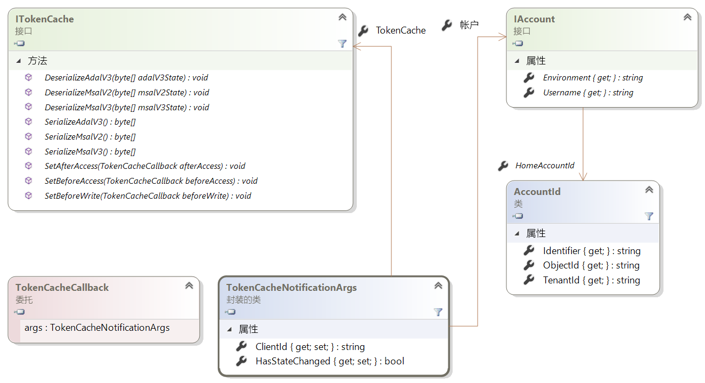
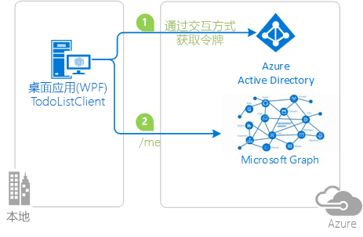

# <a name="token-cache-serialization-in-msalnet"></a>MSAL.NET 中的令牌缓存序列化
[获取令牌](msal-acquire-cache-tokens.md)后，Microsoft 身份验证库 (MSAL) 会缓存该令牌。  在通过其他方法获取令牌之前，应用程序代码应该先尝试从缓存中获取令牌。  本文介绍 MSAL.NET 中令牌缓存的默认序列化和自定义序列化。

本文适用于 MSAL.NET 3.x。 如果你对 MSAL.NET 2.x 感兴趣，请参阅 [MSAL.NET 2.x 中的令牌缓存序列化](https://github.com/AzureAD/microsoft-authentication-library-for-dotnet/wiki/Token-cache-serialization-2x)。

## <a name="default-serialization-for-mobile-platforms"></a>适用于移动平台的默认序列化

在 MSAL.NET 中，默认会提供内存中令牌缓存。 对于可提供安全存储供用户使用的平台，默认会提供序列化。 这些平台包括通用 Windows 平台 (UWP)、Xamarin.iOS 和 Xamarin.Android。

> [!Note]
> 将 Xamarin.Android 项目从 MSAL.NET 1.x 迁移到 MSAL.NET 3.x 时，可能需要将 `android:allowBackup="false"` 添加到项目，以避免当 Visual Studio 部署触发本地存储的还原时再次使用旧的缓存令牌。 请参阅[问题 #659](https://github.com/AzureAD/microsoft-authentication-library-for-dotnet/issues/659#issuecomment-436181938)。

## <a name="custom-serialization-for-windows-desktop-apps-and-web-appsweb-apis"></a>适用于 Windows 桌面应用和 Web 应用/Web API 的自定义序列化

请记住，自定义序列化不适用于移动平台（UWP、Xamarin.iOS 和 Xamarin.Android）。 MSAL 已经为这些平台定义了安全且高效的序列化机制。 但是，.NET 桌面和 .NET Core 应用程序使用不同的体系结构，而 MSAL 无法实现通用的序列化机制。 例如，网站可能会选择在 Redis 缓存中存储令牌，而桌面应用在加密的文件中存储令牌。 因此，提供的序列化方法并不是按原样使用的。 若要在 .NET 桌面或 .NET Core 中使用持久的令牌缓存应用程序，需要自定义序列化。

令牌缓存序列化中使用以下类和接口：

- `ITokenCache`，定义用于订阅令牌缓存序列化请求的事件，以及用于序列化或反序列化采用各种格式的缓存的方法（ADAL v3.0、MSAL 2.x 和 MSAL 3.x = ADAL v5.0）。
- `TokenCacheCallback` 是传递给事件的回调，可让你处理序列化。 将结合 `TokenCacheNotificationArgs` 类型的参数调用这些回调。
- `TokenCacheNotificationArgs` 仅提供应用程序的 `ClientId`，是对该令牌适用的用户的引用。

  

> [!IMPORTANT]
> MSAL.NET 将为你创建令牌缓存，当你调用应用程序的 `GetUserTokenCache` 和 `GetAppTokenCache` 方法时，它会提供 `IToken` 缓存。 最好是不要自行实现接口。 实现自定义令牌缓存序列化时，你的责任是：
> - 对 `BeforeAccess` 和 `AfterAccess`“事件”做出反应。 `BeforeAccess` 委托负责反序列化缓存，而 `AfterAccess` 负责序列化缓存。
> - 其中的一部分事件存储或加载 Blob，这些 Blob 将通过事件参数传递到所需的任何存储。

所用的策略会有所不同，具体取决于是针对[公共客户端应用程序](msal-client-applications.md)（桌面）还是[机密客户端应用程序](msal-client-applications.md)（Web 应用/Web API、守护程序应用程序）编写令牌缓存序列化。

### <a name="token-cache-for-a-public-client"></a>适用于公共客户端的令牌缓存 

从 MSAL.NET v2.x 开始，可以使用多个选项来序列化公共客户端的令牌缓存。 只能以 MSAL.NET 格式序列化缓存（统一格式的缓存在不同的 MSAL 和平台中是通用的）。  还可以支持 ADAL V3 的[旧式](https://github.com/AzureAD/azure-activedirectory-library-for-dotnet/wiki/Token-cache-serialization)令牌缓存序列化。

以下示例说明了如何自定义令牌缓存序列化，以在 ADAL.NET 3.x、ADAL.NET 5.x 与 MSAL.NET 之间共享单一登录状态：[active-directory-dotnet-v1-to-v2](https://github.com/Azure-Samples/active-directory-dotnet-v1-to-v2)。

> [!Note]
> MSAL 2.x 不再支持 MSAL.NET 1.1.4-preview 令牌缓存格式。 如果应用程序利用 MSAL.NET 1.x，则用户必须重新登录。 也支持从 ADAL 4.x（和 3.x）迁移。

#### <a name="simple-token-cache-serialization-msal-only"></a>简单令牌缓存序列化（仅限 MSAL）

下面是适用于桌面应用程序的令牌缓存的自定义序列化的简单实现示例。 此处，用户令牌缓存是应用程序所在的同一文件夹中的某个文件。

生成应用程序后，通过调用 `TokenCacheHelper.EnableSerialization()` 方法并传递应用程序 `UserTokenCache` 来启用序列化。

```csharp
app = PublicClientApplicationBuilder.Create(ClientId)
    .Build();
TokenCacheHelper.EnableSerialization(app.UserTokenCache);
```

`TokenCacheHelper` 帮助器类定义为：

```csharp
static class TokenCacheHelper
 {
  public static void EnableSerialization(ITokenCache tokenCache)
  {
   tokenCache.SetBeforeAccess(BeforeAccessNotification);
   tokenCache.SetAfterAccess(AfterAccessNotification);
  }

  /// <summary>
  /// Path to the token cache
  /// </summary>
  public static readonly string CacheFilePath = System.Reflection.Assembly.GetExecutingAssembly().Location + ".msalcache.bin3";

  private static readonly object FileLock = new object();


  private static void BeforeAccessNotification(TokenCacheNotificationArgs args)
  {
   lock (FileLock)
   {
    args.TokenCache.DeserializeMsalV3(File.Exists(CacheFilePath)
            ? ProtectedData.Unprotect(File.ReadAllBytes(CacheFilePath),
                                      null,
                                      DataProtectionScope.CurrentUser)
            : null);
   }
  }

  private static void AfterAccessNotification(TokenCacheNotificationArgs args)
  {
   // if the access operation resulted in a cache update
   if (args.HasStateChanged)
   {
    lock (FileLock)
    {
     // reflect changesgs in the persistent store
     File.WriteAllBytes(CacheFilePath,
                         ProtectedData.Protect(args.TokenCache.SerializeMsalV3(),
                                                 null,
                                                 DataProtectionScope.CurrentUser)
                         );
    }
   }
  }
 }
```

[Microsoft.Identity.Client.Extensions.Msal](https://github.com/AzureAD/microsoft-authentication-extensions-for-dotnet/tree/master/src/Microsoft.Identity.Client.Extensions.Msal) 开放源代码库中提供了适用于公共客户端应用程序（适用于 Windows、Mac 和 Linux 上运行的桌面应用程序）的基于产品质量令牌缓存文件的序列化程序预览。 可以通过以下 Nuget 包将此程序包含在应用程序中：[Microsoft.Identity.Client.Extensions.Msal](https://www.nuget.org/packages/Microsoft.Identity.Client.Extensions.Msal/)。

#### <a name="dual-token-cache-serialization-msal-unified-cache-and-adal-v3"></a>双令牌缓存序列化（MSAL 统一缓存和 ADAL v3）

若要在同一个平台上同时使用统一缓存格式（在 ADAL.NET 4.x 和 MSAL.NET 2.x 中通用）和同一代的或更低版本的其他 MSAL 实现令牌缓存序列化，请查看以下代码：

```csharp
string appLocation = Path.GetDirectoryName(Assembly.GetEntryAssembly().Location;
string cacheFolder = Path.GetFullPath(appLocation) + @"..\..\..\..");
string adalV3cacheFileName = Path.Combine(cacheFolder, "cacheAdalV3.bin");
string unifiedCacheFileName = Path.Combine(cacheFolder, "unifiedCache.bin");

IPublicClientApplication app;
app = PublicClientApplicationBuilder.Create(clientId)
                                    .Build();
FilesBasedTokenCacheHelper.EnableSerialization(app.UserTokenCache,
                                               unifiedCacheFileName,
                                               adalV3cacheFileName);

```

在此情况下，帮助器类定义为：

```csharp
using System;
using System.IO;
using System.Security.Cryptography;
using Microsoft.Identity.Client;

namespace CommonCacheMsalV3
{
 /// <summary>
 /// Simple persistent cache implementation of the dual cache serialization (ADAL V3 legacy
 /// and unified cache format) for a desktop applications (from MSAL 2.x)
 /// </summary>
 static class FilesBasedTokenCacheHelper
 {
  /// <summary>
  /// Get the user token cache
  /// </summary>
  /// <param name="adalV3CacheFileName">File name where the cache is serialized with the
  /// ADAL V3 token cache format. Can
  /// be <c>null</c> if you don't want to implement the legacy ADAL V3 token cache
  /// serialization in your MSAL 2.x+ application</param>
  /// <param name="unifiedCacheFileName">File name where the cache is serialized
  /// with the Unified cache format, common to
  /// ADAL V4 and MSAL V2 and above, and also across ADAL/MSAL on the same platform.
  ///  Should not be <c>null</c></param>
  /// <returns></returns>
  public static void EnableSerialization(ITokenCache cache, string unifiedCacheFileName, string adalV3CacheFileName)
  {
   usertokenCache = cache;
   UnifiedCacheFileName = unifiedCacheFileName;
   AdalV3CacheFileName = adalV3CacheFileName;

   usertokenCache.SetBeforeAccess(BeforeAccessNotification);
   usertokenCache.SetAfterAccess(AfterAccessNotification);
  }

  /// <summary>
  /// Token cache
  /// </summary>
  static ITokenCache usertokenCache;

  /// <summary>
  /// File path where the token cache is serialized with the unified cache format
  /// (ADAL.NET V4, MSAL.NET V3)
  /// </summary>
  public static string UnifiedCacheFileName { get; private set; }

  /// <summary>
  /// File path where the token cache is serialized with the legacy ADAL V3 format
  /// </summary>
  public static string AdalV3CacheFileName { get; private set; }

  private static readonly object FileLock = new object();

  public static void BeforeAccessNotification(TokenCacheNotificationArgs args)
  {
   lock (FileLock)
   {
    args.TokenCache.DeserializeAdalV3(ReadFromFileIfExists(AdalV3CacheFileName));
    try
    {
     args.TokenCache.DeserializeMsalV3(ReadFromFileIfExists(UnifiedCacheFileName));
    }
    catch(Exception ex)
    {
     // Compatibility with the MSAL v2 cache if you used one
     args.TokenCache.DeserializeMsalV2(ReadFromFileIfExists(UnifiedCacheFileName));
    }
   }
  }

  public static void AfterAccessNotification(TokenCacheNotificationArgs args)
  {
   // if the access operation resulted in a cache update
   if (args.HasStateChanged)
   {
    lock (FileLock)
    {
     WriteToFileIfNotNull(UnifiedCacheFileName, args.TokenCache.SerializeMsalV3());
     if (!string.IsNullOrWhiteSpace(AdalV3CacheFileName))
     {
      WriteToFileIfNotNull(AdalV3CacheFileName, args.TokenCache.SerializeAdalV3());
     }
    }
   }
  }

  /// <summary>
  /// Read the content of a file if it exists
  /// </summary>
  /// <param name="path">File path</param>
  /// <returns>Content of the file (in bytes)</returns>
  private static byte[] ReadFromFileIfExists(string path)
  {
   byte[] protectedBytes = (!string.IsNullOrEmpty(path) && File.Exists(path))
       ? File.ReadAllBytes(path) : null;
   byte[] unprotectedBytes = encrypt ?
       ((protectedBytes != null) ? ProtectedData.Unprotect(protectedBytes, null, DataProtectionScope.CurrentUser) : null)
       : protectedBytes;
   return unprotectedBytes;
  }

  /// <summary>
  /// Writes a blob of bytes to a file. If the blob is <c>null</c>, deletes the file
  /// </summary>
  /// <param name="path">path to the file to write</param>
  /// <param name="blob">Blob of bytes to write</param>
  private static void WriteToFileIfNotNull(string path, byte[] blob)
  {
   if (blob != null)
   {
    byte[] protectedBytes = encrypt
      ? ProtectedData.Protect(blob, null, DataProtectionScope.CurrentUser)
      : blob;
    File.WriteAllBytes(path, protectedBytes);
   }
   else
   {
    File.Delete(path);
   }
  }

  // Change if you want to test with an un-encrypted blob (this is a json format)
  private static bool encrypt = true;
 }
}
```

### <a name="token-cache-for-a-web-app-confidential-client-application"></a>Web 应用（机密客户端应用程序）的令牌缓存

在 Web 应用或 Web API 中，缓存可以利用会话、Redis 缓存或数据库。

对于 Web 应用和 Web API，要记住的一个要点是，每个用户（每个帐户）应有一个令牌缓存。 需要为每个帐户序列化令牌缓存。

[ASP.NET Core Web 应用教程](https://ms-identity-aspnetcore-webapp-tutorial)的阶段 [2-2 令牌缓存](https://github.com/Azure-Samples/active-directory-aspnetcore-webapp-openidconnect-v2/tree/master/2-WebApp-graph-user/2-2-TokenCache)中提供了有关如何对 Web 应用和 Web API 使用令牌缓存的示例。 有关实现，请查看 [microsoft-authentication-extensions-for-dotnet](https://github.com/AzureAD/microsoft-authentication-extensions-for-dotnet) 库中的以下 [TokenCacheProviders](https://github.com/AzureAD/microsoft-authentication-extensions-for-dotnet/tree/master/src/Microsoft.Identity.Client.Extensions.Web/TokenCacheProviders) 文件夹（在 [Microsoft.Identity.Client.Extensions.Web](https://github.com/AzureAD/microsoft-authentication-extensions-for-dotnet/tree/master/src/Microsoft.Identity.Client.Extensions.Web) 文件夹中）。 

## <a name="next-steps"></a>后续步骤
以下示例演示了令牌缓存序列化。

| 示例 | 平台 | 说明|
| ------ | -------- | ----------- |
|[active-directory-dotnet-desktop-msgraph-v2](https://github.com/azure-samples/active-directory-dotnet-desktop-msgraph-v2) | 桌面 (WPF) | 调用 Microsoft Graph API 的 Windows 桌面 .NET (WPF) 应用程序。 |
|[active-directory-dotnet-v1-to-v2](https://github.com/Azure-Samples/active-directory-dotnet-v1-to-v2) | 桌面（控制台） | 演示如何将使用 ADAL.NET 的 Azure AD v1.0 应用程序迁移到使用 MSAL.NET 的 Azure AD v2.0 应用程序（也称为融合应用程序）的 Visual Studio 解决方案集。具体而言，此功能称为[令牌缓存迁移](https://github.com/Azure-Samples/active-directory-dotnet-v1-to-v2/blob/master/TokenCacheMigration/README.md)|