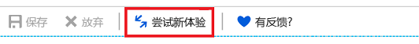
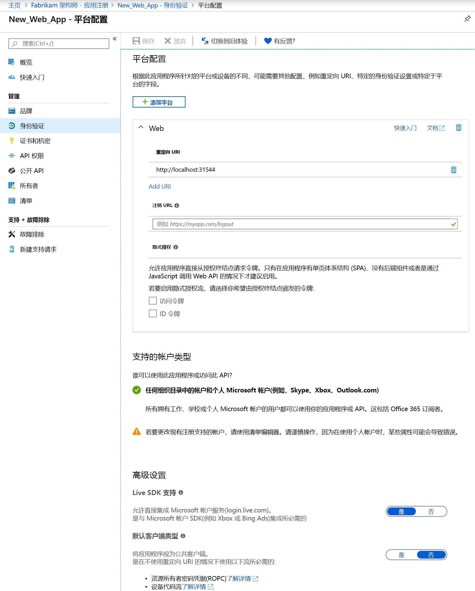
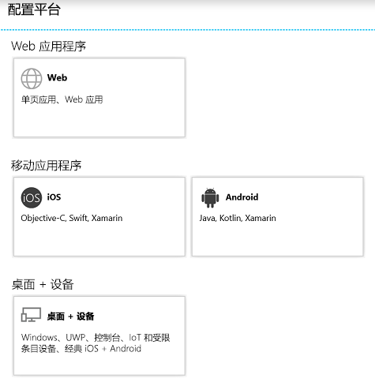

# 快速入门：配置客户端应用程序以访问 Web API

为使 Web/机密客户端应用程序能够参与要求身份验证的授权流程（以及获取访问令牌），必须建立安全凭据。 Azure 门户支持的默认身份验证方法为“客户端 ID + 机密密钥”。

此外，在客户端可以访问资源应用程序公开的 Web API（例如 Microsoft Graph API）之前，许可框架可确保客户端根据请求的权限获取所需的授权。 默认情况下，所有应用程序都可以从 Microsoft Graph API 选择权限。 默认选择[图形 API 的“登录并读取用户配置文件”权限](https://developer.microsoft.com/graph/docs/concepts/permissions_reference#user-permissions)。 可以从每个所需 Web API 的[两种类型的权限](developer-glossary.md#permissions)中进行选择：

* **应用程序权限** - 客户端应用程序需要亲自直接访问 Web API（无用户上下文）。 此类型的权限需要管理员同意，并且不可用于公共（桌面和移动）客户端应用程序。
* **委托的权限** - 客户端应用程序需要以登录用户的身份访问 Web API，但访问权限受所选权限的限制。 除非权限需要管理员许可，否则用户可以授予此类型的权限。

  > [!NOTE]
  > 将委托权限添加到应用程序不会自动向租户中的用户授予许可。 除非管理员代表所有用户授予许可，否则用户仍必须在运行时手动同意添加的委托权限。

本快速入门介绍如何将应用配置为执行以下操作：

* [将重定向 URL 添加到应用程序](#add-redirect-uris-to-your-application)
* [配置应用程序的高级设置](#configure-advanced-settings-for-your-application)
* [修改支持的帐户类型](#modify-supported-account-types)
* [将凭据添加到 Web 应用程序](#add-credentials-to-your-web-application)
* [添加用于访问 Web API 的权限](#add-permissions-to-access-web-apis)

## 必备条件

若要开始，请确保满足下列先决条件：

* 了解支持的[权限和许可](v2-permissions-and-consent.md)，这是在生成其他用户或应用程序需要使用的应用程序时必须理解的。
* 拥有一个其中已注册了应用程序的租户。
  * 如果尚未注册应用，请[了解如何将应用程序注册到 Microsoft 标识平台](quickstart-register-app.md)。

## 登录到 Azure 门户，并选择应用

在配置应用之前，请执行以下步骤：

1. 使用工作或学校帐户或个人 Microsoft 帐户登录到 [Azure 门户](https://portal.azure.com)。
1. 如果你的帐户有权访问多个租户，请在右上角选择该帐户，并将门户会话设置为所需的 Azure AD 租户。
1. 搜索并选择“Azure Active Directory”  。 
1. 在左侧窗格中，选择“应用注册”  。
1. 找到并选择要配置的应用程序。 选择应用以后，会看到应用程序的“概览”页或主注册页。 
1. 按步骤将应用程序配置为访问 Web API：
    * [将重定向 URL 添加到应用程序](#add-redirect-uris-to-your-application)
    * [配置应用程序的高级设置](#configure-advanced-settings-for-your-application)
    * [修改支持的帐户类型](#modify-supported-account-types)
    * [将凭据添加到 Web 应用程序](#add-credentials-to-your-web-application)
    * [添加用于访问 Web API 的权限](#add-permissions-to-access-web-apis)

## 将重定向 URL 添加到应用程序

若要将重定向 URI 添加到应用程序，请执行以下步骤：

1. 在应用的“概览”页中，选择“身份验证”部分。  
1. 若要为 Web 和公共客户端应用程序添加自定义重定向 URI，请执行以下步骤：
   1. 找到“重定向 URI”  部分。
   1. 选择要生成的应用程序的类型：“Web”或“公共客户端(移动和桌面)”。  
   1. 输入应用程序的重定向 URI。
      * 对于 Web 应用程序，请提供应用程序的基 URL。 例如，`http://localhost:31544` 可以是本地计算机上运行的 Web 应用程序的 URL。 用户将使用此 URL 登录到 Web 客户端应用程序。
      * 对于公共应用程序，请提供 Azure AD 返回令牌响应时所用的 URI。 输入特定于应用程序的值，例如 `https://MyFirstApp`。

1. 若要从建议用于公共客户端（移动、桌面）的重定向 URI 中进行选择，请执行以下步骤：
    1. 找到“建议用于公共客户端(移动、桌面)的重定向 URI”部分。 
    1. 通过复选框选择适用于应用程序的重定向 URI。 还可以输入自定义重定向 URI。 如果不确定要使用什么，请查看库文档。

有一些限制适用于重定向 URI。 详细了解[重定向 URI 限制和限制](https://docs.microsoft.com/azure/active-directory/develop/reply-url)。
> [!NOTE]
> 尝试新的“身份验证设置”体验，在其中可以根据要面向的平台或设备配置应用程序的设置。 
>
> 若要查看此视图，请从默认的“身份验证”页面视图中选择“试用新体验”。  
>
> 
>
> 此时会转到[新的“平台配置”页](#configure-platform-settings-for-your-application)。 

### 配置应用程序的高级设置

根据要注册的应用程序，可能需要配置其他一些设置，例如：

* **注销 URL**
* 对于单页应用，可以启用“隐式授权”，并选择希望授权终结点颁发的令牌。 
* 对于“默认客户端类型”部分中使用 Windows 集成身份验证、设备代码流或用户名/密码获取令牌的桌面应用，请将“将应用程序视为公共客户端”设置配置为“是”。   
* 对于使用 Live SDK 来与 Microsoft 帐户服务集成的传统应用，请配置“Live SDK 支持”。  新应用不需要此设置。
* **默认客户端类型**

### 修改支持的帐户类型

“支持的帐户类型”指定哪些用户可以使用该应用程序或访问 API。 

在最初注册应用程序时[配置支持的帐户类型](quickstart-register-app.md)后，只能在以下情况下使用应用程序清单编辑器更改此设置：

* 将帐户类型从 **AzureADMyOrg** 或 **AzureADMultipleOrgs** 更改为 **AzureADandPersonalMicrosoftAccount**，或反之。
* 将帐户类型从 **AzureADMyOrg** 更改为 **AzureADMultipleOrgs**，或反之。

若要更改现有应用注册支持的帐户类型：

* 参阅[配置应用程序清单](reference-app-manifest.md)并更新 `signInAudience` 密钥。

## 配置应用程序的平台设置

若要根据面向的平台或设备配置应用程序设置：

1. 在“平台配置”页上选择“添加平台”，并从可用选项中进行选择。  

   

1. 根据所选的平台输入设置信息。

   | 平台                | 选项              | 配置设置            |
   |-------------------------|----------------------|-----------------------------------|
   | **Web 应用程序**    | **Web**              | 输入应用程序的“重定向 URI”。  |
   | **移动应用程序** | **iOS**              | 输入应用的“捆绑 ID”（可在 XCode 中的 info.plist 内找到，或者在“生成设置”中找到）。  添加捆绑 ID 可自动创建应用程序的重定向 URI。 |
   |                         | **Android**          | * 提供应用的**包名称**（可在 AndroidManifest.xml 文件中找到）。 * 生成并输入**签名哈希**。 添加签名哈希可自动创建应用程序的重定向 URI。  |
   | **桌面 + 设备**   | **桌面 + 设备** | * 可选。 为桌面和设备生成应用时，请选择**建议的重定向 URI** 之一。 * 可选。 输入一个**自定义重定向 URI**，用作 Azure AD 在响应身份验证请求时将用户重定向到的位置。 例如，对于要交互的 .NET Core 应用程序，请使用 `https://localhost`。 |

   > [!IMPORTANT]
   > 对于不使用最新 MSAL 库或不使用中介的移动应用程序，必须在“桌面 + 设备”中为这些应用程序配置重定向 URI。 

1. 根据所选的平台，可能还可以配置其他设置。 对于“Web”应用，可以： 
    * 添加更多重定向 URI
    * 配置“隐式授权”，以选择希望由授权终结点颁发的令牌： 
        * 对于单页应用，请同时选择“访问令牌”和“ID 令牌”  
        * 对于 Web 应用，请选择“ID 令牌” 

## 将凭据添加到 Web 应用程序

若要向 Web 应用程序添加凭据，请执行以下操作：

1. 在应用的“概览”页中，选择“证书和机密”部分。  

1. 若要添加证书，请执行以下步骤：

    1. 选择“上传证书”。 
    1. 选择要上传的文件。 它必须是以下文件类型之一：.cer、.pem、.crt。
    1. 选择 **添加** 。

1. 若要添加客户端机密，请执行以下步骤：

    1. 选择“新建客户端机密”。 
    1. 添加客户端机密的说明。
    1. 选择持续时间。
    1. 选择 **添加** 。

> [!NOTE]
> 保存配置更改后，最右边的列会包含客户端机密值。 **请务必复制此值**，以便在客户端应用程序代码中使用，因为退出此页后将无法访问此密钥。

## 添加用于访问 Web API 的权限

若要添加从客户端访问资源 API 的权限，请执行以下操作：

1. 在应用的“概览”页中，选择“API 权限”部分。  
1. 在“已配置权限”部分下，选择“添加权限”按钮。  
1. 默认情况下，此视图允许从“Microsoft API”进行选择。  选择感兴趣的 API 部分。
    * **Microsoft API** - 用于选择 Microsoft API（例如 Microsoft Graph）的权限。
    * **组织使用的 API** - 用于选择由组织公开的 API 或组织已与之集成的 API 的权限。
    * **我的 API** - 用于选择你已经公开的 API 的权限。
1. 选择 API 后，会看到“请求 API 权限”页。  如果 API 公开委托的权限和应用程序权限，请选择应用程序需要哪种类型的权限。
1. 完成后，请选择“添加权限”  。 此时会返回到“API 权限”页，其中的权限已保存并添加到表。 

## 了解 API 权限和管理员同意 UI

### 已配置权限

此部分显示已在应用程序对象上显式配置的权限（这些权限是应用程序所需的资源访问列表的一部分）。 可以在此表中添加或删除权限。 作为管理员，你还可以为此部分中的一组 API 权限或单个权限授予/撤销管理员同意。

### 授予的其他权限

如果你的应用程序已在租户中注册，则你可能会看到一个名为“为租户授予的其他权限”的附加部分  。 此部分显示已为租户授予但尚未在应用程序对象上显式配置的权限（例如，动态请求和同意的权限）。 仅当至少有一个应用的权限时，才会显示此部分。

可以将此部分中显示的一组 API 权限或单个权限添加到“已配置权限”部分  。 作为管理员，你还可以撤销此部分中各个 API 或权限的管理员同意。

### 管理员同意按钮

如果你的应用程序已在租户中注册，你将看到“为租户授予管理员同意”按钮  。 如果你不是管理员，或者没有为应用程序配置任何权限，则将禁用此按钮。
通过此按钮，管理员可以轻松地向为应用程序配置的权限授予管理员同意。 单击“管理员同意”按钮将启动一个新窗口，其中包含显示了所有已配置权限的同意提示。

> [!NOTE]
> 为应用程序配置的权限与在同意提示下显示的权限之间存在延迟。 如果在同意提示中看不到所有配置的权限，请将其关闭并重新启动。

如果你具有已授予但尚未配置的权限，则在单击“管理员同意”按钮时，系统将提示你决定如何处理这些权限。 可以将它们添加到已配置的权限，也可以将其删除。

同意提示提供“接受”或“取消”选项   。 如果选择“接受”  ，则将授予管理员同意。 如果选择“取消”  ，则不授予管理员同意，你将看到一条错误，指出同意已被拒绝。

> [!NOTE]
> 授予管理员同意（在同意提示中选择“接受”  ）与在 UI 中反映的管理员同意状态之间存在延迟。

## 后续步骤

了解下述其他相关的应用管理快速入门：

* [将应用程序注册到 Microsoft 标识平台](quickstart-register-app.md)
* [配置应用程序以公开 Web API](quickstart-configure-app-expose-web-apis.md)
* [修改应用程序支持的帐户](quickstart-modify-supported-accounts.md)
* [删除注册到 Microsoft 标识平台的应用程序](quickstart-remove-app.md)

了解有关表示已注册应用程序的两个 Azure AD 对象及它们之间的关系的详细信息，请参阅[应用程序对象和服务主体对象](app-objects-and-service-principals.md)。

深入了解使用 Azure Active Directory 开发应用程序时应使用的品牌准则，请参阅[应用程序的品牌准则](howto-add-branding-in-azure-ad-apps.md)。
