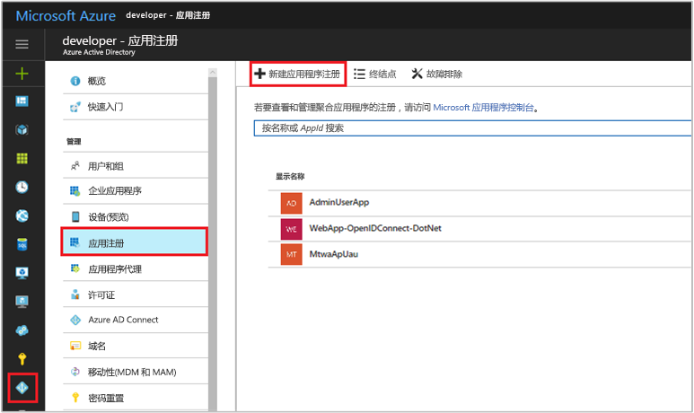
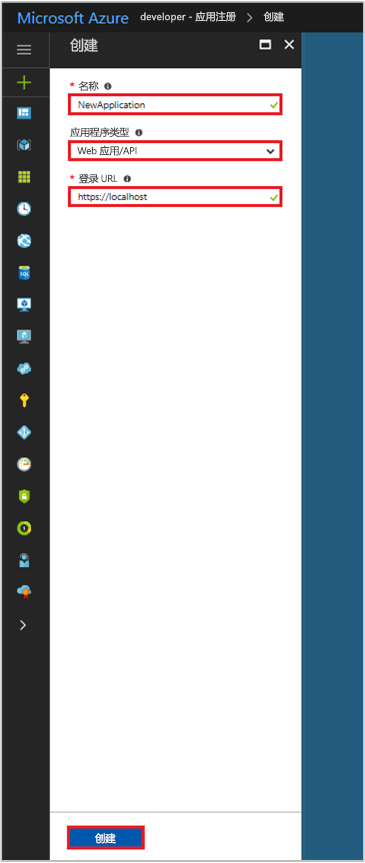

# 快速入门：向 Azure Active Directory v1.0 终结点注册应用

[!INCLUDE [active-directory-develop-applies-v1](../../../includes/active-directory-develop-applies-v1.md)]

企业开发人员和软件即服务 (SaaS) 提供商可以开发能够与 Azure Active Directory (Azure AD) 集成的商业云服务或业务线应用程序，以针对其服务提供安全的登录和授权。 若要将某个应用程序或服务与 Azure AD 进行集成，开发人员必须先将该应用程序注册到 Azure AD。

任何想要使用 Azure AD 功能的应用程序都必须先在 Azure AD 租户中注册。 此注册过程涉及到提供有关应用程序的 Azure AD 详细信息，例如，该应用程序所在位置的 URL、对用户进行身份验证后用于发送答复的 URL、用于标识应用程序的 URI，等等。

本快速入门展示了如何使用 Azure 门户中现有的**应用注册**体验在 Azure AD 中添加和注册应用程序。

> [!NOTE]
> 注册新应用？ 在 Azure 门户中试用新的**应用注册（预览版）** 体验。 请参阅[注册应用（预览版）](quickstart-register-app.md)以开始使用。

## 先决条件

若要开始，请确保拥有可用于向其注册应用的 Azure AD 租户。 如果还没有租户，请[了解如何获取租户](quickstart-create-new-tenant.md)。

## 使用 Azure 门户注册新应用程序

1. 登录到 [Azure 门户](https://portal.azure.com)。
1. 如果你的帐户有权访问多个租户，请在右上角选择该帐户，并将门户会话设置为所需的 Azure AD 租户。
1. 在左侧导航窗格中，选择“Azure Active Directory”服务。
1. 选择“应用注册”并选择“新建应用程序注册”。

    

1. 出现“创建”页后，请输入应用程序的注册信息： 

    - **名称：** 输入有意义的应用程序名称
    - **应用程序类型：**
      - 为安装在设备本地的[客户端应用程序](developer-glossary.md#client-application)选择“本机”。 此设置用于 OAuth 公共[本机客户端](developer-glossary.md#native-client)。
      - 为安装在安全服务器上的[客户端应用程序](developer-glossary.md#client-application)和[资源/API 应用程序](developer-glossary.md#resource-server)选择“Web 应用/API”。 此设置用于 OAuth 机密性 [Web 客户端](developer-glossary.md#web-client)和公共的[基于用户代理的客户端](developer-glossary.md#user-agent-based-client)。 相同的应用程序还可以公开客户端和资源/API。
    - **登录 URL：** 对于“Web 应用/API”应用程序，请提供应用的基 URL。 例如，`http://localhost:31544` 可以是本地计算机上运行的 Web 应用的 URL。 用户将使用此 URL 登录到 Web 客户端应用程序。 
    - **重定向 URI：** 对于“本机”应用程序，请提供 Azure AD 返回令牌响应时所用的 URI。 输入特定于应用程序的值，例如 `http://MyFirstAADApp`

      

    如需 Web 应用程序或本机应用程序的特定示例，请查看文档中的“快速入门”。

1. 完成后，选择“创建”。

    Azure AD 会将唯一的应用程序 ID 分配给应用程序，同时你会转到应用程序的注册主页。 根据应用程序是 Web 应用程序还是本机应用程序，会提供不同的选项用于将更多功能添加到应用程序。

      > [!NOTE]
      > 默认情况下，新注册的 Web 应用程序配置为只允许同一租户中的用户登录到应用程序。

## 后续步骤

- 请参阅 [Azure AD 许可框架](consent-framework.md)，了解许可概述。
- 若要在应用程序注册中启用其他配置功能（如凭据、权限、使用户能够从其他租户登录），请参阅[更新 Azure AD 中的应用程序](quickstart-v1-update-azure-ad-app.md)。
- 如需深入了解表示已注册应用程序和它们之间的关系的两个 Azure AD 对象，请参阅[应用程序对象和服务主体对象](app-objects-and-service-principals.md)。
- 如需深入了解使用 Azure Active Directory 开发应用程序时应使用的品牌准则，请参阅[应用程序的品牌准则](howto-add-branding-in-azure-ad-apps.md)。
